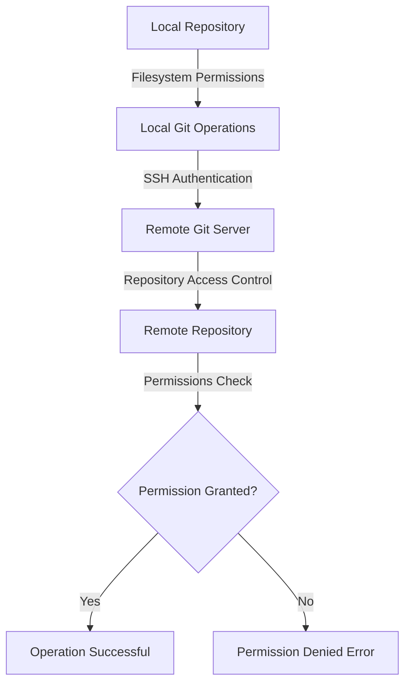

# Git Permission Problems

## Introduction

When working with Git repositories, you may occasionally encounter permission-related errors that prevent you from performing basic operations like pushing changes, cloning repositories, or accessing files. These issues can be frustrating, especially for beginners, but they're often straightforward to resolve once you understand the underlying causes.

Permission problems in Git typically occur due to:
- File system permission restrictions
- SSH key configuration issues
- Repository access rights
- Ownership conflicts

In this guide, we'll explore common Git permission problems, understand their causes, and learn how to resolve them effectively.

## Common Permission Errors

### "Permission denied (publickey)" Error

One of the most common permission errors occurs when trying to interact with a remote repository using SSH.

```bash
$ git push origin main
git@github.com: Permission denied (publickey).
fatal: Could not read from remote repository.

Please make sure you have the correct access rights
and the repository exists.
```

This error indicates that your SSH key hasn't been properly set up or recognized by the remote server.

#### Solution:

1. **Verify your SSH key setup**:

```bash
$ ssh -T git@github.com
```

If successful, you'll see a message like:

```
Hi username! You've successfully authenticated, but GitHub does not provide shell access.
```

2. **Generate a new SSH key** (if you don't have one):

```bash
$ ssh-keygen -t ed25519 -C "your_email@example.com"
```

3. **Add your SSH key to the ssh-agent**:

```bash
$ eval "$(ssh-agent -s)"
Agent pid 59566

$ ssh-add ~/.ssh/id_ed25519
```

4. **Add your SSH public key to your Git account** (GitHub, GitLab, etc.)

Copy your public key:

```bash
$ cat ~/.ssh/id_ed25519.pub
```

Then add it to your account settings on the Git platform.

### "Permission denied" When Working with Local Files

Sometimes you might encounter permission errors when trying to modify files in a local repository.

```bash
$ git pull
error: cannot open .git/FETCH_HEAD: Permission denied
```

#### Solution:

Check and fix file ownership:

```bash
$ ls -la .git/
```

If files are owned by another user or have incorrect permissions, you can fix them with:

```bash
$ sudo chown -R $(whoami) .git/
$ chmod -R u+rwX .git/
```

### "Failed to lock" Error

This often happens when Git can't acquire a lock on a file it needs to modify.

```bash
$ git pull
fatal: Unable to create '/path/to/repo/.git/refs/remotes/origin/main.lock': Permission denied
```

#### Solution:

1. **Check for existing lock files**:

```bash
$ find .git -name "*.lock"
```

2. **Remove any stale lock files** (be careful):

```bash
$ rm .git/refs/remotes/origin/main.lock
```

3. **Fix permissions** if needed:

```bash
$ sudo chown -R $(whoami) .git/
```

## Understanding Git Permissions Flow

Git permissions involve interactions between local file system permissions, SSH authentication, and remote repository access controls.



## Preventing Permission Issues

### 1. Properly Set Up SSH Keys

Always ensure your SSH keys are correctly set up for seamless authentication:

```bash
# Generate key
$ ssh-keygen -t ed25519 -C "your_email@example.com"

# Start ssh-agent
$ eval "$(ssh-agent -s)"

# Add key to agent
$ ssh-add ~/.ssh/id_ed25519

# Test connection
$ ssh -T git@github.com
```

### 2. Use Consistent User Accounts

When working across multiple environments or with team repositories, ensure consistent user accounts and permissions:

```bash
# Check Git user configuration
$ git config user.name
$ git config user.email

# Set Git user if needed
$ git config --global user.name "Your Name"
$ git config --global user.email "your_email@example.com"
```

### 3. Properly Clone Repositories

Use the appropriate protocol (HTTPS or SSH) when cloning repositories based on your authentication setup:

```bash
# SSH (requires SSH key setup)
$ git clone git@github.com:username/repository.git

# HTTPS (requires username/password or token)
$ git clone https://github.com/username/repository.git
```

## Solving Platform-Specific Issues

### Windows-Specific Solutions

Windows has some unique permission issues related to file system restrictions and credential management.

#### 1. Running Git with Administrator Privileges

For operations requiring elevated permissions:
- Right-click on Git Bash and select "Run as administrator"

#### 2. Check Windows-Specific Credentials

Windows stores Git credentials in the Credential Manager:
1. Open Control Panel > Credential Manager
2. Check for and update any Git-related credentials

#### 3. File Path Length Limitations

Windows has path length limitations that can cause issues:

```bash
# Enable long paths in Git
$ git config --system core.longpaths true
```

### Mac/Linux-Specific Solutions

Unix-based systems use file permissions that can be modified using `chmod` and `chown`.

#### 1. Fix Repository Permissions

```bash
# Change ownership recursively
$ sudo chown -R $(whoami) /path/to/repository

# Fix permissions
$ chmod -R u+rwX /path/to/repository
```

#### 2. Check File Access Control Lists (ACLs)

Some systems use ACLs for more granular permission control:

```bash
# View ACLs
$ getfacl /path/to/repository

# Modify ACLs
$ setfacl -m u:username:rwx /path/to/repository
```

## Troubleshooting Enterprise Git Setups

If you're working in an enterprise environment, additional permission layers may exist:

### 1. Corporate Firewalls and Proxies

Configure Git to work with corporate proxies:

```bash
$ git config --global http.proxy http://proxy.company.com:8080
$ git config --global https.proxy https://proxy.company.com:8080
```

### 2. Self-hosted Git Servers

For self-hosted Git servers (like GitLab or Gitea):
- Ensure server administrators have granted appropriate access
- Check project-specific permissions in the web interface
- Verify your account is linked to the correct teams/groups

## Summary

Permission problems in Git can stem from various sources, including file system restrictions, SSH configuration issues, and repository access controls. By understanding these common issues and their solutions, you can troubleshoot and resolve Git permission problems efficiently.

Remember these key points:
- Always verify SSH key setup when using SSH-based repositories
- Check file system permissions for local repository issues
- Use appropriate protocols (HTTPS or SSH) based on your setup
- Platform-specific issues may require different approaches
- Enterprise environments might have additional permission layers

## Additional Resources

For further learning on Git permissions and troubleshooting:

- [Git Documentation](https://git-scm.com/doc)
- [GitHub SSH Key Setup](https://docs.github.com/en/authentication/connecting-to-github-with-ssh)
- [GitLab Permissions Documentation](https://docs.gitlab.com/ee/user/permissions.html)

## Practice Exercises

1. **SSH Key Setup Exercise**
   - Generate a new SSH key pair
   - Add it to your GitHub/GitLab account
   - Clone a repository using SSH
   - Make and push a change

2. **Permissions Debugging**
   - Intentionally change permissions on a Git repository
   - Try to perform Git operations and observe the errors
   - Fix the permissions and verify operations work again

3. **Team Collaboration Simulation**
   - Create a test repository with another user
   - Set up different permission levels
   - Test which operations each user can perform