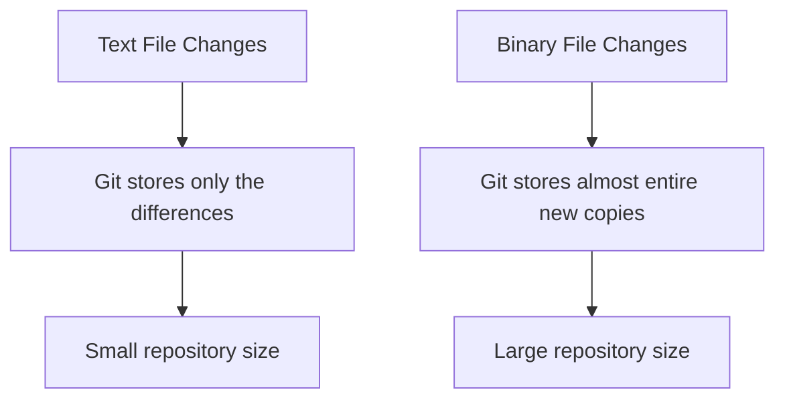

# Git Large Files

## Introduction

When working with Git, you might encounter challenges when trying to add large files to your repository. Git wasn't originally designed to handle large binary files efficiently, which can lead to bloated repositories, slow clones, and checkout times. In this guide, we'll explore why Git struggles with large files, common issues you might face, and solutions to effectively manage large files in your Git workflow.

## Understanding the Problem

### Why Git and Large Files Don't Mix Well

Git stores the complete history of your project, including every version of every file. For text files with line-by-line changes, Git's delta compression works efficiently. However, for large binary files like images, videos, or datasets, even small changes result in storing almost entirely new copies of the file.

Let's visualize the difference:



### Common Issues with Large Files in Git

1. **Slow Operations**: Clone, push, and pull operations become increasingly slower
2. **Repository Bloat**: Your `.git` directory grows excessively large
3. **Memory Issues**: Git may run out of memory when trying to process large files
4. **Collaboration Challenges**: Team members struggle with long download times

## Identifying Large Files in Your Repository

Before implementing a solution, it's useful to identify which files are causing the problem.

### Finding Large Files in Git History

You can use the following command to identify the largest files in your Git repository:

```bash
git rev-list --objects --all | grep -f <(git verify-pack -v .git/objects/pack/*.idx | sort -k 3 -n | tail -n 40 | awk '{print $1}') | sort -k 2
```

This complex command:
1. Lists all objects in your repository
2. Identifies the largest objects by size
3. Shows their corresponding filenames

For a more user-friendly approach, you can use:

```bash
git lfs migrate info
```

Which provides a cleaner output if you have Git LFS installed:

```
*.psd 15 files  1.2 GB
*.zip 3 files   632 MB
*.mp4 12 files  45 MB
```

## Solutions for Managing Large Files in Git

### 1. Git Attributes and Filters

For simple cases, you can use Git attributes to specify how Git should handle certain file types:

Create a `.gitattributes` file in your repository root:

```
*.zip filter=lfs diff=lfs merge=lfs -text
*.psd filter=lfs diff=lfs merge=lfs -text
*.mp4 filter=lfs diff=lfs merge=lfs -text
```

### 2. Git LFS (Large File Storage)

Git LFS is a Git extension that replaces large files with text pointers in your repository, while storing the actual file contents elsewhere.

#### Installing Git LFS

```bash
# Install Git LFS
git lfs install

# Initialize Git LFS in your repository
cd your-repository
git lfs install
```

#### Tracking Large Files with Git LFS

```bash
# Track specific file types
git lfs track "*.psd"
git lfs track "*.zip"
git lfs track "*.mp4"

# Make sure to commit the .gitattributes file
git add .gitattributes
git commit -m "Configure Git LFS tracking"
```

#### Basic Git LFS Workflow

Using Git LFS is similar to your regular Git workflow:

```bash
# Add and commit your large files as usual
git add large-file.psd
git commit -m "Add design file"
git push origin main

# When someone else clones and pulls, LFS files are downloaded automatically
git clone https://github.com/username/repo.git
```

#### Example Output

When you run `git status` after adding a large file tracked by Git LFS:

```
On branch main
Changes to be committed:
  (use "git restore --staged <file>..." to unstage)
        new file:   large-design-file.psd
```

The file appears normal, but behind the scenes, Git LFS is working to manage it efficiently.

### 3. Git Submodules or Git Subtrees

For some scenarios, you might want to separate large files into a different repository:

```bash
# Add a submodule for large files
git submodule add https://github.com/username/large-files-repo.git assets

# Update submodules when cloning
git clone --recursive https://github.com/username/main-repo.git
```

### 4. External Storage Solutions

Sometimes the best approach is to keep large files outside Git entirely:

```bash
# Example using a .gitignore file
echo "large-files/" >> .gitignore
git add .gitignore
git commit -m "Ignore large files directory"
```

Then document in your README how team members should obtain and manage those files separately.

## Best Practices for Large Files in Git

1. **Think before committing**: Ask yourself if the file really needs version control
2. **Use Git LFS from the start**: It's easier than migrating later
3. **Be selective about which files to track**: Not all large files need Git LFS
4. **Update your documentation**: Ensure team members understand your large file workflow
5. **Regularly clean up unnecessary large files**: Keep your repository lean

## Migrating Existing Repositories to Git LFS

If you've already committed large files to your repository, you can migrate them to Git LFS:

```bash
# Install the Git LFS migration tool
git lfs migrate import --include="*.psd,*.zip,*.mp4" --everything
```

This command:
1. Finds all matching files in your repository history
2. Converts them to use Git LFS
3. Rewrites your Git history

**Warning**: This rewrites history, so coordinate with your team before performing this operation!

## Practical Example: Setting Up a Project with Git LFS

Let's walk through a complete example:

```bash
# Create a new repository
mkdir my-design-project
cd my-design-project
git init

# Install and set up Git LFS
git lfs install

# Configure which files to track with LFS
git lfs track "*.psd"
git lfs track "*.ai"
git lfs track "*.zip"
git add .gitattributes
git commit -m "Configure Git LFS tracking"

# Add your project files, including large files
touch README.md
echo "# Design Project" > README.md
# ... add your large design files

git add .
git commit -m "Initial project setup with design assets"

# Create a repository on GitHub/GitLab/etc and push
git remote add origin https://github.com/username/my-design-project.git
git push -u origin main
```

## Troubleshooting Common LFS Issues

### Error: "This repository is over its data quota"

GitHub and other providers have storage limits for LFS:

```
remote: error: GH008: Your push referenced at least 1 LFS object that is over the limit of 100MB.
```

**Solution**: 
- Upgrade your plan, or
- Remove the large file and use an alternative storage solution

### Slow Pushes or Pulls

If Git LFS operations are slow:

```bash
# Set up a custom transfer agent
git config lfs.customtransfer.myagent.path /path/to/transfer/agent

# Or set higher concurrent transfers
git config lfs.concurrenttransfers 8
```

### Missing LFS Files

If you're seeing text pointers instead of actual files:

```
version https://git-lfs.github.com/spec/v1
oid sha256:4d7a214614ab2935c943f9e0ff69d22eadbb8f32b1258daaa5e2ca24d17e2393
size 12345
```

Run:

```bash
git lfs pull
```

## Summary

Managing large files in Git requires understanding its limitations and implementing appropriate solutions. Git LFS provides an effective way to version large files while maintaining repository performance. By following best practices and using the right tools, you can successfully include large files in your Git workflow without compromising efficiency.

## Additional Resources

- [Official Git LFS Documentation](https://git-lfs.github.com/)
- [GitHub's Documentation on Git LFS](https://docs.github.com/en/repositories/working-with-files/managing-large-files)
- [GitLab's Documentation on Git LFS](https://docs.gitlab.com/ee/topics/git/lfs/)

## Exercises

1. Install Git LFS and configure it to track `.psd` files in a test repository
2. Find the largest files in one of your existing repositories using the commands provided
3. Practice migrating a repository with large files to use Git LFS
4. Create a workflow that combines Git LFS for some files and external storage for others
5. Set up a shared team workflow for collaborating on a project with large media files