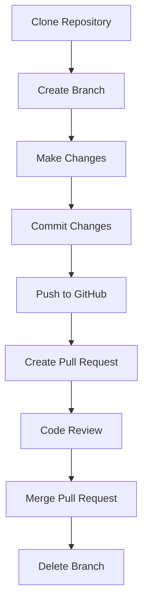

# Git GitHub Integration

## Introduction

Git and GitHub are two powerful tools that, when used together, provide a robust environment for version control and collaborative software development. While Git is a distributed version control system that helps you track changes in your codebase, GitHub is a cloud-based hosting service that lets you manage Git repositories. Integrating Git with GitHub allows you to store your code in the cloud, collaborate with other developers, and leverage additional features like pull requests, issues, and project management tools.

In this tutorial, we'll explore how to integrate your local Git repositories with GitHub, establish effective workflows, and use GitHub's collaboration features to enhance your development process.

## Prerequisites

Before we begin, make sure you have:

- Git installed on your local machine
- A GitHub account
- Basic understanding of Git commands (commit, push, pull)

## Setting Up GitHub Integration

### Creating a GitHub Repository

The first step to integrating Git with GitHub is creating a repository on GitHub:

1. Log in to your GitHub account
2. Click the "+" icon in the upper right corner and select "New repository"
3. Enter a repository name and optional description
4. Choose whether the repository should be public or private
5. Click "Create repository"

GitHub will then provide you with instructions for either:
- Creating a new repository from scratch
- Pushing an existing repository from your local machine

### Connecting Local Repository to GitHub

If you already have a local Git repository that you want to connect to GitHub, follow these steps:

```bash
# Navigate to your local repository
cd your-local-repository

# Add the GitHub repository as a remote
git remote add origin https://github.com/yourusername/your-repository.git

# Verify the remote has been added
git remote -v

# Push your existing repository to GitHub
git push -u origin main
```

If you're starting from scratch:

```bash
# Create a new repository locally
git init

# Add your files
git add .

# Commit your changes
git commit -m "Initial commit"

# Connect to the GitHub repository
git remote add origin https://github.com/yourusername/your-repository.git

# Push to GitHub
git push -u origin main
```

The `-u` flag sets up tracking, which simplifies future push and pull commands.

## Understanding the GitHub Workflow

### Basic GitHub Collaboration Workflow

Here's a visualization of a typical GitHub workflow:



### Cloning a GitHub Repository

To work with an existing GitHub repository, you need to clone it:

```bash
git clone https://github.com/username/repository.git
```

This creates a local copy of the repository with all its history.

### Authentication Methods

GitHub offers multiple authentication methods:

1. **HTTPS with Personal Access Token**:
   ```bash
   # Configure Git to store credentials
   git config --global credential.helper store
   
   # When pushing, you'll be prompted for username and token (instead of password)
   git push origin main
   ```

2. **SSH Authentication**:
   ```bash
   # Generate SSH key
   ssh-keygen -t ed25519 -C "your_email@example.com"
   
   # Add key to SSH agent
   eval "$(ssh-agent -s)"
   ssh-add ~/.ssh/id_ed25519
   
   # Add public key to GitHub account
   # Then use SSH URL for repository
   git remote set-url origin git@github.com:username/repository.git
   ```

## Collaborative Development with GitHub

### Branching Strategies

A common branching strategy is the GitHub Flow:

1. Create a branch for a new feature or bug fix
2. Commit changes to the branch
3. Open a pull request
4. Discuss and review code
5. Deploy or test changes
6. Merge to main branch

```bash
# Create and switch to a new branch
git checkout -b feature-name

# Make changes and commit
git add .
git commit -m "Add new feature"

# Push branch to GitHub
git push -u origin feature-name
```

### Pull Requests

Pull requests (PRs) are GitHub's way to propose changes to a repository:

1. Go to the repository on GitHub
2. Click "Pull requests" tab
3. Click "New pull request"
4. Select the branch with your changes
5. Click "Create pull request"
6. Add a title and description
7. Submit the pull request

### Code Reviews

Code reviews on GitHub allow team members to:

- Comment on specific lines of code
- Suggest changes
- Approve or request changes to a pull request
- Discuss implementation details

### Handling Merge Conflicts

Merge conflicts occur when competing changes are made to the same line of a file:

```bash
# Pull the latest changes from the main branch
git checkout main
git pull

# Switch back to your branch
git checkout your-branch

# Merge main into your branch to resolve conflicts locally
git merge main

# Resolve conflicts in your code editor, then
git add .
git commit -m "Resolve merge conflicts"

# Push updated branch
git push origin your-branch
```

## GitHub Features for Enhanced Collaboration

### Issues

GitHub Issues help track bugs, enhancements, and tasks:

- Create detailed issues with descriptions
- Assign issues to team members
- Add labels for categorization
- Reference issues in commits and pull requests

```bash
# Reference an issue in a commit message
git commit -m "Fix login bug, closes #42"
```

### GitHub Actions

GitHub Actions allow you to automate workflows directly in your repository:

```yaml
name: Node.js CI

on:
  push:
    branches: [ main ]
  pull_request:
    branches: [ main ]

jobs:
  build:
    runs-on: ubuntu-latest
    steps:
    - uses: actions/checkout@v3
    - name: Use Node.js
      uses: actions/setup-node@v3
      with:
        node-version: '16.x'
    - run: npm ci
    - run: npm test
```

### GitHub Pages

GitHub Pages allows you to host websites directly from your repository:

1. Go to repository settings
2. Scroll to "GitHub Pages" section
3. Select the branch to publish from
4. Optionally, choose a theme

## Best Practices for Git-GitHub Integration

1. **Write meaningful commit messages**:
   ```bash
   # Bad
   git commit -m "Fix bug"
   
   # Good
   git commit -m "Fix user authentication timeout issue"
   ```

2. **Use branches for features and bug fixes**:
   - Keep main/master branch stable
   - Create branches for new work
   - Delete branches after merging

3. **Pull before you push**:
   ```bash
   git pull origin main
   # Make your changes
   git push origin main
   ```

4. **Use .gitignore**:
   ```
   # Example .gitignore file
   node_modules/
   .env
   .DS_Store
   *.log
   ```

5. **Protect sensitive information**:
   - Never commit API keys, passwords, or tokens
   - Use environment variables for sensitive data

## Troubleshooting Common Issues

### Authentication Problems

```bash
# If you're having authentication issues
git config --global credential.helper store

# Or use SSH instead of HTTPS
git remote set-url origin git@github.com:username/repository.git
```

### Undo Last Push

```bash
# Undo last commit but keep changes
git reset HEAD^
# Then fix changes and commit again

# Force push to update remote (use with caution!)
git push -f origin branch-name
```

### Detached HEAD State

```bash
# If you end up in a detached HEAD state
git checkout main
# Or create a new branch from the current state
git checkout -b new-branch-name
```

## Summary

Integrating Git with GitHub provides a powerful platform for version control and collaboration. You've learned how to:

- Connect local repositories to GitHub
- Establish effective workflows for collaboration
- Utilize pull requests for code review
- Resolve merge conflicts
- Leverage GitHub features like Issues and Actions

By following these practices, you can maintain a clean, collaborative codebase and streamline your development process.

## Additional Resources

- [GitHub Documentation](https://docs.github.com)
- [Pro Git Book](https://git-scm.com/book/en/v2)
- [GitHub Learning Lab](https://lab.github.com/)
- [GitHub Guides](https://guides.github.com/)

## Practice Exercises

1. Create a local Git repository and connect it to a new GitHub repository
2. Clone an open-source project, create a branch, make a change, and submit a pull request
3. Collaborate with a friend on a shared repository using branches and pull requests
4. Set up a GitHub Action to run tests automatically on your repository
5. Create and resolve a merge conflict intentionally to practice conflict resolution