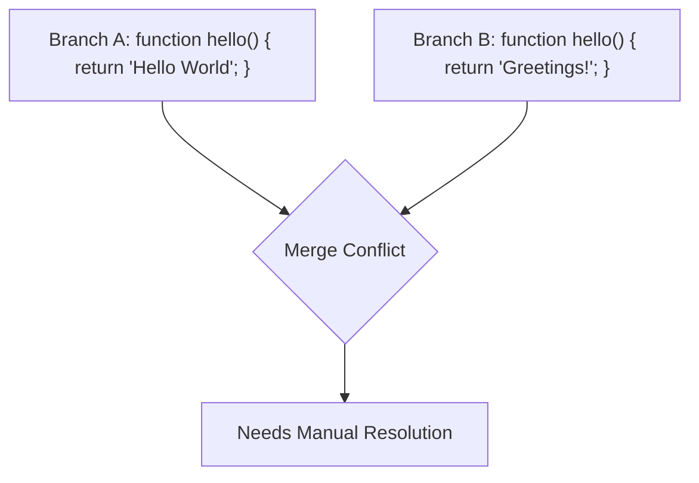
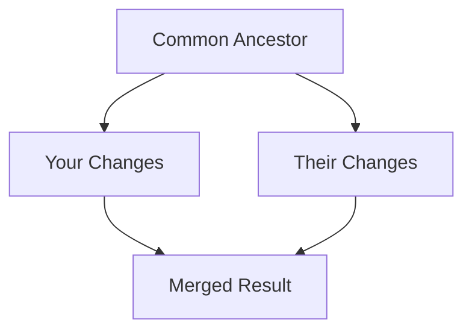

# Git Merge Tools

## Introduction

When working with Git in a collaborative environment, merging branches is a fundamental operation. While Git handles most merges automatically, conflicts can arise when the same part of a file has been modified in different ways across branches. This is where Git merge tools come into play. These specialized tools provide visual interfaces and intelligent algorithms to help you resolve merge conflicts efficiently.

In this guide, we'll explore various Git merge tools, how they work, and how to configure them to streamline your development workflow.

## What are Git Merge Conflicts?

Before diving into merge tools, let's understand what causes merge conflicts:



A merge conflict occurs when:
- The same line(s) of a file have been modified in both branches
- A file has been modified in one branch and deleted in another
- A file has been added with the same name but different content in both branches

When Git encounters these scenarios, it marks the conflicting areas in the affected files with conflict markers (`<<<<<<<`, `=======`, `>>>>>>>`), and it's up to you to resolve them.

## Built-in Git Merge Capabilities

Git provides a basic built-in merge conflict resolution mechanism:

```bash
# When a merge conflict occurs
git merge feature-branch
# Git will report conflicts
```

The conflicting files will be marked with conflict markers:

```
<<<<<<< HEAD
function greet() {
  return "Hello World";
}
=======
function greet() {
  return "Greetings, user!";
}
>>>>>>> feature-branch
```

You would manually edit these files, decide which changes to keep, remove the conflict markers, and then continue the merge:

```bash
# After manually resolving conflicts
git add resolved-file.js
git merge --continue
```

While this works, it can be tedious and error-prone, especially with complex conflicts. This is where dedicated merge tools shine.

## Popular Git Merge Tools

### 1. Visual Studio Code

VS Code has become one of the most popular tools for resolving Git conflicts thanks to its intuitive interface.

**Setup:**

```bash
git config --global merge.tool vscode
git config --global mergetool.vscode.cmd "code --wait $MERGED"
```

**Usage:**

```bash
# When conflicts occur
git mergetool
```

VS Code will open with its merge editor, presenting:
- The base version (common ancestor)
- The current branch changes
- The incoming branch changes
- The output result

You can accept changes from either side or manually edit the result.

### 2. Meld

Meld is a visual diff and merge tool that works well for Git conflict resolution.

**Setup:**

```bash
git config --global merge.tool meld
```

**Usage:**

```bash
git mergetool
```

Meld presents a three-pane view:
- Left: your current branch
- Center: the merged result you're creating
- Right: the incoming changes

### 3. KDiff3

KDiff3 is a powerful tool that can handle complex merges with its advanced algorithms.

**Setup:**

```bash
git config --global merge.tool kdiff3
```

**Usage:**

```bash
git mergetool
```

### 4. Beyond Compare

A commercial tool with robust comparison and merging capabilities.

**Setup:**

```bash
git config --global merge.tool bc
git config --global mergetool.bc.path "C:/Program Files/Beyond Compare 4/BCompare.exe"
```

## Configuring Git Merge Tools

You can configure several aspects of how Git uses merge tools:

```bash
# Keep .orig backup files
git config --global mergetool.keepBackup true

# Skip prompt before opening each conflict
git config --global mergetool.prompt false

# Set your preferred merge tool
git config --global merge.tool vscode

# For custom tools, specify the command
git config --global mergetool.mytool.cmd "custom-tool \$LOCAL \$REMOTE \$MERGED"
```

## Practical Workflow Examples

### Example 1: Resolving a Feature Branch Merge

Imagine you're working on a feature branch and need to merge the latest main branch changes:

```bash
# Update main branch
git checkout main
git pull

# Switch to feature branch
git checkout feature-branch

# Merge main into feature branch
git merge main

# If conflicts occur
git mergetool

# After resolving all conflicts
git commit -m "Merge main into feature-branch, resolve conflicts"
```

### Example 2: Setting Up a Project-Specific Merge Tool

For team consistency, you might want to configure a specific merge tool for a project:

```bash
# In your project directory
git config merge.tool meld
git config mergetool.prompt false

# Create a .gitconfig file to share with your team
cat > .gitconfig <<EOL
[merge]
  tool = meld
[mergetool]
  prompt = false
EOL

# Share this file with instructions for your team
```

### Example 3: Pre-emptive Conflict Resolution with Frequent Merges

To minimize complex conflicts, adopt a workflow of frequent merges:

```bash
# Start each day by updating from main
git checkout main
git pull
git checkout your-feature-branch
git merge main

# If conflicts occur, they're smaller and more manageable
git mergetool
git commit -m "Merge main, resolve conflicts"
```

## Advanced Merge Techniques

### Three-Way Merge

Most modern merge tools support three-way merges:



This approach considers:
- The common ancestor (the base version)
- Your changes
- Their changes

This context helps make more intelligent merge decisions.

### Configuring Merge Drivers

For specific file types, you can set up custom merge drivers:

```bash
# In .gitattributes
*.json merge=json

# In .git/config or global config
[merge "json"]
  name = JSON merge driver
  driver = node /path/to/json-merge-script.js %O %A %B %P
```

This can be particularly useful for structured file formats like JSON, XML, or database schemas.

## Tips for Effective Conflict Resolution

1. **Understand the changes**: Before resolving conflicts, understand why both changes were made.

2. **Communicate with team members**: If you're unsure about which changes to keep, discuss with the team.

3. **Test after merging**: Always test your application after resolving conflicts to ensure functionality.

4. **Use meaningful commit messages**: Explain what conflicts were resolved and why certain decisions were made.

5. **Break large features into smaller branches**: Smaller, focused branches tend to have fewer conflicts.

## Summary

Git merge tools are essential for collaborative development, making conflict resolution more visual, intuitive, and efficient. While Git's built-in conflict markers work for simple cases, dedicated merge tools offer significant advantages for complex merges.

In this guide, we've explored:
- What causes merge conflicts
- Common Git merge tools and their configuration
- Practical workflows for effective conflict resolution
- Advanced merge techniques for specific scenarios

By incorporating these tools and practices into your Git workflow, you'll spend less time wrestling with conflicts and more time on productive development.

## Additional Resources

- Practice resolving conflicts with [Git-it](https://github.com/jlord/git-it-electron), an interactive Git tutorial
- Git's official documentation on [merge tools](https://git-scm.com/docs/git-mergetool)
- Try [Oh My Git!](https://ohmygit.org/), a game for learning Git concepts including merging

## Exercises

1. Configure three different merge tools and compare their interfaces and capabilities.
2. Create a practice repository with intentional conflicts and practice resolving them with different tools.
3. Set up a custom merge driver for a specific file type in your project.
4. Create a team-specific document explaining your preferred merge resolution workflow.