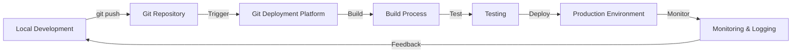

# Git Deployment Platforms

## Introduction

Git deployment platforms bridge the gap between version control and application hosting. They enable developers to deploy applications directly from Git repositories, automating the process of building, testing, and releasing code to production environments. This integration streamlines the development workflow, making it easier to maintain applications while ensuring consistent deployment processes.

In this guide, we'll explore various Git deployment platforms, their features, and how to use them effectively for your projects. Whether you're developing a simple personal website or a complex application, understanding these platforms will help you establish an efficient deployment pipeline.

## What Are Git Deployment Platforms?

Git deployment platforms are services that connect to your Git repositories (like GitHub, GitLab, or Bitbucket) and automatically deploy your application whenever changes are pushed to specific branches. These platforms typically:

1. Monitor your repository for changes
2. Pull the latest code when changes are detected
3. Build your application according to your configuration
4. Deploy the built application to a hosting environment
5. Provide logs and monitoring for the deployment process

This workflow is commonly referred to as **Continuous Deployment** or **Continuous Delivery (CD)**, which is often paired with Continuous Integration (CI) to form a CI/CD pipeline.



## Popular Git Deployment Platforms

### 1. Vercel

Vercel is a cloud platform designed for frontend frameworks and static sites, with a focus on providing the best developer experience.

#### Key Features:
- Zero-configuration deployments for popular frameworks (Next.js, React, Vue, etc.)
- Automatic preview deployments for pull requests
- Global CDN for fast content delivery
- Serverless functions support
- Environment variables management

#### Getting Started with Vercel:

1. Create a Vercel account and connect your Git provider:

```bash
# Install Vercel CLI
npm install -g vercel

# Login to Vercel
vercel login
```

2. Deploy your project:

```bash
# Navigate to your project directory
cd my-project

# Deploy to Vercel
vercel
```

3. Configure deployment settings in `vercel.json`:

```json
{
  "version": 2,
  "builds": [
    { "src": "package.json", "use": "@vercel/static-build" }
  ],
  "routes": [
    { "src": "/(.*)", "dest": "/index.html" }
  ]
}
```

### 2. Netlify

Netlify is a web development platform that offers hosting and serverless backend services for web applications and static websites.

#### Key Features:
- Continuous deployment from Git
- Global CDN with instant cache invalidation
- Automatic HTTPS
- Serverless functions
- Form handling
- Identity service

#### Getting Started with Netlify:

1. Create a `netlify.toml` configuration file in your project:

```toml
[build]
  command = "npm run build"
  publish = "build"

[context.production]
  environment = { NODE_VERSION = "16" }

[[redirects]]
  from = "/*"
  to = "/index.html"
  status = 200
```

2. Deploy using Netlify CLI:

```bash
# Install Netlify CLI
npm install -g netlify-cli

# Login to Netlify
netlify login

# Initialize your site
netlify init
```

3. Set up continuous deployment by connecting to your Git repository in the Netlify dashboard.

### 3. Heroku

Heroku is a platform-as-a-service (PaaS) that enables developers to build, run, and operate applications entirely in the cloud.

#### Key Features:
- Support for multiple programming languages
- Managed container system (Dynos)
- Add-ons marketplace for databases and other services
- Automatic scaling
- Release management with rollback capability

#### Getting Started with Heroku:

1. Create a `Procfile` in your project root to specify process types:

```
web: npm start
```

2. Set up Git deployment with Heroku CLI:

```bash
# Install Heroku CLI
npm install -g heroku

# Login to Heroku
heroku login

# Create a new Heroku app
heroku create my-app-name

# Add Heroku as a Git remote
heroku git:remote -a my-app-name
```

3. Deploy your application:

```bash
# Push to Heroku
git push heroku main
```

### 4. GitHub Pages

GitHub Pages is a static site hosting service that takes files straight from a GitHub repository.

#### Key Features:
- Free hosting for public repositories
- Custom domain support
- HTTPS enforcement
- Built-in Jekyll support

#### Getting Started with GitHub Pages:

1. Create a GitHub repository with your website files

2. Configure GitHub Pages in repository settings or create a GitHub workflow:

```yaml
# .github/workflows/deploy.yml
name: Deploy to GitHub Pages

on:
  push:
    branches: [ main ]

jobs:
  build-and-deploy:
    runs-on: ubuntu-latest
    steps:
      - uses: actions/checkout@v2
      
      - name: Setup Node.js
        uses: actions/setup-node@v2
        with:
          node-version: '16'
      
      - name: Install dependencies
        run: npm ci
      
      - name: Build
        run: npm run build
      
      - name: Deploy
        uses: JamesIves/github-pages-deploy-action@4.1.4
        with:
          branch: gh-pages
          folder: build
```

## Comparing Deployment Approaches

Let's compare these platforms for deploying a simple React application:

| Platform | Best For | Setup Complexity | Build Configuration | Free Tier |
|----------|----------|------------------|---------------------|-----------|
| Vercel | Frontend apps, JAMstack | Very Low | Automatic for most frameworks | Generous |
| Netlify | Static sites, JAMstack | Low | Build command in netlify.toml | Generous |
| Heroku | Full-stack applications | Medium | Buildpacks, Procfile | Limited |
| GitHub Pages | Static documentation, personal sites | Low | GitHub Actions workflow | Free for public repos |

## Advanced Deployment Configurations

### Environment Variables

Most deployment platforms support environment variables for configuration:

```bash
# Vercel example
vercel env add SECRET_API_KEY production

# Netlify example (via netlify.toml)
[context.production.environment]
  API_URL = "https://api.example.com"
  
# Heroku example
heroku config:set DATABASE_URL="postgres://..."
```

### Custom Domains

Setting up custom domains:

```bash
# Vercel
vercel domains add myproject.com

# Netlify (via dashboard or CLI)
netlify domains:add myproject.com

# Heroku
heroku domains:add www.myproject.com
```

### Deployment Hooks

Triggering deployments via webhooks:

```bash
# Create a deploy hook URL in your platform dashboard
# Then trigger a deployment with:
curl -X POST https://api.netlify.com/build_hooks/YOUR_HOOK_ID
```

## Real-World Example: Deploying a React App to Vercel

Let's walk through deploying a React application to Vercel:

1. Create a React app:

```bash
npx create-react-app my-react-app
cd my-react-app
```

2. Initialize Git and commit your code:

```bash
git init
git add .
git commit -m "Initial commit"
```

3. Create a GitHub repository and push your code:

```bash
git remote add origin https://github.com/yourusername/my-react-app.git
git push -u origin main
```

4. Connect Vercel to your GitHub repository:
   - Create a Vercel account
   - Import your GitHub repository
   - Configure build settings (defaults work for Create React App)
   - Deploy!

5. Every time you push changes to your main branch, Vercel will automatically:
   - Detect the push
   - Pull the latest code
   - Build your React application
   - Deploy it to their global CDN

Output: Your app is now live at a URL like `https://my-react-app-yourusername.vercel.app`

## Troubleshooting Common Deployment Issues

### Build Failures

If your deployment fails during the build phase:

1. Check your build logs on the platform
2. Ensure all dependencies are properly listed in `package.json`
3. Verify your build command is correct
4. Test the build locally before deploying:

```bash
# Test your build locally
npm run build
```

### Environment Variable Issues

If your app deploys but doesn't function correctly:

1. Check if you've configured all necessary environment variables
2. Verify environment variable names match what your application expects
3. For client-side usage, ensure variables are properly prefixed (e.g., `REACT_APP_` for Create React App)

## Summary

Git deployment platforms provide powerful tools for automating your application deployment pipeline. By connecting your Git repository to these platforms, you can:

- Automate builds and deployments
- Implement continuous deployment workflows
- Focus on development instead of manual deployment tasks
- Get instant feedback through preview deployments
- Ensure consistent deployment processes

The right platform depends on your specific project needs, but all of them share the common goal of making deployment simpler and more reliable through Git integration.

## Additional Resources

- [Official Vercel Documentation](https://vercel.com/docs)
- [Netlify Deployment Guide](https://docs.netlify.com/site-deploys/overview/)
- [Heroku Dev Center](https://devcenter.heroku.com/)
- [GitHub Pages Documentation](https://docs.github.com/en/pages)

## Exercises

1. Deploy a simple HTML/CSS/JavaScript application to GitHub Pages.
2. Create a React application and deploy it to Vercel with environment variables.
3. Set up a Node.js API and deploy it to Heroku.
4. Configure a custom domain for your deployed application.
5. Create a deployment pipeline that includes testing before deployment.