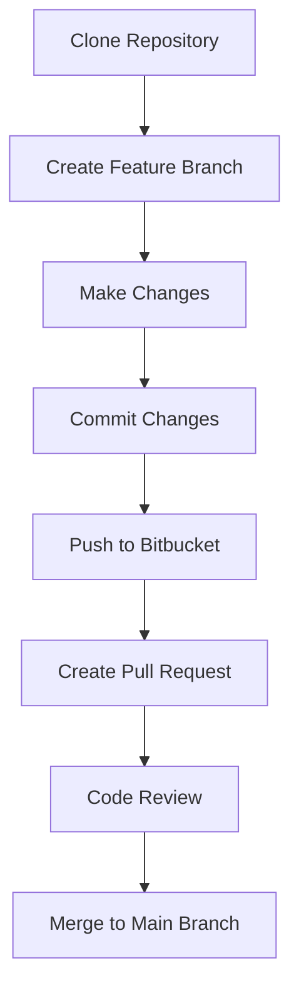
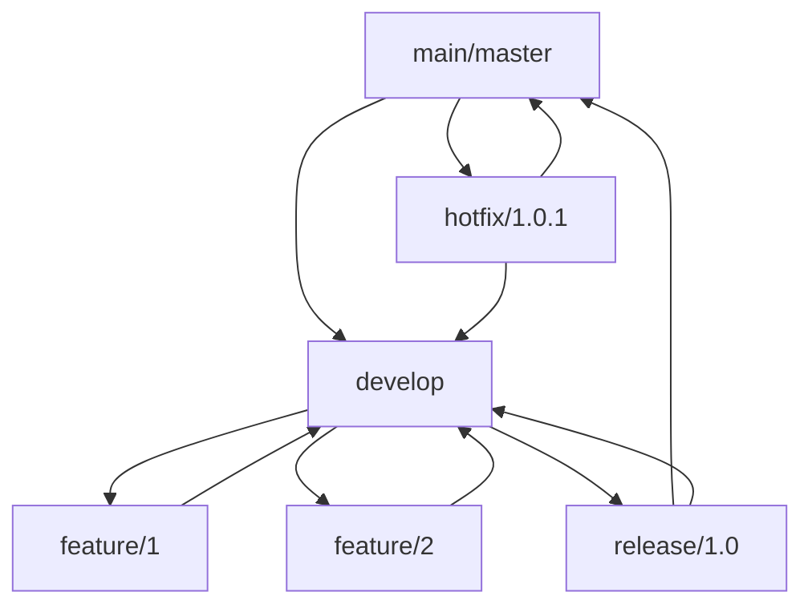

# Git Bitbucket Integration

## Introduction

Bitbucket is a web-based hosting service for Git repositories that provides a powerful platform for source code management and collaboration. Integrating Git with Bitbucket combines the distributed version control capabilities of Git with Bitbucket's collaborative features, including pull requests, code reviews, and continuous integration tools.

This guide will walk you through the process of integrating your local Git repositories with Bitbucket, from setting up your first repository to implementing advanced workflows for team collaboration.

## Prerequisites

Before you begin, make sure you have:

- Git installed on your local machine
- A Bitbucket account
- Basic understanding of Git commands and concepts

## Setting Up Bitbucket with Git

### Creating a Bitbucket Account

If you don't already have a Bitbucket account, visit [Bitbucket.org](https://bitbucket.org/) and sign up for a free account.

### Installing Git

If you haven't installed Git yet, download and install it from the [official Git website](https://git-scm.com/).

You can verify your Git installation by running:

```bash
git --version
```

This should display the installed Git version.

## Creating Your First Repository

### Method 1: Create a Repository on Bitbucket First

1. Log in to your Bitbucket account
2. Click the "+" icon in the sidebar and select "Repository"
3. Fill in the repository details (name, description, etc.)
4. Make sure "Git" is selected as the repository type
5. Click "Create repository"

Once created, Bitbucket will display instructions for pushing an existing project or creating a new repository. For a new repository, you would do:

```bash
git clone https://yourusername@bitbucket.org/yourusername/repository-name.git
cd repository-name
echo "# My Project" >> README.md
git add README.md
git commit -m "Initial commit"
git push -u origin main
```

### Method 2: Push an Existing Local Repository

If you already have a Git repository on your local machine:

```bash
cd /path/to/your/repository
git remote add origin https://yourusername@bitbucket.org/yourusername/repository-name.git
git push -u origin main
```

## Authentication Options

### SSH Authentication (Recommended)

Using SSH keys is more secure and convenient than password authentication.

1. Generate an SSH key pair if you don't have one:

```bash
ssh-keygen -t ed25519 -C "your_email@example.com"
```

2. Copy your public key:

```bash
# For macOS
pbcopy < ~/.ssh/id_ed25519.pub

# For Windows (Git Bash)
cat ~/.ssh/id_ed25519.pub | clip

# For Linux
cat ~/.ssh/id_ed25519.pub
```

3. Add the SSH key to your Bitbucket account:
   - Go to Bitbucket settings
   - Navigate to "SSH keys"
   - Click "Add key"
   - Paste your public key and save

4. Update your repository remote URL to use SSH:

```bash
git remote set-url origin git@bitbucket.org:yourusername/repository-name.git
```

### HTTP/HTTPS Authentication

When using HTTPS URLs for your repository, you'll need to enter your Bitbucket credentials. You can use:

- App passwords (recommended for HTTPS)
- Personal access tokens

To create an app password:
1. Go to Bitbucket settings
2. Select "App passwords" under "Access management"
3. Click "Create app password"
4. Select the permissions you need
5. Create and save the password securely

## Basic Workflow with Bitbucket

Here's a typical workflow when working with Bitbucket:



### Step 1: Clone the Repository

```bash
git clone https://yourusername@bitbucket.org/yourusername/repository-name.git
cd repository-name
```

### Step 2: Create a Feature Branch

```bash
git checkout -b feature/new-feature
```

### Step 3: Make Changes and Commit

```bash
# Make your changes
git add .
git commit -m "Add new feature"
```

### Step 4: Push Changes to Bitbucket

```bash
git push -u origin feature/new-feature
```

### Step 5: Create a Pull Request

1. Go to your repository on Bitbucket
2. Click "Create pull request"
3. Select your feature branch as the source and main branch as the destination
4. Add title, description, and reviewers
5. Click "Create pull request"

## Working with a Team

### Branching Strategies

A common branching strategy when working with Bitbucket is Gitflow:



### Pull Requests and Code Reviews

Bitbucket's pull request feature allows team members to:
- Review code changes
- Leave comments on specific lines
- Suggest improvements
- Approve or request changes
- Merge code once approved

### Continuous Integration with Bitbucket Pipelines

Bitbucket Pipelines is a built-in CI/CD service that allows you to automatically build, test, and deploy your code.

To enable Pipelines:

1. Create a `bitbucket-pipelines.yml` file in your repository root:

```yaml
pipelines:
  default:
    - step:
        name: Build and Test
        image: node:16
        script:
          - npm install
          - npm test
```

2. Commit and push this file to your repository
3. Enable Pipelines in your Bitbucket repository settings

## Advanced Features

### Repository Access Management

Bitbucket allows you to:
- Add users as collaborators
- Create teams
- Set up fine-grained permissions

To add a collaborator:
1. Go to repository settings
2. Select "Access management"
3. Enter the user's email or username
4. Select their access level (Admin, Write, or Read)
5. Click "Add"

### Jira Integration

Bitbucket integrates seamlessly with Jira for issue tracking:

1. Connect your Bitbucket repository to your Jira project
2. Reference Jira issues in commit messages (`PROJECT-123: Fix bug`)
3. Create branches from Jira issues
4. See development information directly in Jira

### Webhooks

Webhooks allow you to notify external services when certain events occur in your repository:

1. Go to repository settings
2. Select "Webhooks"
3. Click "Add webhook"
4. Enter a title and the URL to notify
5. Select the events to trigger the webhook
6. Save the webhook

## Troubleshooting Common Issues

### Authentication Failures

If you're having trouble authenticating:
1. Check that you're using the correct username/email
2. Verify your SSH key is properly added to Bitbucket
3. For HTTPS, use app passwords instead of your account password

### Merge Conflicts

When you encounter merge conflicts:

```bash
git pull origin main
# Resolve conflicts in your code editor
git add .
git commit -m "Resolve merge conflicts"
git push
```

### Large File Issues

Bitbucket has file size limits. For large files, consider:
- Git Large File Storage (LFS)
- Excluding large files using `.gitignore`

## Summary

Integrating Git with Bitbucket provides a powerful workflow for version control and collaboration. In this guide, we covered:

- Setting up Bitbucket with Git
- Creating and managing repositories
- Authentication options
- Basic and team workflows
- Pull requests and code reviews
- Continuous integration with Pipelines
- Advanced features like access management and Jira integration

By leveraging these tools together, you can streamline your development process, improve code quality through peer reviews, and build a more efficient workflow for individual or team projects.

## Additional Resources

To further enhance your Git and Bitbucket skills:

- [Bitbucket Documentation](https://support.atlassian.com/bitbucket-cloud/)
- [Atlassian Git Tutorials](https://www.atlassian.com/git/tutorials)
- [Advanced Git Commands](https://git-scm.com/book/en/v2)

## Practice Exercises

1. **Basic Integration:**
   - Create a new repository on Bitbucket
   - Clone it to your local machine
   - Add a README.md file and push it back to Bitbucket

2. **Branching and Merging:**
   - Create a feature branch
   - Make changes and commit them
   - Push the branch to Bitbucket
   - Create a pull request and merge it

3. **Team Simulation:**
   - Create two feature branches
   - Make changes that would conflict when merged
   - Practice resolving these conflicts

4. **Pipeline Setup:**
   - Create a simple web application
   - Set up a Bitbucket Pipeline to test and build it
   - Configure the pipeline to deploy to a staging environment