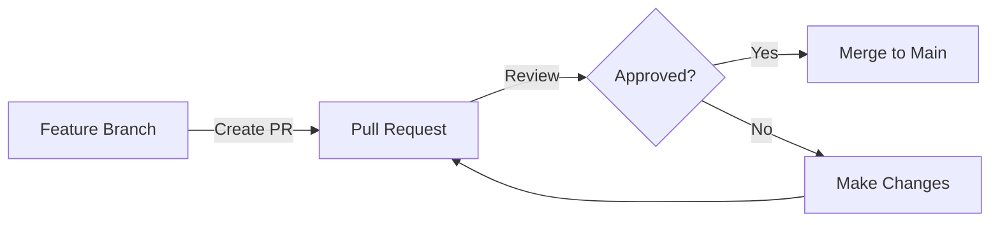

# Git Azure DevOps

## Introduction

Azure DevOps (formerly known as Visual Studio Team Services or VSTS) provides a powerful platform for managing the complete development lifecycle, and Git serves as its primary version control system. This integration allows developers to manage source code, track changes, collaborate effectively, and automate build and deployment processes.

In this tutorial, we'll explore how to use Git with Azure DevOps, covering everything from setting up repositories to implementing advanced workflows for team collaboration. Whether you're working solo or in a team, these tools will streamline your development process and help maintain code quality.

## Prerequisites

Before we start, make sure you have:
- Basic understanding of Git concepts (commits, branches, merges)
- An Azure DevOps account (free tier available)
- Git installed on your local machine
- Visual Studio, VS Code, or your preferred IDE

## Setting Up Git with Azure DevOps

### Step 1: Create a New Project in Azure DevOps

1. Log in to your Azure DevOps account at [dev.azure.com](https://dev.azure.com)
2. Click on "New project"
3. Enter a project name and description
4. Select "Git" as the version control system
5. Click "Create project"

### Step 2: Initialize a Git Repository

When your project is created, Azure DevOps automatically initializes a Git repository for you. You can either:

- Clone this empty repository to start fresh, or
- Push an existing local Git repository to Azure DevOps

Let's look at both approaches:

#### Cloning an Empty Repository

```bash
# Navigate to your desired folder
git clone https://organization-name@dev.azure.com/organization-name/project-name/_git/repository-name
cd repository-name

# Create some files
echo "# My Project" > README.md
git add README.md
git commit -m "Initial commit"
git push -u origin main
```

#### Pushing an Existing Repository

```bash
# Navigate to your existing git repository
cd my-existing-project

# Add the Azure DevOps remote
git remote add azure https://organization-name@dev.azure.com/organization-name/project-name/_git/repository-name

# Push your code to Azure DevOps
git push -u azure --all
```

## Working with Branches in Azure DevOps

Azure DevOps follows Git's branching model, allowing you to create and manage branches both through the web interface and using Git commands.

### Creating a Branch Using the Web Interface

1. Navigate to your repository in Azure DevOps
2. Click on "Branches" in the left sidebar
3. Click "New branch"
4. Enter a name (e.g., `feature/login-page`)
5. Select the source branch (usually `main` or `master`)
6. Click "Create"

### Working with Branches Using Git Commands

```bash
# Create and switch to a new branch
git checkout -b feature/login-page

# Make changes, add, and commit
git add .
git commit -m "Implement login page"

# Push the branch to Azure DevOps
git push -u origin feature/login-page
```

## Pull Requests in Azure DevOps

Pull Requests (PRs) allow you to review code before merging branches. They're essential for quality control and team collaboration.

### Creating a Pull Request

1. After pushing your branch, navigate to your repository
2. Click "Create a pull request" (often appears as a notification)
3. Fill in the details:
   - Title: Brief description of changes
   - Description: Detailed explanation of changes
   - Reviewers: Team members who should review the code
4. Click "Create"

Here's a diagram showing the PR workflow:



### Reviewing and Completing Pull Requests

As a reviewer, you can:
- Add comments on specific lines of code
- Suggest changes
- Approve the PR or request changes

Once approved, to complete the PR:
1. Click "Complete"
2. Choose merge options (merge, squash, or rebase)
3. Optionally check "Delete source branch"
4. Click "Complete merge"

## CI/CD with Azure Pipelines

One of the most powerful features of Azure DevOps is Azure Pipelines, which allows you to automate builds and deployments.

### Creating a Basic CI Pipeline

1. In your project, click on "Pipelines" > "New pipeline"
2. Select "Azure Repos Git" as your code location
3. Select your repository
4. Choose a template (e.g., "Node.js" for a JavaScript project)
5. Save your pipeline YAML file (you can customize it as needed)

Here's a simple YAML pipeline example for a Node.js project:

```yaml
trigger:
- main

pool:
  vmImage: 'ubuntu-latest'

steps:
- task: NodeTool@0
  inputs:
    versionSpec: '16.x'
  displayName: 'Install Node.js'

- script: |
    npm install
    npm run build
  displayName: 'npm install and build'

- script: |
    npm test
  displayName: 'Run tests'
```

## Advanced Git Features in Azure DevOps

### Branch Policies

Branch policies protect important branches by enforcing certain rules before merging:

1. Go to "Repos" > "Branches"
2. Find your main branch and select "..." > "Branch policies"
3. Set requirements such as:
   - Minimum number of reviewers
   - Linked work items
   - Build validation
   - Comment resolution

### Git Hooks

Azure DevOps supports server-side Git hooks through branch policies, but you can also use client-side hooks for additional checks:

Create a `.git/hooks/pre-commit` file in your local repository:

```bash
#!/bin/sh

# Example: Prevent committing to the main branch directly
branch="$(git rev-parse --abbrev-ref HEAD)"
if [ "$branch" = "main" ]; then
  echo "You can't commit directly to the main branch!"
  exit 1
fi

# Run linting
npm run lint

# Exit with the status of the lint command
exit $?
```

Make the hook executable:

```bash
chmod +x .git/hooks/pre-commit
```

### Working with Git Tags

Tags are useful for marking release points. In Azure DevOps, you can manage tags through the web interface or Git commands:

```bash
# Create a new tag
git tag -a v1.0.0 -m "Version 1.0.0"

# Push tags to Azure DevOps
git push --tags
```

## Best Practices for Git with Azure DevOps

1. **Use a consistent branching strategy**: Consider Git Flow or GitHub Flow
2. **Write meaningful commit messages**: Follow the format "type: subject" (e.g., "feat: add login functionality")
3. **Keep pull requests small**: Smaller PRs are easier to review
4. **Use work items**: Link commits and PRs to Azure DevOps work items
5. **Set up branch policies**: Protect your main branches
6. **Automate testing**: Configure CI pipelines to run tests automatically
7. **Regular housekeeping**: Delete merged branches periodically

## Common Workflow Example

Let's walk through a typical workflow using Git and Azure DevOps:

1. **Create a work item**:
   - In Azure DevOps, create a new task or user story

2. **Create a feature branch**:
   ```bash
   git checkout main
   git pull
   git checkout -b feature/user-authentication
   ```

3. **Make changes and commit**:
   ```bash
   # Make changes to files
   git add .
   git commit -m "feat: implement user login form"
   ```

4. **Push to Azure DevOps**:
   ```bash
   git push -u origin feature/user-authentication
   ```

5. **Create a Pull Request**:
   - Navigate to the repository in Azure DevOps
   - Create a PR from `feature/user-authentication` to `main`
   - Link the work item
   - Add reviewers

6. **Address review comments**:
   ```bash
   # Make requested changes
   git add .
   git commit -m "refactor: address review comments"
   git push
   ```

7. **Complete the PR**:
   - Once approved, complete the PR in Azure DevOps
   - The pipeline will automatically build and test your code

8. **Sync local repository**:
   ```bash
   git checkout main
   git pull
   ```

## Troubleshooting Common Issues

### Authentication Problems

If you're having trouble authenticating, try using a Personal Access Token (PAT):

1. Go to Azure DevOps > User settings > Personal access tokens
2. Create a new token with appropriate permissions
3. Use the token in place of your password when Git prompts for credentials

### Merge Conflicts

When you encounter merge conflicts:

```bash
# Pull the latest changes from the target branch
git checkout main
git pull

# Switch back to your feature branch
git checkout feature/my-feature

# Merge main into your feature branch
git merge main

# Resolve conflicts manually, then
git add .
git commit -m "resolve merge conflicts"
git push
```

## Summary

In this tutorial, we've covered:
- Setting up Git with Azure DevOps
- Creating and working with branches
- Using pull requests for code reviews
- Implementing CI/CD with Azure Pipelines
- Advanced Git features in Azure DevOps
- Best practices and common workflows

Git integration with Azure DevOps provides a robust platform for version control, collaboration, and automation. By following the practices outlined in this guide, you'll be well on your way to more efficient and effective development workflows.

## Additional Resources

- [Azure DevOps Documentation](https://docs.microsoft.com/en-us/azure/devops/)
- [Git Documentation](https://git-scm.com/doc)
- [Learn Git Branching](https://learngitbranching.js.org/) - Interactive Git tutorial

## Exercises

1. Create a new Azure DevOps project and push an existing Git repository to it.
2. Create a feature branch, make changes, and submit a pull request.
3. Set up a basic CI/CD pipeline that runs tests on pull requests.
4. Configure branch policies for your main branch.
5. Create a release using Git tags and Azure DevOps release pipelines.