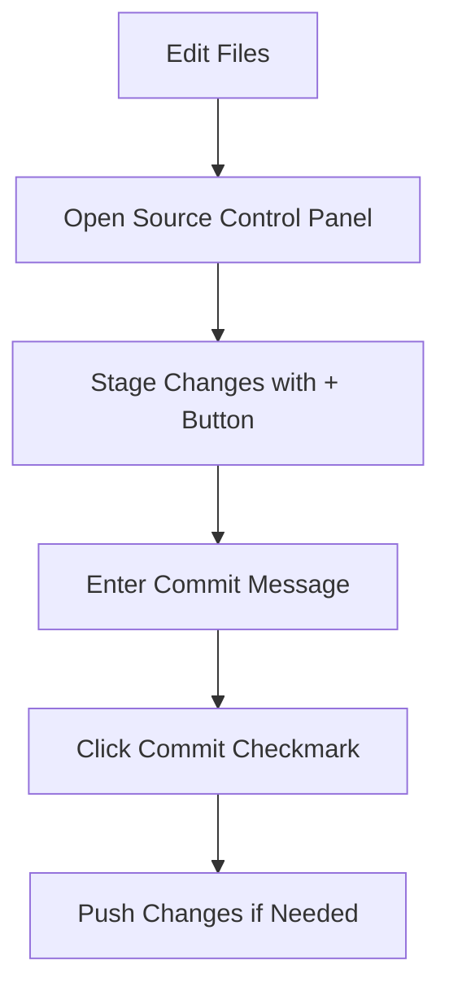

# Git IDE Integration

## Introduction

When you're first learning Git, you might start with the command line interface, typing commands like `git add`, `git commit`, and `git push`. While understanding these commands is essential, modern Integrated Development Environments (IDEs) offer powerful Git integration features that can make version control more intuitive and efficient.

In this guide, we'll explore how Git integrates with popular IDEs, allowing you to perform version control operations without leaving your coding environment. This integration streamlines your workflow and helps you focus on writing code rather than switching between applications.

## Why Use Git Through an IDE?

Before diving into specific IDE integrations, let's understand the benefits:

- **Visual feedback**: See changed files, conflicts, and repository status directly in your editor
- **Simplified workflows**: Perform complex Git operations with a few clicks
- **Contextual operations**: Commit, compare, or view history of specific files while editing them
- **Reduced context switching**: Stay in your development environment instead of switching between terminal and editor

## Popular IDEs with Git Integration

### Visual Studio Code

VS Code has become one of the most popular code editors with excellent Git integration out of the box.

#### Key Git Features in VS Code

1. **Source Control Panel**: Access with the Git icon in the sidebar or press `Ctrl+Shift+G` (Windows/Linux) or `Cmd+Shift+G` (Mac).

2. **File Status Indicators**: VS Code shows the Git status of files directly in the explorer:
   - Green `U`: Untracked files
   - Yellow `M`: Modified files
   - Red `D`: Deleted files

3. **Inline Blame Information**: See who last modified each line with the Git Lens extension.

4. **Basic Git Operations**:
   - Stage changes (equivalent to `git add`)
   - Commit changes
   - Pull/Push changes
   - Manage branches

#### Example: Making a Commit in VS Code

1. Make changes to your files
2. Open the Source Control panel
3. Hover over files and click `+` to stage changes
4. Enter a commit message in the text field
5. Click the checkmark (✓) to commit



### JetBrains IDEs (IntelliJ IDEA, PyCharm, WebStorm, etc.)

JetBrains offers robust Git integration across their entire suite of IDEs.

#### Key Git Features in JetBrains IDEs

1. **VCS Operations Menu**: Access Git operations via VCS in the top menu or right-click context menus.

2. **Git Tool Window**: View changes, commits, branches, and more in the dedicated Git panel.

3. **Advanced Features**:
   - Interactive rebase
   - Resolve merge conflicts with visual diff tool
   - Cherry-pick commits
   - Advanced branch management

#### Example: Resolving a Merge Conflict in IntelliJ

When a merge conflict occurs:

1. Open the Git tool window
2. Select the conflicted file
3. IntelliJ will open a 3-panel merge tool:
   - Left panel: your current branch changes
   - Right panel: incoming changes
   - Center panel: result after merging

4. Use the arrows (`>>>/<<<`) to accept changes from either side, or manually edit the center panel
5. Click "Apply" when resolved

### Eclipse

Eclipse, a popular Java IDE, offers Git integration through its EGit plugin (included in most distributions).

#### Key Git Features in Eclipse

1. **Git Repositories View**: Manage Git repositories through Window > Show View > Git Repositories.

2. **Team Context Menu**: Right-click on projects or files and use the Team submenu for Git operations.

3. **History View**: Track file changes over time with detailed commit information.

#### Example: Creating a Branch in Eclipse

```
1. Right-click on your project
2. Select Team > Switch To > New Branch
3. Enter branch name
4. Select "Checkout new branch" option
5. Click Finish
```

## Practical Workflow Examples

Let's walk through some common Git workflows using IDE integration.

### Feature Branch Workflow in VS Code

1. **Create a feature branch**:
   - Click on the branch name in the status bar
   - Select "Create new branch" from the dropdown
   - Enter a name like `feature/login-page`

2. **Make changes and commit incrementally**:
   - Edit files
   - Stage changes using the + button in the Source Control panel
   - Write a descriptive commit message
   - Click the checkmark to commit

3. **Push to remote**:
   - Click the "..." menu in the Source Control panel
   - Select "Push"
   - If it's a new branch, VS Code will prompt to publish it

4. **Create a Pull Request**:
   - Many IDEs now support creating PRs directly:
   - In VS Code with the GitHub extension, click the "Create Pull Request" icon
   - Fill in the PR details
   - Submit the PR without leaving your editor

### Handling Merge Conflicts in JetBrains IDEs

1. **Update your branch**:
   - Select VCS > Git > Pull
   - If conflicts occur, you'll see a notification

2. **Resolve conflicts**:
   - Open the Git window
   - Select a conflicted file
   - Use the visual Merge Tool
   - Accept changes from either side or manually edit
   - Mark as resolved

3. **Complete the merge**:
   - Commit the resolved changes
   - Push your updates

## Customizing Git Settings in IDEs

Most IDEs allow you to customize Git behavior:

### VS Code Git Settings

Open settings (`Ctrl+,` or `Cmd+,`) and search for "git" to find options like:

```json
{
  "git.enableSmartCommit": true,
  "git.autofetch": true,
  "git.confirmSync": false
}
```

### JetBrains Git Configuration

Go to Settings/Preferences > Version Control > Git to configure:
- Path to Git executable
- Commit message formatting
- Update methods
- SSH configurations

## Debugging with Git Integration

IDEs with Git integration make it easier to track down when bugs were introduced:

### Using Git Blame/Annotate

1. **In VS Code**:
   - Install GitLens extension
   - Right-click on a line > Show Line Blame

2. **In JetBrains IDEs**:
   - Right-click in the editor gutter > Annotate with Git Blame

3. **In Eclipse**:
   - Right-click file > Team > Show Blame Annotation

This shows who last modified each line, when, and in which commit—invaluable for understanding code evolution.

## Common Git IDE Operations Compared to CLI

| Operation | Command Line | VS Code | JetBrains IDEs |
|-----------|--------------|---------|----------------|
| Initialize | `git init` | Initialize Repository in Source Control tab | VCS > Create Git Repository |
| Clone | `git clone URL` | Clone Repository in Source Control tab | VCS > Get from Version Control |
| Add | `git add file` | Click + next to file | Select files and press Ctrl+Alt+A |
| Commit | `git commit -m "message"` | Enter message and click ✓ | Commit button (Ctrl+K) |
| Push | `git push` | ... menu > Push | VCS > Git > Push |
| Pull | `git pull` | ... menu > Pull | VCS > Git > Pull |
| Branch | `git checkout -b branch-name` | Click branch name in status bar | Git branches popup (Ctrl+Shift+`) |

## Troubleshooting Common Issues

### IDE Doesn't Recognize Git

**Solution**: Ensure Git is installed and available in your PATH. Most IDEs have a setting to specify the Git executable path:
- VS Code: settings.json > `git.path`
- JetBrains: Settings > Version Control > Git > Path to Git executable
- Eclipse: Preferences > Team > Git > Configuration

### Changes Not Showing in IDE

**Solution**: 
1. Refresh the Git status (usually in the Git panel)
2. Check if your file is in `.gitignore`
3. Restart the IDE

### Authentication Issues

**Solution**:
1. Configure Git credentials helper:
   ```
   git config --global credential.helper cache
   ```
2. Use SSH keys instead of passwords
3. Check IDE settings for authentication options

## Best Practices for IDE Git Integration

1. **Learn the keyboard shortcuts** for common Git operations in your IDE
2. **Use built-in diff tools** rather than external ones when possible
3. **Combine IDE integration with Git knowledge** - understand what's happening behind the GUI
4. **Keep IDE and Git plugins updated** for the best experience
5. **Configure auto-fetch** to stay updated with remote changes

## Summary

Git IDE integration bridges the gap between coding and version control, creating a seamless development experience. By leveraging these integrations, you can:

- Perform Git operations without leaving your editor
- Visualize changes, history, and repository status
- Resolve conflicts with powerful visual tools
- Streamline common Git workflows

While command-line Git knowledge remains valuable, IDE integration makes version control more accessible and can significantly improve your productivity.

## Additional Resources

- Official documentation:
  - [VS Code Git Integration](https://code.visualstudio.com/docs/editor/versioncontrol)
  - [JetBrains Git Documentation](https://www.jetbrains.com/help/idea/using-git-integration.html)
  - [Eclipse EGit User Guide](https://wiki.eclipse.org/EGit/User_Guide)

## Exercises

1. **Basic IDE Git Operations**:
   - Create a new repository in your IDE
   - Make changes to multiple files
   - Stage only specific changes from each file
   - Commit with a descriptive message
   - Push to a remote repository

2. **Branch Management**:
   - Create a new feature branch in your IDE
   - Make and commit changes
   - Switch back to main/master
   - Merge your feature branch
   - Resolve any conflicts using IDE tools

3. **History Exploration**:
   - Use your IDE's history view/log to examine a file's evolution
   - Find a specific commit using search
   - Examine the changes introduced in that commit
   - Use blame/annotation features to determine when a specific line was modified