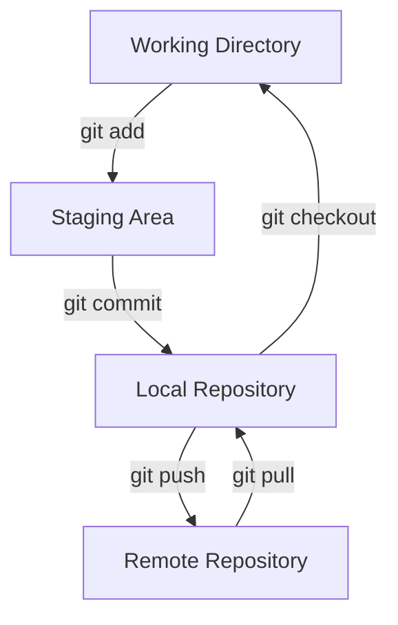

# Git Terminal Integration

## Introduction

Git is a powerful version control system that allows developers to track changes, collaborate on projects, and maintain different versions of their code. While there are many graphical user interfaces (GUIs) available for Git, mastering the terminal-based commands gives you the most flexibility and control over your workflow.

This guide will walk you through the essential Git commands and operations you can perform directly from your terminal, explaining each concept step by step with practical examples.

## Prerequisites

Before we begin, make sure you have:

- Git installed on your system
- Basic familiarity with terminal/command-line operations
- A text editor configured

## Setting Up Git in Your Terminal

### Installation Verification

First, let's verify that Git is properly installed:

```bash
git --version
```

Output:
```
git version 2.39.2
```

### Initial Configuration

Before using Git, you should configure your identity:

```bash
git config --global user.name "Your Name"
git config --global user.email "your.email@example.com"
```

You can verify your settings with:

```bash
git config --list
```

Output:
```
user.name=Your Name
user.email=your.email@example.com
```

## Essential Git Terminal Commands

### Initializing a Repository

To start tracking a project with Git:

```bash
mkdir my-project
cd my-project
git init
```

Output:
```
Initialized empty Git repository in /path/to/my-project/.git/
```

### Checking Repository Status

To see which files are tracked, modified, or staged:

```bash
git status
```

Output:
```
On branch main

No commits yet

nothing to commit (create/copy files and use "git add" to track)
```

### Creating and Adding Files

Let's create a file and track it with Git:

```bash
echo "# My Project" > README.md
git status
```

Output:
```
On branch main

No commits yet

Untracked files:
  (use "git add <file>..." to include in what will be committed)
        README.md

nothing added to commit but untracked files present (use "git add" to track)
```

Now, let's add the file to the staging area:

```bash
git add README.md
git status
```

Output:
```
On branch main

No commits yet

Changes to be committed:
  (use "git rm --cached <file>..." to unstage)
        new file:   README.md
```

### Making Commits

To save your changes to the repository:

```bash
git commit -m "Initial commit: Add README file"
```

Output:
```
[main (root-commit) f7ec1e9] Initial commit: Add README file
 1 file changed, 1 insertion(+)
 create mode 100644 README.md
```

### Viewing Commit History

To see a log of all commits:

```bash
git log
```

Output:
```
commit f7ec1e9d96af96f1e2fadb681fb243e9425f578a (HEAD -> main)
Author: Your Name <your.email@example.com>
Date:   Fri Mar 14 08:30:45 2025 -0700

    Initial commit: Add README file
```

For a more compact view:

```bash
git log --oneline
```

Output:
```
f7ec1e9 (HEAD -> main) Initial commit: Add README file
```

## Working with Branches

Branches allow you to develop features, fix bugs, or experiment without affecting the main codebase.

### Creating a New Branch

```bash
git branch feature-login
```

### Switching Branches

```bash
git checkout feature-login
```

Output:
```
Switched to branch 'feature-login'
```

Or, create and switch in one command:

```bash
git checkout -b feature-pagination
```

Output:
```
Switched to a new branch 'feature-pagination'
```

### Listing Branches

```bash
git branch
```

Output:
```
  feature-login
* feature-pagination
  main
```

The asterisk (*) indicates your current branch.

### Merging Branches

First, switch to the destination branch:

```bash
git checkout main
```

Then merge your feature branch:

```bash
git merge feature-login
```

Output (for a fast-forward merge):
```
Updating f7ec1e9..8d3e4b2
Fast-forward
 login.js | 25 +++++++++++++++++++++++++
 1 file changed, 25 insertions(+)
 create mode 100644 login.js
```

## Working with Remote Repositories

### Adding a Remote

```bash
git remote add origin https://github.com/username/repository.git
```

### Viewing Remotes

```bash
git remote -v
```

Output:
```
origin  https://github.com/username/repository.git (fetch)
origin  https://github.com/username/repository.git (push)
```

### Pushing Changes

```bash
git push -u origin main
```

Output:
```
Enumerating objects: 3, done.
Counting objects: 100% (3/3), done.
Writing objects: 100% (3/3), 253 bytes | 253.00 KiB/s, done.
Total 3 (delta 0), reused 0 (delta 0), pack-reused 0
To https://github.com/username/repository.git
 * [new branch]      main -> main
Branch 'main' set up to track remote branch 'main' from 'origin'.
```

### Pulling Changes

```bash
git pull origin main
```

Output:
```
Already up to date.
```

## Git Terminal Workflow Diagram

The following diagram illustrates a typical Git workflow:



## Advanced Terminal Commands

### Stashing Changes

Temporarily store changes without committing:

```bash
git stash
```

Output:
```
Saved working directory and index state WIP on main: f7ec1e9 Initial commit: Add README file
```

Apply stashed changes later:

```bash
git stash apply
```

### Viewing Differences

See changes between working directory and staging area:

```bash
git diff
```

See changes between staging area and last commit:

```bash
git diff --staged
```

### Tagging Versions

Create a lightweight tag:

```bash
git tag v1.0.0
```

Create an annotated tag:

```bash
git tag -a v1.1.0 -m "Release version 1.1.0"
```

List tags:

```bash
git tag
```

Output:
```
v1.0.0
v1.1.0
```

## Customizing Your Git Terminal Experience

### Creating Aliases

You can create shortcuts for common commands:

```bash
git config --global alias.co checkout
git config --global alias.br branch
git config --global alias.ci commit
git config --global alias.st status
```

Now you can use:

```bash
git co main
git br
git ci -m "Your commit message"
git st
```

### Colorizing Output

Enable color in your Git output:

```bash
git config --global color.ui auto
```

## Best Practices for Terminal Git Usage

1. **Commit Often**: Make small, focused commits that address a single concern.
2. **Write Clear Commit Messages**: Follow conventions like "Add feature X" or "Fix issue Y".
3. **Pull Before Push**: Always pull the latest changes before pushing your own.
4. **Use Branches**: Create a new branch for each feature or bugfix.
5. **Review Changes Before Committing**: Use `git diff` and `git status` to review changes.

## Common Issues and Troubleshooting

### Resolving Merge Conflicts

When Git can't automatically merge changes, you'll see:

```
Auto-merging file.txt
CONFLICT (content): Merge conflict in file.txt
Automatic merge failed; fix conflicts and then commit the result.
```

Open the conflicted file, resolve the conflicts marked with `<<<<<<<`, `=======`, and `>>>>>>>`, then:

```bash
git add file.txt
git commit -m "Resolve merge conflict in file.txt"
```

### Undoing the Last Commit

If you need to undo your last commit but keep the changes:

```bash
git reset --soft HEAD~1
```

### Discarding Changes

To discard changes in a file:

```bash
git checkout -- file.txt
```

## Summary

In this guide, we've covered the essential Git commands you can use directly from your terminal:

- Setting up Git and initial configuration
- Creating and managing repositories
- Working with files and commits
- Branching and merging
- Collaborating with remote repositories
- Advanced operations like stashing and tagging
- Customizing your Git experience
- Troubleshooting common issues

Mastering Git in the terminal provides you with powerful tools to manage your code efficiently, collaborate with others effectively, and maintain a clean project history.

## Additional Resources

For further learning, consider these resources:

- The official Git documentation: [https://git-scm.com/doc](https://git-scm.com/doc)
- Interactive Git learning: [https://learngitbranching.js.org/](https://learngitbranching.js.org/)
- Git cheat sheet: [https://github.github.com/training-kit/downloads/github-git-cheat-sheet.pdf](https://github.github.com/training-kit/downloads/github-git-cheat-sheet.pdf)

## Exercises

To reinforce your Git terminal skills, try these exercises:

1. Create a new repository and add three files with different content.
2. Make separate commits for each file with meaningful commit messages.
3. Create a new branch, make changes to at least one file, and commit them.
4. Switch back to the main branch, make different changes to the same file, and commit them.
5. Merge your feature branch into main and resolve any conflicts.
6. Push your changes to a remote repository.