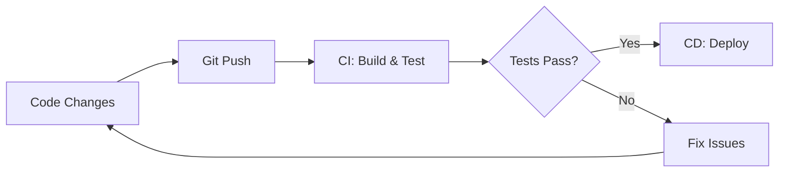

# Git CI/CD Integration

## Introduction

Continuous Integration and Continuous Deployment (CI/CD) represent modern software development practices that aim to improve code quality and accelerate delivery. When integrated with Git, CI/CD creates a powerful workflow that automates testing, building, and deploying your applications whenever changes are committed to your repository.

In this tutorial, we'll explore how Git integrates with CI/CD systems, helping you understand:
- What CI/CD is and why it matters
- How Git triggers CI/CD pipelines
- Common CI/CD tools that integrate with Git
- How to set up basic CI/CD workflows
- Best practices for Git CI/CD integration

## What is CI/CD?

CI/CD consists of two related but distinct practices:

**Continuous Integration (CI)** involves automatically testing and building code when changes are pushed to a repository. This helps catch bugs early in the development process.

**Continuous Deployment/Delivery (CD)** automates the process of deploying applications to testing or production environments after the CI process succeeds.



## How Git Triggers CI/CD Pipelines

Git serves as the foundation for modern CI/CD workflows through several mechanisms:

### 1. Webhooks

When you push code to a Git repository, the hosting service (like GitHub, GitLab, or Bitbucket) can send a webhook notification to your CI/CD system, triggering the pipeline.

```javascript
// Example of a GitHub webhook payload (simplified)
{
  "ref": "refs/heads/main",
  "repository": {
    "name": "my-project",
    "full_name": "username/my-project"
  },
  "commits": [
    {
      "id": "a1b2c3d4e5f6",
      "message": "Fix login bug",
      "author": {
        "name": "Developer Name",
        "email": "dev@example.com"
      }
    }
  ]
}
```

### 2. Branch-Based Workflows

Git branches provide a natural way to organize CI/CD pipelines:

- **Feature branches** trigger test pipelines
- **Development branch** triggers test and staging deployment
- **Main/master branch** triggers production deployment

### 3. Git Events

CI/CD pipelines can be configured to respond to specific Git events:

- `git push` (new commits)
- Pull/Merge requests
- Tags (often used for releases)
- Comments (some systems allow triggering pipelines via PR comments)

## Popular CI/CD Tools for Git Integration

Several CI/CD platforms offer seamless Git integration:

### GitHub Actions

GitHub's built-in CI/CD system uses workflow files stored in your repository.

```yaml
# .github/workflows/ci.yml
name: CI

on:
  push:
    branches: [ main ]
  pull_request:
    branches: [ main ]

jobs:
  build:
    runs-on: ubuntu-latest
    
    steps:
    - uses: actions/checkout@v3
    - name: Set up Node.js
      uses: actions/setup-node@v3
      with:
        node-version: '16'
    - name: Install dependencies
      run: npm ci
    - name: Run tests
      run: npm test
```

### GitLab CI/CD

GitLab includes integrated CI/CD defined in `.gitlab-ci.yml` files.

```yaml
# .gitlab-ci.yml
stages:
  - test
  - build
  - deploy

test_job:
  stage: test
  script:
    - npm install
    - npm test
  
build_job:
  stage: build
  script:
    - npm run build
  artifacts:
    paths:
      - dist/
      
deploy_job:
  stage: deploy
  script:
    - echo "Deploying application..."
    - ./deploy.sh
  only:
    - main
```

### Jenkins

Jenkins is a self-hosted automation server that can be triggered by Git webhooks.

```groovy
// Jenkinsfile
pipeline {
    agent any
    
    stages {
        stage('Build') {
            steps {
                sh 'npm install'
                sh 'npm run build'
            }
        }
        stage('Test') {
            steps {
                sh 'npm test'
            }
        }
        stage('Deploy') {
            when {
                branch 'main'
            }
            steps {
                sh './deploy.sh'
            }
        }
    }
}
```

## Setting Up Your First CI/CD Pipeline with Git

Let's walk through setting up a basic CI/CD pipeline for a Node.js project using GitHub Actions:

### Step 1: Create a GitHub Repository

If you don't already have one, create a new repository on GitHub for your project.

### Step 2: Create a Workflow File

In your repository, create a new file at `.github/workflows/ci-cd.yml`:

```yaml
name: CI/CD Pipeline

on:
  push:
    branches: [ main ]
  pull_request:
    branches: [ main ]

jobs:
  test:
    runs-on: ubuntu-latest
    
    steps:
    - uses: actions/checkout@v3
    - name: Set up Node.js
      uses: actions/setup-node@v3
      with:
        node-version: '16'
    - name: Install dependencies
      run: npm ci
    - name: Run tests
      run: npm test
      
  deploy:
    needs: test
    if: github.ref == 'refs/heads/main'
    runs-on: ubuntu-latest
    
    steps:
    - uses: actions/checkout@v3
    - name: Deploy to production
      run: |
        echo "Deploying to production"
        # Add your deployment commands here
```

### Step 3: Push Your Changes

Commit and push this file to your repository:

```bash
git add .github/workflows/ci-cd.yml
git commit -m "Add CI/CD workflow"
git push origin main
```

### Step 4: Monitor Pipeline Execution

Visit the "Actions" tab in your GitHub repository to watch your workflow run.

## Real-World Applications and Examples

### Example 1: Automated Testing for a Web Application

Let's look at a more complete CI workflow for a React application:

```yaml
name: React App CI

on:
  push:
    branches: [ main, development ]
  pull_request:
    branches: [ main, development ]

jobs:
  test:
    runs-on: ubuntu-latest
    
    steps:
    - uses: actions/checkout@v3
    
    - name: Set up Node.js
      uses: actions/setup-node@v3
      with:
        node-version: '16'
        
    - name: Cache dependencies
      uses: actions/cache@v3
      with:
        path: ~/.npm
        key: ${{ runner.os }}-node-${{ hashFiles('**/package-lock.json') }}
        
    - name: Install dependencies
      run: npm ci
      
    - name: Lint code
      run: npm run lint
      
    - name: Run unit tests
      run: npm test
      
    - name: Build application
      run: npm run build
```

### Example 2: Deploying a Backend API to Cloud Provider

This example shows how to deploy a Node.js API to Azure App Service:

```yaml
name: API Deployment

on:
  push:
    branches: [ main ]

jobs:
  build_and_deploy:
    runs-on: ubuntu-latest
    
    steps:
    - uses: actions/checkout@v3
    
    - name: Set up Node.js
      uses: actions/setup-node@v3
      with:
        node-version: '16'
        
    - name: Install dependencies
      run: npm ci
      
    - name: Run tests
      run: npm test
      
    - name: Deploy to Azure
      uses: azure/webapps-deploy@v2
      with:
        app-name: 'my-api-service'
        publish-profile: ${{ secrets.AZURE_PUBLISH_PROFILE }}
        package: .
```

## Best Practices for Git CI/CD Integration

### 1. Use Branch Protection Rules

Protect your main branches by requiring CI checks to pass before merging:

- Go to repository settings → Branches → Add rule
- Select "Require status checks to pass before merging"
- Select your CI workflow

### 2. Keep Secrets Secure

Never commit sensitive information to your repository. Use your CI/CD platform's secrets management:

```yaml
# Using a secret in GitHub Actions
steps:
  - name: Deploy with API key
    run: ./deploy.sh
    env:
      API_KEY: ${{ secrets.API_KEY }}
```

### 3. Cache Dependencies

Speed up your pipelines by caching dependencies between runs:

```yaml
- name: Cache dependencies
  uses: actions/cache@v3
  with:
    path: ~/.npm
    key: ${{ runner.os }}-node-${{ hashFiles('**/package-lock.json') }}
```

### 4. Use Meaningful Commit Messages

Good commit messages help track what changes triggered which pipeline runs:

```bash
# Good commit message
git commit -m "Fix authentication bug in login form"

# Not helpful
git commit -m "Fix stuff"
```

### 5. Test Locally Before Pushing

Run tests locally before pushing to avoid unnecessary CI failures:

```bash
# Run tests before pushing
npm test

# If tests pass, then push
git push origin feature-branch
```

## Advanced Git CI/CD Concepts

### Feature Flags

Combine CI/CD with feature flags to deploy code that isn't yet activated:

```javascript
// Feature flag example
function newFeature() {
  if (featureFlags.isEnabled('new-search')) {
    return <NewSearchComponent />;
  } else {
    return <LegacySearchComponent />;
  }
}
```

### Monorepo CI/CD

For monorepos, configure CI to only run tests for affected packages:

```yaml
# Example for detecting changes in a specific directory
jobs:
  test-frontend:
    if: contains(github.event.commits.*.modified, 'frontend/')
    runs-on: ubuntu-latest
    steps:
      # Run frontend tests
```

### Multi-Environment Deployments

Use Git tags or branches to deploy to different environments:

```yaml
jobs:
  deploy:
    runs-on: ubuntu-latest
    steps:
      - uses: actions/checkout@v3
      
      - name: Deploy to dev
        if: github.ref == 'refs/heads/development'
        run: ./deploy.sh dev
        
      - name: Deploy to staging
        if: github.ref == 'refs/heads/staging'
        run: ./deploy.sh staging
        
      - name: Deploy to production
        if: github.ref == 'refs/heads/main'
        run: ./deploy.sh production
```

## Summary

Git CI/CD integration transforms the development workflow by automating testing, building, and deployment processes. With the right setup, you can:

- Catch bugs early through automated testing
- Deploy code consistently and reliably
- Reduce manual errors in the deployment process
- Accelerate your development cycle

By incorporating these practices, even beginners can implement professional-grade workflows that improve code quality and team productivity.

## Additional Resources

### Tutorials and Documentation
- [GitHub Actions Documentation](https://docs.github.com/en/actions)
- [GitLab CI/CD Documentation](https://docs.gitlab.com/ee/ci/)
- [Jenkins Pipeline Documentation](https://www.jenkins.io/doc/book/pipeline/)

### Exercises

1. **Basic CI Setup**
   Set up a simple CI pipeline for an existing project that runs tests on every push.

2. **Environment Variables**
   Modify your CI pipeline to use environment variables for configuration.

3. **Multi-Stage Pipeline**
   Create a pipeline with separate stages for testing, building, and deploying.

4. **Branch-Based Deployment**
   Configure your pipeline to deploy to different environments based on the Git branch.

5. **Pull Request Checks**
   Set up status checks that must pass before a pull request can be merged.