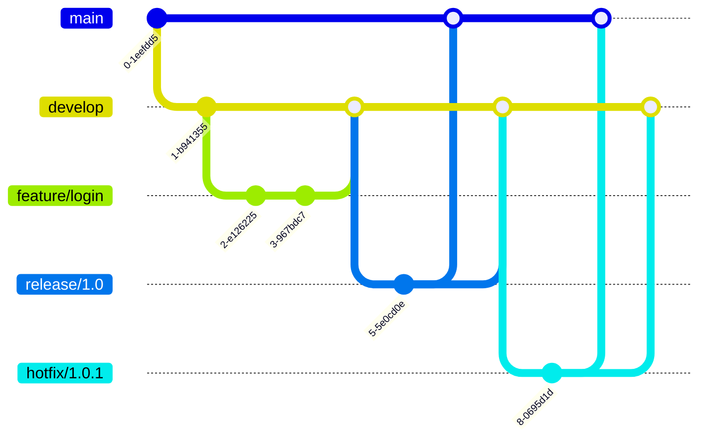

# Git Project Management

## Introduction

Git is not just a version control system, but a powerful tool for project management. This guide will show you how to leverage Git's features to organize your development workflow, collaborate effectively with team members, and maintain a clean, efficient codebase. Whether you're working on a personal project or as part of a large team, mastering Git for project management will significantly enhance your development experience.

## Understanding Git as a Project Management Tool

Git transforms how developers track changes and collaborate, providing these key project management capabilities:

- **Version control**: Track all changes to your codebase over time
- **Collaboration**: Enable multiple developers to work on the same project simultaneously
- **Branching strategy**: Organize features, fixes, and experiments
- **Project history**: Maintain a complete, searchable record of your project's evolution
- **Release management**: Tag and mark project milestones and versions

## Setting Up a New Git Project

### Creating a New Repository

Let's start by setting up a new Git repository for your project:

```bash
# Initialize a new Git repository
mkdir my-project
cd my-project
git init

# Create initial project files
touch README.md
touch .gitignore

# Make your first commit
git add .
git commit -m "Initial project setup"
```

### Configuring Your .gitignore File

A properly configured `.gitignore` file keeps your repository clean by excluding unnecessary files:

```plaintext
# Example .gitignore for a Node.js project
node_modules/
.env
.DS_Store
*.log
dist/
coverage/
```

### Creating a Meaningful README

Your README serves as your project's front page:

```markdown
# Project Name

Brief description of what your project does.

## Installation

```bash
npm install my-project
```

## Usage

```javascript
const myProject = require('my-project');
myProject.awesomeFunction();
```

## Features

- Feature 1
- Feature 2

## Contributing

Instructions for contributors.

## License

MIT
```

## Branching Strategies for Project Organization

Branching is the heart of Git project management. Let's explore effective branching strategies:

### GitFlow Workflow

GitFlow is a robust branching model designed for larger projects:



Key branches in GitFlow:

- **main**: Production-ready code
- **develop**: Development integration branch
- **feature/***: New features (branched from develop)
- **release/***: Preparing a new release
- **hotfix/***: Emergency fixes for production

### GitHub Flow

A simpler alternative for continuous delivery:


GitHub Flow steps:

1. Branch from `main`
2. Develop your feature
3. Open a pull request
4. Review and discuss
5. Deploy and test
6. Merge to `main`

### Implementing Your Branching Strategy

```bash
# GitFlow example
# Create a develop branch
git checkout -b develop

# Create a feature branch
git checkout -b feature/user-authentication develop

# Work on your feature
# Make changes, commits...

# When finished, merge back to develop
git checkout develop
git merge --no-ff feature/user-authentication
git branch -d feature/user-authentication

# Create a release
git checkout -b release/1.0 develop
# Final testing and bug fixes...
git checkout main
git merge --no-ff release/1.0
git tag -a v1.0 -m "Version 1.0"
```

## Managing Project Milestones with Tags and Releases

Tags help mark important points in your project history:

```bash
# Create an annotated tag for a stable release
git tag -a v1.0.0 -m "First stable release"

# Push tags to remote repository
git push origin --tags

# List all tags
git tag -l

# Check out code at a specific tag
git checkout v1.0.0
```

### Semantic Versioning

Follow semantic versioning to make your releases predictable:

- **MAJOR** version for incompatible API changes (v1.0.0 → v2.0.0)
- **MINOR** version for new functionality that's backward-compatible (v1.0.0 → v1.1.0)
- **PATCH** version for backward-compatible bug fixes (v1.0.0 → v1.0.1)

## Collaborative Project Management

### Pull Request Workflow

Here's how to use pull requests for code review and collaboration:

1. Create a feature branch:
   ```bash
   git checkout -b feature/search-functionality
   ```

2. Make your changes with descriptive commit messages:
   ```bash
   git commit -m "Add search bar component to header"
   git commit -m "Implement search API connection"
   git commit -m "Add search results display"
   ```

3. Push your feature branch:
   ```bash
   git push -u origin feature/search-functionality
   ```

4. Create a pull request (via GitHub, GitLab, etc.)

5. After review and approval, merge the changes

### Handling Merge Conflicts

Merge conflicts are inevitable in collaborative development. Here's how to resolve them:

```bash
# When a merge conflict occurs:
git merge feature/search-functionality
# CONFLICT: Merge conflict in src/header.js

# Edit the file to resolve the conflict
# Files will contain markers showing the conflicting changes:
# <<<<<<< HEAD
# current code
# =======
# incoming code
# >>>>>>> feature/search-functionality

# After resolving, add the file and finish the merge
git add src/header.js
git commit -m "Resolve merge conflict in header"
```

## Tracking Work with Git Projects and Issues

Most Git platforms (GitHub, GitLab, Bitbucket) offer project management features:

### GitHub Projects Example

1. Create a project board with columns:
   - To Do
   - In Progress
   - Review
   - Done

2. Create issues for tasks:
   ```markdown
   Title: Implement user authentication
   
   Description:
   Add user login and registration functionality.
   
   Tasks:
   - [ ] Create login form
   - [ ] Set up authentication API
   - [ ] Add session management
   - [ ] Create user registration form
   
   Acceptance Criteria:
   - Users can register with email and password
   - Users can log in and stay authenticated
   - Proper error handling for authentication failures
   ```

3. Connect commits to issues using keywords:
   ```bash
   git commit -m "Add login form, fixes #42"
   ```

## Advanced Git Project Management Techniques

### Using Git Hooks for Project Quality

Git hooks automate tasks when specific events occur:

```bash
# Create a pre-commit hook to run linters
# .git/hooks/pre-commit
#!/bin/sh
npm run lint

# If linting fails, prevent the commit
if [ $? -ne 0 ]; then
  echo "Linting failed! Fix the errors before committing."
  exit 1
fi
```

Don't forget to make the hook executable:
```bash
chmod +x .git/hooks/pre-commit
```

### Monorepo Management

For larger projects with multiple components:

```bash
# Example monorepo structure
my-project/
├── packages/
│   ├── frontend/
│   ├── backend/
│   └── shared/
├── .gitignore
└── package.json
```

Use tools like Lerna or Nx to manage your monorepo:

```bash
# Initialize Lerna for monorepo management
npx lerna init

# Set up workspaces in package.json
{
  "name": "my-project",
  "private": true,
  "workspaces": [
    "packages/*"
  ]
}
```

### Continuous Integration

Integrate Git with CI tools:

```yaml
# Example GitHub Actions workflow
# .github/workflows/ci.yml
name: CI

on:
  push:
    branches: [ main, develop ]
  pull_request:
    branches: [ main, develop ]

jobs:
  build:
    runs-on: ubuntu-latest
    steps:
    - uses: actions/checkout@v3
    - name: Setup Node.js
      uses: actions/setup-node@v3
      with:
        node-version: '16'
    - name: Install dependencies
      run: npm ci
    - name: Run tests
      run: npm test
    - name: Build
      run: npm run build
```

## Best Practices for Git Project Management

1. **Commit often with meaningful messages**:
   ```bash
   # Bad commit message
   git commit -m "Fix stuff"
   
   # Good commit message
   git commit -m "Fix navigation dropdown not closing on mobile devices"
   ```

2. **Keep branches focused on a single task**

3. **Regularly rebase or merge from the main branch**:
   ```bash
   git checkout feature/my-feature
   git rebase main
   ```

4. **Use pull requests for code review**

5. **Maintain a clean commit history**:
   ```bash
   # Squash multiple commits when merging
   git merge --squash feature/login
   
   # Or rebase interactively to clean up before pushing
   git rebase -i HEAD~3
   ```

6. **Document project workflows in the repository**:
   ```markdown
   # CONTRIBUTING.md
   
   ## Development Workflow
   
   1. Create a feature branch from `develop`
   2. Make your changes and commit
   3. Push your branch and create a pull request
   4. Ensure tests pass and address review comments
   5. Once approved, your PR will be merged
   ```

## Troubleshooting Common Git Project Issues

### Recovering Lost Work

```bash
# Find "deleted" commits with reflog
git reflog

# Recover a commit that's no longer on any branch
git checkout -b recovery-branch a1b2c3d

# Find changes that weren't committed
git fsck --lost-found
```

### Dealing with Large Files and Repositories

```bash
# Clean up unnecessary files
git gc

# Find large files in your repository
git rev-list --objects --all | git cat-file --batch-check='%(objecttype) %(objectname) %(objectsize) %(rest)' | sort -k3nr | head -n 10
```

## Summary

Git project management goes far beyond basic version control. By leveraging branches, tags, pull requests, and integration with other tools, you can create a streamlined workflow that enhances collaboration and maintains code quality. The strategies outlined in this guide will help you organize your development process, track progress effectively, and deliver high-quality software consistently.

## Additional Resources

- [Pro Git Book](https://git-scm.com/book/en/v2)
- [Git Flow Cheatsheet](https://danielkummer.github.io/git-flow-cheatsheet/)
- [Conventional Commits](https://www.conventionalcommits.org/)

## Exercises

1. Set up a new repository with a proper `.gitignore`, README, and initial commit.
2. Create a feature branch, make several changes, and then merge it back to the main branch.
3. Simulate a merge conflict (have two branches modify the same file) and practice resolving it.
4. Create a release tag using semantic versioning.
5. Try setting up a simple pre-commit hook to ensure code quality.