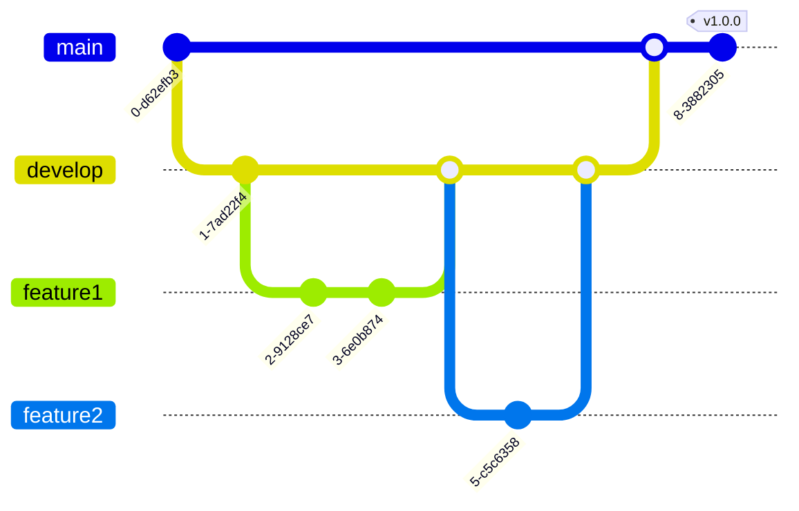

# Git Documentation Tools

## Introduction

Documentation is a crucial aspect of any software project, and Git repositories are no exception. Good documentation helps team members understand the project structure, contribution guidelines, and development workflows. In this guide, we'll explore various tools and approaches for documenting Git repositories that will help make your projects more accessible, maintainable, and collaborative.

Git documentation tools help you create, maintain, and share information about your repositories in a structured and accessible way. Whether you're working alone or in a team, proper documentation ensures that anyone interacting with your repository can quickly understand its purpose and how to contribute effectively.

## Core Documentation Files

Before diving into specialized tools, let's understand the fundamental documentation files that should exist in most Git repositories:

### README.md

The README file is the first document users encounter when visiting your repository. It should provide:

```markdown
# Project Name

A brief description of what the project does.

## Features

- Key feature 1
- Key feature 2
- Key feature 3

## Installation

```bash
# Installation commands
npm install my-package
```

## Usage

```javascript
// Basic usage example
import myPackage from 'my-package';
myPackage.doSomething();
```

## Contributing

Please read CONTRIBUTING.md for details on our code of conduct and the process for submitting pull requests.
```

### CONTRIBUTING.md

This file outlines how others can contribute to your project:

```markdown
# Contributing Guidelines

Thank you for considering contributing to our project!

## Code of Conduct

Please follow our code of conduct in all your interactions with the project.

## Pull Request Process

1. Update the README.md with details of changes if applicable.
2. Update any examples or documentation to reflect your changes.
3. The PR will be merged once it has been reviewed and approved.

## Development Setup

```bash
# Commands to set up the development environment
git clone https://github.com/username/project.git
cd project
npm install
```
```

### CHANGELOG.md

A chronological list of notable changes for each version of your project:

```markdown
# Changelog

All notable changes to this project will be documented in this file.

## [1.0.0] - 2025-03-10

### Added
- Feature A
- Feature B

### Changed
- Improved performance of X

### Fixed
- Bug in Y component
```

## Specialized Git Documentation Tools

Now let's explore some specialized tools for documenting Git repositories:

### 1. GitBook

GitBook is a modern documentation platform that lets you create beautiful documentation websites from Markdown files.

#### Key Features:
- Converts Markdown files into interactive documentation
- Supports versioning
- Integrates with GitHub repositories
- Collaborative editing
- Search functionality

#### Basic Setup:

```bash
# Install GitBook CLI
npm install -g gitbook-cli

# Initialize a new GitBook
gitbook init

# Preview your documentation
gitbook serve
```

#### Real-world Example:

Many open-source projects use GitBook for their documentation, such as Redux, Webpack, and React Native.

### 2. Docsify

Docsify is a lightweight documentation site generator that doesn't generate static HTML files.

#### Key Features:
- No build process needed
- Simple and lightweight
- Multiple themes
- Full-text search
- Compatible with Markdown files

#### Basic Setup:

```bash
# Install Docsify CLI
npm install -g docsify-cli

# Initialize a new documentation site
docsify init ./docs

# Preview your documentation
docsify serve docs
```

#### Example Structure:

```
docs/
|-- .nojekyll
|-- README.md
|-- index.html
|-- _sidebar.md
|-- guide/
    |-- getting-started.md
    |-- configuration.md
```

### 3. Jekyll with GitHub Pages

GitHub Pages offers native support for Jekyll, making it easy to turn your documentation into a website.

#### Key Features:
- Free hosting on GitHub Pages
- Integrates naturally with Git repositories
- Supports themes and plugins
- Automatic builds when you push to your repository

#### Basic Setup:

```bash
# Install Jekyll and Bundler
gem install jekyll bundler

# Create a new Jekyll site
jekyll new docs

# Build and serve your site
cd docs
bundle exec jekyll serve
```

### 4. MkDocs

MkDocs is a fast, simple documentation generator that builds static HTML sites from Markdown files.

#### Key Features:
- Built-in dev-server with live-reload
- Simple YAML configuration
- Themeable
- Extensible with plugins

#### Basic Setup:

```bash
# Install MkDocs
pip install mkdocs

# Create a new project
mkdocs new my-project
cd my-project

# Serve your documentation
mkdocs serve

# Build your documentation
mkdocs build
```

#### Example mkdocs.yml Configuration:

```yaml
site_name: My Git Project
theme: material
nav:
  - Home: index.md
  - Getting Started: getting-started.md
  - API Reference: api.md
  - Contributing: contributing.md
```

### 5. Docusaurus

Docusaurus (which you're using for your site) is a modern static website generator that builds optimized websites quickly.

#### Key Features:
- Built with React
- Supports MDX (Markdown + JSX)
- Versioning support
- Document search
- Internationalization

#### Basic Setup:

```bash
# Install Docusaurus
npx @docusaurus/init@latest init my-website classic

# Start the development server
cd my-website
npm start
```

## Automated Documentation Tools

Beyond manual documentation, there are tools that can automatically generate documentation from your code and Git history:

### 1. JSDoc (for JavaScript)

JSDoc comments in your code can be transformed into API documentation.

```javascript
/**
 * Calculates the sum of two numbers
 * @param {number} a - The first number
 * @param {number} b - The second number
 * @returns {number} The sum of a and b
 */
function add(a, b) {
  return a + b;
}
```

To generate documentation from JSDoc comments:

```bash
# Install JSDoc
npm install -g jsdoc

# Generate documentation
jsdoc path/to/javascript/files -d docs
```

### 2. Git-Changelog

This tool automatically generates a changelog from your Git commit history.

```bash
# Install git-changelog
npm install -g git-changelog

# Generate a changelog
git-changelog
```

### 3. Doxygen (for C, C++, Java, etc.)

Doxygen can generate documentation from annotated source files.

```cpp
/**
 * @brief Adds two integers
 * @param a First integer
 * @param b Second integer
 * @return Sum of a and b
 */
int add(int a, int b) {
  return a + b;
}
```

```bash
# Install Doxygen (varies by platform)
# On Ubuntu:
sudo apt-get install doxygen

# Generate a configuration file
doxygen -g

# Generate documentation
doxygen
```

## Documenting Git Workflows

Beyond documenting the code itself, it's important to document your Git workflows:

### 1. Git Flow Diagrams

Visualize your branching strategy with Mermaid diagrams:



### 2. Commit Message Guidelines

Document your commit message format:

```markdown
## Commit Message Format

Each commit message should include:

1. A type: feat, fix, docs, style, refactor, test, or chore
2. A scope (optional): what part of the code the change affects
3. A subject: short description of the change

Example:
```

```
feat(auth): add OAuth2 authentication
```

### 3. Branch Naming Conventions

```markdown
## Branch Naming Conventions

- `feature/`: For new features
- `bugfix/`: For bug fixes
- `hotfix/`: For critical fixes to production
- `docs/`: For documentation updates
- `refactor/`: For code refactoring

Example: `feature/user-authentication`
```

## Integrating Documentation into CI/CD

Automating documentation generation ensures it stays up-to-date:

### GitHub Actions Example

```yaml
name: Generate Documentation

on:
  push:
    branches: [ main ]

jobs:
  build:
    runs-on: ubuntu-latest
    steps:
    - uses: actions/checkout@v2
    - name: Set up Node.js
      uses: actions/setup-node@v2
      with:
        node-version: '16'
    - name: Install dependencies
      run: npm install
    - name: Generate docs
      run: npm run docs
    - name: Deploy to GitHub Pages
      uses: peaceiris/actions-gh-pages@v3
      with:
        github_token: ${{ secrets.GITHUB_TOKEN }}
        publish_dir: ./docs
```

## Best Practices for Git Documentation

1. **Keep documentation close to code**: Store documentation in the same repository as your code.
2. **Use version control for documentation**: Track changes to documentation just like you track changes to code.
3. **Update documentation with code changes**: Make documentation updates part of your pull request process.
4. **Use templates**: Standardize documentation with templates for READMEs, issues, and pull requests.
5. **Automate where possible**: Use tools to generate documentation from code and comments.
6. **Include examples**: Provide clear examples for better understanding.
7. **Focus on the why, not just the what**: Explain the reasoning behind decisions.

## Implementation Example: Setting Up Docusaurus for Git Documentation

Let's walk through a complete example of setting up Docusaurus (which you're already using) specifically for Git documentation:

### 1. Project Setup

```bash
# Create a new Docusaurus project
npx @docusaurus/init@latest init git-docs classic

# Navigate to the project
cd git-docs
```

### 2. Create Documentation Structure

```
docs/
|-- git-integrations/
    |-- git-documentation-tools.md
    |-- git-hosting-services.md
    |-- git-ide-plugins.md
|-- git-basics/
    |-- installation.md
    |-- configuration.md
    |-- basic-commands.md
```

### 3. Configure Docusaurus

Update your `docusaurus.config.js`:

```javascript
module.exports = {
  title: 'Git Documentation',
  tagline: 'Comprehensive Git guides for beginners',
  url: 'https://yourdomain.com',
  baseUrl: '/',
  organizationName: 'yourname',
  projectName: 'git-docs',
  themeConfig: {
    navbar: {
      title: 'Git Documentation',
      items: [
        {
          to: 'docs/git-basics/installation',
          activeBasePath: 'docs',
          label: 'Git Basics',
          position: 'left',
        },
        {
          to: 'docs/git-integrations/git-documentation-tools',
          activeBasePath: 'docs',
          label: 'Git Integrations',
          position: 'left',
        },
      ],
    },
    footer: {
      style: 'dark',
      links: [
        {
          title: 'Docs',
          items: [
            {
              label: 'Git Basics',
              to: 'docs/git-basics/installation',
            },
            {
              label: 'Git Integrations',
              to: 'docs/git-integrations/git-documentation-tools',
            },
          ],
        },
      ],
    },
  },
  presets: [
    [
      '@docusaurus/preset-classic',
      {
        docs: {
          sidebarPath: require.resolve('./sidebars.js'),
        },
      },
    ],
  ],
};
```

## Summary

Documentation is a critical component of any Git repository. With the right tools and practices, you can create comprehensive, accessible documentation that enhances collaboration and project sustainability. 

In this guide, we've explored:
- Essential documentation files for Git repositories
- Specialized Git documentation tools
- Automated documentation generators
- Methods for documenting Git workflows
- Best practices for maintaining documentation
- A practical implementation example using Docusaurus

By incorporating these tools and techniques into your development workflow, you'll create repositories that are more accessible to new contributors, more maintainable for existing team members, and better structured for long-term success.

## Additional Resources

- [Git Documentation](https://git-scm.com/doc)
- [Docusaurus Documentation](https://docusaurus.io/docs)
- [Markdown Guide](https://www.markdownguide.org/)
- [GitHub Guides](https://guides.github.com/)

## Exercises

1. Create a README.md for a project you're working on, following the template provided in this guide.
2. Set up one of the documentation tools discussed (GitBook, Docsify, or MkDocs) for a personal project.
3. Create a Mermaid diagram illustrating your team's Git branching strategy.
4. Write documentation for a Git hook that your team uses.
5. Set up a GitHub Action to automatically generate and deploy documentation for your repository.