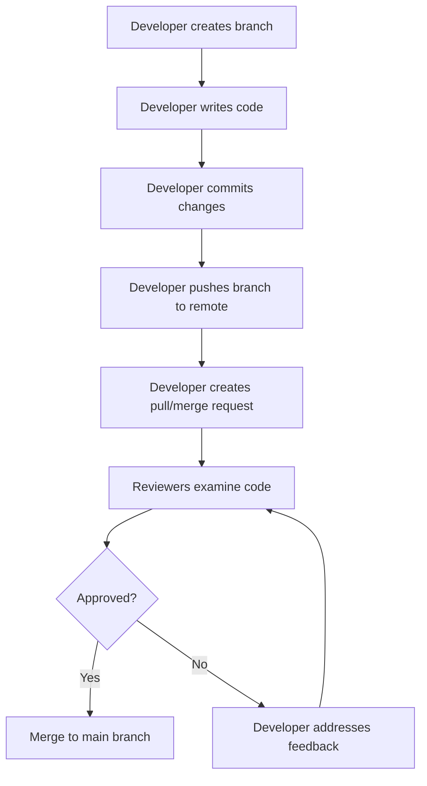
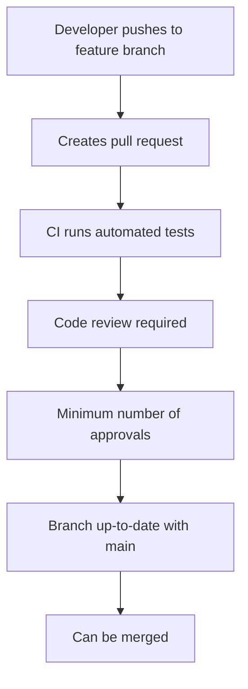

# Git Code Review Tools

## Introduction

Code review is a fundamental practice in modern software development that helps teams maintain high code quality, share knowledge, and catch potential issues before they reach production. Git, as the most widely-used version control system, integrates with various code review tools that streamline this process.

In this guide, we'll explore the major Git code review tools available, how they work, and how to integrate them into your development workflow. Whether you're working on a small personal project or contributing to a large team effort, understanding these tools will significantly improve your collaboration experience.

## What is Code Review?

Before diving into specific tools, let's understand what code review is and why it matters:

Code review is the systematic examination of source code by peers to identify bugs, improve code quality, and ensure adherence to project standards. It typically happens after a developer completes a feature or fix but before the code is merged into the main codebase.

### Benefits of Code Review

- **Bug detection**: Multiple eyes catch what one pair might miss
- **Knowledge sharing**: Team members learn from each other's approaches
- **Consistent standards**: Ensures code follows project conventions
- **Improved architecture**: Identifies design issues early
- **Mentorship**: Helps junior developers grow through feedback

## Git Workflow and Code Reviews

Code reviews in Git typically follow this workflow:



Now let's explore the tools that facilitate this process.

## Popular Git Code Review Tools

### 1. GitHub Pull Requests

GitHub's Pull Requests (PRs) are the most widely-used code review tool in the open-source community and many professional teams.

#### Key Features:

- Line-by-line commenting
- Threaded discussions
- Review approval/rejection
- CI integration
- Draft pull requests for work-in-progress code
- Automatic merge conflict detection

#### How to Use GitHub Pull Requests:

1. Create a new branch for your feature or fix:

```bash
git checkout -b feature-name
```

2. Make changes and commit them:

```bash
git add .
git commit -m "Implement new feature"
```

3. Push your branch to GitHub:

```bash
git push -u origin feature-name
```

4. Navigate to your repository on GitHub and click "Compare & pull request"

5. Fill in the description and create the pull request

6. Reviewers will now be able to comment on your code

#### Example PR Description:

```
## Changes Made
- Added pagination to the user list
- Fixed bug in search functionality
- Updated API endpoints to use the new authentication system

## Testing Done
- Tested pagination with 100+ users
- Verified search works with special characters
- Confirmed API endpoints return correct status codes

## Screenshots
(Would include screenshots in a real PR)
```

### 2. GitLab Merge Requests

GitLab's equivalent to pull requests is called "Merge Requests" (MRs).

#### Key Features:

- Similar commenting and review capabilities to GitHub
- Built-in CI/CD pipeline integration
- Merge when pipeline succeeds option
- Approval rules for different types of changes
- Code quality reports

#### Creating a GitLab Merge Request:

```bash
# Create a new branch
git checkout -b my-feature

# Make changes and commit
git add .
git commit -m "Implement new feature"

# Push to GitLab
git push -u origin my-feature
```

Then navigate to GitLab and create a merge request through the web interface.

### 3. Bitbucket Pull Requests

Atlassian's Bitbucket offers pull requests with tight integration to their suite of tools.

#### Key Features:

- Similar to GitHub and GitLab for basic review functionality
- Integration with Jira for issue tracking
- Task creation from comments
- Automatic merging when conditions are met
- File-by-file review capability

### 4. Gerrit Code Review

Gerrit is different from the platforms above as it's a specialized code review tool that works with Git rather than being part of a hosting platform.

#### Key Features:

- Patch-based review system (each commit is reviewed separately)
- Voting system with customizable categories
- Automated verification through CI integration
- Powerful access control
- Used by Android and other large projects

#### Working with Gerrit:

```bash
# Clone the repository with the Gerrit hook
git clone https://gerrit-instance.example/project

# Create a branch for your change
git checkout -b my-feature

# Make changes and commit
git add .
git commit -m "Implement new feature"

# Push to Gerrit for review (not to the normal Git remote)
git push origin HEAD:refs/for/master
```

### 5. Review Board

Review Board is a dedicated code review tool that can integrate with Git repositories.

#### Key Features:

- Support for pre-commit and post-commit code reviews
- Rich diff viewing interface
- Multi-line commenting
- Review request organization and tracking
- Support for multiple version control systems

## Self-Hosted vs. Cloud-Hosted Solutions

When choosing a Git code review tool, consider whether you want a self-hosted or cloud-hosted solution:

### Self-Hosted Options:
- GitLab Community/Enterprise Edition
- Gerrit
- Review Board

### Cloud-Hosted Options:
- GitHub
- GitLab.com
- Bitbucket

### Comparison Factors:
- Control over data and infrastructure
- Maintenance burden
- Cost structure (upfront vs. subscription)
- Available integrations
- Team familiarity

## Integrating Code Review into Your Workflow

### 1. Branch Protection

Most Git hosting platforms allow you to set branch protection rules:



For GitHub, you can set up protection rules through:
Repository → Settings → Branches → Branch protection rules

### 2. Code Review Best Practices

#### For Authors:
- Keep changes small and focused
- Write clear commit messages and PR descriptions
- Self-review your code before requesting review
- Be responsive to feedback

#### For Reviewers:
- Be timely and thorough
- Focus on substance over style
- Ask questions rather than making demands
- Provide positive feedback, not just criticism

### 3. Automating Code Quality Checks

Integrate automated tools to handle routine checks:

- Linters for code style and potential issues
- Test runners to ensure code works as expected
- Static analysis tools for deeper code inspection

Example GitHub Actions workflow for automated checks:

```yaml
name: Code Quality Checks

on:
  pull_request:
    branches: [ main ]

jobs:
  lint:
    runs-on: ubuntu-latest
    steps:
    - uses: actions/checkout@v2
    - name: Set up Node.js
      uses: actions/setup-node@v2
      with:
        node-version: '16'
    - name: Install dependencies
      run: npm ci
    - name: Run linting
      run: npm run lint
  
  test:
    runs-on: ubuntu-latest
    steps:
    - uses: actions/checkout@v2
    - name: Set up Node.js
      uses: actions/setup-node@v2
      with:
        node-version: '16'
    - name: Install dependencies
      run: npm ci
    - name: Run tests
      run: npm test
```

## Command-Line Code Review Tools

Sometimes you may want to perform code reviews locally or through the command line:

### Git's Built-in Tools

```bash
# See what changes a branch introduces
git diff main..feature-branch

# View commit history on a branch
git log main..feature-branch

# See changes by files
git diff --stat main..feature-branch
```

### Specialized CLI Review Tools

- **git-revise**: For interactive revision of commits before submitting for review
- **git-review**: A command-line tool for Gerrit
- **hub**: GitHub's command-line tool with PR functionality

Example of using `hub` to create a PR:

```bash
# Install hub first
# Then create a PR from your current branch
hub pull-request -m "Implement new feature"
```

## Code Review Templates

Using templates for pull requests ensures comprehensive information is provided:

```markdown
## What does this PR do?
<!-- Provide a brief description of the changes -->

## Why is it needed?
<!-- Explain the context and why this change matters -->

## How has it been tested?
<!-- Describe the testing process and outcomes -->

## Screenshots (if applicable)
<!-- Include relevant screenshots -->

## Type of change
- [ ] Bug fix
- [ ] New feature
- [ ] Breaking change
- [ ] Documentation update

## Checklist
- [ ] My code follows the project's style guidelines
- [ ] I have performed a self-review
- [ ] I have added tests that prove my fix/feature works
- [ ] Documentation has been updated if needed
```

You can add this as a PR template in GitHub by creating a file at `.github/PULL_REQUEST_TEMPLATE.md`.

## Advanced Code Review Features

### 1. Suggested Changes

Modern code review tools allow reviewers to suggest specific code changes:

In GitHub, you can click the "+" button on a line of code in a PR and select "Suggestion" to propose a specific change. The author can then directly apply the suggestion.

### 2. Required Reviewers

Assign specific team members as required reviewers for certain types of changes:

- Security team for authentication changes
- UI/UX team for frontend changes
- Database experts for schema changes

### 3. Code Owners

Define code owners in a `CODEOWNERS` file to automatically assign reviewers:

```
# Assign backend team to review server code
/server/ @backend-team

# Assign frontend team to review client code
/client/ @frontend-team

# Assign security team to review authentication code
/server/auth/ @security-team
```

## Real-World Example: Full Review Workflow

Let's follow a complete example of implementing a feature and getting it reviewed:

1. **Create an issue** describing the feature or bug to be fixed

2. **Create a branch** for the feature:
   ```bash
   git checkout -b feature/add-user-search
   ```

3. **Implement the changes** and commit with clear messages:
   ```bash
   git add src/components/UserSearch.js
   git commit -m "Add user search component with filtering"
   ```

4. **Push the branch** to remote:
   ```bash
   git push -u origin feature/add-user-search
   ```

5. **Create a pull request** with a detailed description

6. **Wait for CI checks** to complete

7. **Address review feedback**:
   ```bash
   git add src/components/UserSearch.js
   git commit -m "Refactor search logic as suggested in review"
   git push
   ```

8. **Get approval** and merge the pull request

9. **Delete the branch** after merging:
   ```bash
   git checkout main
   git pull
   git branch -d feature/add-user-search
   ```

## Summary

Git code review tools play a crucial role in modern software development workflows. They help teams maintain high-quality codebases, facilitate knowledge sharing, and ensure that changes are properly vetted before being merged.

Key takeaways:
- Code review is a critical practice for maintaining code quality
- Major Git platforms (GitHub, GitLab, Bitbucket) have built-in review capabilities
- Specialized tools like Gerrit provide more advanced review features
- Automating quality checks complements human code review
- Establishing a consistent review workflow improves team efficiency

## Further Learning

To continue improving your code review skills:

1. Practice reviewing open-source projects on GitHub
2. Set up branch protection rules on your repositories
3. Create custom PR templates for your projects
4. Experiment with different code review tools to find what works best for your team

## Exercises

1. Set up a sample repository and practice creating a pull request with a code change
2. Create a PR template for a project you're working on
3. Configure branch protection rules to require reviews before merging
4. Try using a command-line tool like `hub` to create and manage PRs
5. Implement a CI workflow that runs tests on pull requests

By integrating code review into your Git workflow, you'll significantly improve code quality and team collaboration, making your development process more robust and efficient.