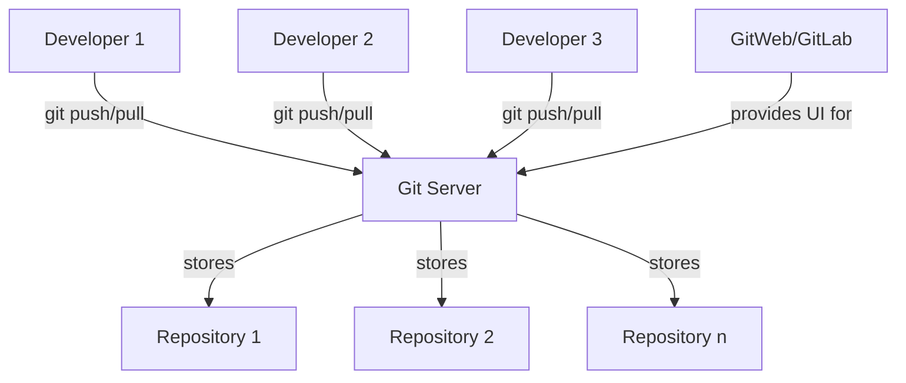

# Git Server Setup

## Introduction

Setting up your own Git server gives you complete control over your code repositories and collaboration workflows. While services like GitHub and GitLab offer excellent hosted solutions, there are many scenarios where maintaining your own Git server is advantageous:

- Complete control over your infrastructure and security
- No dependency on third-party services
- No storage or user limitations
- Internal code hosting for sensitive projects
- Customized workflow integration with your existing tools

This guide will walk you through the process of setting up a basic Git server and then explore more advanced options for team collaboration.

## Prerequisites

Before setting up a Git server, ensure you have:

- A Linux server (we'll use Ubuntu in this guide)
- Root or sudo access
- Basic understanding of Git fundamentals
- SSH access to your server

## Basic Git Server Setup

At its core, a Git server is simply a machine with Git installed that has repositories accessible via SSH. Let's start with this basic setup.

### 1. Install Git on the Server

First, install Git on your server:

```bash
sudo apt update
sudo apt install git
```

### 2. Create a Git User

It's a good practice to create a dedicated user for Git operations:

```bash
sudo adduser git
```

Follow the prompts to create a password and user information.

### 3. Set Up SSH Authentication

For secure access to your Git repositories, you'll want to set up SSH keys:

1. On each client machine, generate an SSH key if you don't already have one:

```bash
ssh-keygen -t rsa -b 4096 -C "your_email@example.com"
```

2. Copy the public key (usually in `~/.ssh/id_rsa.pub`) from each client machine.

3. On the server, add these keys to the git user's authorized keys:

```bash
# As the git user or with sudo
sudo su git
mkdir -p ~/.ssh
touch ~/.ssh/authorized_keys
chmod 700 ~/.ssh
chmod 600 ~/.ssh/authorized_keys
```

4. Append each client's public key to the `~/.ssh/authorized_keys` file:

```bash
echo "ssh-rsa AAAAB3NzaC1yc2EAAAADAQABAAACAQ..." >> ~/.ssh/authorized_keys
```

### 4. Create a Repository on the Server

Now let's create a bare Git repository on the server:

```bash
# Login as the git user
sudo su git
cd ~
mkdir project.git
cd project.git
git init --bare
```

A bare repository contains only the Git data and no working files. It's specifically designed for sharing.

### 5. Clone the Repository from a Client

On your local machine, clone the empty repository:

```bash
git clone git@your-server-ip:~/project.git
cd project
```

### 6. Add Files and Push to the Server

```bash
# Create a sample file
echo "# My Project" > README.md
git add README.md
git commit -m "Initial commit"
git push origin main
```

Congratulations! You now have a basic Git server setup.

## Enhancing Your Git Server with Git Shell

For better security, you can restrict the git user to only Git operations using `git-shell`:

```bash
sudo chsh git -s $(which git-shell)
```

This prevents the git user from obtaining a normal SSH shell, limiting them to Git push/pull operations.

## Setting Up Git with Web Access

While the SSH-based setup is functional, you might want a web interface for better collaboration. Here are some options:

### Option 1: Set Up Gitolite for Access Control

Gitolite is a Git management layer that provides fine-grained access control:

```bash
# As your regular user (not git)
git clone https://github.com/sitaramc/gitolite
cd gitolite
sudo su git
./install -ln
gitolite setup -pk /tmp/YourName.pub
```

This sets up Gitolite with your public key as the admin key. You can now manage repositories and permissions through a special 'gitolite-admin' repository.

### Option 2: Install GitWeb for Basic Web Viewing

GitWeb provides a simple web interface to browse your repositories:

```bash
sudo apt install gitweb apache2
```

Configure GitWeb by editing `/etc/gitweb.conf`:

```perl
$projectroot = "/home/git";
$projects_list = "/home/git/projects.list";
$feature{'highlight'}{'default'} = [1];
```

And create the projects list:

```bash
find /home/git -name "*.git" -type d > /home/git/projects.list
chown git:git /home/git/projects.list
```

## Full-Featured Git Server: GitLab Community Edition

For a complete Git management solution similar to GitHub, consider setting up GitLab Community Edition:

```bash
# Install dependencies
sudo apt update
sudo apt install -y curl openssh-server ca-certificates tzdata perl

# Add GitLab repository
curl https://packages.gitlab.com/install/repositories/gitlab/gitlab-ce/script.deb.sh | sudo bash

# Install GitLab
sudo EXTERNAL_URL="http://your-server-ip" apt install gitlab-ce
```

GitLab provides a complete ecosystem including:
- Web interface for repository management
- Issue tracking
- Merge requests (Pull requests)
- CI/CD integration
- User management with fine-grained permissions
- Wiki and documentation tools

## Backup Strategy for Git Servers

Always implement a proper backup strategy for your Git server:

```bash
# Basic backup script for Git repositories
#!/bin/bash
TIMESTAMP=$(date +"%Y%m%d%H%M%S")
BACKUP_DIR="/path/to/backups"
GIT_REPOS="/home/git"

mkdir -p "$BACKUP_DIR"
tar -czf "$BACKUP_DIR/git_repos_$TIMESTAMP.tar.gz" "$GIT_REPOS"

# Keep only the last 7 backups
ls -t "$BACKUP_DIR" | tail -n +8 | xargs -I {} rm "$BACKUP_DIR/{}"
```

Save this as a script and set up a cron job to run it regularly.

## Git Server Architecture

The following diagram shows the basic architecture of a Git server setup:



## Troubleshooting Git Server Issues

Here are solutions to common Git server issues:

### Permission Denied Errors

If you see "Permission denied (publickey)" errors:

```bash
# Check SSH connection with verbose output
ssh -vT git@your-server-ip

# Verify permissions on the server
sudo su git
ls -la ~/.ssh/
chmod 700 ~/.ssh
chmod 600 ~/.ssh/authorized_keys
```

### Repository Not Found Errors

If Git can't find your repository:

```bash
# Check if the path is correct
ssh git@your-server-ip
ls -la ~/project.git

# Make sure the repository is initialized as bare
cd ~/project.git
git config --get core.bare # Should return "true"
```

## Summary

Setting up your own Git server provides flexibility and control over your source code management. In this guide, we've covered:

1. Basic Git server setup using SSH
2. Enhancing security with git-shell
3. Adding web interfaces with GitWeb
4. Implementing a full-featured solution with GitLab CE
5. Backup strategies and troubleshooting

By hosting your own Git server, you gain independence from third-party services while maintaining complete control over your development workflow.

## Additional Resources

To deepen your understanding of Git server administration:

- Experiment with repository hooks for custom workflows
- Learn about Git server scaling for larger teams
- Explore integrating your Git server with CI/CD pipelines
- Set up automated testing when changes are pushed

## Practice Exercises

1. Set up a basic Git server following the instructions
2. Configure GitWeb for repository browsing
3. Create a post-receive hook that sends email notifications on pushes
4. Implement a backup system for your Git repositories
5. Configure different access levels for different team members using Gitolite

With these skills, you'll be well-equipped to manage and maintain your own Git infrastructure for teams of any size.