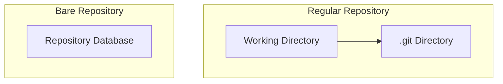

# Git Bare Repositories

## Introduction

Git bare repositories are a special type of Git repository that plays a crucial role in collaborative development workflows. Unlike standard Git repositories that you use for daily work, bare repositories don't contain a working directory. Instead, they solely store the Git database (the `.git` directory) and are primarily designed to be a central point for collaboration.

In this guide, we'll explore what bare repositories are, why they're useful, and how to work with them effectively.

## What is a Bare Repository?

A standard Git repository contains two main components:
1. A working directory where you can view and edit files
2. A `.git` directory containing the repository database (commits, branches, tags, etc.)

A bare repository, on the other hand, **only contains the repository database** without any working directory. You can think of it as just the `.git` directory from a regular repository, but structured slightly differently.



Bare repositories are created using the `--bare` flag with the `git init` or `git clone` commands.

## Why Use Bare Repositories?

Bare repositories serve several important purposes:

1. **Centralized Storage**: They act as a central point where multiple developers can push and pull changes.
2. **Avoiding Conflicts**: Since bare repositories don't have a working directory, no one can directly make changes in them, preventing potential conflicts.
3. **Server Efficiency**: They're more efficient for servers because they don't need to maintain a working copy of all files.
4. **Git Hosting**: Services like GitHub, GitLab, and Bitbucket use bare repositories behind the scenes to host your projects.

## Creating a Bare Repository

### Method 1: Initialize a New Bare Repository

To create a new bare repository from scratch:

```bash
git init --bare my-project.git
```

This creates a directory named `my-project.git` which contains the Git database structure.

### Method 2: Converting a Regular Repository to Bare

You can also create a bare copy of an existing repository:

```bash
git clone --bare /path/to/my-project my-project.git
```

This creates a bare clone of the repository at `/path/to/my-project` named `my-project.git`.

## Working with Bare Repositories

Since bare repositories don't have a working directory, you can't directly edit files or make commits in them. Instead, you work with them by:

1. **Cloning** from the bare repository
2. Making changes in your local copy
3. **Pushing** your changes back to the bare repository

### Basic Workflow Example

Here's a step-by-step example of setting up and using a bare repository:

#### Step 1: Create a bare repository on a server or shared location

```bash
# On the server
mkdir /srv/git
cd /srv/git
git init --bare my-project.git
```

#### Step 2: Clone the repository to your local machine

```bash
# On your local machine
git clone ssh://user@server:/srv/git/my-project.git
cd my-project
```

#### Step 3: Make changes and push them back

```bash
# Make some changes
echo "# My Project" > README.md
git add README.md
git commit -m "Add README"

# Push changes to the bare repository
git push origin main
```

#### Step 4: Other developers can clone and work with the same repository

```bash
# On another developer's machine
git clone ssh://user@server:/srv/git/my-project.git
cd my-project
```

## Real-World Applications

### Setting Up a Shared Repository

Bare repositories are commonly used for setting up shared repositories in team environments:

```bash
# On a shared server
mkdir -p /var/git/shared-project.git
cd /var/git/shared-project.git
git init --bare
```

Now all team members can clone from and push to this central repository:

```bash
git clone ssh://user@shared-server:/var/git/shared-project.git
```

### Git Hosting on Your Own Server

You can create your own simple Git hosting service using bare repositories:

```bash
# On your server
sudo mkdir -p /opt/git
sudo git init --bare /opt/git/project.git
sudo chown -R git:git /opt/git/project.git
```

Then configure SSH access for users who need to push to this repository.

### Mirroring a Repository

Bare repositories are useful for creating mirrors of existing repositories:

```bash
# Create a bare mirror
git clone --bare https://github.com/username/original-repo.git

# Push the mirror to another location
cd original-repo.git
git push --mirror https://gitlab.com/username/mirrored-repo.git
```

## Examining a Bare Repository

If you look inside a bare repository, you'll notice that it's structured differently from a regular `.git` directory:

```bash
ls -la my-project.git
# Output:
# drwxr-xr-x  7 user user 4096 Jan 1 12:00 .
# drwxr-xr-x  3 user user 4096 Jan 1 12:00 ..
# drwxr-xr-x  2 user user 4096 Jan 1 12:00 branches
# -rw-r--r--  1 user user   66 Jan 1 12:00 config
# -rw-r--r--  1 user user   73 Jan 1 12:00 description
# -rw-r--r--  1 user user   23 Jan 1 12:00 HEAD
# drwxr-xr-x  2 user user 4096 Jan 1 12:00 hooks
# drwxr-xr-x  2 user user 4096 Jan 1 12:00 info
# drwxr-xr-x 10 user user 4096 Jan 1 12:00 objects
# drwxr-xr-x  4 user user 4096 Jan 1 12:00 refs
```

Notice that the files that would normally be in the `.git` directory are directly in the main folder of a bare repository.

## Common Operations with Bare Repositories

### Add a Remote to Point to a Bare Repository

```bash
git remote add origin ssh://user@server:/path/to/repo.git
```

### Initialize a Bare Repository with a Specific Branch as Default

```bash
git init --bare --initial-branch=main my-project.git
```

### Push All Branches and Tags to a Bare Repository

```bash
git push --all origin
git push --tags origin
```

## Best Practices

1. **Naming Convention**: It's a common convention to add the `.git` extension to bare repository directories to distinguish them from regular repositories.

2. **Repository Location**: Place bare repositories in a dedicated location on your server, like `/srv/git/` or `/opt/git/`.

3. **Backup Regularly**: Since bare repositories contain all your project's history, make sure to back them up regularly.

4. **Access Control**: Set up proper permissions and access controls for your bare repositories, especially on shared servers.

5. **Hooks**: Use Git hooks in bare repositories to enforce policies or trigger actions when changes are pushed.

## Troubleshooting Common Issues

### Cannot Push to Bare Repository

If you're having trouble pushing to a bare repository, check:

- File permissions on the server
- SSH access and authentication
- Remote URL configuration

```bash
# Verify remote URL
git remote -v

# Update remote URL if needed
git remote set-url origin ssh://user@server:/correct/path/to/repo.git
```

### Repository Corruption

If a bare repository becomes corrupted, you might need to repair it:

```bash
# In the bare repository
git fsck --full
```

## Summary

Git bare repositories are essential components of collaborative Git workflows, serving as central points for sharing and storing Git data without a working directory. They're the foundation of Git hosting services and are invaluable for team-based development.

Key points to remember:
- Bare repositories contain only the Git database, not a working directory
- They're created using the `--bare` flag
- They're primarily used as centralized points for collaboration
- You can't directly work in a bare repository; instead, you clone, make changes locally, and push back

By understanding and utilizing bare repositories correctly, you can streamline your team's collaboration and set up efficient Git-based workflows.

## Additional Resources

To deepen your understanding of Git bare repositories, consider exploring:

- Git's official documentation on bare repositories
- Advanced Git server setup techniques
- Git hooks for automation in bare repositories
- Git internals to understand how bare repositories store data

## Practice Exercises

1. Create a bare repository locally and push a project to it
2. Set up a bare repository on a server and configure it for team access
3. Clone a repository from a popular hosting service and create a bare mirror of it
4. Use Git hooks in a bare repository to enforce commit message standards
5. Configure multiple remotes in a project to push to different bare repositories simultaneously