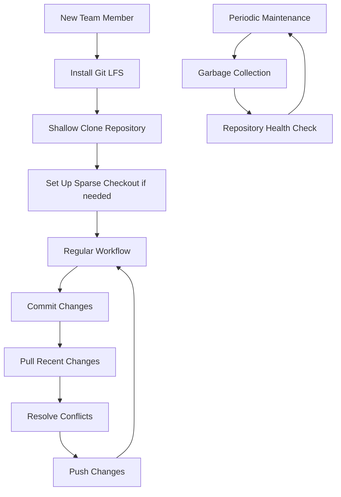

# Git Large Repositories

## Introduction

When working with Git, you may eventually encounter repositories that grow significantly in size. Large repositories present unique challenges that can impact performance, storage requirements, and team workflows. This guide focuses on understanding the challenges of large Git repositories and implementing effective strategies to manage them efficiently.

Large repositories can result from:
- Many commits over a long project history
- Large binary files (images, videos, datasets)
- Generated files that shouldn't be in version control
- Monolithic codebases containing multiple projects

## Understanding the Challenges

### Performance Issues

```bash
# Example: Cloning a large repository can be slow
$ time git clone https://github.com/large-project/repo.git
Cloning into 'repo'...
# ... many minutes later
real    14m22.531s
user    0m19.328s
sys     0m21.103s
```

Large repositories can significantly slow down common Git operations:

- Clone operations download the entire repository history
- Pull operations take longer as Git processes more objects
- Commit and push operations slow down as Git has more data to process
- Branching and merging become more complex and time-consuming

### Storage Issues

```bash
# Example: Checking the size of a Git repository
$ du -sh .git/
3.4G    .git/
```

Large repositories consume substantial disk space, which can be problematic for:
- Developers with limited disk space
- CI/CD environments with storage quotas
- Teams with slow internet connections

## Best Practices for Managing Large Repositories

### 1. Git LFS (Large File Storage)

Git LFS is an extension that replaces large files with text pointers in the repository, while storing the actual files on a remote server.

```bash
# Installing Git LFS
$ git lfs install
Git LFS initialized.

# Tracking large files (example: images and videos)
$ git lfs track "*.png"
$ git lfs track "*.jpg"
$ git lfs track "*.mp4"
$ git add .gitattributes

# Committing and pushing as usual
$ git add large-image.png
$ git commit -m "Add large image using Git LFS"
$ git push origin main
```

The `.gitattributes` file will contain entries like:

```
*.png filter=lfs diff=lfs merge=lfs -text
*.jpg filter=lfs diff=lfs merge=lfs -text
*.mp4 filter=lfs diff=lfs merge=lfs -text
```

### 2. Shallow Clones

If you don't need the full history, you can create a shallow clone:

```bash
# Clone with a depth of 1 (only most recent commit)
$ git clone --depth 1 https://github.com/large-project/repo.git

# Clone with a specific depth
$ git clone --depth 10 https://github.com/large-project/repo.git
```

### 3. Sparse Checkout

If you only need a portion of the repository, you can use sparse checkout:

```bash
# Initialize a new repository
$ mkdir repo && cd repo
$ git init
$ git remote add origin https://github.com/large-project/repo.git

# Enable sparse checkout
$ git config core.sparseCheckout true

# Specify which directories/files you want
$ echo "path/to/directory/*" >> .git/info/sparse-checkout
$ echo "specific/file.txt" >> .git/info/sparse-checkout

# Pull the specified files
$ git pull --depth=1 origin main
```

### 4. Repository Splitting

For truly massive repositories, consider splitting them into smaller ones:

```bash
# Extract a subdirectory into a new repository
$ git subtree split -P path/to/directory -b split-branch
$ mkdir ../new-repo && cd ../new-repo
$ git init
$ git pull ../original-repo split-branch
```

Or use the `git-filter-repo` tool (recommended over the older `git-filter-branch`):

```bash
# Install git-filter-repo
$ pip install git-filter-repo

# Extract a subdirectory while preserving history
$ git-filter-repo --path path/to/keep/ --path another/path/to/keep/
```

### 5. Good .gitignore Practices

Prevent unnecessary files from being tracked:

```
# Example .gitignore for a typical project
# Build outputs
/build/
/dist/
/out/

# Dependencies
/node_modules/
/vendor/

# IDE files
.idea/
.vscode/

# Generated files
*.log
*.min.js
*.min.css

# Large binary files
*.zip
*.tar.gz
*.mp4
```

### 6. Git Garbage Collection

Regularly clean up your repository to optimize storage:

```bash
# Standard garbage collection
$ git gc

# Aggressive garbage collection
$ git gc --aggressive

# Prune old objects
$ git prune
```

## Workflow for Teams with Large Repositories



### Repository Health Monitoring

Regularly check the health of your repository:

```bash
# Check repository size
$ du -sh .git/

# Count number of objects
$ git count-objects -v

# Find large files in history
$ git rev-list --objects --all | git cat-file --batch-check='%(objecttype) %(objectname) %(objectsize) %(rest)' | awk '/^blob/ {print $3 " " $4}' | sort -nr | head -10
```

## Practical Example: Converting a Repository to Use Git LFS

Let's walk through a practical example of converting a repository with large files to use Git LFS:

```bash
# Step 1: Install Git LFS
$ git lfs install
Git LFS initialized.

# Step 2: Identify large files (files over 10MB)
$ find . -type f -size +10M | grep -v ".git/"
./assets/videos/demo.mp4
./assets/images/background.png
./datasets/training-data.csv

# Step 3: Set up tracking for these file types
$ git lfs track "*.mp4"
$ git lfs track "*.png"
$ git lfs track "*.csv"

# Step 4: Add the .gitattributes file
$ git add .gitattributes
$ git commit -m "Configure Git LFS tracking"

# Step 5: If these files are already in your repository, you need to migrate them
$ git lfs migrate import --include="*.mp4,*.png,*.csv" --everything

# Step 6: Push changes to the remote repository
$ git push --force origin main
```

:::caution
The `--force` flag is used after migration as the history has been rewritten. Be careful with this in shared repositories!
:::

## Case Study: Monorepo vs. Multiple Repositories

Let's compare approaches for a large software project:

### Monorepo Approach
```bash
project/
├── frontend/
│   ├── react-app/
│   └── assets/
├── backend/
│   ├── api/
│   └── database/
├── mobile/
│   ├── android/
│   └── ios/
└── shared/
    └── common-libs/
```

**Pros:**
- Single source of truth
- Simplified dependency management
- Atomic commits across components
- Easier code sharing

**Cons:**
- Larger repository size
- Slower Git operations
- Higher complexity for CI/CD
- Access control is all-or-nothing

### Multiple Repositories Approach
```bash
frontend-repo/
backend-repo/
mobile-repo/
shared-libs-repo/
```

**Pros:**
- Smaller repository sizes
- Faster Git operations
- Granular access control
- Simplified CI/CD pipelines

**Cons:**
- Dependency management challenges
- Cross-repository changes are harder
- Versioning complexity
- Onboarding requires multiple repos

## Summary

Managing large Git repositories requires a combination of:
- Proper tooling (Git LFS, git-filter-repo)
- Effective strategies (shallow clones, sparse checkout)
- Good practices (.gitignore, regular maintenance)
- Repository architecture decisions (mono vs. multiple repos)

By implementing these techniques, you can maintain efficient workflows even as your repositories grow in size, ensuring your team stays productive and your version control system remains responsive.

## Additional Resources

- [Git LFS Documentation](https://git-lfs.github.com/)
- [Git Internals](https://git-scm.com/book/en/v2/Git-Internals-Plumbing-and-Porcelain)
- [Monorepo vs. Multi-Repo](https://www.atlassian.com/git/tutorials/monorepos)

## Exercises

1. Convert an existing repository to use Git LFS for image files.
2. Experiment with shallow clones and analyze how they improve clone times.
3. Set up a sparse checkout to work on only a specific directory of a large project.
4. Use Git's built-in tools to identify the largest files in your repository's history.
5. Configure a CI/CD pipeline that efficiently works with a large repository.