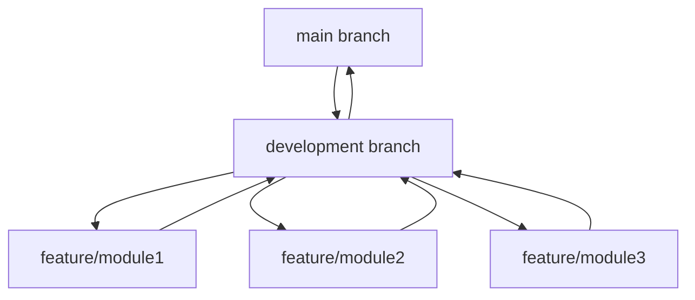

# Git Performance Tuning

## Introduction

When working with Git, especially in large repositories or on teams with many contributors, you might notice operations like cloning, fetching, pushing, or even local commands becoming slower over time. Git is generally fast, but certain conditions can impact its performance. This guide will help you identify performance bottlenecks and apply techniques to optimize Git's speed and efficiency.

## Why Git Performance Matters

Git performance directly affects developer productivity. Slow Git operations can disrupt workflow, reduce efficiency, and even discourage best practices like frequent commits. Understanding how to optimize Git's performance is a valuable skill for any developer or administrator managing Git repositories.

## Common Git Performance Issues

Before diving into solutions, let's understand what typically causes Git to slow down:

1. **Large repository size** - Repositories with extensive history or large binary files
2. **Network constraints** - Slow connections when pushing/pulling from remote repositories
3. **Filesystem limitations** - Different filesystems handle Git operations with varying efficiency
4. **Git configuration** - Default settings may not be optimal for your specific use case
5. **Hook scripts** - Custom scripts that run on Git events might add processing time

## Basic Performance Tuning Techniques

### 1. Update Git to the Latest Version

Git is constantly improving, with performance enhancements in each release.

```bash
# Check your current Git version
git --version

# On Ubuntu/Debian
sudo apt update
sudo apt install git

# On macOS with Homebrew
brew update
brew upgrade git

# On Windows with Git for Windows
# Download and install the latest version from https://git-scm.com/download/win
```

### 2. Enable Git Core Compression

Compression reduces the data transferred over the network:

```bash
# Set compression level (0-9, where 0 is no compression and 9 is maximum)
git config --global core.compression 9
```

For slow networks, maximum compression (9) helps, but on fast networks, a lower value or even 0 might be more efficient as it reduces CPU usage.

### 3. Configure Git to Use Multiple Threads

Enable parallel operations for improved performance:

```bash
# Enable parallel index preload for operations like git diff
git config --global core.preloadindex true

# Use as many threads as available for packing
git config --global pack.threads 0
```

The `pack.threads` value of 0 tells Git to determine the number of CPU cores automatically and use that many threads.

## Advanced Performance Optimization

### 1. Optimize the Git Garbage Collection

Git's garbage collection (gc) consolidates loose objects to improve performance:

```bash
# Set aggressive garbage collection
git config --global gc.auto 256

# Run garbage collection manually on your repository
git gc --aggressive
```

The `gc.auto` setting determines how many loose objects Git allows before triggering automatic garbage collection. A lower number means more frequent collection.

**Example output of running gc:**

```
Counting objects: 5837, done.
Delta compression using up to 8 threads.
Compressing objects: 100% (2381/2381), done.
Writing objects: 100% (5837/5837), done.
Total 5837 (delta 3105), reused 5829 (delta 3099)
```

### 2. Use Shallow Clones for Large Repositories

When you don't need the full history of a repository:

```bash
# Clone with limited history (last 10 commits)
git clone --depth 10 https://github.com/username/repository.git

# Later, if you need more history
git fetch --deepen 10
```

Shallow clones significantly reduce the download size and time for large repositories.

### 3. Implement Git LFS (Large File Storage)

For repositories with large binary files:

```bash
# Install Git LFS
# On Ubuntu/Debian
sudo apt install git-lfs

# On macOS
brew install git-lfs

# On Windows (with Git for Windows installed)
# It's typically included, but you can download from https://git-lfs.github.com/

# Set up Git LFS in your repository
git lfs install

# Track specific file types with LFS
git lfs track "*.psd"
git lfs track "*.zip"
git lfs track "*.pdf"

# Make sure to commit the .gitattributes file
git add .gitattributes
git commit -m "Configure Git LFS tracking"
```

Git LFS replaces large files with text pointers in the repository, keeping the actual files on a separate server.

### 4. Optimize Git for Specific File Systems

Different file systems have varying performance characteristics with Git:

```bash
# For repositories on network drives or slower file systems
git config --global core.preloadindex true
git config --global core.fscache true
git config --global gc.auto 256
```

The `core.fscache` setting is particularly useful on Windows to reduce the number of disk operations.

## Real-World Example: Optimizing a CI/CD Pipeline

Let's walk through a real-world scenario where a team's continuous integration pipeline was slowed down by Git operations.

**Problem:** Each CI job was taking 3-5 minutes just to clone the repository.

**Solution:**

1. First, we identified that full history wasn't needed for most CI jobs:

```bash
# In the CI configuration
git clone --depth 1 https://github.com/company/repository.git
```

2. Then, we set up a local mirror on the CI server to reduce network traffic:

```bash
# Set up a mirror (done once)
git clone --mirror https://github.com/company/repository.git repo-mirror

# Update the mirror periodically
cd repo-mirror
git fetch --prune origin

# In CI jobs, clone from the local mirror
git clone --reference /path/to/repo-mirror --depth 1 https://github.com/company/repository.git
```

3. Finally, we configured Git to optimize for the CI server's environment:

```bash
git config --global core.compression 0  # Fast local network
git config --global pack.threads 4      # CI server had 4 cores
```

**Results:** CI job git operations reduced from 3-5 minutes to 15-30 seconds.

## Performance Monitoring Tools

### 1. Git Built-in Tracing

Git has built-in performance tracing:

```bash
# Enable trace for all Git operations
GIT_TRACE=1 git status

# More specific tracing for performance analysis
GIT_TRACE_PERFORMANCE=1 git status
```

**Example output:**

```
performance: 0.041257s: git command: 'git' 'status'
performance: 0.000121s: reading git dir
performance: 0.000123s: checking if repository is shallow
performance: 0.000141s: index file open
performance: 0.005641s: load cache tree
performance: 0.022155s: refresh index
performance: 0.000285s: setup worktree
```

### 2. Using Git's Built-in Profiler

For in-depth analysis:

```bash
# Generate a profile for a Git command
git --no-pager log --pretty=oneline --no-walk HEAD -p -- myfile.txt 2>log.perf

# Analyze the profile
perl /path/to/git/contrib/git-legacy-stash/git-stash--helper perf log.perf
```

## Practical Git Workflow Strategies

Beyond technical optimizations, certain workflow strategies can improve Git performance:

### 1. Use Sparse-Checkout for Large Repositories

When you only need a part of a large repository:

```bash
# Initialize a repository
git init my-repository
cd my-repository
git remote add origin https://github.com/username/large-repository.git

# Enable sparse-checkout
git config core.sparseCheckout true

# Define which directories you want
echo "path/to/directory/*" > .git/info/sparse-checkout
echo "another/directory/*" >> .git/info/sparse-checkout

# Fetch and checkout
git fetch --depth=1 origin main
git checkout main
```

### 2. Optimize Branching Strategy

A well-designed branching strategy can significantly impact performance:



Keep feature branches short-lived and focused to minimize merge complexity and reduce the time required for Git operations.

## Troubleshooting Common Performance Issues

### Problem: Slow `git status` Command

```bash
# First, try running with performance tracing
GIT_TRACE_PERFORMANCE=1 git status

# If the issue is with file status checks, update the index
git update-index --refresh

# Consider enabling filesystem monitor if supported
git config core.fsmonitor true
```

### Problem: Slow Remote Operations

```bash
# Check your remote URL protocol
git remote -v

# Switch from HTTPS to SSH if needed
git remote set-url origin git@github.com:username/repository.git

# Use a more specific URL for GitHub to bypass DNS
git remote set-url origin ssh://git@github.com/username/repository.git
```

### Problem: Slow Repository on Windows

```bash
# Enable filesystem caching
git config --global core.fscache true

# Avoid checking file permissions (which are less relevant on Windows)
git config --global core.filemode false

# Ensure Git for Windows is up to date
```

## Summary

Git performance tuning involves understanding the bottlenecks in your specific environment and applying the appropriate optimizations. Key strategies include:

1. Keeping Git up to date
2. Configuring Git for your hardware and network environment
3. Optimizing repository size with tools like Git LFS
4. Using shallow clones and sparse-checkout when appropriate
5. Implementing efficient Git workflows and branching strategies
6. Regular maintenance with Git's garbage collection

By applying these techniques, you can significantly improve Git's performance, especially in large repositories or challenging network environments.

## Additional Resources

- [Git Official Documentation on Performance](https://git-scm.com/docs/git-gc)
- [Git Internals - The Reference Guide](https://git-scm.com/book/en/v2/Git-Internals-Plumbing-and-Porcelain)
- [Git LFS Documentation](https://git-lfs.github.com/)

## Exercises

1. Profile a Git command on your largest repository using `GIT_TRACE_PERFORMANCE=1` and identify the slowest operations.
2. Experiment with different compression settings (`git config core.compression X`) and measure the impact on remote operations.
3. Set up Git LFS for a repository with large binary files and compare clone times before and after.
4. Implement a shallow clone strategy for a CI pipeline and measure the performance improvement.