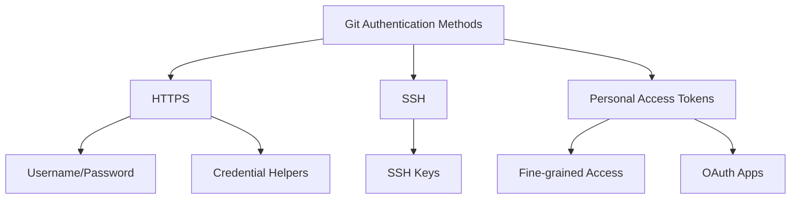

# Git Authentication

## Introduction

When working with Git repositories hosted on platforms like GitHub, GitLab, or Bitbucket, you need a way to prove your identity to access and modify those repositories. This process is called authentication, and it's a fundamental aspect of Git administration that ensures only authorized users can interact with your code.

In this guide, we'll explore different authentication methods in Git, how to set them up, and best practices for keeping your repositories secure while maintaining a smooth workflow.

## Why Authentication Matters

Authentication in Git serves several important purposes:

- **Access control**: Ensures only authorized users can access private repositories
- **Identity verification**: Links commits and changes to specific users
- **Security**: Protects your code from unauthorized modifications
- **Accountability**: Tracks who made what changes and when

## Common Authentication Methods

Git supports several authentication methods, each with its own advantages and use cases.



Let's explore each of these methods in detail.

## HTTPS Authentication

HTTPS (Hypertext Transfer Protocol Secure) is the most straightforward method for authenticating with Git repositories.

### Basic Username and Password

When you clone a repository using HTTPS, Git prompts you for your username and password when you push changes:

```bash
$ git clone https://github.com/username/repository.git
$ cd repository
# Make some changes
$ git add .
$ git commit -m "Update files"
$ git push origin main
Username: your_username
Password: your_password
```

**Note**: Most Git hosting platforms no longer support basic password authentication due to security concerns. Instead, they require personal access tokens (covered later).

### Credential Helpers

Typing your credentials every time can be tedious. Git offers credential helpers to store your credentials securely:

```bash
# Store credentials in memory for 15 minutes
$ git config --global credential.helper cache

# Store credentials indefinitely
$ git config --global credential.helper store

# Use the macOS keychain
$ git config --global credential.helper osxkeychain

# Use Windows credential manager
$ git config --global credential.helper wincred
```

Example of configuring and using a credential helper:

```bash
$ git config --global credential.helper store
$ git pull
Username: your_username
Password: your_token
# Future Git operations won't ask for credentials
```

## SSH Authentication

SSH (Secure Shell) authentication uses a pair of cryptographic keys to establish a secure connection. This method is more secure than password-based authentication and doesn't require entering credentials for each operation.

### Generating SSH Keys

To use SSH authentication, first generate an SSH key pair:

```bash
$ ssh-keygen -t ed25519 -C "your_email@example.com"
Generating public/private ed25519 key pair.
Enter file in which to save the key (/home/username/.ssh/id_ed25519):
Enter passphrase (empty for no passphrase):
Enter same passphrase again:
Your identification has been saved in /home/username/.ssh/id_ed25519
Your public key has been saved in /home/username/.ssh/id_ed25519.pub
```

### Adding SSH Key to Your Git Account

After generating your key, add the public key to your Git hosting platform:

1. Copy your public key to the clipboard:

```bash
# For Linux/macOS
$ cat ~/.ssh/id_ed25519.pub | pbcopy

# For Windows (using Git Bash)
$ cat ~/.ssh/id_ed25519.pub | clip
```

2. Go to your Git platform account settings:
   - GitHub: Settings → SSH and GPG keys → New SSH key
   - GitLab: Settings → SSH Keys
   - Bitbucket: Personal settings → SSH Keys → Add key

3. Paste your public key and save.

### Using SSH for Git Operations

To use SSH for Git operations, clone repositories using the SSH URL:

```bash
$ git clone git@github.com:username/repository.git
$ cd repository
# Make changes
$ git push origin main
# No credentials needed!
```

## Personal Access Tokens (PAT)

Personal Access Tokens are an alternative to passwords when using HTTPS authentication. They provide better security and more granular control over repository access.

### Creating a Personal Access Token

The process varies slightly by platform, but generally follows these steps:

1. Go to your account settings
2. Find the Developer settings or API section
3. Create a new personal access token
4. Select the appropriate scopes/permissions
5. Generate the token and save it securely

### Using Personal Access Tokens

Use your token in place of your password when performing Git operations:

```bash
$ git clone https://github.com/username/repository.git
$ cd repository
$ git push origin main
Username: your_username
Password: your_personal_access_token
```

Example of setting up a credential helper with a personal access token:

```bash
$ git clone https://github.com/username/repository.git
$ cd repository
$ git config credential.helper store
$ git push
Username: your_username
Password: your_personal_access_token
# Token is now stored for future use
```

## Two-Factor Authentication (2FA)

Many Git platforms support two-factor authentication for added security. When 2FA is enabled, you'll need to use personal access tokens or SSH keys for Git operations, as password authentication won't work.

### Enabling 2FA

The process to enable 2FA depends on your Git platform:

1. Go to your account security settings
2. Find the two-factor authentication option
3. Follow the setup process to enable 2FA
4. Save your recovery codes in a secure location

### Using Git with 2FA Enabled

When 2FA is enabled, you must use one of the following methods:

- SSH keys (recommended)
- Personal access tokens for HTTPS

## Git Authentication Best Practices

Follow these best practices to keep your Git authentication secure:

1. **Use SSH keys** when possible for the best balance of security and convenience
2. **Enable 2FA** on your Git hosting accounts
3. **Use scoped tokens** that have only the permissions they need
4. **Rotate credentials periodically** to minimize the impact of potential leaks
5. **Never commit tokens or credentials** to your repositories
6. **Use credential helpers** securely (prefer keychain-based helpers over plain text storage)
7. **Set expiration dates** on personal access tokens when the platform supports it

## Troubleshooting Authentication Issues

### Authentication Failed

If you see errors like `Authentication failed` or `Permission denied`:

1. Verify your credentials are correct
2. Check that your SSH key or token has the appropriate permissions
3. Ensure your token hasn't expired
4. Confirm you're using the correct authentication method for the URL

Example error and resolution:

```bash
$ git push origin main
remote: Invalid username or password.
fatal: Authentication failed for 'https://github.com/username/repository.git/'

# Solution: Update credentials or switch to SSH
$ git remote set-url origin git@github.com:username/repository.git
```

### Permission Denied (publickey)

If you see `Permission denied (publickey)` when using SSH:

1. Ensure your SSH key is added to your Git account
2. Verify the SSH agent is running and has your key
3. Check that you're using the correct SSH URL

Debugging SSH issues:

```bash
# Check if SSH agent is running and has your key
$ eval "$(ssh-agent -s)"
$ ssh-add -l

# Test SSH connection
$ ssh -T git@github.com
```

## Setting Up Git Authentication in CI/CD Environments

For automated workflows, authentication requires special consideration:

### Deploy Keys

For single-repository access, use deploy keys:

1. Generate an SSH key pair on your CI server
2. Add the public key as a deploy key in your repository settings
3. Configure your CI/CD to use the private key for Git operations

### Machine Users

For multi-repository access, consider creating a machine user:

1. Create a separate account for automation
2. Generate SSH keys or personal access tokens for this account
3. Grant the minimum necessary access to repositories
4. Configure your CI/CD environment to use these credentials

### Secure Environment Variables

Store credentials as encrypted environment variables:

```yaml
# Example GitHub Actions workflow using a PAT
jobs:
  deploy:
    runs-on: ubuntu-latest
    steps:
      - uses: actions/checkout@v3
        with:
          token: ${{ secrets.GIT_ACCESS_TOKEN }}
```

## Summary

Git authentication ensures secure access to your repositories and links changes to their authors. The main authentication methods include:

- **HTTPS** with personal access tokens and credential helpers
- **SSH keys** for passwordless, secure authentication
- **Two-factor authentication** for additional security

Choose the method that best balances security and convenience for your workflow. For most users, SSH authentication provides the best combination of security and ease of use.

## Additional Resources

- [Git Documentation on Credentials](https://git-scm.com/docs/gitcredentials)
- [GitHub Documentation on Authentication](https://docs.github.com/en/authentication)
- [GitLab Documentation on Authentication](https://docs.gitlab.com/ee/user/profile/account/two_factor_authentication.html)

## Practice Exercises

1. Generate a new SSH key and add it to your Git hosting account.
2. Create a personal access token with specific permissions and use it for HTTPS authentication.
3. Configure a Git credential helper appropriate for your operating system.
4. Try cloning and pushing to a repository using both SSH and HTTPS authentication.
5. Set up a private repository and practice granting access to another user.