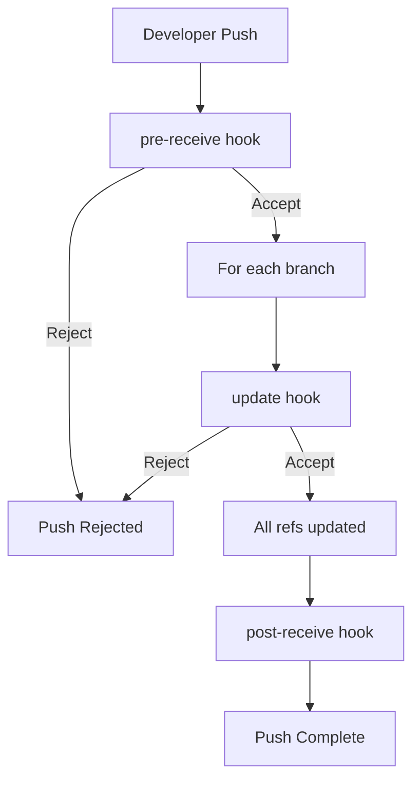

# Git Hooks Server-Side

Git hooks are scripts that Git executes before or after events such as commit, push, and receive. They allow you to customize Git's internal behavior and trigger customizable actions at key points in the development lifecycle. While client-side hooks run on developers' local machines, **server-side hooks** run on the Git server and can be used to enforce project policies and automate workflows.

## Introduction to Server-Side Hooks

Server-side hooks operate on the Git server during repository operations like receiving pushed commits. Unlike client-side hooks, server-side hooks:

- Cannot be bypassed by developers
- Are controlled by the repository administrator
- Can enforce organization-wide policies
- Run on the server where the central repository is hosted

This makes them perfect for implementing mandatory checks and integrations that apply to all contributors in a project.

## Common Server-Side Hooks

Git provides several server-side hooks, each serving a specific purpose:

1. `pre-receive`
2. `update`
3. `post-receive`

Let's explore each of these hooks in detail.

## The `pre-receive` Hook

The `pre-receive` hook runs once when handling a push from a client, before any references are updated. It receives a list of references being pushed from stdin.

### Purpose

- Validate all pushed commits at once
- Perform checks that apply to the entire push operation
- Reject pushes that don't meet criteria

### Implementation

To implement a `pre-receive` hook:

1. Create a script named `pre-receive` in the `hooks` directory of your Git server's bare repository.
2. Make it executable with `chmod +x pre-receive`.
3. The script receives input in the format `<old-value> <new-value> <ref-name>` for each ref being updated.

### Example: Preventing Force Pushes to Main Branch

This example rejects force pushes to the main branch:

```bash
#!/bin/bash

# Read input from stdin
while read oldrev newrev refname; do
  # Check if this is the main branch
  if [[ "$refname" == "refs/heads/main" ]]; then
    # Check if this is a force push (deletion of commits)
    if [[ "$oldrev" != "0000000000000000000000000000000000000000" && "$newrev" != "0000000000000000000000000000000000000000" ]]; then
      # Check if commits are being deleted
      if git merge-base --is-ancestor "$newrev" "$oldrev"; then
        echo "ERROR: Force pushing to main branch is not allowed!"
        exit 1
      fi
    fi
  fi
done

exit 0
```

Input example:
```
ab123456789012345678901234567890 cd987654321098765432109876543210 refs/heads/main
```

Output for a force push:
```
ERROR: Force pushing to main branch is not allowed!
```

## The `update` Hook

The `update` hook is similar to `pre-receive` but runs once for each branch being updated. It receives three arguments: the name of the reference being updated, the old object name, and the new object name.

### Purpose

- Perform checks on specific branches
- Handle each reference separately
- More granular control than `pre-receive`

### Implementation

To implement an `update` hook:

1. Create a script named `update` in the `hooks` directory.
2. Make it executable with `chmod +x update`.
3. The script receives three arguments: `$1` (reference name), `$2` (old revision), and `$3` (new revision).

### Example: Enforcing Commit Message Format

This example ensures all commit messages follow a specific format:

```bash
#!/bin/bash

# Arguments
refname="$1"
oldrev="$2"
newrev="$3"

# Only apply to main branch
if [[ "$refname" != "refs/heads/main" ]]; then
  exit 0
fi

# Get the list of commits that are being pushed
commits=$(git rev-list "$oldrev".."$newrev")

# Check each commit message
for commit in $commits; do
  message=$(git log --format=%B -n 1 $commit)
  
  # Check if the commit message matches the required format
  # Format: [TYPE-123] Commit message
  if ! echo "$message" | grep -qE '^\[([A-Z]+-[0-9]+)\] .+$'; then
    echo "ERROR: Commit $commit does not follow the required format:"
    echo "Expected: [TYPE-123] Commit message"
    echo "Got: $message"
    exit 1
  fi
done

exit 0
```

Input example (from arguments):
```
refs/heads/main ab123456789012345678901234567890 cd987654321098765432109876543210
```

Output for an incorrectly formatted commit message:
```
ERROR: Commit 1a2b3c4d5e6f7g8h does not follow the required format:
Expected: [TYPE-123] Commit message
Got: Fixed a bug
```

## The `post-receive` Hook

The `post-receive` hook runs after the entire push process is completed and all references have been updated. It receives the same input as `pre-receive` but cannot reject the push since it's already completed.

### Purpose

- Notify team members about new commits
- Trigger CI/CD pipelines
- Update issue tracking systems
- Deploy applications

### Implementation

To implement a `post-receive` hook:

1. Create a script named `post-receive` in the `hooks` directory.
2. Make it executable with `chmod +x post-receive`.
3. The script receives input in the format `<old-value> <new-value> <ref-name>` for each ref that was updated.

### Example: Triggering Jenkins CI Pipeline

This example triggers a Jenkins CI pipeline when commits are pushed to specific branches:

```bash
#!/bin/bash

# Jenkins URL and authentication
JENKINS_URL="https://jenkins.example.com"
JENKINS_USER="jenkins-user"
JENKINS_API_TOKEN="your-api-token"

# Read input from stdin
while read oldrev newrev refname; do
  # Extract branch name from refname
  branch=$(echo $refname | sed 's|refs/heads/||')
  
  # Trigger builds for specific branches
  case "$branch" in
    main|develop|feature/*)
      echo "Triggering Jenkins build for branch: $branch"
      
      # Call Jenkins API to trigger build
      curl -s -X POST \
        -u "${JENKINS_USER}:${JENKINS_API_TOKEN}" \
        "${JENKINS_URL}/job/my-project/buildWithParameters?BRANCH=${branch}"
      
      echo "Jenkins build triggered successfully"
      ;;
  esac
done

exit 0
```

Input example:
```
ab123456789012345678901234567890 cd987654321098765432109876543210 refs/heads/main
```

Output:
```
Triggering Jenkins build for branch: main
Jenkins build triggered successfully
```

## Server-Side Hook Workflow Visualization

Here's a diagram illustrating the flow of server-side hooks during a push operation:



## Practical Applications

### Policy Enforcement

Server-side hooks can enforce organizational policies such as:

1. **Commit Message Standards**: Ensure commit messages follow a specific format or contain required information.

2. **Code Quality Checks**: Run linters and code quality tools on pushed code.

   ```bash
   #!/bin/bash
   # update hook example for code quality check
   
   refname="$1"
   oldrev="$2"
   newrev="$3"
   
   # Only check for source code in the main branch
   if [[ "$refname" != "refs/heads/main" ]]; then
     exit 0
   fi
   
   # Create a temporary directory
   TEMP_DIR=$(mktemp -d)
   trap "rm -rf $TEMP_DIR" EXIT
   
   # Check out the new revision
   git archive $newrev | tar -x -C $TEMP_DIR
   
   # Run linter on JavaScript files
   cd $TEMP_DIR
   if [ -f package.json ]; then
     npm install --quiet eslint
     ./node_modules/.bin/eslint . --ext .js
     if [ $? -ne 0 ]; then
       echo "ERROR: ESLint checks failed. Push rejected."
       exit 1
     fi
   fi
   
   exit 0
   ```

3. **Branch Protection**: Prevent direct pushes to critical branches.

### Integration with Other Systems

Server-side hooks enable integration with external systems:

1. **Continuous Integration**: Trigger build pipelines automatically.

2. **Issue Tracking**: Update ticket status based on commit messages.

```bash
   #!/bin/bash
   # post-receive hook for updating JIRA tickets
   
   JIRA_URL="https://jira.example.com"
   JIRA_USER="jira-user"
   JIRA_API_TOKEN="your-api-token"
   
   while read oldrev newrev refname; do
     # Only process main branch
     if [[ "$refname" != "refs/heads/main" ]]; then
       continue
     fi
     
     # Get all commits
     commits=$(git rev-list $oldrev..$newrev)
     
     for commit in $commits; do
       # Get commit message
       message=$(git log --format=%B -n 1 $commit)
       
       # Extract JIRA ticket IDs (format: PROJECT-123)
       tickets=$(echo "$message" | grep -oE '[A-Z]+-[0-9]+')
       
       # Update each ticket mentioned in the commit
       for ticket in $tickets; do
         echo "Updating JIRA ticket: $ticket"
         
         # Add a comment to the JIRA ticket
         curl -s -X POST \
           -u "${JIRA_USER}:${JIRA_API_TOKEN}" \
           -H "Content-Type: application/json" \
           --data "{\"body\": \"Commit: ${commit}
            Message: ${message}\"}" \
           "${JIRA_URL}/rest/api/2/issue/${ticket}/comment"
       done
     done
   done
   
   exit 0
```

3. **Deployment**: Automatically deploy code to staging or production environments.

## Configuring Server-Side Hooks in Different Git Servers

### Git on a Standard Server

For a bare Git repository on a standard server:

```bash
# Navigate to your bare repository
cd /path/to/repo.git

# Create the hook script
vim hooks/pre-receive
# Add your script content

# Make it executable
chmod +x hooks/pre-receive
```

### GitHub Enterprise

For GitHub Enterprise, you can configure server-side hooks via:

1. Repository Settings > Hooks
2. Add the script in the appropriate hook section

### GitLab

GitLab provides "Server Hooks" that work similar to Git hooks:

1. Navigate to Admin Area > Settings > Repository
2. Expand "Server Hooks" section
3. Add your script in the appropriate hook section

### Bitbucket Server

Bitbucket Server offers hooks through its UI:

1. Go to Repository Settings > Hooks
2. Enable and configure the desired hook

## Best Practices

1. **Keep Hooks Simple**: Complex logic can slow down the push process.

2. **Handle Errors Gracefully**: Provide clear error messages to help users understand why their push was rejected.

3. **Log Actions**: Maintain logs of hook actions for troubleshooting.

4. **Test Thoroughly**: Test hooks in a development environment before deploying to production.

5. **Document Policies**: Ensure all team members understand the policies enforced by hooks.

6. **Version Control Hooks**: Keep your hook scripts in their own repository for easier management.

## Common Challenges and Solutions

### Challenge: Slow Hook Execution

**Solution**: Optimize scripts for performance, consider using background jobs for non-critical tasks.

### Challenge: Developers Getting Frustrated with Rejected Pushes

**Solution**: Provide clear error messages and create pre-commit tools that developers can run locally.

### Challenge: Managing Hooks Across Multiple Repositories

**Solution**: Use a centralized hook management system or hook templates with symbolic links.

## Summary

Server-side Git hooks are powerful tools for automating workflows and enforcing policies in your Git repositories. They provide administrators with the ability to ensure consistency and quality across all contributions to a project.

Key takeaways:

- `pre-receive` hooks validate an entire push operation
- `update` hooks verify each branch being updated
- `post-receive` hooks trigger actions after all updates are completed
- Server-side hooks cannot be bypassed by developers
- Hooks can integrate with external systems like CI/CD, issue trackers, and deployment tools

By implementing server-side Git hooks, you can create a more robust and automated Git workflow that ensures project standards are maintained while reducing manual overhead.

## Exercises for Practice

1. Create a `pre-receive` hook that verifies all pushed commits are signed with GPG.

2. Implement an `update` hook that prevents the deletion of tags.

3. Write a `post-receive` hook that sends a notification to a Slack channel when changes are pushed.

4. Develop a hook that automatically creates a backup of the repository after each push.

5. Create a hook system that checks for sensitive information (like API keys or passwords) in pushed code.

## Additional Resources

- [Git Documentation on Hooks](https://git-scm.com/docs/githooks)
- [Pro Git Book - Chapter on Git Hooks](https://git-scm.com/book/en/v2/Customizing-Git-Git-Hooks)
- [Sample Git Hooks Repository](https://github.com/git/git/tree/master/templates)