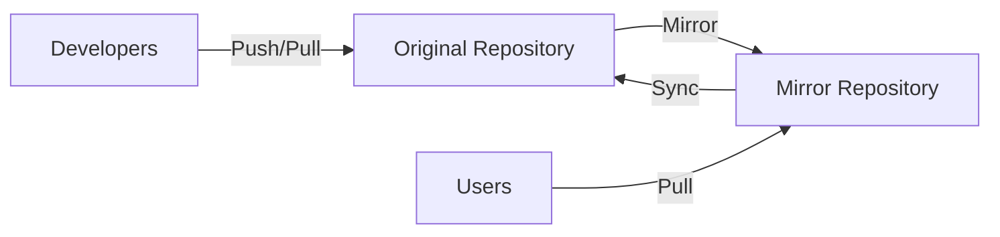

# Git Mirroring

## Introduction

Git mirroring is a powerful technique that creates an exact copy of a repository, including all branches, tags, and commit history. Unlike regular clones, mirrors are designed to be kept in sync with the original repository, making them ideal for backup strategies, distributed development workflows, and ensuring repository availability.

In this guide, we'll explore what Git mirroring is, why you might need it, and how to set up and maintain Git mirrors effectively.

## What is Git Mirroring?

A Git mirror is a complete, identical copy of a Git repository that includes all references (branches, tags), objects, and history. When you create a mirror, you're essentially creating a full backup of the repository that can be kept in sync with the original over time.



Key characteristics of Git mirrors:
- They contain all branches, tags, and commits from the original repository
- They can be updated to reflect changes in the original repository
- They can serve as full backups or alternative access points
- They maintain the complete Git object database

## Why Use Git Mirroring?

There are several scenarios where Git mirroring becomes valuable:

1. **Backup and Redundancy**: Protect against data loss by maintaining copies of repositories in different locations.
2. **Geographical Distribution**: Provide faster access to repositories for teams in different locations.
3. **Load Balancing**: Distribute repository access across multiple servers to improve performance.
4. **Migration**: Facilitate the process of moving repositories between Git hosting services.
5. **Continuous Integration**: Create mirrors for build systems to avoid overloading the primary repository.
6. **Access Control**: Provide read-only access to certain teams while maintaining a centralized workflow.

## Creating a Git Mirror

Let's look at how to create a mirror of an existing Git repository.

### Basic Mirroring

To create a mirror of a repository, use the `--mirror` flag with the `git clone` command:

```bash
git clone --mirror https://github.com/original/repository.git
```

This creates a bare repository with all references exactly as they are in the source repository. The resulting directory will have a `.git` extension.

**Example:**

```bash
# Create a mirror of a repository
git clone --mirror https://github.com/example/project.git
```

**Output:**
```
Cloning into bare repository 'project.git'...
remote: Enumerating objects: 1432, done.
remote: Counting objects: 100% (1432/1432), done.
remote: Compressing objects: 100% (987/987), done.
remote: Total 1432 (delta 445), reused 1197 (delta 231)
Receiving objects: 100% (1432/1432), 2.1 MiB | 5.7 MiB/s, done.
Resolving deltas: 100% (445/445), done.
```

The result is a bare repository named `project.git` that contains all branches, tags, and history from the original repository.

### Mirror vs. Regular Clone

It's important to understand the difference between a regular clone and a mirror:

```bash
# Regular clone
git clone https://github.com/example/project.git

# Mirror clone
git clone --mirror https://github.com/example/project.git
```

A regular clone:
- Creates a working directory with the default branch checked out
- Sets up a remote tracking branch only for the default branch
- Is designed for development work

A mirror:
- Creates a bare repository (no working directory)
- Copies all remote refs and sets up the remote tracking configuration
- Is designed for mirroring/backup purposes

## Updating a Git Mirror

Mirrors aren't automatically synchronized with the original repository. You need to update them periodically to keep them in sync.

To update a mirror, navigate to the mirror directory and use the `git remote update` command:

```bash
cd project.git
git remote update
```

This fetches all updates from the remote repository and updates the local references.

**Example:**

```bash
cd project.git
git remote update
```

**Output:**
```
Fetching origin
remote: Enumerating objects: 45, done.
remote: Counting objects: 100% (45/45), done.
remote: Compressing objects: 100% (23/23), done.
remote: Total 45 (delta 18), reused 37 (delta 11)
Unpacking objects: 100% (45/45), 6.3 KiB | 1.5 MiB/s, done.
From https://github.com/example/project
   a1b2c3d..e4f5g6h  main       -> main
   b2c3d4e..f5g6h7i  dev        -> dev
 * [new tag]         v1.2.0     -> v1.2.0
```

### Automating Mirror Updates

For keeping mirrors up-to-date automatically, you can set up a scheduled task or cron job:

```bash
# Example cron job to update a mirror every hour
0 * * * * cd /path/to/project.git && git remote update
```

## Push Mirroring

In addition to pull-based mirroring (cloning and updating), Git also supports push mirroring, where you push your repository to another location as a mirror.

```bash
# Add a push mirror remote
git remote add mirror https://github.com/your-username/repository-mirror.git

# Push as mirror
git push --mirror mirror
```

This is useful when:
- You want to maintain mirrors on different Git hosting services
- You need to migrate repositories
- You're setting up distributed backup systems

**Example: Mirroring from GitHub to GitLab**

```bash
# Clone the original repository
git clone https://github.com/original/repository.git
cd repository

# Add GitLab as a mirror remote
git remote add gitlab https://gitlab.com/your-username/repository-mirror.git

# Push as mirror to GitLab
git push --mirror gitlab
```

## Setting Up a Bidirectional Mirror

Sometimes you might want to set up bidirectional mirroring, where changes can flow in both directions. This requires more careful configuration:

```bash
# Clone the first repository
git clone --bare https://github.com/original/repository.git
cd repository.git

# Add the second repository as a remote
git remote add alternate https://gitlab.com/your-username/repository-mirror.git

# Fetch from the alternate
git fetch alternate

# Push to the alternate
git push --mirror alternate

# To pull from alternate later
git fetch alternate
git push --mirror origin
```

**Warning:** Bidirectional mirroring can lead to conflicts if the same branch is modified in both repositories. It's generally safer to designate one repository as the primary source of truth.

## Real-World Applications

### Example 1: Setting Up a Backup Server

Let's say you want to set up an automatic backup of all your GitHub repositories on a private server:

```bash
# On your backup server
mkdir -p /backups/git-mirrors
cd /backups/git-mirrors

# Clone as mirror
git clone --mirror https://github.com/your-username/important-project.git

# Create a script to update all mirrors
cat > update-mirrors.sh << 'EOF'
#!/bin/bash
cd /backups/git-mirrors
for repo in *.git; do
  echo "Updating $repo..."
  cd "$repo"
  git remote update
  cd ..
done
EOF

chmod +x update-mirrors.sh

# Add to crontab (update daily at 2 AM)
(crontab -l 2>/dev/null; echo "0 2 * * * /backups/git-mirrors/update-mirrors.sh") | crontab -
```

### Example 2: Geographic Distribution

For a team with developers in multiple regions, you can set up regional mirrors:

```bash
# Set up mirrors in each region
# Region 1: North America
git clone --mirror https://github.com/company/project.git project-na.git

# Region 2: Europe
git clone --mirror https://github.com/company/project.git project-eu.git

# Region 3: Asia
git clone --mirror https://github.com/company/project.git project-asia.git

# Configure each regional server to update its mirror
# North America update script
0 */2 * * * cd /path/to/project-na.git && git remote update

# Update and then push to central
0 */6 * * * cd /path/to/project-na.git && git remote update && git push --mirror origin
```

### Example 3: Migration Between Git Hosting Services

If you're moving from GitHub to GitLab:

```bash
# Create a mirror of your GitHub repository
git clone --mirror https://github.com/your-username/repository.git

# Add GitLab as a new remote
cd repository.git
git remote set-url --push origin https://gitlab.com/your-username/repository.git

# Push everything to GitLab
git push --mirror

# To update from GitHub and push to GitLab in the future
git remote add github https://github.com/your-username/repository.git
git fetch github
git push --mirror origin
```

## Mirroring with GitLab and GitHub

Both GitLab and GitHub offer built-in mirroring capabilities through their web interfaces.

### GitHub to GitLab Mirroring

GitLab provides repository mirroring in its web interface:

1. Create a new project in GitLab
2. Go to Settings > Repository > Mirroring repositories
3. Enter the GitHub repository URL
4. Add your GitHub access token
5. Select "Pull" from the direction dropdown
6. Save the mirror settings

GitLab will now automatically sync changes from GitHub according to the schedule you set.

### GitLab to GitHub Mirroring

Similarly, GitLab can push mirrors to GitHub:

1. In your GitLab project, go to Settings > Repository > Mirroring repositories
2. Enter the GitHub repository URL
3. Add your GitHub access token
4. Select "Push" from the direction dropdown
5. Save the mirror settings

## Best Practices for Git Mirroring

1. **Use Different Storage Solutions**: Store mirrors on different physical servers or cloud providers to protect against infrastructure failures.

2. **Automate Updates**: Set up automated processes to keep mirrors in sync.

3. **Monitor Synchronization**: Implement monitoring to ensure mirrors are successfully updating.

4. **Document Mirror Locations**: Keep a record of all mirror locations and their update schedules.

5. **Test Recovery Procedures**: Regularly test that you can restore from mirrors if needed.

6. **Consider Access Controls**: Ensure appropriate access controls on mirrors, especially if they contain sensitive code.

7. **Use Bare Repositories**: For mirroring purposes, always use bare repositories to save space and avoid confusion.

## Common Challenges and Solutions

### Challenge: Large Repositories

For very large repositories, the initial mirroring process can take a long time and consume significant bandwidth.

**Solution:** Consider using the `--depth` option initially, then gradually fetching the full history:

```bash
# Create a shallow mirror first
git clone --mirror --depth=1 https://github.com/large/repository.git

# Then gradually fetch more history
cd repository.git
git fetch --deepen=1000
git fetch --deepen=1000
# Repeat until you have the full history
git fetch --unshallow
```

### Challenge: Authentication for Automated Updates

When automating mirror updates, you need to handle authentication securely.

**Solution:** Use credential caching or SSH keys:

```bash
# Configure credential caching
git config --global credential.helper 'cache --timeout=86400'

# Or use SSH keys for authentication
git clone --mirror git@github.com:user/repo.git
```

### Challenge: Handling Large Binary Files

Repositories with large binary files can be problematic for mirroring.

**Solution:** Consider using Git LFS consistently across all mirrors:

```bash
# Ensure Git LFS is installed on the mirror server
apt-get install git-lfs  # Debian/Ubuntu
# or
brew install git-lfs     # macOS

# Enable Git LFS in the mirror
cd repository.git
git lfs install
git lfs fetch --all
```

## Summary

Git mirroring is a powerful technique for creating exact copies of repositories for backup, distribution, and redundancy purposes. By using the `--mirror` flag with Git clone and regularly updating mirrors, you can maintain synchronized copies of your repositories across different locations and services.

Key points to remember:
- Use `git clone --mirror` to create a mirror
- Update mirrors with `git remote update`
- Automate updates with scheduled tasks or cron jobs
- Consider push mirroring for migrations and distributed setups
- Use built-in mirroring features of platforms like GitLab when available
- Follow best practices for security and maintainability

## Additional Resources

- [Git Documentation on Mirroring](https://git-scm.com/docs/git-clone#Documentation/git-clone.txt---mirror)
- [GitLab Repository Mirroring](https://docs.gitlab.com/ee/user/project/repository/mirror/)
- [GitHub Importing a Repository](https://docs.github.com/en/github/importing-your-projects-to-github/importing-a-repository-with-github-importer)

## Exercises

1. Create a mirror of a public repository and set up a daily update schedule.
2. Configure bidirectional mirroring between two repositories and observe how changes propagate.
3. Set up a mirror on a different Git hosting service than the original repository.
4. Write a script to automatically mirror all repositories from a GitHub organization.
5. Implement a monitoring system that alerts you if a mirror hasn't been updated in more than 24 hours.