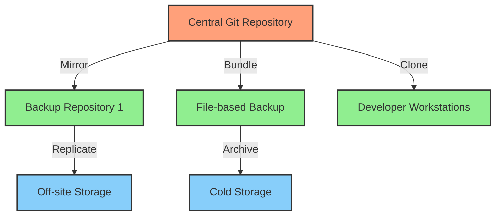
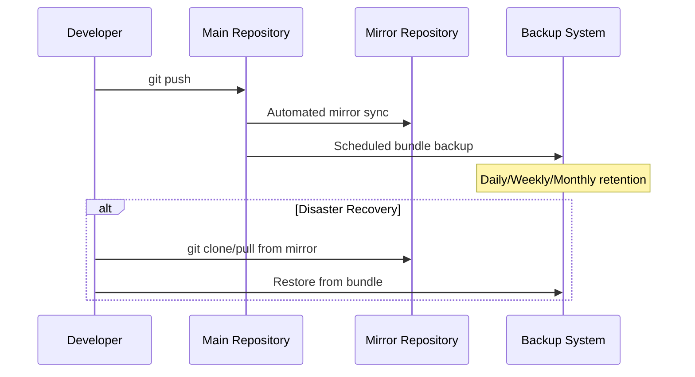

# Git Backup Strategy

## Introduction

When working with Git repositories, your source code and its entire history represent some of your most valuable digital assets. While Git itself is a distributed version control system that creates copies of your repository on each developer's machine, a proper backup strategy remains essential for protecting against data loss, corruption, or accidental deletion.

This guide will walk you through various approaches to backing up Git repositories, from simple manual techniques to automated solutions appropriate for teams and organizations of different sizes.

## Why You Need a Git Backup Strategy

Despite Git's distributed nature, several scenarios can still lead to permanent data loss:

- Catastrophic server failure where your central repository is hosted
- Accidental deletion of branches or repositories
- Malicious actions by compromised accounts
- Corruption of Git data structures
- Cloud hosting service outages or business closures

A solid backup strategy helps mitigate these risks and ensures your code's safety and availability.

## Basic Backup Approaches

### 1. Repository Mirroring

One of the simplest backup strategies is to maintain a mirror of your repository on a different remote server.

```bash
# Create a bare mirror clone
git clone --mirror git@github.com:username/original-repo.git

# Enter the mirrored repository
cd original-repo.git

# Add a new remote as backup destination
git remote add backup git@gitlab.com:username/backup-repo.git

# Push all references to backup
git push --mirror backup
```

This creates a complete copy of your repository with all branches, tags, and other references on another server.

### 2. Regular Git Bundle Creation

Git bundles provide a way to package a repository into a single file, which is perfect for backup purposes.

```bash
# Create a bundle of the entire repository
git bundle create repo-backup-$(date +%Y%m%d).bundle --all

# To restore from a bundle
git clone repo-backup-20230615.bundle restored-repo
```

You can automate bundle creation using a cron job or scheduled task:

```bash
#!/bin/bash
# backup-git-repos.sh
BACKUP_DIR="/path/to/backups"
REPOS_DIR="/path/to/repositories"

# Create timestamp for the backup
TIMESTAMP=$(date +%Y%m%d-%H%M)

# Ensure backup directory exists
mkdir -p "$BACKUP_DIR"

# For each repository, create a bundle
for REPO in "$REPOS_DIR"/*; do
  if [ -d "$REPO/.git" ] || [[ "$REPO" == *.git ]]; then
    REPO_NAME=$(basename "$REPO" .git)
    cd "$REPO"
    git bundle create "$BACKUP_DIR/$REPO_NAME-$TIMESTAMP.bundle" --all
    echo "Created backup for $REPO_NAME"
  fi
done
```

### 3. Physical/File System Backup

Taking regular file system backups of your Git repositories is another straightforward approach:

```bash
# Simple rsync backup
rsync -avz --delete /path/to/repositories/ /path/to/backup/
```

For bare repositories on a server:

```bash
# Backup all Git repositories with timestamp
tar -czf git-repos-$(date +%Y%m%d).tar.gz /path/to/git/repositories/
```

## Advanced Backup Strategies

### 1. Automated Mirroring with GitHub Actions/GitLab CI

For GitHub repositories, you can set up automated mirroring using GitHub Actions:

```yaml
# .github/workflows/mirror.yml
name: Mirror Repository

on:
  push:
    branches: [ main, master ]
  schedule:
    - cron: '0 0 * * *'  # Daily at midnight

jobs:
  mirror:
    runs-on: ubuntu-latest
    steps:
    - name: Checkout code
      uses: actions/checkout@v3
      with:
        fetch-depth: 0  # Get all history and refs
    
    - name: Push to GitLab mirror
      run: |
        git remote add gitlab https://oauth2:${{ secrets.GITLAB_TOKEN }}@gitlab.com/username/mirror-repo.git
        git push --mirror gitlab
```

### 2. Using Dedicated Backup Solutions

Several purpose-built tools exist for backing up Git repositories:

#### BorgBackup with git-backup

```bash
# Install BorgBackup and git-backup
pip install borgbackup git-backup

# Initialize a backup repository
borg init --encryption=repokey /path/to/backup/repository

# Create backup script
cat > backup-git.sh << 'EOF'
#!/bin/bash
REPOS="/path/to/repositories"
BORG_REPO="/path/to/backup/repository"

# Create a backup archive
borg create --stats --progress \
  $BORG_REPO::git-{now:%Y-%m-%d} \
  $REPOS

# Prune old backups (keep daily backups for a week, weeklies for a month, etc.)
borg prune --stats --keep-daily=7 --keep-weekly=4 --keep-monthly=6 $BORG_REPO
EOF

chmod +x backup-git.sh
```

## Disaster Recovery Testing

Any backup strategy is incomplete without testing your ability to restore from those backups. Regular testing ensures your backups are valid and your process works.

```bash
# Test bundle restoration
mkdir test-restore
cd test-restore
git clone /path/to/backups/repo-backup-20230615.bundle test-repo

# Verify the repository
cd test-repo
git log --oneline  # Check history
git branch -a      # Check branches
```

## Best Practices for Git Backups

1. **Implement the 3-2-1 backup rule**:
   - Maintain at least 3 copies of your data
   - Store backups on 2 different types of media
   - Keep 1 backup off-site

2. **Automate your backup process** to ensure consistency and reduce human error

3. **Encrypt sensitive repositories** when backing up to external services

4. **Document your backup and restore procedures** for the entire team

5. **Regularly verify your backups** by performing test restorations

6. **Set up monitoring** to alert you of backup failures

## Diagramming Your Backup Strategy

A visual representation of your backup workflow can help clarify the process:



## Git Repository Backup Flow



## Summary

A robust Git backup strategy is crucial for protecting your code and project history. By implementing a combination of repository mirroring, bundle creation, and systematic file backups, you can safeguard against various failure scenarios.

Remember that the most effective backup strategy is one that's regularly tested and continuously improved. Start with the basics and gradually enhance your approach as your team and codebase grow.

## Exercises

1. Set up a mirror of one of your repositories on a different Git hosting service.
2. Create a script that automatically generates Git bundles of your repositories on a scheduled basis.
3. Perform a test restoration from your backups to verify your recovery process.
4. Design a backup strategy for your team that incorporates the 3-2-1 rule.
5. Document your backup and restoration procedures in your team's knowledge base.

## Additional Resources

- [Git Documentation on git-bundle](https://git-scm.com/docs/git-bundle)
- [Git Documentation on git-clone --mirror](https://git-scm.com/docs/git-clone#Documentation/git-clone.txt---mirror)
- [Pro Git Book Chapter on Git Internals](https://git-scm.com/book/en/v2/Git-Internals-Plumbing-and-Porcelain)