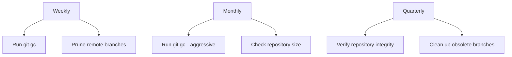

# Git Maintenance

## Introduction

Git repositories, like any system that grows over time, require regular maintenance to ensure optimal performance and reliability. Git maintenance involves various tasks that help keep your repositories clean, efficient, and well-organized. Whether you're managing a personal project or maintaining a large codebase with multiple contributors, understanding these maintenance techniques is crucial for long-term sustainability.

In this guide, we'll explore essential Git maintenance tasks, how to automate routine maintenance, and best practices to ensure your Git repositories remain healthy and performant.

## Why Maintenance Matters

Without regular maintenance, Git repositories can suffer from several issues:

- Slow performance due to bloated repository size
- Excessive disk space usage
- Difficulty finding and accessing historical information
- Risk of data corruption or loss
- Degraded developer experience

Let's dive into the specific maintenance tasks that can help address these challenges.

## Essential Git Maintenance Tasks

### 1. Garbage Collection

Git stores objects in its database that aren't always immediately removed when no longer needed. Garbage collection helps clean up these unnecessary objects and optimize your repository.

#### Manual Garbage Collection

```bash
# Basic garbage collection
git gc

# More aggressive garbage collection
git gc --aggressive
```

The `--aggressive` option performs a more thorough optimization but takes longer to complete. It's recommended to run this occasionally (perhaps monthly) on larger repositories.

#### What Happens During Garbage Collection?

- Compresses file revisions to save space
- Removes unreachable objects
- Repacks objects for better efficiency

### 2. Pruning Remote Tracking Branches

Over time, your repository accumulates references to remote branches that may have been deleted on the remote server. Pruning helps clean up these stale references.

```bash
# Prune remote-tracking branches
git remote prune origin

# Or combine fetch with pruning
git fetch --prune
```

You can verify which branches would be removed before pruning:

```bash
# Dry run to see what would be pruned
git remote prune origin --dry-run
```

### 3. Repository Size Management

Large repositories can slow down Git operations. Here are techniques to manage repository size:

#### Finding Large Files

```bash
# Find the 10 largest files in your Git repository
git rev-list --objects --all | 
  git cat-file --batch-check='%(objecttype) %(objectname) %(objectsize) %(rest)' | 
  sed -n 's/^blob //p' | 
  sort -k2nr | 
  head -10
```

#### Using Git LFS for Large Files

For repositories with large binary files, consider using Git Large File Storage (Git LFS):

```bash
# Install Git LFS
git lfs install

# Track large file types
git lfs track "*.psd"
git lfs track "*.zip"

# Make sure .gitattributes is tracked
git add .gitattributes
```

#### Removing Large Files from History

If you need to remove large files that were accidentally committed:

```bash
# Remove a file from the entire Git history
git filter-branch --force --index-filter \
  "git rm --cached --ignore-unmatch PATH-TO-FILE" \
  --prune-empty --tag-name-filter cat -- --all

# Don't forget to force push after this operation
git push origin --force --all
```

**Note:** Use `filter-branch` with caution as it rewrites history. For shared repositories, coordinate with your team before performing this operation.

### 4. Repository Verification and Repair

Occasionally check your repository's integrity:

```bash
# Verify the integrity of Git objects
git fsck

# Repair any issues found
git fsck --full
```

This command identifies corrupted objects, dangling commits, and other issues that might require attention.

## Automating Git Maintenance

Git provides a built-in maintenance scheduler to automate routine tasks:

```bash
# Register the current repository for maintenance
git maintenance register

# Start the maintenance runner
git maintenance start
```

This enables several automated tasks:

1. **gc:** Regular garbage collection
2. **commit-graph:** Updates the commit-graph file for faster commit traversal
3. **prefetch:** Pre-fetches objects from the configured remotes
4. **loose-objects:** Packs loose objects into packfiles

You can customize the maintenance schedule:

```bash
git config maintenance.strategy incremental
```

Available strategies include:
- **incremental:** Light maintenance tasks run frequently
- **incremental-repack:** Includes more aggressive repacking periodically
- **full:** Comprehensive maintenance less frequently

## Best Practices for Repository Maintenance

### 1. Establish a Regular Maintenance Schedule



### 2. Configure `.gitignore` Properly

Prevent unnecessary files from bloating your repository:

```bash
# Example .gitignore entries
node_modules/
*.log
.DS_Store
.env
dist/
coverage/
```

Review and update your `.gitignore` file regularly as your project evolves.

### 3. Use Shallow Clones for CI/CD Pipelines

For CI/CD environments where full history isn't needed:

```bash
# Clone with limited history
git clone --depth=1 https://github.com/username/repository.git

# Or fetch with limited history
git fetch --depth=1
```

### 4. Archive Old Repositories

For inactive projects, consider creating an archive:

```bash
# Create a bundle of the entire repository
git bundle create project-archive.bundle --all

# Clone from the bundle when needed
git clone project-archive.bundle new-workspace
```

### 5. Clean Local Branches Regularly

Remove merged or obsolete local branches:

```bash
# List merged branches
git branch --merged main

# Delete a branch
git branch -d branch-name

# Find branches not merged to main
git branch --no-merged main
```

## Git Maintenance via Git's Native Commands

Git 2.30.0 and later include dedicated maintenance commands:

```bash
# Run all maintenance tasks now
git maintenance run

# Run specific maintenance tasks
git maintenance run --task=gc
git maintenance run --task=commit-graph
git maintenance run --task=loose-objects
git maintenance run --task=pack-refs
```

## Practical Example: Maintenance Workflow

Here's a practical example of a maintenance routine for a team repository:

```bash
# 1. Update your local copy
git fetch --all --prune

# 2. Check repository status
git status

# 3. Run garbage collection
git gc

# 4. Verify repository integrity
git fsck

# 5. Check repository size
du -sh .git

# 6. Look for large files if repository is too big
git rev-list --objects --all | 
  git cat-file --batch-check='%(objecttype) %(objectname) %(objectsize) %(rest)' | 
  sed -n 's/^blob //p' | 
  sort -k2nr | 
  head -10

# 7. Update maintenance configuration
git maintenance register
```

## Git Maintenance Script

Here's a simple shell script you can save as `git-maintenance.sh` to automate your maintenance tasks:

```bash
#!/bin/bash
# Git repository maintenance script

echo "Starting Git maintenance tasks..."

# Fetch the latest changes and prune
echo "Fetching and pruning..."
git fetch --all --prune

# Perform garbage collection
echo "Running garbage collection..."
git gc

# Verify repository integrity
echo "Checking repository integrity..."
git fsck

# Check repository size
echo "Repository size:"
du -sh .git

echo "Git maintenance completed!"
```

Make it executable and run it periodically:

```bash
chmod +x git-maintenance.sh
./git-maintenance.sh
```

## Summary

Regular Git maintenance is essential for keeping your repositories healthy and efficient. By incorporating these maintenance tasks into your workflow, you can prevent performance issues, reduce storage requirements, and ensure the longevity of your Git repositories.

Key takeaways from this guide:

1. Perform regular garbage collection with `git gc`
2. Prune stale remote tracking branches
3. Manage repository size by tracking and removing large files
4. Verify repository integrity with `git fsck`
5. Automate maintenance tasks when possible
6. Establish and follow a maintenance schedule

By making repository maintenance a regular part of your Git workflow, you'll create a better experience for yourself and your collaborators while ensuring the reliability of your version control system.

## Additional Resources

- [Git Documentation: git-gc](https://git-scm.com/docs/git-gc)
- [Git Documentation: git-maintenance](https://git-scm.com/docs/git-maintenance)
- [Git Large File Storage (LFS)](https://git-lfs.github.com/)

## Exercises

1. Set up automated maintenance for one of your repositories using `git maintenance start`.
2. Identify the largest files in your repository and consider whether they should be tracked with Git LFS.
3. Create a maintenance script that you can run monthly on your important repositories.
4. Compare repository performance before and after running `git gc --aggressive`.
5. Configure a pre-push hook that performs basic maintenance tasks before pushing to remote repositories.