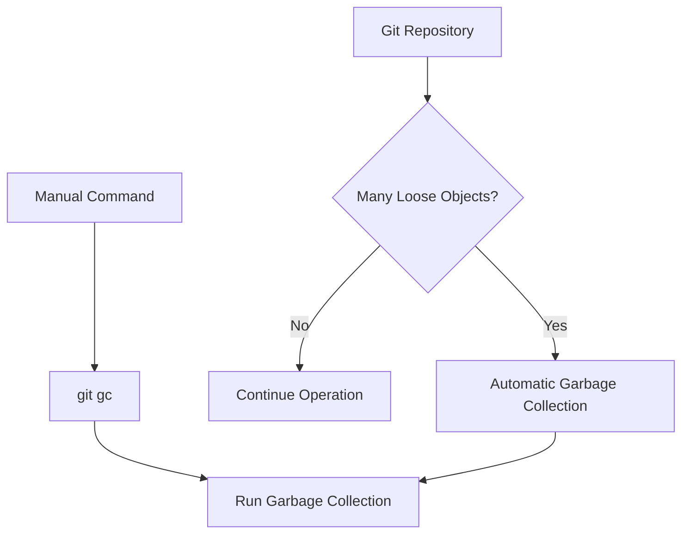

# Git Garbage Collection

## Introduction

Just like your home needs regular cleaning, Git repositories need occasional tidying up to remain efficient. Git's "garbage collection" is an internal process that optimizes your repository by cleaning up unnecessary files and compressing data to improve performance.

When you work with Git, various operations create objects in the repository's database. Over time, some of these objects become unreachable (no longer needed) but still occupy space. Git's garbage collection process identifies and removes these objects, keeping your repository lean and efficient.

## What is Git Garbage Collection?

Git garbage collection (`git gc`) is an administrative command that performs several maintenance tasks:

1. Removing unreachable objects
2. Packing loose objects into packfiles
3. Consolidating packfiles into more optimal collections
4. Pruning reflog entries older than a certain date

This process helps maintain repository performance and reduce disk space usage without changing any of your version history or data integrity.

## When Does Git Garbage Collection Run?

Git has built-in intelligence around garbage collection:

1. **Automatic collection**: Git automatically runs garbage collection during certain operations like `git pull`, `git merge`, `git rebase`, and `git commit` when it detects too many loose objects.

2. **Manual collection**: You can manually run garbage collection using the `git gc` command.

Let's visualize when garbage collection typically happens:



## Basic Git Garbage Collection Commands

### Running Standard Garbage Collection

The most basic form of garbage collection is running the `git gc` command:

```bash
$ git gc
Enumerating objects: 12500, done.
Counting objects: 100% (12500/12500), done.
Delta compression using up to 8 threads
Compressing objects: 100% (3270/3270), done.
Writing objects: 100% (12500/12500), done.
Total 12500 (delta 9120), reused 12500 (delta 9120), pack-reused 0
```

This command performs standard garbage collection on your repository.

### Aggressive Garbage Collection

For more thorough optimization, you can use the `--aggressive` flag:

```bash
$ git gc --aggressive
Enumerating objects: 12500, done.
Counting objects: 100% (12500/12500), done.
Delta compression using up to 8 threads
Compressing objects: 100% (11452/11452), done.
Writing objects: 100% (12500/12500), done.
Total 12500 (delta 7830), reused 8542 (delta 560), pack-reused 0
```

The aggressive option spends more time optimizing, which can significantly reduce repository size but takes much longer to complete. This should typically be used infrequently (maybe once every few months) on large repositories.

### Checking If Garbage Collection Is Needed

Before running garbage collection, you can check if it's necessary:

```bash
$ git gc --auto
```

This command will only perform garbage collection if Git determines it's necessary based on the number of loose objects.

## Understanding What Git Garbage Collection Cleans

To better understand what garbage collection does, let's look at what Git considers "garbage":

1. **Unreachable objects**: Objects not referenced by any branch, tag, or other reference
2. **Dangling commits**: Commits that are no longer part of any branch
3. **Older reflog entries**: Entries in the reflog older than the configured expiry time
4. **Loose objects**: Individual object files that can be combined into packfiles

You can examine unreachable objects before garbage collection with:

```bash
$ git fsck --unreachable
Checking object directories: 100% (256/256), done.
Checking objects: 100% (12500/12500), done.
unreachable blob 8ad33f3bfd36d8520a9177393041f3c9e85f4150
unreachable blob c39c2bf5da76374d67e9a295ff52a003db30a0a6
unreachable commit 4a5c0cd28f1dd8e2a74bf28ad2b2327bc5c3d8f0
```

## Practical Examples

### Example 1: Optimizing a Repository After a Large Import

Imagine you've just imported a large project with thousands of files:

```bash
$ git clone --mirror https://github.com/large-project/repo.git
$ cd repo.git
$ du -sh .
925MB .

# Run aggressive garbage collection
$ git gc --aggressive
# This may take several minutes

$ du -sh .
780MB .
```

In this example, aggressive garbage collection reduced the repository size by approximately 15%.

### Example 2: Setting Up Regular Maintenance

For a busy repository with many contributors, you might want to schedule regular maintenance:

```bash
# Create a shell script for maintenance
$ cat > git-maintenance.sh << 'EOF'
#!/bin/bash
cd /path/to/repository
git gc --auto
git prune --expire=2.weeks.ago
EOF

$ chmod +x git-maintenance.sh

# Add to crontab to run weekly
$ crontab -e
# Add this line:
# 0 3 * * 0 /path/to/git-maintenance.sh
```

This script performs automatic garbage collection and prunes objects older than two weeks. The crontab entry runs it every Sunday at 3 AM.

### Example 3: Cleaning Up After Large Binary Files

If you accidentally committed large binary files that were later removed, your repository might still be bloated:

```bash
# Check repository size
$ du -sh .
1.2GB .

# Run garbage collection with pruning
$ git gc --prune=now --aggressive

# Check size again
$ du -sh .
850MB .
```

## Advanced Configuration Options

Git's garbage collection behavior can be customized through configuration settings:

```bash
# Set auto gc threshold to trigger after 1000 loose objects (default is 6700)
$ git config --global gc.auto 1000

# Set pruning to 14 days (default is 2 weeks)
$ git config --global gc.pruneExpire "14 days"

# Disable automatic gc during certain commands
$ git config --global gc.auto 0
```

Let's explore these configurations:

| Configuration | Description | Default Value | Recommended Value |
|---------------|-------------|---------------|-------------------|
| `gc.auto` | Number of loose objects to trigger auto gc | 6700 | 1000-10000 depending on repo size |
| `gc.autoPackLimit` | Number of packs to trigger auto gc | 50 | 20-100 depending on repo size |
| `gc.pruneExpire` | Time to keep unreachable objects | "2 weeks ago" | "14 days" for most repos |
| `gc.aggressiveWindow` | Window size for --aggressive | 250 | Default is usually sufficient |

## Common Issues and Troubleshooting

### Issue 1: Garbage Collection Takes Too Long

For large repositories, garbage collection can take a considerable amount of time, especially with the `--aggressive` option.

**Solution**: Run garbage collection during off-hours or split it up:

```bash
# First, just collect loose objects
$ git repack

# Later, run a full garbage collection
$ git gc
```

### Issue 2: "Cannot lock refs" Error

Sometimes you might encounter an error like:

```
error: cannot lock ref 'refs/remotes/origin/main': Unable to create '/path/to/repo/.git/refs/remotes/origin/main.lock': File exists.
```

**Solution**: This usually indicates another Git process is running. Wait for it to complete or clean up lock files if you're sure no other process is running:

```bash
$ find .git -name "*.lock" -delete
```

### Issue 3: Git Operations Become Slower After Garbage Collection

Occasionally, frequent garbage collection might cause Git operations to slow down temporarily.

**Solution**: Adjust the auto GC settings:

```bash
# Increase the threshold to run gc less frequently
$ git config --global gc.auto 10000
```

## Best Practices

1. **Run `git gc` regularly but not too frequently**
   - For most repositories, running it monthly is sufficient
   - For very active repositories, you might run it weekly

2. **Use `--aggressive` sparingly**
   - Only run aggressive GC occasionally (every few months)
   - Schedule it during periods of low activity

3. **Automate garbage collection**
   - Set up maintenance scripts to run during off-hours
   - Use tools like Git hooks or scheduled tasks

4. **Optimize workflow to minimize garbage**
   - Avoid committing and then immediately removing large files
   - Use Git LFS for large binary files
   - Set appropriate `.gitignore` rules

## Summary

Git garbage collection is an essential maintenance process that keeps your repositories performing optimally. By understanding when and how to run garbage collection, you can ensure your Git repositories remain efficient and take up minimal disk space.

Remember these key points:

- Git automatically runs garbage collection when necessary
- Manual garbage collection can be run with `git gc`
- Aggressive garbage collection (`git gc --aggressive`) provides more thorough optimization but takes longer
- Regular maintenance keeps repositories healthy and performant

## Additional Resources

- [Git Documentation: git-gc](https://git-scm.com/docs/git-gc)
- [Pro Git Book: Git Internals - Maintenance and Data Recovery](https://git-scm.com/book/en/v2/Git-Internals-Maintenance-and-Data-Recovery)

## Exercises for Practice

1. Check the current size of a local repository, run garbage collection, and measure the size difference.
2. Create a script that performs maintenance on multiple Git repositories.
3. Experiment with different garbage collection settings and observe their effects on repository size and performance.
4. Use `git count-objects -v` before and after garbage collection to see detailed statistics on what was cleaned up.