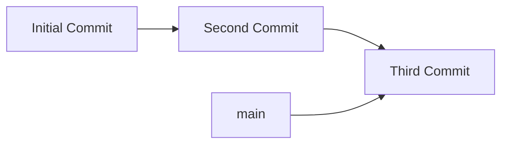
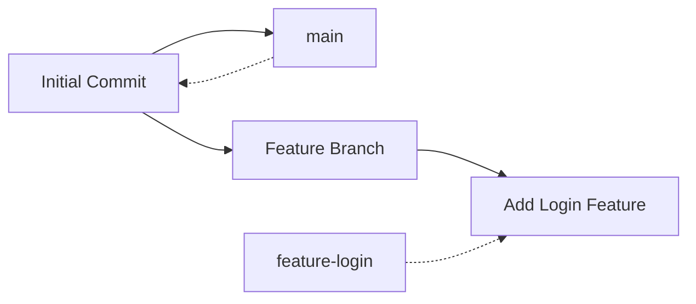

# Git Branch Basics

## Introduction

Branching is one of Git's most powerful features. It allows developers to diverge from the main line of development and work independently without affecting the main codebase. Think of branches as separate workspaces where you can develop features, fix bugs, or experiment with new ideas in isolation.

In this tutorial, we'll explore the fundamentals of Git branching and learn how to create, switch between, and manage branches in your Git repositories.

## What Are Git Branches?

A branch in Git is simply a lightweight movable pointer to a commit. The default branch in Git is called `main` (previously called `master` in older repositories). When you make commits, the branch pointer automatically moves forward to your latest commit.



When you create a new branch, you're creating a new pointer to the same commit you're currently on. This allows you to diverge from the main line of development.

## Basic Branch Commands

### Viewing Branches

To list all local branches in your repository:

```bash
git branch
```

Output:
```
* main
```

The branch with an asterisk (`*`) is the branch you're currently on.

To see all branches (including remote branches):

```bash
git branch -a
```

Output:
```
* main
  remotes/origin/main
```

### Creating a New Branch

To create a new branch:

```bash
git branch feature-login
```

This creates a new branch called `feature-login` but doesn't switch to it.

### Switching to a Branch

To switch to an existing branch:

```bash
git checkout feature-login
```

Output:
```
Switched to branch 'feature-login'
```

Git 2.23 introduced a new command for switching branches:

```bash
git switch feature-login
```

### Creating and Switching in One Command

To create a new branch and switch to it immediately:

```bash
git checkout -b feature-login
```

Or using the newer syntax:

```bash
git switch -c feature-login
```

Output:
```
Switched to a new branch 'feature-login'
```

## Working with Branches

Let's walk through a practical example of working with branches:

### Step 1: Create a New Branch for a Feature

```bash
git checkout -b feature-login
```

### Step 2: Make Changes in Your Branch

```bash
# Edit some files
touch login.js
git add login.js
git commit -m "Add login functionality"
```

### Step 3: View the Commit History

```bash
git log --oneline
```

Output:
```
a1b2c3d Add login functionality
e5f6g7h Initial commit
```

### Step 4: Switch Back to Main Branch

```bash
git checkout main
```

Notice that your working directory reflects the state of the `main` branch, and the changes you made in the `feature-login` branch are not visible.



## Branching Workflows

Here are some common branching workflows:

### Feature Branching

Create a new branch for each feature you're working on:

```bash
git checkout -b feature-login
# Make changes
git add .
git commit -m "Add login page"
git push origin feature-login
```

When the feature is complete, merge it back into the main branch:

```bash
git checkout main
git merge feature-login
```

### Bug Fix Branching

Similar to feature branching, but for bug fixes:

```bash
git checkout -b fix-header-bug
# Fix the bug
git add .
git commit -m "Fix header display issue"
git push origin fix-header-bug
```

## Branch Management

### Renaming a Branch

To rename your current branch:

```bash
git branch -m new-branch-name
```

To rename a branch you're not currently on:

```bash
git branch -m old-branch-name new-branch-name
```

### Deleting a Branch

To delete a local branch:

```bash
git branch -d branch-name
```

If the branch has unmerged changes, Git will prevent the deletion. To force the deletion:

```bash
git branch -D branch-name
```

To delete a remote branch:

```bash
git push origin --delete branch-name
```

## Common Branching Scenarios

### Scenario 1: Starting a New Feature

```bash
# Create and switch to a new branch
git checkout -b new-feature

# Make some changes
# ...

# Commit your changes
git add .
git commit -m "Implement new feature"

# Push branch to remote repository
git push -u origin new-feature
```

### Scenario 2: Fixing a Bug in Production

```bash
# Switch to main branch and get latest changes
git checkout main
git pull

# Create a bug fix branch
git checkout -b hotfix-login-issue

# Fix the bug and commit
git add .
git commit -m "Fix login issue"

# Push fix to remote
git push -u origin hotfix-login-issue
```

## Summary

Branching is a fundamental concept in Git that enables parallel development and collaboration. In this tutorial, we learned:

- What Git branches are
- How to create, switch between, and manage branches
- Basic branching workflows
- Common branching commands and scenarios

Git branches allow you to work on different features or fixes in isolation, keeping your codebase clean and organized. By mastering branches, you'll be able to collaborate more effectively with your team and maintain a well-structured development workflow.

## Further Practice

Try these exercises to reinforce your understanding:

1. Create a new Git repository and practice creating different feature branches.
2. Make changes in different branches and observe how Git tracks them separately.
3. Try merging branches together and resolving any conflicts that arise.
4. Experiment with the different branch management commands.

## Additional Resources

- [Git Documentation on Branching](https://git-scm.com/book/en/v2/Git-Branching-Branches-in-a-Nutshell)
- [Atlassian Git Tutorial: Using Branches](https://www.atlassian.com/git/tutorials/using-branches)