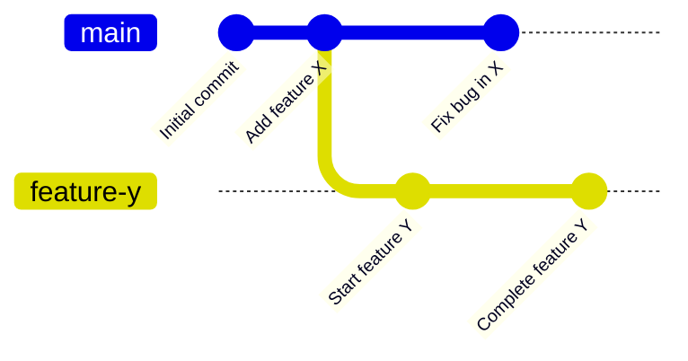

# Git Branch Creation

## Introduction

Branching is one of Git's most powerful features. It allows developers to diverge from the main line of development and work independently without affecting the main codebase. Think of branches as separate workspaces where you can develop features, fix bugs, or experiment with new ideas in isolation.

In this tutorial, we'll learn how to create branches in Git, understand the concept behind branching, and explore practical scenarios where branching proves invaluable.

## What is a Git Branch?

A branch in Git is simply a lightweight movable pointer to a commit. The default branch in Git is called `main` (or `master` in older repositories). When you create a new branch, Git creates a new pointer that can move independently from the main branch.



## Checking Current Branches

Before creating a new branch, it's helpful to see what branches already exist in your repository. You can use the following command:

```bash
git branch
```

Output:
```
* main
```

The asterisk `*` indicates the branch you're currently on (the active branch).

To see both local and remote branches, use:

```bash
git branch -a
```

Output:
```
* main
  remotes/origin/main
```

## Creating a New Branch

There are two primary ways to create a branch in Git:

### Method 1: Using `git branch`

```bash
git branch <branch-name>
```

This command creates a new branch but doesn't switch to it. For example:

```bash
git branch feature-login
```

After running this command, you've created a new branch called `feature-login`, but you're still on your original branch (e.g., `main`).

### Method 2: Using `git checkout` with the `-b` flag

```bash
git checkout -b <branch-name>
```

This command creates a new branch and immediately switches to it. For example:

```bash
git checkout -b feature-login
```

Output:
```
Switched to a new branch 'feature-login'
```

### Method 3: Using `git switch` (Git 2.23+)

If you're using Git version 2.23 or newer, you can use the more intuitive `git switch` command:

```bash
git switch -c <branch-name>
```

The `-c` flag stands for "create." For example:

```bash
git switch -c feature-login
```

Output:
```
Switched to a new branch 'feature-login'
```

## Switching Between Branches

Once you've created multiple branches, you'll need to switch between them. You can do this using:

### Using `git checkout`

```bash
git checkout <branch-name>
```

For example:
```bash
git checkout main
```

Output:
```
Switched to branch 'main'
```

### Using `git switch` (Git 2.23+)

```bash
git switch <branch-name>
```

For example:
```bash
git switch feature-login
```

Output:
```
Switched to branch 'feature-login'
```

## Creating a Branch from a Specific Commit

Sometimes, you might want to create a branch starting from a specific commit in your history, not just the current HEAD:

```bash
git branch <branch-name> <commit-hash>
```

For example:
```bash
git branch hotfix-login a7d3f0c
```

This creates a new branch called `hotfix-login` that points to the commit with hash `a7d3f0c`.

## Practical Example: Feature Branch Workflow

Let's walk through a complete example of creating and using a branch for developing a new feature:

1. Ensure you're on the main branch and it's up to date:

```bash
git checkout main
git pull origin main
```

2. Create and switch to a new feature branch:

```bash
git checkout -b feature-user-profile
```

3. Make changes to implement the feature:

```bash
# Edit files, add new code
```

4. Stage and commit your changes:

```bash
git add .
git commit -m "Add user profile page and functionality"
```

5. Push your branch to the remote repository:

```bash
git push -u origin feature-user-profile
```

The `-u` flag sets up tracking, which links your local branch to the remote branch.

## Best Practices for Branch Creation

1. **Use descriptive names**: Choose branch names that clearly describe the purpose of the branch.
   - Good: `feature-login`, `bugfix-header`, `refactor-api`
   - Poor: `my-branch`, `fix`, `new-stuff`

2. **Use branch prefixes**: Adopt a consistent naming convention with prefixes:
   - `feature/`: For new features
   - `bugfix/` or `fix/`: For bug fixes
   - `hotfix/`: For urgent fixes to production
   - `refactor/`: For code refactoring
   - `docs/`: For documentation changes

3. **Keep branches focused**: Each branch should represent a single feature, bug fix, or task.

4. **Keep branches short-lived**: Long-lived branches can lead to complex merge conflicts. Try to merge your branches back to the main branch frequently.

5. **Delete branches after merging**: Clean up branches that have been merged to avoid cluttering your repository.

```bash
# Delete a local branch
git branch -d feature-login

# Delete a remote branch
git push origin --delete feature-login
```

## Branch Creation in Different Scenarios

### 1. Feature Development

Create a branch for each new feature to isolate development:

```bash
git checkout -b feature/user-authentication
```

### 2. Bug Fixes

Create a branch specifically for fixing a bug:

```bash
git checkout -b bugfix/login-error
```

### 3. Hotfixes

For critical fixes that need to be applied to production:

```bash
git checkout -b hotfix/security-patch
```

### 4. Experimental Work

For experimental features that might not make it to production:

```bash
git checkout -b experimental/new-ui
```

## Summary

Creating branches in Git is a fundamental skill that enables isolated development, collaboration, and organized workflows. By creating branches, you can:

- Work on features without affecting the main codebase
- Collaborate with teammates without stepping on each other's toes
- Organize your development process with dedicated branches for different purposes
- Experiment with new ideas safely

Remember these key commands:
- `git branch <branch-name>`: Create a new branch
- `git checkout -b <branch-name>` or `git switch -c <branch-name>`: Create and switch to a new branch
- `git checkout <branch-name>` or `git switch <branch-name>`: Switch between branches
- `git branch -d <branch-name>`: Delete a branch after you're done with it

## Exercises

1. Create a new repository and practice creating branches with different naming conventions.
2. Create a feature branch, make some changes, and merge it back to the main branch.
3. Create a branch from a specific commit in your history.
4. Create a branch to fix a bug, then delete it after merging.
5. Practice the feature branch workflow by creating a branch, making changes, pushing to a remote repository, and creating a pull request.

## Additional Resources

- [Git Branching - Basic Branching and Merging](https://git-scm.com/book/en/v2/Git-Branching-Basic-Branching-and-Merging)
- [A successful Git branching model](https://nvie.com/posts/a-successful-git-branching-model/)
- [GitHub Flow](https://guides.github.com/introduction/flow/)
- [Learn Git Branching](https://learngitbranching.js.org/) - An interactive tutorial