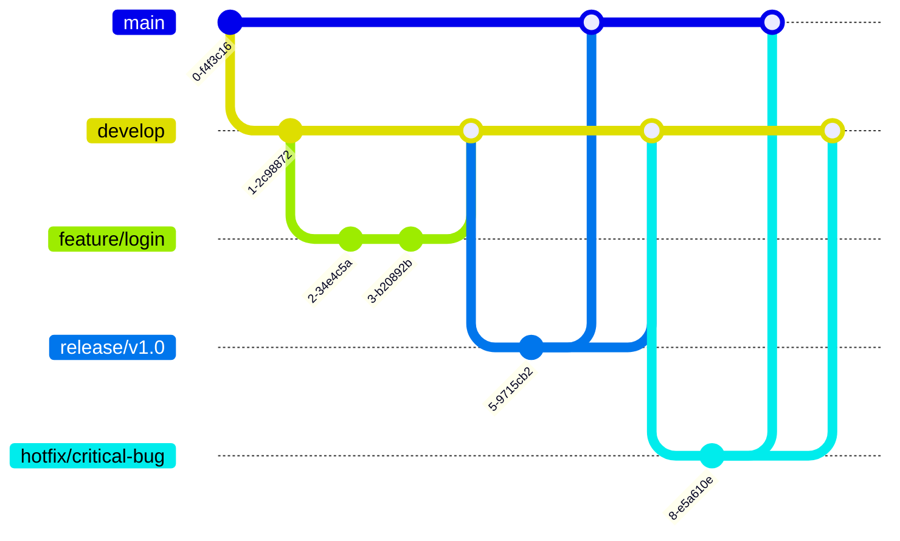

# Git Branch Management

## Introduction

Branch management is a crucial skill for any developer working with Git. Branches allow multiple developers to work on different features simultaneously without interfering with each other's work. However, as projects grow and more branches are created, maintaining a clean and organized repository becomes challenging.

In this guide, we'll explore effective strategies for managing Git branches, including when to create them, how to name them, when to merge or delete them, and common workflows that teams use to streamline collaboration.

## Understanding Branches in Git

Before diving into branch management strategies, let's recap what branches are in Git and why they're important.

A branch in Git is simply a lightweight movable pointer to a commit. When you create a branch, you're creating a new line of development that diverges from the main line. This divergence enables parallel work on multiple features or bug fixes without affecting the stable codebase.


In the diagram above, after commit B, development splits into two branches: one leading to C and F, and another leading to D and E.

## Creating and Managing Branches

### Listing Branches

Before creating new branches, it's helpful to see what branches already exist:

```bash
git branch
```

This will show all local branches, with the current branch marked with an asterisk (*).

To see remote branches as well:

```bash
git branch -a
```

### Creating a New Branch

To create a new branch from your current position:

```bash
git branch feature-login
```

This creates the branch but doesn't switch to it. To create and switch in one command:

```bash
git checkout -b feature-login
```

Or using the newer Git syntax:

```bash
git switch -c feature-login
```

### Switching Between Branches

To switch to an existing branch:

```bash
git checkout feature-login
```

Or with the newer syntax:

```bash
git switch feature-login
```

### Branch Naming Conventions

Good branch naming helps everyone understand what work is being done. Common naming patterns include:

- `feature/feature-name`: For new features
- `bugfix/bug-description`: For bug fixes
- `hotfix/issue-description`: For critical fixes that need immediate deployment
- `release/version-number`: For release preparation
- `refactor/component-name`: For code refactoring

Example:

```bash
git branch feature/user-authentication
git branch bugfix/login-timeout
git branch hotfix/security-vulnerability
git branch release/v1.2.0
```

## Working with Branches

### Tracking Changes

After making changes to files in your branch, you can see the status with:

```bash
git status
```

Add and commit your changes as usual:

```bash
git add .
git commit -m "Add login form validation"
```

### Pushing a Branch to Remote

To share your branch with others, push it to the remote repository:

```bash
git push -u origin feature-login
```

The `-u` flag sets up tracking, which makes subsequent pushes simpler:

```bash
git push
```

### Retrieving Remote Branches

To fetch all remote branches:

```bash
git fetch origin
```

To fetch and switch to a remote branch:

```bash
git checkout -b feature-login origin/feature-login
```

Or more simply:

```bash
git checkout feature-login
```

(Git will automatically set up tracking if a remote branch with the same name exists)

## Branch Management Strategies

### When to Create a Branch

Create a new branch when:

1. Developing a new feature
2. Fixing a bug
3. Working on experimental changes
4. Preparing for a release
5. Making significant refactors

### Keeping Branches Updated

It's important to regularly incorporate changes from the main branch to avoid complex merge conflicts later:

```bash
# While on your feature branch
git fetch origin
git merge origin/main

# Or the shorthand
git pull origin main
```

### Branch Cleanup

After a branch has been merged, it's good practice to delete it to keep your repository clean:

```bash
# Delete a local branch
git branch -d feature-login

# Force delete if changes aren't merged
git branch -D feature-login

# Delete a remote branch
git push origin --delete feature-login
```

## Common Branching Workflows

### Simple Workflow (GitHub Flow)

This is a lightweight workflow suitable for small teams or simple projects:

1. Create a branch from `main` for each new feature/bugfix
2. Develop and test on your branch
3. Open a pull request for review
4. Merge to `main` after review
5. Delete the branch


### Git Flow

A more comprehensive workflow for larger projects:

1. **Main Branches**:
   - `main`: Production-ready code
   - `develop`: Integration branch for features

2. **Supporting Branches**:
   - `feature/*`: For new features (branched from `develop`)
   - `release/*`: For release preparation (branched from `develop`)
   - `hotfix/*`: For urgent fixes (branched from `main`)



### Trunk-Based Development

A streamlined approach focusing on small, frequent merges to the main branch:

1. Work in short-lived feature branches (1-2 days max)
2. Merge frequently to the main branch
3. Use feature flags to hide incomplete features in production


## Resolving Merge Conflicts

When Git can't automatically merge changes, you'll encounter merge conflicts:

```bash
git merge feature-login
# Auto-merging src/login.js
# CONFLICT (content): Merge conflict in src/login.js
# Automatic merge failed; fix conflicts and then commit the result.
```

To resolve conflicts:

1. Open the conflicted files in your editor
2. Look for conflict markers (`<<<<<<<`, `=======`, `>>>>>>>`)
3. Edit the file to resolve the conflict
4. Save the file
5. Mark as resolved: `git add src/login.js`
6. Complete the merge: `git merge --continue`

Example of conflict markers:

```javascript
function validateLogin() {
<<<<<<< HEAD
  // Current branch code
  return checkCredentials(username, password);
=======
  // Incoming branch code
  if (!username || !password) return false;
  return validateCredentials(username, password);
>>>>>>> feature-login
}
```

## Best Practices for Branch Management

1. **Keep branches focused**: Each branch should relate to a single feature or fix
2. **Keep branches short-lived**: Long-lived branches lead to integration headaches
3. **Regularly update from main**: Integrate changes from the main branch often
4. **Delete merged branches**: Keep your repository clean
5. **Use descriptive branch names**: Make the purpose clear from the name
6. **Use pull/merge requests**: For code review before integration
7. **Protect important branches**: Configure branch protection for `main` and `develop`

## Practical Example: Adding a Feature

Let's work through an example of adding a user registration feature:

### 1. Create a new branch

```bash
git checkout main
git pull  # Ensure you have the latest changes
git checkout -b feature/user-registration
```

### 2. Make your changes

```bash
# Add and modify files for the registration feature
# Test your changes
```

### 3. Commit your changes

```bash
git add .
git commit -m "Add user registration form and validation"
```

### 4. Keep your branch updated

```bash
git fetch origin
git merge origin/main
# Resolve any conflicts
```

### 5. Push your branch

```bash
git push -u origin feature/user-registration
```

### 6. Create a pull request (via GitHub/GitLab/etc.)

### 7. After the merge, clean up

```bash
git checkout main
git pull
git branch -d feature/user-registration
```

## Advanced Branch Management Techniques

### Cherry-Picking

Sometimes you want to apply a specific commit from one branch to another without merging the entire branch:

```bash
git cherry-pick <commit-hash>
```

Example:

```bash
git checkout main
git cherry-pick a72f3bc  # Apply this specific bugfix to main
```

### Rebasing

Rebasing is a way to incorporate changes from one branch to another by replaying commits:

```bash
git checkout feature-branch
git rebase main
```

This creates a cleaner history but should generally be avoided for branches that have been pushed to remote repositories.

### Stashing Changes

If you need to switch branches but aren't ready to commit:

```bash
git stash
git checkout other-branch
# Do work on other-branch
git checkout feature-branch
git stash pop  # Apply your stashed changes
```

## Summary

Effective branch management is essential for productive collaboration in Git. By following consistent naming conventions, keeping branches focused and short-lived, and adhering to an established workflow, teams can minimize conflicts and maintain a clean, understandable project history.

Remember these key points:

- Create branches for specific purposes
- Name branches descriptively
- Keep branches updated with changes from the main branch
- Clean up branches after they're merged
- Follow a consistent workflow that suits your team's needs

With these practices in place, you'll be able to leverage Git's branching system to its full potential, enabling parallel development while maintaining a stable codebase.

## Exercises

1. Create a new branch for a feature, make several commits, and then merge it back to the main branch.
2. Simulate a merge conflict by making changes to the same file in two different branches, then practice resolving it.
3. Experiment with different branching workflows on a sample project.
4. Practice using `git cherry-pick` to apply specific commits from one branch to another.
5. Set up branch protection rules in GitHub/GitLab for a repository.

## Additional Resources

- [Git Documentation on Branching](https://git-scm.com/book/en/v2/Git-Branching-Branches-in-a-Nutshell)
- [Atlassian's Git Workflow Guide](https://www.atlassian.com/git/tutorials/comparing-workflows)
- [GitHub Flow](https://guides.github.com/introduction/flow/)
- [GitLab Flow](https://about.gitlab.com/topics/version-control/what-is-gitlab-flow/)