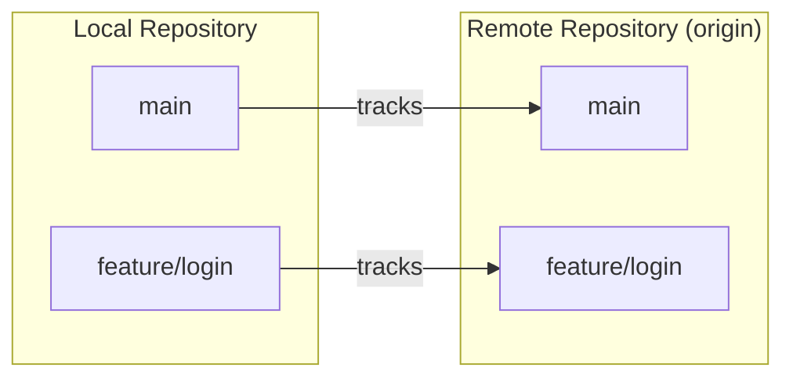

# Git Remote Branches

## Introduction

When working on software projects, especially in a team environment, understanding how to work with remote repositories and branches is essential. Remote branches are references to the state of branches in remote repositories. They allow you to track what others are working on and effectively collaborate on projects.

In this tutorial, you'll learn:
- What remote branches are and how they differ from local branches
- How to view and manage remote branches
- How to fetch, pull, and push changes to remote branches
- Common workflows when collaborating with remote branches

## Understanding Remote Branches

### What Are Remote Branches?

Remote branches are references to the state of branches in a remote repository. Unlike local branches that exist on your machine, remote branches represent branches that exist on a remote server (like GitHub, GitLab, or Bitbucket).

Remote branches have a special naming convention: `<remote>/<branch>`. For example, `origin/main` refers to the `main` branch on the remote named `origin`.



### Viewing Remote Branches

To see all remote branches, you can use:

```bash
git branch -r
```

This will display something like:

```
origin/main
origin/develop
origin/feature/login
```

To see both local and remote branches:

```bash
git branch -a
```

Output:

```
* main
  feature/login
  remotes/origin/main
  remotes/origin/develop
  remotes/origin/feature/login
```

## Working with Remote Branches

### Fetching Remote Branches

When you want to update your local repository with the latest changes from a remote repository without merging them, you use `git fetch`.

```bash
# Fetch all branches from all remotes
git fetch

# Fetch from a specific remote
git fetch origin
```

Fetching downloads new data from the remote repository but doesn't integrate it into your working files. It updates your remote-tracking branches so you can see what others have been working on.

### Creating a Local Branch from a Remote Branch

To work on a remote branch, you need to create a local branch that tracks it:

```bash
# Checkout and create a new local branch that tracks the remote branch
git checkout -b feature/user-auth origin/feature/user-auth
```

A simpler way to accomplish the same thing:

```bash
# Automatically creates and tracks the remote branch
git checkout feature/user-auth
```

Git will show a message like:

```
Branch 'feature/user-auth' set up to track remote branch 'feature/user-auth' from 'origin'.
Switched to a new branch 'feature/user-auth'
```

### Pushing Local Branches to Remote

When you've made changes to your local branch and want to share them with others, you need to push your branch to the remote repository:

```bash
# Push your current branch to the remote
git push origin feature/user-auth
```

If this is a new branch that doesn't exist remotely yet, you can set it up to track the remote branch with:

```bash
# Push and set upstream tracking
git push -u origin feature/user-auth
```

After setting the upstream, you can use `git push` and `git pull` without specifying the remote and branch names.

### Pulling Changes from Remote Branches

To update your local branch with changes from the corresponding remote branch, use:

```bash
git pull
```

This is equivalent to running `git fetch` followed by `git merge origin/<current-branch>`.

### Viewing Remote Branch Information

To see detailed information about remote branches and their relationship to local branches:

```bash
git remote show origin
```

This will show information about the remote repository, including which remote branches are tracked by your local branches:

```
* remote origin
  Fetch URL: https://github.com/username/repository.git
  Push  URL: https://github.com/username/repository.git
  HEAD branch: main
  Remote branches:
    main                tracked
    develop             tracked
    feature/login       tracked
  Local branches configured for 'git pull':
    main     merges with remote main
    develop  merges with remote develop
  Local refs configured for 'git push':
    main    pushes to main    (up to date)
    develop pushes to develop (up to date)
```

## Practical Examples

### Example 1: Collaborating on a Feature

Let's walk through a typical workflow when collaborating with a team member on a feature:

1. First, fetch the latest changes from the remote repository:

```bash
git fetch origin
```

2. See what branches are available remotely:

```bash
git branch -r
```

3. Your colleague has pushed a new feature branch called `feature/user-search`. Create a local copy of this branch:

```bash
git checkout feature/user-search
```

4. Make your changes to the code, then commit them:

```bash
git add .
git commit -m "Add filtering to user search"
```

5. Push your changes back to the remote branch:

```bash
git push
```

### Example 2: Handling Conflicting Changes

When multiple people work on the same branch, conflicts can arise. Here's how to handle them:

1. Try to pull the latest changes:

```bash
git pull
```

2. If there are conflicts, you'll see a message like:

```
CONFLICT (content): Merge conflict in src/components/UserSearch.js
Automatic merge failed; fix conflicts and then commit the result.
```

3. Open the conflicting files and resolve the conflicts. Conflicts are marked with:

```
<<<<<<< HEAD
// Your local changes
=======
// Remote changes
>>>>>>> origin/feature/user-search
```

4. After resolving conflicts, add the files and commit the merge:

```bash
git add .
git commit -m "Resolve merge conflicts in UserSearch component"
```

5. Push the resolved changes:

```bash
git push
```

### Example 3: Tracking Remote Branches

Sometimes you need to track what's happening in multiple branches without necessarily working on them. Here's how:

1. Fetch all branches from the remote:

```bash
git fetch origin
```

2. Check the status of your local branches compared to their remote counterparts:

```bash
git branch -vv
```

Output:

```
* main            abc1234 [origin/main] Latest commit message
  feature/login   def5678 [origin/feature/login: ahead 2] Your recent commits
  feature/payment ghi9101 [origin/feature/payment: behind 3] Last commit before remote updates
```

This tells you that:
- Your `main` branch is up-to-date with `origin/main`
- Your `feature/login` branch is 2 commits ahead of `origin/feature/login`
- Your `feature/payment` branch is 3 commits behind `origin/feature/payment`

## Managing Remote Branches

### Deleting Remote Branches

If a feature is completed and merged, you might want to delete the remote branch:

```bash
git push origin --delete feature/completed
```

### Pruning Deleted Remote Branches

When others delete remote branches, your local references to those remote branches still exist. To clean up your local references:

```bash
git fetch --prune
```

Or set this to happen automatically when fetching:

```bash
git config --global fetch.prune true
```

## Advanced Remote Branch Operations

### Rebasing on Remote Branches

Instead of merging remote changes, you might want to rebase your work on top of the latest remote changes to maintain a linear history:

```bash
git pull --rebase origin feature/user-auth
```

This will:
1. Fetch the latest changes from `origin/feature/user-auth`
2. Apply your local commits on top of those changes

### Force Pushing (with caution)

Sometimes after rebasing or amending commits, you need to force push to update the remote branch:

```bash
git push --force-with-lease
```

⚠️ **Warning**: Force pushing rewrites the remote branch history. Only use this when you understand the consequences and have coordinated with your team.

## Best Practices for Working with Remote Branches

1. **Always fetch before starting work**
   ```bash
   git fetch origin
   ```

2. **Create feature branches from the latest main/develop**
   ```bash
   git checkout main
   git pull
   git checkout -b feature/new-feature
   ```

3. **Regularly pull changes from the parent branch**
   ```bash
   git checkout main
   git pull
   git checkout feature/new-feature
   git rebase main
   ```

4. **Use descriptive branch names**
   Good: `feature/user-authentication`
   Avoid: `my-branch` or `fix`

5. **Use pull requests/merge requests for code review** rather than directly pushing to main branches

6. **Delete branches after they're merged** to keep the repository clean

## Summary

Remote branches are a powerful feature of Git that enable collaboration between developers. They allow you to:

- Track what others are working on
- Share your work with the team
- Collaborate on features without interfering with each other
- Maintain a central reference for your project

By understanding how to work with remote branches, you can effectively collaborate with others on software projects, regardless of team size or project complexity.

## Additional Resources

- [Git Documentation on Remote Branches](https://git-scm.com/book/en/v2/Git-Branching-Remote-Branches)
- Practice these concepts with [Learn Git Branching](https://learngitbranching.js.org/)

## Exercises

1. Create a new repository on GitHub and practice pushing local branches to it.
2. Clone an open-source repository and explore its remote branches using `git branch -r`.
3. Simulate a collaboration scenario with a friend:
   - Both clone the same repository
   - Create and push feature branches
   - Pull each other's changes and resolve any conflicts
4. Try to rebase your feature branch on the latest main branch, then push it to the remote.
5. Practice deleting remote branches and pruning your local references.