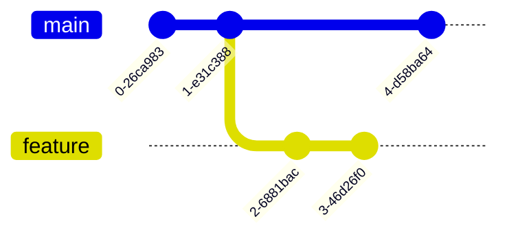

# Git Branch Switching

## Introduction

When working with Git, one of its most powerful features is the ability to create and manage multiple branches. Branches allow you to work on different features, bug fixes, or experiments simultaneously without affecting your main codebase. However, creating branches is only half the story - you also need to know how to switch between them efficiently.

In this guide, we'll learn how to navigate between branches in Git, understand the implications of switching, and explore some advanced techniques for managing your workflow.

## Understanding Git Branches

Before diving into branch switching, let's quickly review what branches are:

A branch in Git is simply a lightweight movable pointer to a commit. The default branch is called `main` (or `master` in older repositories). When you create a new branch, you're creating a new pointer to the current commit.



In the diagram above, we have:
- The `main` branch with 3 commits
- A `feature` branch that diverges after the second commit
- Two commits on the `feature` branch

## Basic Branch Switching

### Viewing Your Branches

Before switching branches, you might want to see what branches exist in your repository:

```bash
git branch
```

Output:
```
  feature
* main
  bugfix
```

The branch with an asterisk (`*`) is your current branch.

### Switching Branches with `git checkout`

The traditional command for switching branches is `git checkout`:

```bash
git checkout feature
```

Output:
```
Switched to branch 'feature'
```

This command changes your working directory to reflect the state of the `feature` branch.

### Switching Branches with `git switch`

Git version 2.23 introduced a new command specifically for branch switching called `git switch`. This offers a clearer syntax:

```bash
git switch feature
```

Output:
```
Switched to branch 'feature'
```

The `switch` command is now the preferred way to change branches as it's more intuitive and separates the concerns of branch switching from other `checkout` functionality.

## Creating and Switching in One Step

### With `checkout`

You can create a new branch and switch to it in a single command:

```bash
git checkout -b new-feature
```

Output:
```
Switched to a new branch 'new-feature'
```

### With `switch`

Similarly, with `git switch`:

```bash
git switch -c new-feature
```

Output:
```
Switched to a new branch 'new-feature'
```

## Handling Uncommitted Changes When Switching

When you try to switch branches with uncommitted changes, Git will prevent you from switching if those changes would be overwritten by the switch. Let's explore different scenarios:

### Scenario 1: Non-conflicting Changes

If your uncommitted changes don't conflict with the branch you're switching to, Git will allow the switch and carry your changes over:

```bash
# Make some changes to file.txt
git switch feature
```

Output:
```
Switched to branch 'feature'
```

Your changes to `file.txt` are preserved and carried to the `feature` branch.

### Scenario 2: Conflicting Changes

If your changes would be overwritten by switching branches:

```bash
# Make changes to a file that differs between branches
git switch feature
```

Output:
```
error: Your local changes to the following files would be overwritten by checkout:
        file.txt
Please commit your changes or stash them before you switch branches.
Aborting
```

In this case, you have several options:

1. **Commit your changes** to the current branch:
   ```bash
   git add file.txt
   git commit -m "Complete work on feature X"
   git switch feature
   ```

2. **Stash your changes** to apply them later:
   ```bash
   git stash
   git switch feature
   # Later, if you want to apply the changes
   git stash apply
   ```

3. **Discard your changes** if they're not needed:
   ```bash
   git restore file.txt  # or git checkout -- file.txt in older Git versions
   git switch feature
   ```

## Advanced Branch Switching Techniques

### Temporary Branch Switching with `git worktree`

If you need to quickly check something in another branch without committing or stashing your current work, you can use Git worktrees:

```bash
git worktree add ../temp-main main
```

This creates a new working directory at `../temp-main` with the `main` branch checked out, allowing you to browse that branch without disturbing your current work.

### Branch Switching with Specific File Restoration

Sometimes you want to switch branches but keep specific files from your current branch:

```bash
git switch feature -- file.txt
```

This will switch to the `feature` branch but restore `file.txt` from your current branch.

### Detached HEAD State

You can also checkout a specific commit instead of a branch, which puts you in a "detached HEAD" state:

```bash
git checkout a1b2c3d
```

Output:
```
Note: checking out 'a1b2c3d'.

You are in 'detached HEAD' state. You can look around, make experimental
changes and commit them, and you can discard any commits you make in this
state without impacting any branches by performing another checkout.
```

This is useful for examining old versions of your codebase, but be careful as commits made in this state may be lost if you don't create a branch from them.

## Real-World Application: Feature Branch Workflow

Let's walk through a common workflow that involves branch switching:

1. Start on the main branch and make sure it's up to date:
   ```bash
   git switch main
   git pull
   ```

2. Create and switch to a feature branch:
   ```bash
   git switch -c feature/user-authentication
   ```

3. Work on your feature, making commits as needed:
   ```bash
   # Make changes
   git add .
   git commit -m "Add login form"
   ```

4. While working on your feature, a critical bug is reported that needs immediate attention. Stash your current changes and switch to main:
   ```bash
   git stash
   git switch main
   git pull
   ```

5. Create and switch to a bugfix branch:
   ```bash
   git switch -c hotfix/critical-bug
   ```

6. Fix the bug and commit:
   ```bash
   # Fix bug
   git add .
   git commit -m "Fix critical bug in payment processing"
   ```

7. Push the bugfix and create a pull request (or merge directly if appropriate):
   ```bash
   git push -u origin hotfix/critical-bug
   ```

8. Switch back to your feature branch and restore your stashed changes:
   ```bash
   git switch feature/user-authentication
   git stash pop
   ```

9. Continue working on your feature.

This workflow demonstrates how branch switching enables you to manage priorities effectively without losing work.

## Common Issues and Solutions

### Issue: "Cannot switch branch due to local modifications"

**Solution**: Commit, stash, or discard your changes as described earlier.

### Issue: "Branch switching resulted in merge conflicts"

**Solution**: Resolve conflicts by editing the conflicted files, then:
```bash
git add <resolved-files>
git commit
```

### Issue: "Lost track of which branch I'm on"

**Solution**: Check your current branch with:
```bash
git branch
```
or for more detailed information:
```bash
git status
```

## Summary

Branch switching is a fundamental Git skill that allows you to navigate between different versions of your codebase. Here's what we covered:

- Basic branch switching with `git checkout` and `git switch`
- Creating and switching to new branches in one step
- Handling uncommitted changes when switching branches
- Advanced techniques like using worktrees and detached HEAD states
- A real-world workflow example showing how branch switching fits into daily development

By mastering branch switching, you'll be able to work on multiple features simultaneously, handle urgent bugs without disrupting your main work, and explore your project's history effectively.

## Additional Resources

- Practice branch switching with interactive tutorials like [Learn Git Branching](https://learngitbranching.js.org/)
- Read about Git's branching model in the [Pro Git book](https://git-scm.com/book/en/v2/Git-Branching-Branches-in-a-Nutshell)

## Exercises

1. Create a new Git repository, add a few files, and commit them
2. Create three different branches and make unique changes in each
3. Practice switching between branches and observe how your working directory changes
4. Try creating a situation with uncommitted changes, then practice stashing them to switch branches
5. Create a branch from a specific commit in your history, make some changes, and then merge it back to your main branch