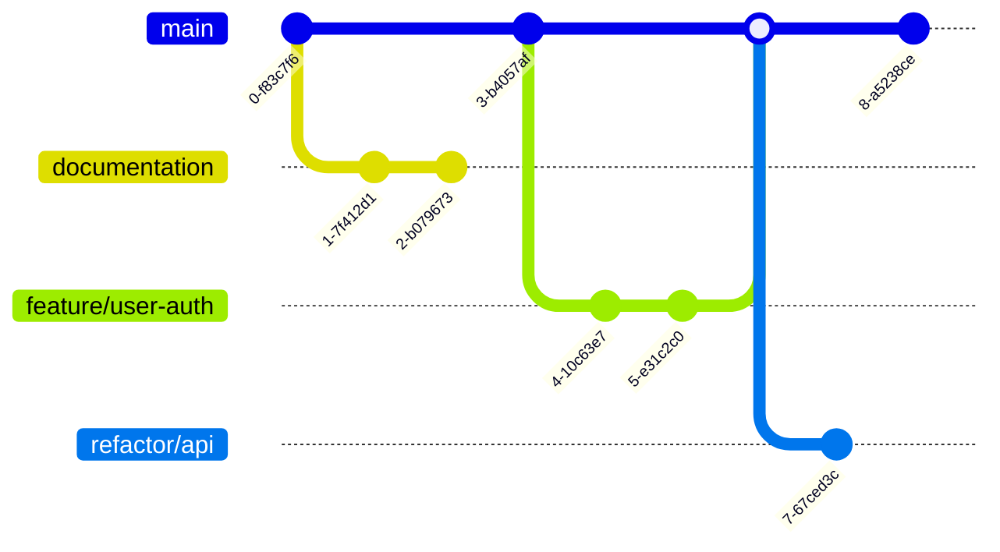

# Git Branch Listing

## Introduction

When working on a Git project, especially with a team, you'll often need to track multiple branches. Git provides several commands to list and manage these branches effectively. This guide will teach you how to view, filter, and sort branches in your Git repositories.

Branches in Git are lightweight, which means you can create many of them without significant performance impact. This makes them perfect for isolating features, bugfixes, or experiments. As your repository grows, knowing how to navigate these branches becomes essential.

## Basic Branch Listing

### The `git branch` Command

The most fundamental way to list branches is using the `git branch` command:

```bash
git branch
```

This command lists all local branches in your repository, with an asterisk (`*`) marking your current branch:

```
  documentation
  feature/user-auth
* main
  refactor/api
```

In this example, you're currently on the `main` branch.

## Viewing Remote Branches

To see branches that exist on remote repositories (like GitHub, GitLab, or Bitbucket), add the `-r` flag:

```bash
git branch -r
```

Output:

```
  origin/HEAD -> origin/main
  origin/documentation
  origin/feature/user-auth
  origin/main
  origin/refactor/api
```

## Viewing All Branches

To see both local and remote branches, use the `-a` flag:

```bash
git branch -a
```

Output:

```
  documentation
  feature/user-auth
* main
  refactor/api
  remotes/origin/HEAD -> origin/main
  remotes/origin/documentation
  remotes/origin/feature/user-auth
  remotes/origin/main
  remotes/origin/refactor/api
```

## Detailed Branch Information

### Viewing Last Commit on Each Branch

Add the `-v` flag to see the last commit on each branch:

```bash
git branch -v
```

Output:

```
  documentation   7d4c8e2 Update API documentation
  feature/user-auth 2e5d3a1 Add social login options
* main            9f4b8d7 Merge pull request #42
  refactor/api    1a2b3c4 Simplify error handling
```

For even more details, use `-vv` to show tracking information:

```bash
git branch -vv
```

Output:

```
  documentation   7d4c8e2 [origin/documentation] Update API documentation
  feature/user-auth 2e5d3a1 [origin/feature/user-auth: ahead 2] Add social login options
* main            9f4b8d7 [origin/main] Merge pull request #42
  refactor/api    1a2b3c4 [origin/refactor/api: behind 3] Simplify error handling
```

This shows that `feature/user-auth` is 2 commits ahead of its remote counterpart, while `refactor/api` is 3 commits behind.

## Filtering Branches

### Branches That Contain a Specific Commit

To find branches containing a specific commit:

```bash
git branch --contains a1b2c3d
```

This is helpful for tracking where a specific bug fix or feature has been applied.

### Merged and Unmerged Branches

View branches that have been merged into the current branch:

```bash
git branch --merged
```

View branches that haven't been merged yet:

```bash
git branch --no-merged
```

These commands help identify branches that can be safely deleted or require attention.

## Sorting Branches

Sort branches by the date of their most recent commit:

```bash
git branch --sort=-committerdate
```

Output:

```
* main
  feature/user-auth
  refactor/api
  documentation
```

The `-` before `committerdate` sorts from newest to oldest. Remove it to reverse the order.

## Branch Visualization

Sometimes a visual representation helps understand branch relationships. You can use Git's built-in graph visualization:

```bash
git log --graph --oneline --decorate --all
```

Or for a clearer diagram, we can use Mermaid:



## Real-World Examples

### Scenario 1: Finding Which Branches Contain a Bug Fix

Imagine you've fixed a critical bug with commit ID `abc1234`, and you need to ensure it's applied to all relevant branches:

```bash
# Find which branches already contain the fix
git branch --contains abc1234

# Find which branches still need the fix
git branch --no-contains abc1234
```

### Scenario 2: Cleaning Up Old Branches

After a product release, you might want to clean up your repository by removing obsolete branches:

```bash
# List merged branches that can be safely deleted
git branch --merged main | grep -v '^\*\|main\|master\|develop'

# Delete these branches (be careful!)
git branch --merged main | grep -v '^\*\|main\|master\|develop' | xargs git branch -d
```

This identifies branches that have been fully merged into `main` and are no longer needed.

### Scenario 3: Checking Team Progress

As a team lead, you might want to check which feature branches are being actively developed:

```bash
# Show all remote branches sorted by latest activity
git for-each-ref --sort=-committerdate refs/remotes/ --format='%(committerdate:short) %(refname:short) %(authorname)'
```

Output:

```
2023-07-15 origin/feature/user-profile Jane Smith
2023-07-12 origin/bugfix/login-error John Doe
2023-07-10 origin/main Team CI
2023-07-05 origin/feature/dark-mode Alex Johnson
```

## Common Issues and Solutions

### Too Many Branches

In large projects, `git branch -a` might return an overwhelming list. Narrow your focus:

```bash
# Search for branches containing specific keywords
git branch | grep "feature"

# List branches modified in the last 30 days
git for-each-ref --sort=-committerdate --format='%(refname:short)' --count=10 refs/heads/
```

### Deleted Remote Branches Still Showing Locally

Remote branches that have been deleted can still appear in your local listing:

```bash
# Prune deleted remote branches
git fetch --prune
```

## Summary

Git branch listing commands allow you to navigate and manage the branches in your repository efficiently. Mastering these commands helps you:

- Keep track of your work across multiple features or versions
- Coordinate with team members
- Maintain a clean and organized repository
- Identify which branches contain specific changes

As you become more comfortable with Git branching, you'll find these listing and filtering techniques indispensable for your daily workflow.

## Additional Resources

- Practice creating and listing branches in your own test repository
- Experiment with different filtering and sorting options
- Try these exercises:
  1. Create three branches, make different commits in each, then use branch listing to see the differences
  2. Use `git for-each-ref` to create a custom branch listing format
  3. Write a small script to identify stale branches that haven't been updated in more than 30 days

By mastering Git branch listing, you're taking an important step toward becoming proficient with Git's branching model, one of its most powerful features.