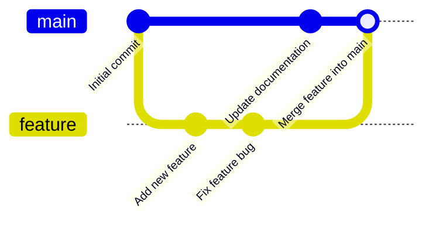

# Git Branch Merging

## Introduction

Branch merging is one of Git's most powerful features, allowing you to combine work from different branches. After developing a feature or fixing a bug in a separate branch, merging is how you incorporate those changes back into your main codebase.

In this tutorial, you'll learn:
- What merging is and why it's important
- Basic merge commands and workflows
- How to handle merge conflicts
- Best practices for successful merges

## Understanding Git Merges

Merging is the process of integrating changes from one branch into another. It's like taking the work you've done in isolation and incorporating it back into the main project.

Let's visualize a basic merge scenario:



In this diagram, we:
1. Created a feature branch from main
2. Made two commits in the feature branch
3. Made one commit in the main branch
4. Merged the feature branch back into main

## Basic Merge Commands

### Fast-Forward Merge

The simplest type of merge occurs when the target branch hasn't changed since you created your branch. Git simply "fast-forwards" the main branch to match your feature branch.

```bash
# Create and switch to a new feature branch
git checkout -b feature-x

# Make some changes and commit them
echo "New feature code" > feature.txt
git add feature.txt
git commit -m "Add feature X"

# Switch back to main
git checkout main

# Merge the feature branch into main (fast-forward)
git merge feature-x
```

Output:
```
Updating 3a4e6f7..8d2c3b1
Fast-forward
 feature.txt | 1 +
 1 file changed, 1 insertion(+)
 create mode 100644 feature.txt
```

### Three-Way Merge

When both branches have new commits, Git performs a "three-way merge" using:
1. The common ancestor commit
2. The latest commit in your current branch
3. The latest commit in the branch you're merging

```bash
# On the main branch
echo "Documentation update" > docs.txt
git add docs.txt
git commit -m "Update documentation"

# Now merge feature-x (which also has changes)
git merge feature-x
```

Output:
```
Merge made by the 'recursive' strategy.
 feature.txt | 1 +
 1 file changed, 1 insertion(+)
 create mode 100644 feature.txt
```

This creates a new "merge commit" that has two parent commits - one from each branch.

## Handling Merge Conflicts

Sometimes Git can't automatically merge changes because both branches modified the same parts of the same files. This is called a merge conflict.

### Example of a Merge Conflict

Let's create a conflict scenario:

```bash
# On main branch
echo "Line 1 - main version" > conflict.txt
git add conflict.txt
git commit -m "Add conflict.txt on main"

# Create and switch to feature branch
git checkout -b feature-y

# Modify the file in feature branch
echo "Line 1 - feature version" > conflict.txt
git add conflict.txt
git commit -m "Modify conflict.txt in feature"

# Switch back to main
git checkout main

# Try to merge
git merge feature-y
```

Output:
```
Auto-merging conflict.txt
CONFLICT (content): Merge conflict in conflict.txt
Automatic merge failed; fix conflicts and then commit the result.
```

### Resolving Conflicts

When you encounter a conflict, Git marks the problematic areas in the affected files:

```
<<<<<<< HEAD
Line 1 - main version
=======
Line 1 - feature version
>>>>>>> feature-y
```

To resolve:

1. Open the file and edit it to the desired final state
2. Remove the conflict markers (`<<<<<<< HEAD`, `=======`, `>>>>>>> feature-y`)
3. Save the file
4. Stage the resolved file and commit

```bash
# Edit the file to resolve the conflict
echo "Line 1 - resolved version" > conflict.txt

# Stage the resolved file
git add conflict.txt

# Complete the merge with a commit
git commit -m "Merge feature-y and resolve conflicts"
```

## Merge Strategies and Options

Git offers several merge strategies and options to help with different scenarios:

### --no-ff (No Fast-Forward)

Forces a merge commit even when a fast-forward merge would be possible:

```bash
git merge --no-ff feature-z
```

This is useful to maintain a record that a feature branch once existed.

### --squash

Combines all changes from the feature branch into a single commit:

```bash
git merge --squash feature-a
git commit -m "Add feature A"
```

This creates a cleaner history by consolidating all feature work into one commit.

## Practical Merge Workflow Examples

### Feature Branch Workflow

This is the most common merge workflow in team environments:

1. Create a branch for your feature/bugfix
2. Develop and test your changes
3. Keep your branch updated with the main branch
4. When complete, merge back to main

```bash
# Create feature branch
git checkout -b user-authentication

# Do work, make commits...

# Before merging, update from main to avoid conflicts
git checkout main
git pull
git checkout user-authentication
git merge main

# Fix any conflicts, then merge back to main
git checkout main
git merge user-authentication
git push
```

### Pull Request Workflow

In many teams, merges happen through pull requests:

1. Push your feature branch to the remote repository
2. Create a pull request (PR) through GitHub/GitLab/etc.
3. Code is reviewed and tested
4. When approved, the PR is merged (often using the web interface)

```bash
# After finishing your feature
git push -u origin user-authentication

# Then create a PR in your Git hosting platform
# Once approved, you can merge using their interface
# or manually from the command line
```

## Best Practices for Merging

1. **Always pull before merging**: Make sure your main branch is up-to-date before merging
2. **Test before and after merging**: Ensure your code works in both branches
3. **Keep branches short-lived**: The longer a branch exists, the harder it is to merge
4. **Communicate with your team**: Coordinate merges to avoid conflicts
5. **Use meaningful commit messages**: Especially for merge commits
6. **Consider using merge tools**: Tools like `meld`, `kdiff3`, or VS Code can help resolve complex conflicts

## Summary

Git branch merging is essential for collaborative development:

- Fast-forward merges move the branch pointer when there are no divergent changes
- Three-way merges create merge commits when both branches have changed
- Conflicts occur when changes overlap and must be manually resolved
- Different merge strategies (no-ff, squash) serve different project needs
- Consistent workflows help teams merge efficiently

## Additional Exercises

1. Create two branches, make different changes to the same file, and practice resolving the conflicts
2. Try different merge strategies (--no-ff, --squash) and observe how they affect your git log
3. Set up a small project with a teammate and practice the pull request workflow
4. Intentionally create a complex merge conflict involving multiple files and practice resolving it

## Further Resources

- [Git Documentation on Merging](https://git-scm.com/book/en/v2/Git-Branching-Basic-Branching-and-Merging)
- [Atlassian's Tutorial on Git Merge](https://www.atlassian.com/git/tutorials/using-branches/git-merge)
- [GitHub's Guide to Pull Requests](https://docs.github.com/en/github/collaborating-with-pull-requests)