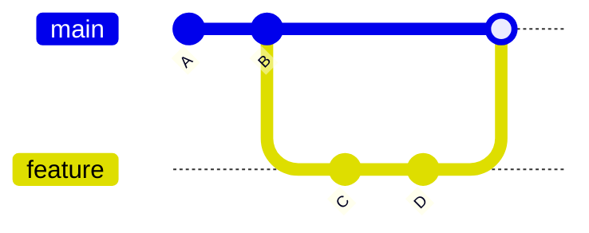
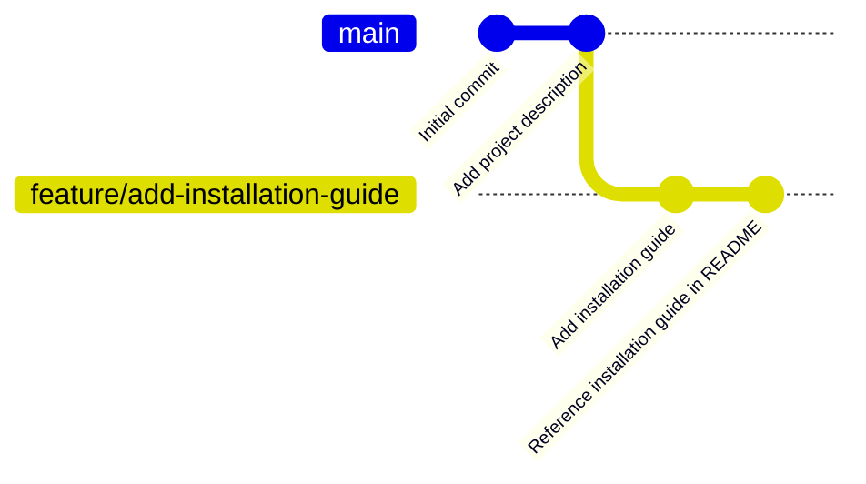
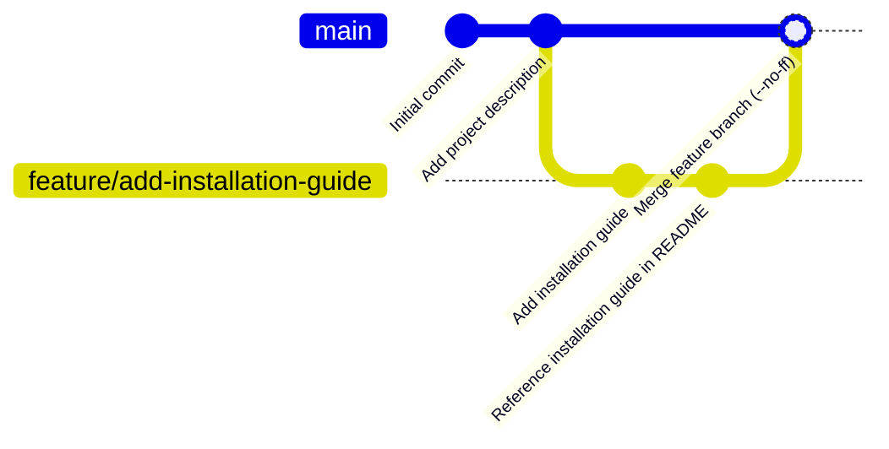

# Git Fast Forward

## Introduction

When working with Git, understanding different types of merges is essential for effective collaboration and version control. One of the most common and straightforward merge types is a **fast-forward merge**. This technique is fundamental to the Git branching workflow and helps maintain a clean project history.

A fast-forward merge occurs when Git can simply move your current branch pointer forward to the target branch pointer without creating an additional merge commit. This happens when there is a direct linear path from the source branch to the target branch.

## Understanding Fast-Forward Merges

### What is a Fast-Forward Merge?

A fast-forward merge is possible when the current branch hasn't diverged from the target branch. In simpler terms, if all the commits in your current branch are also in the branch you're merging into, Git will simply "fast-forward" the current branch to match the target branch.

Let's visualize this with a diagram:



In this diagram:
1. We start with commits A and B on the main branch
2. We create and checkout a feature branch
3. We make commits C and D on the feature branch
4. When we merge the feature branch back to main, Git can perform a fast-forward merge

### When Does a Fast-Forward Happen?

A fast-forward merge happens when:

- The branch you're on (typically `main` or `master`) hasn't changed since you created your feature branch
- There's a direct linear path from the current branch to the target branch

## Fast-Forward Merge in Practice

Let's walk through a practical example of a fast-forward merge:

### Example: Creating a New Feature

First, let's create a new repository and make some initial commits:

```bash
# Initialize a new repository
git init

# Create a file and make the first commit
echo "# My Project" > README.md
git add README.md
git commit -m "Initial commit"

# Add some more content
echo "This is a sample project to demonstrate Git fast-forward merges." >> README.md
git add README.md
git commit -m "Add project description"
```

Now let's create a feature branch and make some changes:

```bash
# Create and checkout a new feature branch
git checkout -b feature/add-installation-guide

# Create a new file for the installation guide
echo "# Installation Guide" > INSTALL.md
echo "1. Clone the repository" >> INSTALL.md
echo "2. Run npm install" >> INSTALL.md
git add INSTALL.md
git commit -m "Add installation guide"

# Update README to mention the installation guide
echo "" >> README.md
echo "See INSTALL.md for setup instructions." >> README.md
git add README.md
git commit -m "Reference installation guide in README"
```

At this point, our commit history looks like this:



Now let's merge our feature branch back to the main branch:

```bash
# Switch back to the main branch
git checkout main

# Merge the feature branch
git merge feature/add-installation-guide
```

The output will look something like this:

```
Updating a1b2c3d..e4f5g6h
Fast-forward
 INSTALL.md | 3 +++
 README.md  | 2 ++
 2 files changed, 5 insertions(+)
 create mode 100644 INSTALL.md
```

Notice the "Fast-forward" message in the output. This indicates that Git was able to perform a fast-forward merge because the main branch hadn't changed since we created our feature branch.

## Preventing Fast-Forward Merges

Sometimes you might want to prevent fast-forward merges to maintain a more detailed project history. You can do this using the `--no-ff` flag:

```bash
git merge --no-ff feature/add-installation-guide
```

This forces Git to create a merge commit even if a fast-forward merge would be possible:



The output will include a message about creating a merge commit:

```
Merge made by the 'recursive' strategy.
 INSTALL.md | 3 +++
 README.md  | 2 ++
 2 files changed, 5 insertions(+)
 create mode 100644 INSTALL.md
```

## Fast-Forward vs. Regular Merge

Let's compare fast-forward merges with regular (non-fast-forward) merges:

| Fast-Forward Merge | Regular Merge (--no-ff) |
|-------------------|------------------------|
| No new commit created | Creates a new merge commit |
| Linear history | Branch structure preserved in history |
| Simpler history | More detailed history |
| No record of feature branch existence | Branch structure visible in history |

## When to Use Fast-Forward Merges

Fast-forward merges are ideal when:

1. You want a clean, linear project history
2. The feature branch represents a small, focused change
3. You don't need to preserve the branch structure in the history

On the other hand, you might want to prevent fast-forward merges (with `--no-ff`) when:

1. You want to preserve the context that a feature branch existed
2. You're working with a significant feature that should be represented as a distinct unit in history
3. Your team's branching strategy requires explicit merge commits

## Common Git Commands for Fast-Forward Merges

Here are some common Git commands related to fast-forward merges:

```bash
# Perform a fast-forward merge (if possible)
git merge feature-branch

# Prevent fast-forward merge
git merge --no-ff feature-branch

# Check if a fast-forward merge is possible
git merge --no-commit --no-ff feature-branch
# If it's possible, abort with:
git merge --abort
```

## Real-World Workflow Example

In a typical development workflow:

1. **Start with the main branch**:
   ```bash
   git checkout main
   git pull
   ```

2. **Create a feature branch**:
   ```bash
   git checkout -b feature/user-authentication
   ```

3. **Make changes and commit them**:
   ```bash
   # Make changes to files
   git add .
   git commit -m "Implement user authentication"
   ```

4. **Push the feature branch** (optional, for collaboration):
   ```bash
   git push -u origin feature/user-authentication
   ```

5. **Merge back to main** (after the feature is complete and reviewed):
   ```bash
   git checkout main
   git pull  # Ensure main is up-to-date
   git merge feature/user-authentication
   git push  # Push the changes to the remote repository
   ```

If no one else has made changes to the main branch in the meantime, this will result in a fast-forward merge.

## Summary

Fast-forward merges are a simple but powerful feature in Git that allows for clean, linear history when merging branches. They occur when there's a direct linear path from the current branch to the target branch, and Git can simply "fast-forward" the current branch pointer.

Key takeaways:
- Fast-forward merges happen when the target branch hasn't changed since your branch was created
- They maintain a linear history without additional merge commits
- You can prevent fast-forward merges with the `--no-ff` flag if you want to preserve branch structure
- Fast-forward merges are ideal for simple, focused changes that don't need explicit representation in the history

## Additional Resources

- [Git Documentation on Basic Branching and Merging](https://git-scm.com/book/en/v2/Git-Branching-Basic-Branching-and-Merging)
- [Atlassian's Tutorial on Merging vs. Rebasing](https://www.atlassian.com/git/tutorials/merging-vs-rebasing)

## Practice Exercises

1. Create a new Git repository and practice creating a feature branch and performing a fast-forward merge.
2. Try the same exercise but use the `--no-ff` flag to see the difference in the commit history.
3. Use `git log --graph --oneline` to visualize the difference between fast-forward and non-fast-forward merges.
4. Create a scenario where a fast-forward merge is not possible (hint: make changes to the main branch after creating your feature branch).