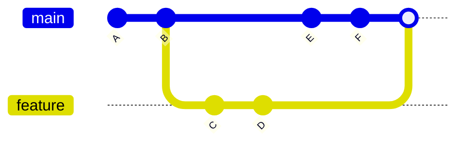

# Git Three-Way Merge

When working with Git, you'll frequently need to combine changes from different branches. Git's three-way merge is a powerful mechanism that intelligently resolves changes between branches. In this tutorial, we'll explore how three-way merges work, when they occur, and how to handle merge conflicts.

## What is a Three-Way Merge?

A three-way merge is Git's method for combining two different branch histories when they have diverged from a common base commit. Unlike a fast-forward merge (which simply moves the branch pointer forward), a three-way merge is necessary when both branches have new commits that the other doesn't contain.

The "three-way" refers to the three commits involved in the merge:
1. The common ancestor commit (base)
2. The commit at the tip of your current branch
3. The commit at the tip of the branch you're merging in

Git uses all three commits to determine the final state of your files.

## When Does Git Use a Three-Way Merge?

Git performs a three-way merge when:
- You run `git merge <branch>` to merge another branch into your current branch
- Both branches have diverged (have unique commits)
- A fast-forward merge isn't possible

## Visualizing a Three-Way Merge

Let's visualize how a three-way merge works:



In this diagram:
- Commit B is the common ancestor (base)
- Commits C and D were made on the feature branch
- Commits E and F were made on the main branch
- The final merge commit combines changes from both branches

## Three-Way Merge in Action

Let's walk through a practical example of a three-way merge:

### Step 1: Create and switch to a new branch

```bash
# Create a new branch and switch to it
git checkout -b feature-login
```

### Step 2: Make changes in your feature branch

```bash
# Edit files and make commits
echo "function login() { /* login code */ }" > login.js
git add login.js
git commit -m "Add login functionality"
```

### Step 3: Switch back to main and make different changes

```bash
# Switch to main branch
git checkout main

# Make different changes
echo "function register() { /* register code */ }" > register.js
git add register.js
git commit -m "Add registration functionality"
```

### Step 4: Merge the feature branch into main

```bash
git merge feature-login
```

Output:
```
Merge made by the 'recursive' strategy.
 login.js | 1 +
 1 file changed, 1 insertion(+)
 create mode 100644 login.js
```

In this example, Git performs a three-way merge because:
- Both branches (main and feature-login) have diverged from their common ancestor
- Each branch contains changes the other doesn't have
- Git creates a new merge commit to represent the combined changes

## Understanding the Merge Algorithm

When Git performs a three-way merge, it follows these steps:

1. **Identify the common ancestor**: Git finds the most recent commit that both branches share.

2. **Compare file states**: Git compares each file in the three commits:
   - Base version (common ancestor)
   - Your current branch version
   - The branch being merged in

3. **Apply non-conflicting changes automatically**:
   - If a file was modified in only one branch, Git applies those changes
   - If identical changes were made in both branches, Git applies the change once
   - If a file was added in one branch but not the other, Git includes the new file

4. **Detect conflicts**: If the same part of a file was modified differently in both branches, Git marks it as a conflict.

## Handling Merge Conflicts

Sometimes Git can't automatically resolve differences during a three-way merge, resulting in a merge conflict. Here's how to handle them:

### Example of a Merge Conflict

Let's say both branches modified the same line in a file called `utils.js`:

In the main branch:
```javascript
function formatDate(date) {
  return date.toLocaleDateString('en-US');
}
```

In the feature branch:
```javascript
function formatDate(date) {
  return date.toISOString().split('T')[0];
}
```

When you try to merge, Git will show:

```
Auto-merging utils.js
CONFLICT (content): Merge conflict in utils.js
Automatic merge failed; fix conflicts and then commit the result.
```

The conflicted file will contain markers:

```javascript
function formatDate(date) {
<<<<<<< HEAD
  return date.toLocaleDateString('en-US');
=======
  return date.toISOString().split('T')[0];
>>>>>>> feature
}
```

### Resolving Merge Conflicts

Follow these steps to resolve a merge conflict:

1. **Open the conflicted files**: Look for the conflict markers (`<<<<<<<`, `=======`, `>>>>>>>`)

2. **Edit the files to resolve conflicts**: Choose one version or create a new combined version

3. **Remove the conflict markers**: Delete the `<<<<<<<`, `=======`, and `>>>>>>>` lines

4. **Add the resolved files**:
   ```bash
   git add utils.js
   ```

5. **Complete the merge by committing**:
   ```bash
   git commit -m "Merge feature branch, resolve date formatting conflict"
   ```

## Best Practices for Three-Way Merges

To make three-way merges smoother:

1. **Merge frequently**: Regular merges from the main branch into your feature branch reduce the likelihood of major conflicts.

2. **Communicate with your team**: If multiple people are working on the same files, coordinate changes.

3. **Use meaningful commit messages**: Clear commit messages help understand the purpose of changes when resolving conflicts.

4. **Test after merging**: Always verify that your code works correctly after a merge.

5. **Use merge tools**: Visual merge tools can make conflict resolution easier. Configure Git to use your preferred tool:
   ```bash
   git config --global merge.tool meld
   ```

## Alternatives to Three-Way Merge

Git offers alternatives to the standard three-way merge:

### Rebase

Instead of merging, you can rebase your branch on top of the target branch:

```bash
git checkout feature
git rebase main
```

Rebasing rewrites your commit history by replaying your changes on top of the target branch, resulting in a linear history without merge commits.

### Squash Merge

A squash merge combines all changes from your feature branch into a single commit:

```bash
git checkout main
git merge --squash feature
git commit -m "Add feature X"
```

This approach simplifies history but loses the individual commits from the feature branch.

## Summary

Git's three-way merge is a powerful mechanism for combining divergent branch histories. It:
- Uses three commits (base, current, and merging) to determine the final state
- Automatically resolves most changes
- Creates a merge commit to represent the combined histories
- Identifies conflicts when it can't automatically determine the correct result

Understanding how three-way merges work helps you manage your Git projects effectively and handle merge conflicts confidently.

## Exercises

1. Create two branches that modify different files, then merge them. Note how Git creates a merge commit.

2. Create two branches that modify the same file but different lines, then merge them. Note how Git automatically resolves this.

3. Create two branches that modify the same line in a file, then merge them. Practice resolving the conflict.

4. Try using the `git merge --abort` command to cancel a merge with conflicts.

5. Compare a three-way merge with rebasing by experimenting with both approaches on the same branches.

## Additional Resources

- [Git Merge Documentation](https://git-scm.com/docs/git-merge)
- [Pro Git Book: Basic Branching and Merging](https://git-scm.com/book/en/v2/Git-Branching-Basic-Branching-and-Merging)
- [Git Merge vs Rebase](https://git-scm.com/book/en/v2/Git-Branching-Rebasing)