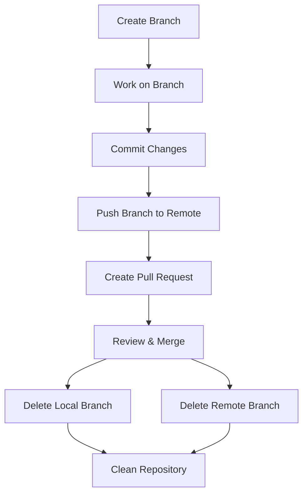

# Git Branch Deletion

## Introduction

As you work with Git, you'll create many branches for different features, bug fixes, and experiments. Over time, these branches can accumulate and clutter your repository. Once you've merged your changes into the main branch (often called `main` or `master`), it's good practice to delete the branches you no longer need.

In this tutorial, you'll learn:
- Why deleting old branches is important
- How to delete local branches
- How to delete remote branches
- Safety considerations when deleting branches
- Best practices for branch management

## Why Delete Branches?

Before diving into the how, let's understand why branch deletion is important:

1. **Repository Cleanliness**: Fewer branches mean a cleaner, more manageable repository
2. **Reduced Confusion**: Eliminates outdated or obsolete branches that could confuse team members
3. **Focus**: Helps keep focus on active work
4. **Performance**: While Git is efficient with many branches, reducing their number can improve performance in some operations

## Checking Your Branches

Before deleting branches, you should know which branches exist in your repository:

```bash
# List all local branches
git branch

# List all branches, including remote branches
git branch -a

# List branches that have been merged into the current branch
git branch --merged

# List branches that haven't been merged yet
git branch --no-merged
```

The current branch will be indicated with an asterisk (*).

## Deleting Local Branches

### Basic Branch Deletion

To delete a local branch that has been fully merged:

```bash
git branch -d branch-name
```

For example:

```bash
git branch -d feature/login-page
```

Output:
```
Deleted branch feature/login-page (was a1b2c3d).
```

### Force Deletion

If the branch contains changes that haven't been merged, Git will protect you from accidentally deleting it:

```bash
git branch -d unmerged-branch
```

Output:
```
error: The branch 'unmerged-branch' is not fully merged.
If you are sure you want to delete it, run 'git branch -D unmerged-branch'.
```

To force delete a branch regardless of its merge status:

```bash
git branch -D branch-name
```

For example:

```bash
git branch -D experimental-feature
```

Output:
```
Deleted branch experimental-feature (was e4f5g6h).
```

:::caution
Be careful with the `-D` option. It will delete the branch and all its commits that haven't been merged elsewhere, potentially losing work forever!
:::

## Deleting Remote Branches

To delete a branch on a remote repository:

```bash
git push origin --delete branch-name
```

Or the shorter syntax:

```bash
git push origin :branch-name
```

For example:

```bash
git push origin --delete feature/signup-form
```

Output:
```
To https://github.com/username/repository.git
 - [deleted]         feature/signup-form
```

## Practical Examples

### Example 1: Feature Branch Workflow

Let's walk through a common scenario where you create a feature branch, complete your work, and then clean up:

```bash
# Create and switch to a new feature branch
git checkout -b feature/user-authentication

# Make changes, commit them
# ... work on files ...
git add .
git commit -m "Implement user authentication"

# Push to remote
git push origin feature/user-authentication

# Later, after code review, merge to main
git checkout main
git pull
git merge feature/user-authentication

# Delete the local branch
git branch -d feature/user-authentication

# Delete the remote branch
git push origin --delete feature/user-authentication
```

### Example 2: Cleaning Up Multiple Merged Branches

You can use this script to delete all local branches that have been fully merged into the main branch:

```bash
# Switch to main branch
git checkout main

# Make sure main is up to date
git pull

# Delete all local branches that have been merged to main
git branch --merged | grep -v "\\*\\|main\\|master" | xargs -n 1 git branch -d
```

This command:
1. Lists all merged branches
2. Filters out the current branch and main/master
3. Deletes each remaining branch

## Branch Deletion Best Practices

1. **Always ensure changes are merged first** unless you deliberately want to discard work
2. **Pull the latest changes** from the remote before deleting branches
3. **Double-check the branch name** before deleting
4. **Use `-d` instead of `-D`** when possible for the safety check
5. **Communicate with your team** before deleting shared branches

## Recovering Deleted Branches

If you accidentally delete a branch, you can often recover it using the commit hash:

```bash
# Find the hash of the branch's last commit
git reflog

# Create a new branch pointing to that commit
git checkout -b recovered-branch commit-hash
```

For example:

```bash
git reflog
# output shows: a1b2c3d HEAD@{5}: commit: Last commit on deleted branch

git checkout -b recovered-branch a1b2c3d
```

## Visualizing Branch Management

Let's visualize the branch lifecycle with a diagram:



## Summary

Managing branches by deleting them when they're no longer needed is an important part of a healthy Git workflow. In this tutorial, you've learned:

- How to delete local branches with `git branch -d` and `git branch -D`
- How to delete remote branches with `git push origin --delete`
- Safety considerations and best practices
- How to recover accidentally deleted branches

By regularly cleaning up your branches, you'll maintain a cleaner, more manageable repository that's easier for you and your team to work with.

## Additional Exercises

1. Create a new branch, make some changes, and practice deleting it locally.
2. Create a branch, push it to a remote repository, and practice deleting it remotely.
3. Write a script that automatically cleans up old branches that have been merged.
4. Practice recovering a deleted branch using `git reflog`.

## Further Reading

- [Git documentation on branches](https://git-scm.com/book/en/v2/Git-Branching-Branch-Management)
- [Effective Git branching strategies](https://nvie.com/posts/a-successful-git-branching-model/)
- [Git workflow best practices](https://www.atlassian.com/git/tutorials/comparing-workflows)