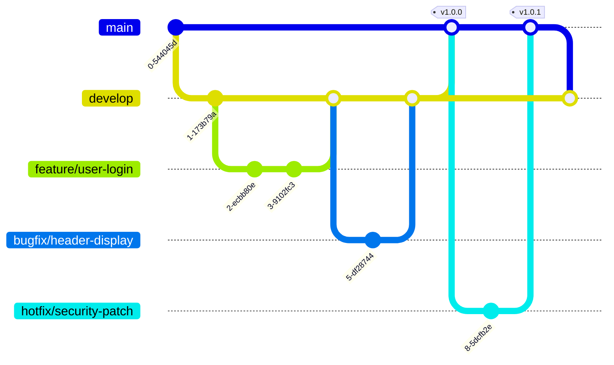

# Git Branch Naming

## Introduction

When working with Git, branches serve as independent lines of development that allow you to work on features, fixes, and experiments without affecting your main codebase. While Git gives you complete freedom to name your branches however you want, following consistent naming conventions is crucial for maintaining an organized repository, especially when collaborating with others.

Good branch naming makes it easier to:
- Identify the purpose of a branch at a glance
- Understand branch relationships
- Automate workflows with CI/CD systems
- Maintain project history clarity

In this guide, we'll explore common branch naming conventions, best practices, and examples to help you establish an efficient branching strategy.

## Basic Branch Naming Structure

Most effective branch naming conventions follow this general pattern:

```
type/description
```

Where:
- `type`: Indicates the kind of work being done (feature, bugfix, etc.)
- `description`: Brief explanation of the work, often with a reference ID

Let's look at the commonly used branch types and how to structure your branch names effectively.

## Common Branch Types

### Main Branches

Every Git repository typically has at least one persistent branch:

```bash
main    # or master (in older repositories)
develop # (optional, used in some workflows)
```

The `main` branch (historically called `master`) represents your production-ready code. Some teams also maintain a `develop` branch as an integration branch for features before they reach production.

### Feature Branches

For new features, use the prefix `feature/` or `feat/`:

```bash
feature/user-authentication
feature/shopping-cart
feature/JIRA-123-add-payment-gateway
```

### Bug Fix Branches

For fixing bugs, use the prefix `bugfix/`, `fix/`, or `hotfix/`:

```bash
bugfix/login-error
fix/calculation-error
hotfix/security-vulnerability
```

:::note
`hotfix` is often reserved for urgent fixes applied directly to the production branch.
:::

### Release Branches

For preparing releases, use the prefix `release/`:

```bash
release/v1.0.0
release/2023-Q1
```

### Other Common Types

Other useful prefixes include:

```bash
docs/update-readme
test/improve-unit-tests
refactor/clean-authentication
chore/update-dependencies
style/format-css-files
perf/optimize-database-queries
```

## Naming Conventions Best Practices

### 1. Use Lowercase Letters

Branch names should ideally use lowercase letters to avoid case-sensitivity issues across different operating systems:

```bash
# Good
feature/add-login

# Avoid
Feature/Add-Login
```

### 2. Use Hyphens or Underscores as Separators

For multi-word descriptions, use hyphens or underscores consistently:

```bash
# Using hyphens
feature/add-user-authentication

# Using underscores
feature/add_user_authentication
```

Pick one style and stick with it throughout your project.

### 3. Be Descriptive but Concise

Branch names should be meaningful but not excessively long:

```bash
# Too vague
feature/update

# Too long
feature/implement-user-authentication-system-with-oauth2-and-email-verification

# Just right
feature/oauth2-authentication
```

### 4. Include Issue/Ticket References

If you use an issue tracking system, include the issue ID in your branch name:

```bash
feature/JIRA-123-user-login
bugfix/GH-456-fix-memory-leak
```

This creates an automatic reference between your code and the related task.

## Practical Examples

Let's look at some real-world examples of good branch naming:

### Example 1: E-commerce Website

```
main
develop
feature/product-search
feature/GH-42-shopping-cart
bugfix/checkout-error
hotfix/security-patch-login
release/v2.1.0
docs/api-documentation
```

### Example 2: Mobile App Development

```
main
develop
feature/JIRA-101-push-notifications
feature/offline-mode
bugfix/APP-202-crash-on-startup
release/v3.5.0
test/notification-unit-tests
```

## Visualizing Branch Structure

Here's a simple visualization of a typical Git branching model:



## Team Conventions

When working with a team, it's important to document your branch naming conventions in your project's README or CONTRIBUTING guide. Here's an example of what that might look like:

```markdown
## Branch Naming Convention

- Feature branches: `feature/issue-id-short-description`
- Bug fixes: `bugfix/issue-id-short-description`
- Hotfixes: `hotfix/issue-id-short-description`
- Release branches: `release/version-number`
- Documentation: `docs/short-description`
```

## Practical Exercise

Try these exercises to practice branch naming:

1. Create a branch for adding a login feature with GitHub authentication
2. Create a branch for fixing a bug where user profiles don't display correctly
3. Create a branch for preparing the 2.0.0 release
4. Create a branch for updating the README with installation instructions

<details>
<summary>Solution</summary>

```bash
git checkout -b feature/github-authentication
git checkout -b bugfix/profile-display-error
git checkout -b release/v2.0.0
git checkout -b docs/installation-instructions
```
</details>

## Common Mistakes to Avoid

- **Using spaces** in branch names (use hyphens or underscores instead)
- **Creating extremely long** branch names
- **Using uppercase** letters (can cause issues on case-sensitive file systems)
- **Not following** team conventions
- **Creating branches without context** (vague names like "fix" or "update")

## Automated Branch Naming

Some teams use git hooks or tools to enforce branch naming conventions. Here's a simple pre-commit hook example that checks branch names:

```bash
#!/bin/sh
# .git/hooks/pre-commit

branch_name=$(git symbolic-ref --short HEAD)
valid_pattern="^(feature|bugfix|hotfix|release|docs|test|refactor|chore)/[a-z0-9-_]+$"

if ! echo "$branch_name" | grep -Eq "$valid_pattern"; then
  echo "ERROR: Branch name '$branch_name' doesn't follow the naming convention."
  echo "Branch names should match: $valid_pattern"
  exit 1
fi
```

## Summary

Effective branch naming is a simple but powerful way to improve team collaboration and repository organization. By following established conventions and being consistent, you make your Git workflow more efficient and your project history more understandable.

Key takeaways:
- Use a `type/description` format
- Be consistent with separators (hyphens or underscores)
- Include issue references when applicable
- Keep names descriptive but concise
- Document your conventions for team reference

## Additional Resources

- [Pro Git Book: Branching Basics](https://git-scm.com/book/en/v2/Git-Branching-Branches-in-a-Nutshell)
- [Atlassian Git Tutorial: Branching](https://www.atlassian.com/git/tutorials/using-branches)
- [GitHub Flow Guide](https://guides.github.com/introduction/flow/)

## Next Steps

Now that you understand branch naming conventions, you're ready to learn about branch management strategies like GitFlow, GitHub Flow, and trunk-based development in our next lessons.