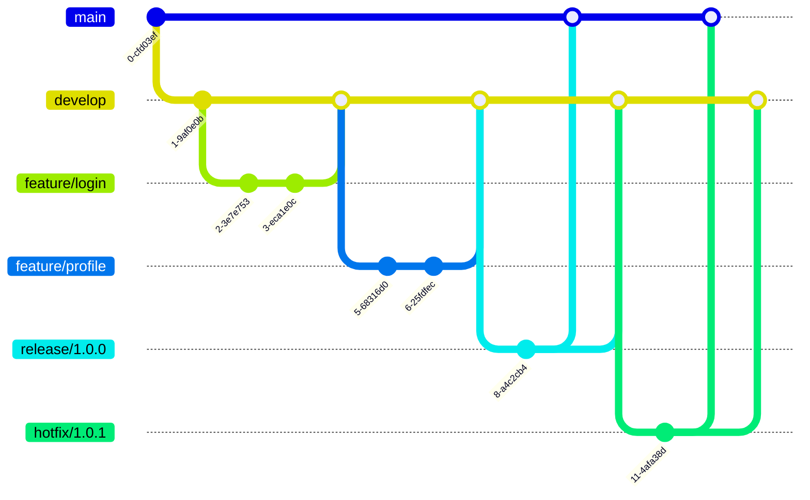

# Git Branch Strategy

## Introduction

A Git branch strategy is a set of rules that developers follow when using branches in a Git repository. It defines how, when, and why branches should be created and managed throughout the development lifecycle. A well-defined branch strategy helps teams collaborate effectively, maintain clean code, and deploy with confidence.

In this guide, we'll explore different branching strategies, their pros and cons, and how to implement them in your projects.

## Why Do You Need a Branch Strategy?

When you're working alone on a small project, you might get by without a formal branch strategy. But as soon as you start collaborating with others or working on larger projects, having a clear strategy becomes essential. Here's why:

- **Prevents code conflicts**: Reduces the likelihood of developers stepping on each other's toes
- **Keeps production code stable**: Isolates unstable code from your main codebase
- **Streamlines releases**: Makes it easier to manage feature releases and hotfixes
- **Improves code quality**: Facilitates code reviews and testing before integration
- **Documents workflows**: Helps new team members understand the development process

## Common Branch Types

Before diving into specific strategies, let's understand the common types of branches you'll encounter:

### Main/Master Branch

This is your primary branch that contains production-ready code. Some key characteristics:

- Always deployable
- Protected from direct commits (typically)
- Represents what's in production

```bash
# Check out the main branch
git checkout main

# View the commit history of the main branch
git log --oneline
```

### Feature Branches

Used to develop new features isolated from the main codebase:

- Created from the main or development branch
- Merged back when feature is complete
- Usually named with a prefix like `feature/`

```bash
# Create a new feature branch
git checkout -b feature/user-authentication

# Work on your feature
# ... make changes and commits ...

# Push your feature branch to the remote repository
git push -u origin feature/user-authentication
```

### Hotfix Branches

For urgent fixes to production code:

- Created from the main branch
- Merged back to both main and development branches
- Named with a prefix like `hotfix/`

```bash
# Create a hotfix branch from main
git checkout main
git checkout -b hotfix/critical-security-fix

# Make the fix
# ... fix the bug and commit ...

# Merge back to main
git checkout main
git merge hotfix/critical-security-fix
```

### Release Branches

Used to prepare for a production release:

- Created when features are ready for release
- Only bug fixes, documentation, and release-oriented tasks
- Named with a prefix like `release/`

## Popular Branching Strategies

Let's explore some widely adopted branching strategies:

### Git Flow

Git Flow is a robust branching model designed by Vincent Driessen in 2010. It defines specific branch roles and how they interact.

#### Core Branches

- **main/master**: Represents production code
- **develop**: Integration branch for features

#### Supporting Branches

- **feature/**: For new features
- **hotfix/**: For urgent production fixes
- **release/**: For release preparation

#### Workflow Visualization



#### Pros of Git Flow

- Well-structured and documented
- Supports parallel development
- Clear separation between in-progress and production code
- Supports multiple versions in production

#### Cons of Git Flow

- Complex for small projects
- Can create long-lived branches
- Overhead for teams with continuous deployment

#### Implementation Example

```bash
# Initialize Git Flow in your repository
git flow init

# Start a new feature
git flow feature start user-signup

# ... work on the feature ...

# Finish the feature (merges to develop)
git flow feature finish user-signup

# Start a release
git flow release start 1.0.0

# ... prepare the release (version bumps, docs) ...

# Finish the release (merges to main and develop)
git flow release finish 1.0.0
```

### GitHub Flow

GitHub Flow is a simpler alternative to Git Flow, focused on continuous delivery. It was designed by GitHub for their own development process.

#### Core Concept

- **main**: Always deployable
- Feature branches created directly from main
- Pull requests for code review
- Merge to main and deploy immediately

#### Workflow Visualization


#### Pros of GitHub Flow

- Simple and easy to understand
- Perfect for continuous deployment
- Less overhead
- Clear connection between branches and work items

#### Cons of GitHub Flow

- Less structured for release management
- Doesn't easily support multiple production versions
- Requires strong testing automation

#### Implementation Example

```bash
# Create a descriptive branch from main
git checkout main
git pull
git checkout -b improve-search-algorithm

# ... make changes and commits ...

# Push your branch and create a pull request
git push -u origin improve-search-algorithm

# After review and approval, merge and deploy
# (typically done through the GitHub interface)
```

### Trunk-Based Development

Trunk-Based Development focuses on keeping branches short-lived and merging frequently to a single "trunk" (usually main).

#### Core Concept

- Everyone commits to the main branch or short-lived feature branches
- Feature flags used to hide incomplete features
- Extremely short-lived branches (1-2 days max)

#### Workflow Visualization


#### Pros of Trunk-Based Development

- Minimizes merge conflicts
- Continuous integration by default
- Simplifies processes
- Encourages small, incremental changes

#### Cons of Trunk-Based Development

- Requires strong testing culture
- May be challenging for larger features
- Requires feature flagging for incomplete work

#### Implementation Example

```bash
# Pull the latest from main
git checkout main
git pull

# Create a short-lived branch
git checkout -b add-sorting-feature

# ... make small, focused changes ...

# Merge back to main quickly (ideally same day)
git checkout main
git merge add-sorting-feature

# Or use pull requests for team review
git push -u origin add-sorting-feature
# (Create PR and merge after review)
```

## Choosing the Right Strategy

The best branching strategy depends on several factors:

### Consider Your Team Size

- **Small teams (1-5 developers)**: GitHub Flow or Trunk-Based Development
- **Medium teams (5-20 developers)**: GitHub Flow or a simplified Git Flow
- **Large teams (20+ developers)**: Git Flow or a customized strategy

### Consider Your Release Cadence

- **Continuous deployment**: GitHub Flow or Trunk-Based Development
- **Scheduled releases**: Git Flow
- **Multiple supported versions**: Git Flow

### Consider Your Product Type

- **Web applications**: GitHub Flow or Trunk-Based Development
- **Desktop/mobile applications**: Git Flow
- **Libraries/frameworks**: Git Flow or a customized strategy

## Implementing Your Branch Strategy

Once you've chosen a strategy, follow these steps to implement it:

1. **Document the workflow**: Create clear documentation explaining the strategy
2. **Configure your repository**:
   - Set up branch protection rules
   - Configure automated testing
   - Set up required reviews

```bash
# Example: Protecting your main branch with Git hooks
# Create a pre-push hook in .git/hooks/pre-push

#!/bin/sh
protected_branch='main'
current_branch=$(git symbolic-ref HEAD | sed -e 's,.*/\(.*\),\1,')

if [ $current_branch = $protected_branch ]; then
   echo "Direct push to $protected_branch branch is not allowed!"
   exit 1
fi
exit 0
```

3. **Train your team**: Ensure everyone understands the workflow
4. **Set up automation**: Use CI/CD pipelines to enforce the strategy

## Best Practices

Regardless of which strategy you choose, these practices will help:

### Branch Naming Conventions

Use descriptive, consistent naming:

- `feature/add-login-page`
- `bugfix/fix-header-alignment`
- `hotfix/security-vulnerability`
- `release/v1.2.0`

### Commit Messages

Write clear, structured commit messages:

```
feat: add password reset functionality

- Create reset password form component
- Add API endpoint for password reset
- Connect form to API
- Add email notification

Closes #123
```

### Code Reviews

Always review code before merging to main branches:

- Use pull/merge requests
- Set up required reviewers
- Use code quality checks

### Keep Branches Updated

Regularly update your branches to minimize conflicts:

```bash
# Update your feature branch with changes from main
git checkout feature/my-feature
git fetch origin
git rebase origin/main

# Or merge approach
git merge origin/main
```

## Example Workflow: Feature Development with GitHub Flow

Let's walk through a complete example of developing a feature using GitHub Flow:

1. **Create a new branch**:
   ```bash
   git checkout main
   git pull
   git checkout -b feature/search-improvements
   ```

2. **Develop your feature**:
   ```bash
   # Make changes to the search functionality
   touch search-utils.js
   # ... edit files ...
   git add .
   git commit -m "Add fuzzy search utility functions"
   
   # Continue development with more commits
   # ... edit more files ...
   git add .
   git commit -m "Implement autocomplete dropdown"
   ```

3. **Push your branch**:
   ```bash
   git push -u origin feature/search-improvements
   ```

4. **Create a pull request** through GitHub's interface

5. **Address review feedback**:
   ```bash
   # Make requested changes
   # ... edit files ...
   git add .
   git commit -m "Fix search results styling per review"
   git push
   ```

6. **Merge the pull request** once approved (through GitHub interface)

7. **Delete the branch** after merging:
   ```bash
   git checkout main
   git pull
   git branch -d feature/search-improvements
   ```

## Handling Common Situations

### Resolving Merge Conflicts

When Git can't automatically merge your changes:

```bash
# When you get a conflict during merge
git merge feature/other-branch
# CONFLICT detected in file.js

# Edit the file to resolve conflicts
# Look for <<<<<<< HEAD ... ======= ... >>>>>>> markers

# After editing, mark as resolved
git add file.js
git commit -m "Merge feature/other-branch and resolve conflicts"
```

### Abandoning a Feature

If you need to discard a feature branch:

```bash
# Switch back to main
git checkout main

# Delete the local branch
git branch -D feature/abandoned-idea

# If pushed, delete the remote branch too
git push origin --delete feature/abandoned-idea
```

### Cherry-Picking Commits

Taking specific commits from one branch to another:

```bash
# Identify the commit to cherry-pick
git log feature/complex-feature --oneline

# Cherry-pick that commit to your current branch
git cherry-pick a1b2c3d
```

## Summary

A well-defined Git branch strategy is crucial for effective collaboration in software development. We've explored several popular approaches:

- **Git Flow**: Structured, with dedicated branches for specific purposes
- **GitHub Flow**: Simpler, focused on continuous deployment
- **Trunk-Based Development**: Minimalist, with short-lived branches

The best strategy for your team depends on your project size, release cadence, and development culture.

Remember that while branching strategies provide structure, they should serve your team's needs, not become a burden. Start with a simple approach and adjust as needed.

## Additional Resources

- [Pro Git Book](https://git-scm.com/book/en/v2) - Free comprehensive Git documentation
- [Git Flow Cheatsheet](https://danielkummer.github.io/git-flow-cheatsheet/) - Quick reference for Git Flow commands
- [GitHub Flow Guide](https://guides.github.com/introduction/flow/) - Official GitHub Flow documentation
- [Learn Git Branching](https://learngitbranching.js.org/) - Interactive tool to practice Git branching

## Exercises

1. Initialize a Git Flow setup in a new repository and practice creating feature, release, and hotfix branches.
2. Take an existing project and refactor its branch structure to follow GitHub Flow.
3. Practice resolving merge conflicts by intentionally creating conflicting changes in two branches.
4. Create a diagram of your own custom branch strategy that fits a specific project's needs.
5. Set up branch protection rules for a repository to enforce your chosen strategy.