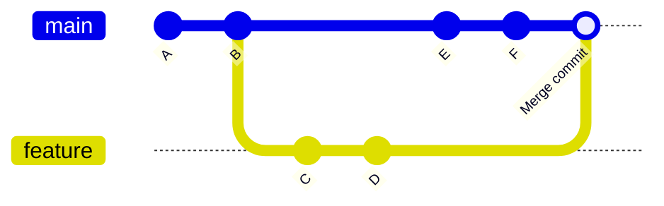
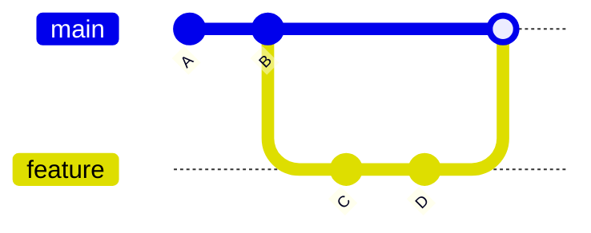
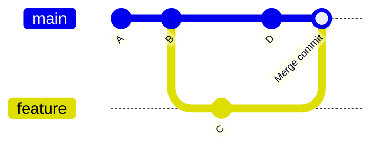

# Git Merge Basics

## Introduction

Merging is one of the most important operations in Git. It allows you to combine work from different branches, integrating changes from one branch into another. Understanding how merging works is essential for effective collaboration in software development.

In this guide, we'll explore the fundamentals of Git merge operations, including different types of merges, how to resolve conflicts, and best practices to follow when merging branches.

## What is a Git Merge?

A merge in Git is an operation that combines multiple sequences of commits into one unified history. Most commonly, you'll use merging to incorporate changes from one branch into another. 

When you merge a branch, Git tries to automatically integrate the changes. The resulting commit (known as a "merge commit") has two parent commits—one from each branch being merged.



## Types of Git Merges

Git performs two main types of merges depending on the branch structure:

### 1. Fast-Forward Merge

A fast-forward merge occurs when the branch you're merging into has no new commits since the branch you're merging from was created. In this case, Git simply "fast forwards" the branch pointer.



#### Example:

```bash
# Start with the main branch
git checkout main

# Create and checkout a new feature branch
git checkout -b feature

# Make changes and commit them
echo "New feature code" > feature.txt
git add feature.txt
git commit -m "Add new feature"

# Go back to main and merge the feature branch
git checkout main
git merge feature
```

Output:
```
Updating abc1234..def5678
Fast-forward
 feature.txt | 1 +
 1 file changed, 1 insertion(+)
 create mode 100644 feature.txt
```

### 2. Three-Way Merge (Recursive Merge)

A three-way merge happens when the branch you're merging into has new commits that the branch you're merging from doesn't have. Git creates a new "merge commit" that has two parents.



#### Example:

```bash
# Start with the main branch
git checkout main

# Create and checkout a new feature branch
git checkout -b feature

# Make changes and commit them
echo "New feature code" > feature.txt
git add feature.txt
git commit -m "Add new feature"

# Go back to main and make different changes
git checkout main
echo "Main branch updates" > main-updates.txt
git add main-updates.txt
git commit -m "Updates on main branch"

# Now merge the feature branch into main
git merge feature
```

Output:
```
Merge made by the 'recursive' strategy.
 feature.txt | 1 +
 1 file changed, 1 insertion(+)
 create mode 100644 feature.txt
```

## Basic Merge Commands

Let's look at the basic commands for merging branches:

### Merging a Branch

To merge changes from a source branch into your current branch:

```bash
git merge <source-branch>
```

For example, to merge a feature branch into main:

```bash
git checkout main
git merge feature
```

### Creating a Merge Commit with a Message

You can specify a custom commit message for the merge:

```bash
git merge <source-branch> -m "Merge branch 'feature' with new functionality"
```

### Merge with No Fast-Forward

Sometimes you might want to create a merge commit even when a fast-forward merge is possible:

```bash
git merge --no-ff <source-branch>
```

This creates a merge commit regardless of whether a fast-forward merge was possible, which can be useful for maintaining a clear record of feature branch history.

## Handling Merge Conflicts

Sometimes Git can't automatically merge changes because there are conflicting modifications to the same parts of files. When this happens, you'll need to resolve the conflicts manually.

### What Are Merge Conflicts?

Merge conflicts occur when competing changes are made to the same line of a file, or when one person edits a file and another person deletes it.

### Steps to Resolve Conflicts

When a merge conflict occurs, Git will pause the merge process and mark the conflicting areas in the affected files:

```
<<<<<<< HEAD
Changes from the current branch
=======
Changes from the branch being merged
>>>>>>> feature
```

Here's how to resolve conflicts:

1. **Identify conflicted files**: Run `git status` to see which files have conflicts.
2. **Open the conflicted files**: Edit the files to resolve the conflicts.
3. **Choose which changes to keep**: Remove the conflict markers and edit the content to include the correct changes.
4. **Mark as resolved**: After editing, add the resolved files with `git add <filename>`.
5. **Complete the merge**: Run `git commit` to create the merge commit.

#### Example of resolving a conflict:

```bash
# Start with a conflict
git merge feature
# CONFLICT: Merge conflict in file.txt

# Edit the file to resolve conflicts
# Then mark as resolved
git add file.txt

# Complete the merge
git commit
```

## Practical Examples

Let's walk through some common scenarios where merging is used:

### Example 1: Merging a Completed Feature

```bash
# Scenario: You've completed a feature and want to merge it into main

# Ensure your branches are up to date
git checkout main
git pull origin main

git checkout feature
git pull origin feature

# Merge the latest main into your feature branch first (to resolve any conflicts)
git merge main

# Switch back to main and merge your feature
git checkout main
git merge feature

# Push the changes to the remote repository
git push origin main
```

### Example 2: Collaborative Work with Multiple Features

```bash
# Scenario: Team is working on multiple features simultaneously

# Developer 1 working on feature-a
git checkout -b feature-a
# make changes, commit...

# Developer 2 working on feature-b
git checkout -b feature-b
# make changes, commit...

# Developer 1 finishes first and merges to main
git checkout main
git merge feature-a
git push origin main

# Developer 2 incorporates the latest changes from main
git checkout feature-b
git merge main
# resolve any conflicts
# continue working...

# Later, Developer 2 merges feature-b
git checkout main
git pull origin main
git merge feature-b
git push origin main
```

## Best Practices for Merging

Follow these guidelines to make merging smoother and avoid common pitfalls:

1. **Pull before merging**: Always update your branch with the latest changes from the remote repository.
2. **Create clean, focused commits**: Make sure each commit does one thing well.
3. **Test before and after merging**: Verify that everything works before and after the merge.
4. **Use feature branches**: Keep new development isolated in feature branches.
5. **Resolve conflicts carefully**: Take your time to understand and correctly resolve merge conflicts.
6. **Use descriptive commit messages**: Make it clear what changes are being merged and why.
7. **Consider code reviews**: Have teammates review changes before merging into main branches.

## Advanced Merge Options

Git provides several options to customize merge behavior:

### Abort a Merge

If you encounter issues during a merge, you can abort the process:

```bash
git merge --abort
```

### Squash Merging

Combine all commits from the source branch into a single commit when merging:

```bash
git merge --squash <branch-name>
git commit -m "Implement feature X"
```

### Strategy Option: Ours vs. Theirs

In cases of conflict, you can automatically select one side:

```bash
# Use our version for all conflicts
git merge -X ours <branch-name>

# Use their version for all conflicts
git merge -X theirs <branch-name>
```

## Summary

Git merging is a powerful feature that allows you to combine work from different branches. We've covered:

- The different types of merges (fast-forward and three-way)
- Basic merge commands
- How to handle merge conflicts
- Practical examples of merging in team workflows
- Best practices for effective merging
- Advanced merge options

Understanding how to merge effectively is essential for collaborative development and maintaining a clean project history.

## Additional Resources

- Try the interactive exercises in [Learn Git Branching](https://learngitbranching.js.org/)
- Read the [official Git documentation on merging](https://git-scm.com/docs/git-merge)
- Practice these commands in a sample repository to build confidence

## Exercises

1. Create a repository with a main branch, then create a feature branch, make changes in both, and practice merging them together.
2. Deliberately create a merge conflict and practice resolving it.
3. Try different merge strategies (--squash, --no-ff) and observe how they affect your repository history.
4. Set up a scenario with another developer (or simulate one) where you both make changes to the same file and need to merge them.