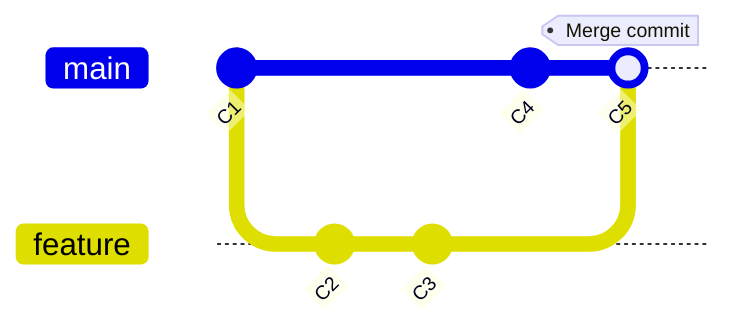
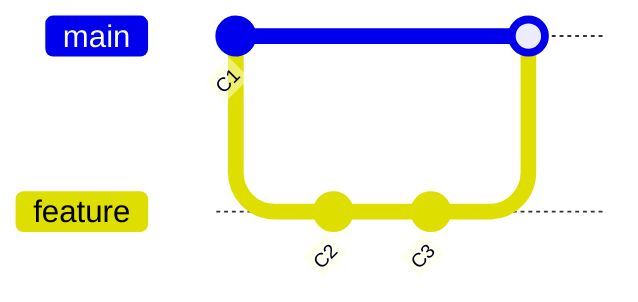
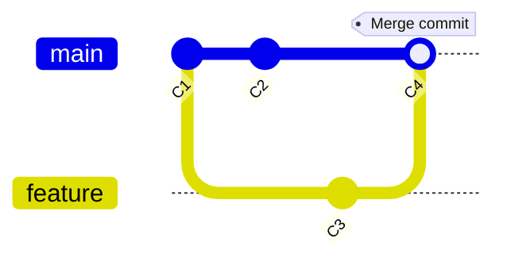

# Git Merge Process

## Introduction

Merging is one of Git's most powerful features, allowing you to combine work from different branches. When you merge branches, Git attempts to automatically integrate the changes. In this guide, we'll walk through the Git merge process step by step, explore different merge scenarios, and provide practical examples to help you master this essential Git operation.

## What is a Git Merge?

A Git merge is the process of combining changes from one branch into another. When you merge, Git takes the contents of a source branch and integrates it with the target branch. This process creates a new merge commit in the target branch that ties together the histories of both branches.



## Basic Merge Process

### 1. Update your local repository

Before performing a merge, make sure your local repository is up to date:

```bash
# Switch to the target branch (where changes will be merged into)
git checkout main

# Fetch the latest changes from remote
git fetch origin

# Update your local main branch
git pull origin main
```

### 2. Start the merge

To merge a branch into your current branch:

```bash
git merge <source-branch-name>
```

For example, to merge a feature branch into main:

```bash
git checkout main
git merge feature
```

### 3. Resolve conflicts (if any)

If Git encounters conflicts during the merge process, it will pause and ask you to resolve them manually. We'll cover conflict resolution in detail in a later section.

### 4. Complete the merge

After resolving any conflicts, complete the merge:

```bash
# If you had conflicts, add the resolved files
git add .

# Complete the merge with a commit
git commit -m "Merge feature branch into main"
```

## Types of Merges

Git supports several types of merges, each with different characteristics:

### Fast-forward Merge

A fast-forward merge occurs when the target branch hasn't diverged from the source branch. Instead of creating a new commit, Git simply moves the pointer of the target branch forward.



To perform a fast-forward merge:

```bash
git checkout main
git merge feature
```

Output:
```
Updating a123456..b789012
Fast-forward
 file.txt | 3 +++
 1 file changed, 3 insertions(+)
```

### Three-way Merge (Recursive)

When the target branch has diverged from the source branch, Git performs a three-way merge, creating a new merge commit.



Example:

```bash
git checkout main
git merge feature
```

Output:
```
Merge made by the 'recursive' strategy.
 feature.txt | 5 +++++
 1 file changed, 5 insertions(+)
```

### Squash Merge

A squash merge takes all the changes from a branch and condenses them into a single commit on the target branch.

```bash
git checkout main
git merge --squash feature
git commit -m "Implemented feature X"
```

Output:
```
Squash commit -- not updating HEAD
 feature.txt | 5 +++++
 1 file changed, 5 insertions(+)
```

### Rebase and Merge

While not a direct merge command, this approach first rebases the feature branch onto the main branch and then performs a fast-forward merge:

```bash
git checkout feature
git rebase main
git checkout main
git merge feature
```

## Handling Merge Conflicts

Merge conflicts occur when Git can't automatically resolve differences between branches. This typically happens when the same part of a file has been modified in both branches.

### 1. Identify conflicts

When a conflict occurs, Git will show a message like:

```
Auto-merging file.txt
CONFLICT (content): Merge conflict in file.txt
Automatic merge failed; fix conflicts and then commit the result.
```

### 2. Understand conflict markers

Git adds conflict markers to files with conflicts:

```
<<<<<<< HEAD
Changes from the current branch
=======
Changes from the branch being merged
>>>>>>> feature
```

### 3. Resolve conflicts

Open the conflicted files in your editor and resolve the conflicts by:
- Deciding which changes to keep
- Modifying the content as needed
- Removing the conflict markers

### 4. Mark as resolved and commit

```bash
# After editing the files to resolve conflicts
git add .
git commit -m "Merge feature branch, resolving conflicts"
```

## Practical Example: Feature Development Workflow

Let's walk through a complete example of developing a feature and merging it back to the main branch:

### 1. Create a feature branch

```bash
git checkout -b user-authentication
```

### 2. Make changes

```bash
# Create new files
touch auth.js login.html

# Edit files with your implementation
# ...

# Commit your changes
git add .
git commit -m "Implement user authentication"
```

### 3. Update your feature branch with main

```bash
git checkout main
git pull
git checkout user-authentication
git merge main
```

### 4. Merge your feature into main

```bash
git checkout main
git merge user-authentication
```

### 5. Push changes to remote

```bash
git push origin main
```

## Advanced Merge Options

Git provides several options to customize the merge process:

### No-commit merge

This performs the merge but doesn't create a commit automatically:

```bash
git merge --no-commit feature
```

### No-fast-forward merge

This forces Git to create a merge commit even when a fast-forward would be possible:

```bash
git merge --no-ff feature
```

### Abort a merge

If you run into trouble during a merge, you can abort it:

```bash
git merge --abort
```

### Specifying merge strategy

Git offers different merge strategies for specific scenarios:

```bash
git merge -s recursive -X ours feature
```

This uses the recursive strategy with the "ours" option, which favors the target branch in conflicts.

## Best Practices for Merging

1. **Always pull before merging**: Ensure your local branches are up to date
2. **Use feature branches**: Develop in feature branches and merge back to main
3. **Communicate**: When working in teams, communicate before merging significant changes
4. **Review code**: Conduct code reviews before merging into main branches
5. **Test before and after**: Verify functionality before and after merges
6. **Use meaningful commit messages**: Write clear commit messages, especially for merge commits
7. **Consider merge frequency**: More frequent merges often lead to fewer conflicts

## Common Issues and Solutions

### "Already up to date" message

```
Already up to date.
```

This means there are no changes to merge. The target branch already contains all commits from the source branch.

### Merge with unrelated histories

If you're trying to merge repositories with unrelated histories:

```bash
git merge --allow-unrelated-histories feature
```

### Reverting a merge

If you need to undo a merge:

```bash
# Find the commit hash before the merge
git log

# Revert to that state
git revert -m 1 <merge-commit-hash>
```

## Summary

The Git merge process is a fundamental skill for effective version control. We've covered:

- Basic merge workflow
- Different types of merges
- Handling merge conflicts
- Practical examples
- Advanced merge options
- Best practices

By mastering Git merges, you'll be able to collaborate more effectively on projects and maintain clean, organized codebases.

## Additional Resources

- [Git Documentation on Branching and Merging](https://git-scm.com/book/en/v2/Git-Branching-Basic-Branching-and-Merging)
- Interactive tutorials:
  - [Learn Git Branching](https://learngitbranching.js.org/)
  - [Atlassian Git Tutorial](https://www.atlassian.com/git/tutorials/using-branches/git-merge)

## Exercises

1. Create a new repository with a main branch
2. Create a feature branch and make several commits
3. Make a different set of commits in the main branch
4. Merge the feature branch into main and resolve any conflicts
5. Try different merge strategies (--squash, --no-ff) and observe the differences in the commit history