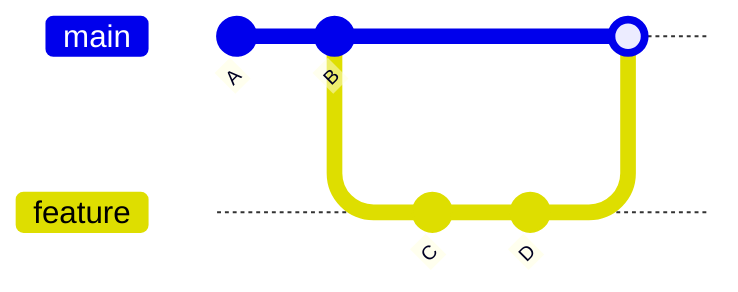
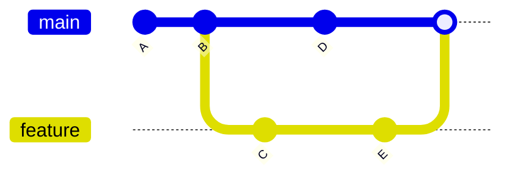

# Git Merge Strategies

## Introduction

When working with Git, you'll frequently need to combine changes from different branches. This process, known as merging, is fundamental to collaborative development. Git offers several merge strategies to handle different scenarios and requirements. Understanding these strategies helps you maintain a clean repository history and resolve conflicts effectively.

In this guide, we'll explore the various merge strategies Git provides, when to use each one, and how they affect your repository's history.

## What is a Merge Strategy?

A merge strategy is the approach Git uses to combine changes from one branch into another. Each strategy follows different rules for creating the resulting history and handling conflicts.

Think of merge strategies as different recipes for combining ingredients - they all create a dish (merged code), but the process and result can vary significantly.

## Common Git Merge Strategies

### 1. Fast-forward Merge

The fast-forward merge is Git's simplest strategy. It moves the pointer of the target branch forward to match the source branch when there are no divergent changes.

#### How it works:



#### Example:

```bash
# Create a feature branch and make changes
git checkout -b feature
echo "New feature" > feature.txt
git add feature.txt
git commit -m "Add new feature"

# Fast-forward merge back to main
git checkout main
git merge feature
```

#### Output:
```
Updating 1234abc..5678def
Fast-forward
 feature.txt | 1 +
 1 file changed, 1 insertion(+)
 create mode 100644 feature.txt
```

#### When to use:
- For simple linear changes
- When you want a clean, linear history
- When no changes have been made to the target branch since the feature branch was created

#### Preventing fast-forward merges:
If you want to preserve branch history, you can prevent fast-forward merges using:

```bash
git merge --no-ff feature
```

This creates a merge commit even when a fast-forward would be possible.

### 2. Recursive Merge (Default)

The recursive strategy is Git's default merge strategy. It comes into play when branches have diverged and a fast-forward isn't possible.

#### How it works:



#### Example:

```bash
# Create a feature branch
git checkout -b feature
echo "Feature code" > feature.txt
git add feature.txt
git commit -m "Add feature"

# Make changes on main
git checkout main
echo "Main update" > main.txt
git add main.txt
git commit -m "Update main"

# Merge feature to main
git merge feature
```

#### Output:
```
Merge made by the 'recursive' strategy.
 feature.txt | 1 +
 1 file changed, 1 insertion(+)
 create mode 100644 feature.txt
```

#### When to use:
- For most regular merges
- When branches have diverged
- When you want to preserve the history of both branches

### 3. Ours

The "ours" strategy is a special case that ignores all changes from the source branch, keeping only the history of the target branch.

#### Example:

```bash
git merge -s ours outdated-branch
```

#### Output:
```
Merge made by the 'ours' strategy.
```

#### When to use:
- When you want to discard all changes from the source branch
- When a branch is obsolete but you want to record the merge in history
- When you're replacing an implementation entirely

### 4. Theirs

While not a standalone strategy, "theirs" is an option for conflict resolution that prefers changes from the source branch.

#### Example (during conflict resolution):

```bash
git checkout --theirs conflicted_file.txt
git add conflicted_file.txt
```

#### When to use:
- When resolving conflicts and you want to keep the incoming changes
- When the other branch has the more up-to-date version of a file

### 5. Octopus

The octopus strategy allows merging more than two branches simultaneously.

#### Example:

```bash
git merge feature1 feature2 feature3
```

#### Output:
```
Merge made by the 'octopus' strategy.
 feature1.txt | 1 +
 feature2.txt | 1 +
 feature3.txt | 1 +
 3 files changed, 3 insertions(+)
```

#### When to use:
- When merging multiple branches simultaneously
- For integrating several non-conflicting feature branches
- Best used for branches that don't conflict with each other

### 6. Subtree

The subtree strategy is specialized for merging between repositories with different directory structures.

#### Example:

```bash
git merge -s subtree --no-commit project-b/master
```

#### When to use:
- When merging a project that exists in a subdirectory
- When dealing with repositories that have different directory structures
- For managing sub-projects within a main project

## Rebase: An Alternative to Merging

While not technically a merge strategy, rebasing offers an alternative approach to integrating changes.

#### How it works:


#### Example:

```bash
git checkout feature
git rebase main
git checkout main
git merge feature  # This will be a fast-forward merge
```

#### When to use:
- When you want a linear, clean history
- For branches that haven't been shared publicly
- When you want to integrate the latest changes from the main branch before merging

#### Caution:
Never rebase branches that are shared with others without coordination, as it rewrites history.

## Choosing the Right Strategy

Selecting the appropriate merge strategy depends on your specific needs:

1. **For simple, linear changes**: Use fast-forward merges
2. **For preserving branch history**: Use recursive with `--no-ff`
3. **For multiple non-conflicting branches**: Consider octopus
4. **For a clean, linear history**: Consider rebasing
5. **For ignoring a branch's changes**: Use ours

Most of the time, Git's default recursive strategy works well, but knowing the alternatives gives you more control over your repository's history.

## Handling Merge Conflicts

Regardless of the merge strategy, conflicts can occur when changes overlap. Here's how to handle them:

```bash
# Start a merge that results in conflicts
git merge feature-branch

# Git will report conflicts
# Edit the conflicted files to resolve

# After editing, mark as resolved
git add resolved_file.txt

# Complete the merge
git commit -m "Merge feature-branch, resolving conflicts"
```

Conflicts are marked in files like this:

```
<<<<<<< HEAD
Current branch content
=======
Incoming branch content
>>>>>>> feature-branch
```

Edit the file to keep the desired content, remove the marker lines, then add and commit.

## Practical Examples

### Example 1: Feature Development Workflow

```bash
# Start a new feature
git checkout -b new-feature

# Make changes and commit
echo "New feature code" > feature.txt
git add feature.txt
git commit -m "Implement new feature"

# Meanwhile, main has progressed
git checkout main
echo "Main update" > main.txt
git add main.txt
git commit -m "Update main"

# Merge the feature with a merge commit to preserve history
git merge --no-ff new-feature
```

### Example 2: Hotfix Workflow

```bash
# Create a hotfix from production
git checkout -b hotfix production

# Fix the bug
echo "Bug fix" > fix.txt
git add fix.txt
git commit -m "Fix critical bug"

# Merge to production
git checkout production
git merge hotfix

# Also merge to development
git checkout development
git merge hotfix
```

### Example 3: Discarding an Experimental Branch

```bash
# Create experimental branch
git checkout -b experiment
echo "Experimental code" > experiment.txt
git add experiment.txt
git commit -m "Experimental implementation"

# Decide to discard but record in history
git checkout main
git merge -s ours experiment -m "Discarded experimental implementation"
```

## Best Practices

1. **Use `--no-ff` for feature branches**: This preserves the feature branch's history.
2. **Keep branches short-lived**: Merge frequently to reduce conflict complexity.
3. **Review changes before merging**: Use `git diff main..feature` to see what will be merged.
4. **Use descriptive commit messages**: Especially for merge commits which document the integration.
5. **Consider using merge tools** for complex conflicts: `git mergetool` opens visual merge tools.
6. **Test after merging**: Even conflict-free merges can introduce logical issues.

## Summary

Git merge strategies provide different ways to combine code from various branches. The strategy you choose affects your repository's history and how conflicts are handled.

- **Fast-forward**: Simple linear history
- **Recursive (default)**: Creates merge commits for divergent branches
- **Ours**: Ignores source branch changes
- **Octopus**: Merges multiple branches simultaneously
- **Subtree**: Specialized for repositories with different structures
- **Rebase**: Alternative to merging that creates linear history

Understanding these strategies helps you maintain a clean, organized repository that accurately reflects your development process.

## Additional Resources

- The official [Git documentation on merge strategies](https://git-scm.com/docs/git-merge#_merge_strategies)
- Pro Git book section on [Basic Branching and Merging](https://git-scm.com/book/en/v2/Git-Branching-Basic-Branching-and-Merging)

## Exercises

1. Create a repository and experiment with different merge strategies.
2. Try creating a merge conflict deliberately and resolve it.
3. Compare the resulting commit graph after using `--no-ff` versus a standard fast-forward merge.
4. Practice merging multiple branches with the octopus strategy.
5. Experiment with rebasing versus merging and observe the differences in history.