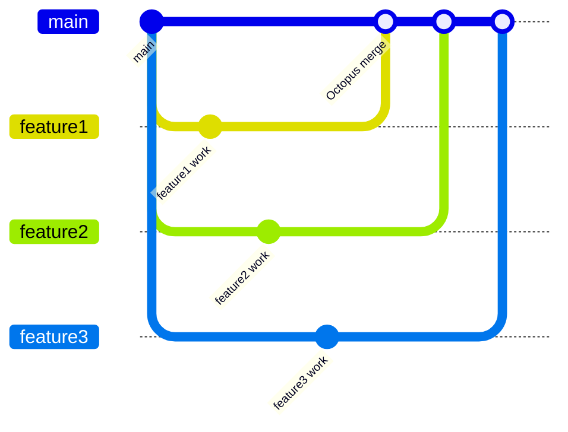

# Git Octopus Merge

## Introduction

When working with Git, you'll often need to merge branches to combine different lines of development. While the standard merge operation handles two branches at a time, there are scenarios where you might want to merge multiple branches simultaneously. This is where the **Git Octopus Merge** comes into play.

The Octopus Merge is a specialized Git merge strategy that allows you to merge multiple branches (more than two) in a single operation. The name "octopus" is a playful reference to the resulting commit having many "arms" or parent references, like an octopus.

## When to Use Octopus Merge

Octopus merges are particularly useful in specific scenarios:

- When integrating multiple feature branches into a main branch
- When managing parallel development tracks that need to be combined
- In continuous integration environments with multiple simultaneous changes
- When you want to avoid a series of sequential two-way merges

It's important to note that octopus merges are best suited for non-conflicting changes. If there are conflicts between the branches, Git will prefer that you resolve them using traditional two-way merges.

## How Octopus Merge Works

An octopus merge works by creating a single merge commit with multiple parent commits. Here's a simplified diagram of what happens:



In the diagram above, instead of merging each feature branch one by one, we perform a single octopus merge that combines all three feature branches into the main branch.

## Basic Octopus Merge Syntax

The syntax for performing an octopus merge is straightforward:

```bash
git merge branch1 branch2 branch3 ... branchN
```

By specifying multiple branch names in a single merge command, Git automatically uses the octopus merge strategy.

## Step-by-Step Octopus Merge Example

Let's walk through a practical example to understand how octopus merge works:

### 1. Set up a sample repository

```bash
# Create and initialize a new repo
mkdir octopus-demo
cd octopus-demo
git init

# Create an initial commit
echo "# Octopus Merge Demo" > README.md
git add README.md
git commit -m "Initial commit"
```

### 2. Create multiple feature branches

```bash
# Create and switch to feature1 branch
git branch feature1
git checkout feature1

# Add a file to feature1
echo "Feature 1 content" > feature1.txt
git add feature1.txt
git commit -m "Add feature1 content"

# Switch back to main and create feature2
git checkout main
git branch feature2
git checkout feature2

# Add a file to feature2
echo "Feature 2 content" > feature2.txt
git add feature2.txt
git commit -m "Add feature2 content"

# Switch back to main and create feature3
git checkout main
git branch feature3
git checkout feature3

# Add a file to feature3
echo "Feature 3 content" > feature3.txt
git add feature3.txt
git commit -m "Add feature3 content"

# Return to main branch
git checkout main
```

### 3. Perform the octopus merge

```bash
git merge feature1 feature2 feature3
```

### 4. Expected output

```
Trying simple merge with feature1
Trying simple merge with feature2
Trying simple merge with feature3
Merge made by the 'octopus' strategy.
 feature1.txt | 1 +
 feature2.txt | 1 +
 feature3.txt | 1 +
 3 files changed, 3 insertions(+)
 create mode 100644 feature1.txt
 create mode 100644 feature2.txt
 create mode 100644 feature3.txt
```

### 5. Verify the merge result

```bash
git log --graph --oneline --all
```

The log will show a merge commit with multiple parents, connecting all the feature branches to the main branch.

## Handling Conflicts in Octopus Merges

One limitation of octopus merges is that Git is not designed to handle conflicts between multiple branches in an octopus merge. If Git detects conflicts, it will abort the octopus merge and suggest that you perform traditional two-way merges instead.

For example, if two of your branches modified the same file in different ways:

```bash
# In feature1
echo "Feature 1 modification" > shared.txt
git add shared.txt
git commit -m "Modify shared file in feature1"

# In feature2
git checkout feature2
echo "Feature 2 modification" > shared.txt
git add shared.txt
git commit -m "Modify shared file in feature2"

# Attempt to merge - will fail
git checkout main
git merge feature1 feature2 feature3
```

You'll likely see an error message like:

```
error: Merge conflict in shared.txt
fatal: Octopus merge failed
```

In this case, you would need to resort to sequential two-way merges:

```bash
git merge feature1
git merge feature2
git merge feature3
```

## Real-World Applications

Octopus merges are particularly useful in the following real-world scenarios:

### 1. Release Integration

When preparing a release, you might have multiple feature branches that need to be combined into your release branch:

```bash
git checkout release-v1.0
git merge feature-login feature-dashboard feature-notifications
```

This creates a single commit that incorporates all the features at once, making the history cleaner and easier to understand.

### 2. Continuous Integration Systems

In CI/CD pipelines, octopus merges can be used to integrate multiple branches that have passed their respective tests:

```bash
git checkout main
git merge feature-a feature-b feature-c --no-ff
```

The `--no-ff` flag ensures a merge commit is created even if a fast-forward merge is possible.

### 3. Topic Branch Management

When working with topic branches (branches dedicated to specific features or components), octopus merges help organize the integration:

```bash
git checkout main
git merge topic/ui topic/api topic/database
```

## Best Practices

To use octopus merges effectively:

1. **Reserve for non-conflicting changes**: Only use octopus merges when you're confident the changes won't conflict.

2. **Limit the number of branches**: While Git can theoretically handle many branches in an octopus merge, keeping the count reasonable (typically less than 10) makes management easier.

3. **Test before merging**: Ensure each branch has been tested individually before attempting an octopus merge.

4. **Use descriptive commit messages**: Since an octopus merge combines multiple branches, a clear commit message is essential:

   ```bash
   git merge feature1 feature2 feature3 -m "Merge features 1, 2, and 3 for release v1.0"
   ```

5. **Consider alternatives**: For complex merges, sometimes a series of two-way merges or using a dedicated integration branch might be clearer.

## The Git Plumbing Behind Octopus Merges

Under the hood, Git creates a special merge commit with multiple parent commits. You can examine this structure using:

```bash
git cat-file -p HEAD
```

After an octopus merge, you might see output like:

```
tree a1b2c3d4e5f6g7h8i9j0k1l2m3n4o5p6
parent q7r8s9t0u1v2w3x4y5z6a7b8c9d0e1
parent f2g3h4i5j6k7l8m9n0o1p2q3r4s5t6
parent u7v8w9x0y1z2a3b4c5d6e7f8g9h0i1
author User <user@example.com> 1623456789 +0000
committer User <user@example.com> 1623456789 +0000

Merge branches 'feature1', 'feature2' and 'feature3'
```

Notice that this commit has three parent commits instead of the usual one or two.

## Alternatives to Octopus Merge

While octopus merges can be powerful, there are alternatives worth considering:

1. **Sequential Two-Way Merges**: The traditional approach of merging one branch at a time.

   ```bash
   git merge branch1
   git merge branch2
   git merge branch3
   ```

2. **Integration Branch**: Create a temporary branch to integrate changes before merging into main.

   ```bash
   git checkout -b integration
   git merge branch1
   git merge branch2
   git merge branch3
   git checkout main
   git merge integration
   ```

3. **Rebase**: Instead of merging, rebase the feature branches onto the main branch.

   ```bash
   git checkout branch1
   git rebase main
   git checkout main
   git merge branch1
   # Repeat for other branches
   ```

## Summary

Git Octopus Merge is a specialized merge strategy that allows you to combine multiple branches in a single operation. It's particularly useful for integrating non-conflicting changes from several feature branches simultaneously.

Key takeaways:
- Octopus merges create a single commit with multiple parents
- Best suited for non-conflicting changes
- Useful for release integration and continuous integration scenarios
- Limited in handling merge conflicts
- Creates a cleaner commit history when merging multiple branches

While not needed for everyday Git operations, octopus merges are a powerful tool to have in your Git toolkit, especially when working with complex branch structures or in team environments where multiple features are being developed in parallel.

## Practice Exercises

1. Create a repository with four branches that make non-conflicting changes and practice merging them all at once.

2. Try creating an octopus merge with conflicting changes to observe how Git behaves.

3. Compare the commit history of an octopus merge versus sequential two-way merges using `git log --graph`.

4. Set up a development workflow where you integrate multiple feature branches into a staging branch using octopus merges.

## Additional Resources

- [Git Documentation on Merge Strategies](https://git-scm.com/docs/git-merge#_merge_strategies)
- [Pro Git Book](https://git-scm.com/book/en/v2)
- [Git Internals - How Git Stores Commits](https://git-scm.com/book/en/v2/Git-Internals-Git-Objects)