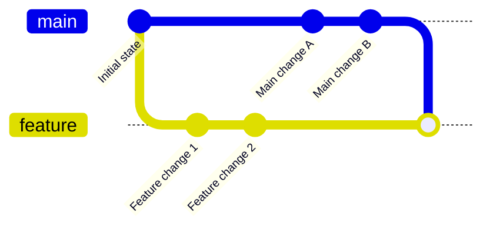

# Git Merge Conflicts

## Introduction

When multiple developers work on the same codebase, their changes may occasionally overlap, leading to what Git calls a "merge conflict." A merge conflict occurs when Git cannot automatically determine how to integrate changes from different branches. This typically happens when two branches modify the same part of a file or when one branch deletes a file that another branch has modified.

Understanding how to handle merge conflicts is an essential skill for any developer working in a team environment. In this guide, we'll explore what merge conflicts are, why they happen, and how to resolve them effectively.

## What Causes Merge Conflicts?

Merge conflicts typically occur in the following scenarios:

1. **Line-level conflicts**: Two branches change the same lines in a file.
2. **File-level conflicts**: One branch deletes a file while another modifies it.
3. **Directory-level conflicts**: Files with the same name are added in the same location on different branches.

Let's visualize how branches diverge and then need to be merged:



When Git can't automatically merge these changes, a conflict arises that requires manual resolution.

## Identifying Merge Conflicts

When a merge conflict occurs, Git will display an error message similar to:

```bash
$ git merge feature-branch
Auto-merging file.txt
CONFLICT (content): Merge conflict in file.txt
Automatic merge failed; fix conflicts and then commit the result.
```

Git also modifies the affected files, adding conflict markers to highlight the conflicting sections:

```
<<<<<<< HEAD
This is the content from the current branch (often main)
=======
This is the content from the branch being merged (e.g., feature-branch)
>>>>>>> feature-branch
```

## Resolving Merge Conflicts Step by Step

### Step 1: Identify conflicting files

Use the following command to see which files have conflicts:

```bash
$ git status
```

The output will show something like:

```
On branch main
You have unmerged paths.
  (fix conflicts and run "git commit")
  (use "git merge --abort" to abort the merge)

Unmerged paths:
  (use "git add <file>..." to mark resolution)
  both modified:   file.txt
```

### Step 2: Open the conflicting files

Open each conflicting file in your editor. You'll see the conflict markers as shown above.

### Step 3: Edit the files to resolve conflicts

You have several options:
- Keep the changes from your current branch (usually main)
- Keep the changes from the incoming branch (e.g., feature-branch)
- Combine both changes
- Completely rewrite the section

For example, if you decide to keep both changes, you might edit the file to look like:

```
This is the content from the current branch
AND
This is the content from the branch being merged
```

Remove all the conflict markers (`<<<<<<<`, `=======`, and `>>>>>>>`) as you resolve each conflict.

### Step 4: Mark the conflicts as resolved

After editing the file, tell Git that you've resolved the conflict:

```bash
$ git add file.txt
```

### Step 5: Complete the merge

Once all conflicts are resolved and marked as such, complete the merge:

```bash
$ git commit
```

Git will open an editor with a pre-populated commit message about the merge. You can modify this message if needed.

## Real-World Example

Let's walk through a practical example of resolving a merge conflict.

Imagine you have a JavaScript function in a file called `calculator.js`:

```javascript
function add(a, b) {
  return a + b;
}

function subtract(a, b) {
  return a - b;
}
```

On the `main` branch, a developer modifies the `add` function:

```javascript
function add(a, b) {
  // Convert inputs to numbers to handle string inputs
  return Number(a) + Number(b);
}

function subtract(a, b) {
  return a - b;
}
```

Meanwhile, on the `feature-branch`, another developer also modifies the `add` function and adds a new function:

```javascript
function add(a, b) {
  // Add validation
  if (isNaN(a) || isNaN(b)) {
    throw new Error('Inputs must be numbers');
  }
  return a + b;
}

function subtract(a, b) {
  return a - b;
}

function multiply(a, b) {
  return a * b;
}
```

When trying to merge `feature-branch` into `main`, Git will report a conflict in `calculator.js`.

The file with conflict markers will look like:

```javascript
<<<<<<< HEAD
function add(a, b) {
  // Convert inputs to numbers to handle string inputs
  return Number(a) + Number(b);
}
=======
function add(a, b) {
  // Add validation
  if (isNaN(a) || isNaN(b)) {
    throw new Error('Inputs must be numbers');
  }
  return a + b;
}
>>>>>>> feature-branch

function subtract(a, b) {
  return a - b;
}

function multiply(a, b) {
  return a * b;
}
```

To resolve this conflict, you need to decide which implementation to keep or how to combine them. A reasonable solution might be:

```javascript
function add(a, b) {
  // Convert inputs to numbers and add validation
  a = Number(a);
  b = Number(b);
  
  if (isNaN(a) || isNaN(b)) {
    throw new Error('Inputs must be numbers');
  }
  
  return a + b;
}

function subtract(a, b) {
  return a - b;
}

function multiply(a, b) {
  return a * b;
}
```

After editing the file, you would:

```bash
$ git add calculator.js
$ git commit
```

## Preventing Merge Conflicts

While you can't completely avoid merge conflicts, you can minimize them:

1. **Pull frequently**: Regularly integrate changes from the main branch into your feature branch.
2. **Communicate with your team**: Coordinate who's working on which files.
3. **Use smaller, focused commits**: Smaller changes are easier to merge.
4. **Structure your codebase thoughtfully**: Design your project so that different features live in different files.

## Advanced Conflict Resolution Tools

Git offers several tools to help with conflict resolution:

### Using `git mergetool`

Git can launch an external merge tool:

```bash
$ git mergetool
```

This will open a visual tool that makes it easier to see and resolve conflicts.

### Using `--ours` and `--theirs` flags

For binary files or when you want to automatically choose one version:

```bash
# Keep the version from the current branch
$ git checkout --ours path/to/file

# Keep the version from the incoming branch
$ git checkout --theirs path/to/file
```

Remember to `git add` the file after using either of these commands.

### Aborting a merge

If you decide you're not ready to resolve the conflicts:

```bash
$ git merge --abort
```

This will revert all changes and take you back to the state before you started the merge.

## Summary

Merge conflicts are a natural part of collaborative development. While they might seem intimidating at first, they're really just Git's way of asking for your help in deciding how to combine changes. With practice, resolving conflicts becomes a routine part of the development workflow.

Understanding the causes of conflicts, knowing how to resolve them, and implementing strategies to minimize them will make you more effective when working with Git in a team environment.

## Additional Resources

- [Git Documentation on Merging](https://git-scm.com/docs/git-merge)
- [Pro Git Book - Basic Merge Conflicts](https://git-scm.com/book/en/v2/Git-Branching-Basic-Branching-and-Merging#_basic_merge_conflicts)

## Exercises

1. Create two branches and deliberately make conflicting changes to practice resolving them.
2. Try resolving a conflict using a visual merge tool like VS Code's built-in conflict resolver.
3. Experiment with `git checkout --ours` and `git checkout --theirs` to understand how they work.
4. Set up a small project with a teammate and practice encountering and resolving real conflicts together.