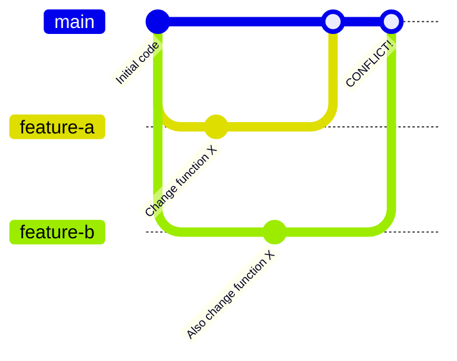

# Git Conflict Resolution

## Introduction

When working in teams on the same codebase, merging different branches is a common operation. However, sometimes Git cannot automatically reconcile differences between branches, resulting in what we call **merge conflicts**. These conflicts occur when competing changes are made to the same line of a file, or when one developer edits a file and another developer deletes it.

Understanding how to resolve these conflicts is an essential skill for any developer. In this guide, we'll explore what merge conflicts are, why they happen, and how to resolve them effectively.

## What Causes Merge Conflicts?

Merge conflicts typically arise in the following scenarios:

1. **Line-level conflicts**: Two developers modify the same line of code in different ways.
2. **File-level conflicts**: One developer edits a file while another deletes it.
3. **Directory-level conflicts**: Similar changes occur at the directory level.

Let's visualize how a typical conflict scenario develops:



In this diagram, two developers branched off from the main branch, and both made changes to the same part of the code. When trying to merge both changes back to main, Git signals a conflict.

## Identifying Merge Conflicts

When a merge conflict occurs, Git will notify you with a message similar to:

```
Auto-merging example.js
CONFLICT (content): Merge conflict in example.js
Automatic merge failed; fix conflicts and then commit the result.
```

Git also modifies the affected files to show the conflicting sections. Let's look at what a conflict might look like in a file:

```js
function calculateTotal(items) {
<<<<<<< HEAD
  return items.reduce((total, item) => total + item.price * 1.08, 0);
=======
  return items.reduce((total, item) => total + item.price * (1 + getTaxRate()), 0);
>>>>>>> feature-branch
}
```

Git marks the conflicting sections with special markers:
- `<<<<<<< HEAD` marks the beginning of the conflicting section from the current branch.
- `=======` separates the changes between the two branches.
- `>>>>>>> feature-branch` marks the end of the conflict, showing changes from the incoming branch.

## Resolving Merge Conflicts: Step-by-Step Guide

### 1. Understand the Changes

Before resolving a conflict, understand what each change is trying to accomplish:
- What was the intention behind each change?
- Are both changes necessary?
- Can the changes be combined?

### 2. Choose a Resolution Strategy

You have several options to resolve conflicts:

- **Accept current change**: Keep the changes from your current branch.
- **Accept incoming change**: Use the changes from the branch being merged.
- **Accept both changes**: Keep both modifications (may require additional editing).
- **Manually edit**: Create a completely custom solution.

### 3. Edit the File to Resolve Conflicts

Let's say we have the conflict we saw earlier. We might decide to combine both approaches:

```js
function calculateTotal(items) {
  // Combine both approaches for a more flexible solution
  return items.reduce((total, item) => total + item.price * (1 + getTaxRate()), 0);
}
```

### 4. Mark the Conflict as Resolved

After editing the file to resolve the conflict, tell Git that you've resolved it:

```bash
git add example.js
```

### 5. Complete the Merge

Once all conflicts are resolved and marked as such, complete the merge:

```bash
git commit -m "Merge branch 'feature-branch' and resolve conflicts"
```

## Practical Examples

### Example 1: Resolving a Simple Line Conflict

Let's walk through a complete example:

**Step 1**: You attempt to merge and encounter a conflict

```bash
$ git merge feature-branch
Auto-merging src/utils.js
CONFLICT (content): Merge conflict in src/utils.js
Automatic merge failed; fix conflicts and then commit the result.
```

**Step 2**: Open the conflicting file and see:

```js
function formatPrice(price) {
<<<<<<< HEAD
  return '$' + price.toFixed(2);
=======
  return `$${price.toFixed(2)}`;
>>>>>>> feature-branch
}
```

**Step 3**: Decide to use the template literal approach and edit the file:

```js
function formatPrice(price) {
  return `$${price.toFixed(2)}`;
}
```

**Step 4**: Mark as resolved and complete the merge:

```bash
$ git add src/utils.js
$ git commit -m "Merge feature-branch and resolve price formatting conflict"
```

### Example 2: Handling Multiple Conflicts

Sometimes you might encounter multiple conflicts in a single merge. The process is similar but requires resolving each conflict one by one.

When you have multiple conflicts, you can see which files have conflicts using:

```bash
$ git status
On branch main
You have unmerged paths.
  (fix conflicts and run "git commit")
  (use "git merge --abort" to abort the merge)

Unmerged paths:
  (use "git add <file>..." to mark resolution)
  both modified:   src/utils.js
  both modified:   src/components/Cart.js
```

Resolve each file one at a time, then add each to the staging area before finally committing to complete the merge.

### Example 3: Using Merge Tools

For complex conflicts, Git's built-in visualization might not be enough. In such cases, you can use visual merge tools:

```bash
$ git mergetool
```

This command will open your configured merge tool (such as VSCode, KDiff3, or Meld) to help you resolve conflicts visually.

## Advanced Conflict Resolution Techniques

### Preventing Conflicts

While conflicts are sometimes unavoidable, you can minimize them by:

1. **Pulling frequently**: Keep your branch updated with the latest changes from the main branch.
2. **Communicating with your team**: Let others know which files you're working on.
3. **Creating smaller, focused branches**: Smaller changes have less chance of conflict.

### Aborting a Merge

If you find yourself in a complex conflict situation and want to start over:

```bash
$ git merge --abort
```

This command restores your working directory to the state before the merge attempt.

### Using Git Rerere (Reuse Recorded Resolution)

For teams that frequently encounter similar conflicts, Git offers a feature called "rerere" (reuse recorded resolution):

```bash
$ git config --global rerere.enabled true
```

With this enabled, Git remembers how you resolved a particular conflict so it can automatically apply the same resolution if it sees the same conflict again.

## Common Pitfalls and How to Avoid Them

1. **Resolving without understanding**: Always understand the changes before resolving.
2. **Losing important changes**: Be careful not to accidentally discard important code.
3. **Introducing bugs**: Test your code after resolving conflicts to ensure functionality.
4. **Committing conflict markers**: Always remove all conflict markers (`<<<<<<<`, `=======`, `>>>>>>>`) before committing.

## Summary

Merge conflicts are a natural part of collaborative development with Git. While they might seem intimidating at first, following a structured approach makes them manageable:

1. Understand what caused the conflict
2. Choose an appropriate resolution strategy
3. Edit files to resolve conflicts
4. Mark conflicts as resolved with `git add`
5. Complete the merge with `git commit`

With practice, resolving conflicts becomes a routine part of your development workflow rather than a source of stress.

## Additional Resources and Exercises

### Exercises

1. **Basic Conflict Resolution**:
   - Create two branches from a main branch
   - Make conflicting changes to the same file
   - Practice merging and resolving the conflict

2. **Multi-file Conflict Resolution**:
   - Create a more complex scenario with conflicts in multiple files
   - Resolve each conflict and complete the merge

3. **Using Different Tools**:
   - Configure a visual merge tool
   - Resolve the same conflict using both the command line and the merge tool
   - Compare the experience

### Further Reading

- [Git Documentation on Resolving Conflicts](https://git-scm.com/book/en/v2/Git-Branching-Basic-Branching-and-Merging#_basic_merge_conflicts)
- [Git Branching Model Strategies](https://nvie.com/posts/a-successful-git-branching-model/)
- [Advanced Git Techniques](https://git-scm.com/book/en/v2/Git-Tools-Advanced-Merging)