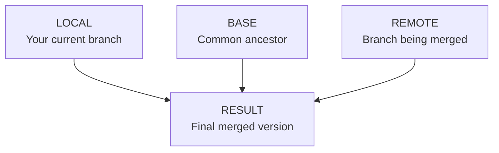

# Git Merge Tools

## Introduction

When working with Git in collaborative projects, merging branches is a common operation that sometimes leads to conflicts. These conflicts occur when the same part of a file has been modified in different ways on the branches being merged. Git merge tools are specialized utilities designed to help developers resolve these conflicts efficiently.

In this guide, we'll explore various Git merge tools, understand how they work, and learn how to use them effectively to resolve merge conflicts.

## What Are Git Merge Tools?

Git merge tools are applications that provide a visual interface to help resolve merge conflicts. While Git provides a basic text-based conflict resolution approach, merge tools offer more intuitive ways to compare and combine changes from different branches.

When Git encounters a conflict during a merge operation, it marks the conflicting sections in the affected files. A merge tool helps you visualize these conflicts and choose which changes to keep.

## Common Git Merge Tools

There are several merge tools available, each with its own features and interface:

### 1. Built-in Git Merge Tool

Git comes with a simple built-in merge resolution system that marks conflicts in files:

```bash
<<<<<<< HEAD
Changes from the current branch (where you're merging into)
=======
Changes from the branch being merged
>>>>>>> feature-branch
```

### 2. Visual Merge Tools

Several visual tools integrate with Git to provide a more intuitive conflict resolution experience:

- **Meld**: A visual diff and merge tool
- **KDiff3**: A diff and merge program with three-way merge capability
- **Beyond Compare**: A powerful file comparison tool
- **P4Merge**: Perforce's visual merge tool
- **Vimdiff**: For Vim users
- **VS Code**: Built-in merge conflict resolution

## Configuring a Merge Tool

Before using a merge tool, you need to configure Git to use it:

```bash
# Set the merge tool
git config --global merge.tool meld

# Optionally, configure Git to automatically launch the merge tool
git config --global merge.conflictstyle diff3
git config --global mergetool.prompt false
```

## How to Use Git Merge Tools

Let's walk through the process of using a merge tool to resolve conflicts:

### Step 1: Attempt the Merge

Start by attempting to merge branches:

```bash
# Switch to the target branch
git checkout main

# Attempt to merge
git merge feature-branch
```

If Git encounters conflicts, it will display a message like:

```
Auto-merging file.txt
CONFLICT (content): Merge conflict in file.txt
Automatic merge failed; fix conflicts and then commit the result.
```

### Step 2: Launch the Merge Tool

Run the mergetool command to launch your configured merge tool:

```bash
git mergetool
```

This will open the configured merge tool to help resolve conflicts in each conflicted file.

### Step 3: Resolve Conflicts

In the merge tool interface, you'll typically see three panels:



The process for resolving conflicts varies by tool, but generally involves:

1. Reviewing the differences between versions
2. Selecting which changes to keep or combining them manually
3. Saving the resolved file

### Step 4: Complete the Merge

After resolving all conflicts:

1. Save and exit the merge tool
2. Git will ask if the conflict is resolved
3. If there are more conflicted files, the tool will open them one by one
4. Once all conflicts are resolved, commit the changes:

```bash
# Check status to ensure all conflicts are resolved
git status

# Commit the merge
git commit -m "Merge feature-branch into main, resolve conflicts"
```

## Practical Example: Resolving a Merge Conflict

Let's walk through a practical example of resolving a merge conflict:

1. Two developers are working on a JavaScript function:

**Developer A (on main branch):**
```javascript
function calculateTotal(items) {
  return items.reduce((total, item) => {
    return total + item.price;
  }, 0);
}
```

**Developer B (on feature-branch):**
```javascript
function calculateTotal(items) {
  return items.reduce((total, item) => {
    return total + (item.price * item.quantity);
  }, 0);
}
```

2. When Developer B tries to merge their changes:

```bash
git checkout main
git merge feature-branch
```

3. Git reports a conflict:

```
Auto-merging app.js
CONFLICT (content): Merge conflict in app.js
Automatic merge failed; fix conflicts and then commit the result.
```

4. Developer B runs the merge tool:

```bash
git mergetool
```

5. The merge tool displays both versions, and Developer B decides to keep the feature-branch implementation since it correctly handles item quantities.

6. After saving and exiting the tool, Developer B completes the merge:

```bash
git commit -m "Merge feature-branch, use quantity in price calculation"
```

## Advanced Merge Tool Features

Modern merge tools offer additional features to make conflict resolution easier:

### 1. Three-Way Merge View

Shows the base version (common ancestor) alongside the conflicting versions, making it easier to understand the context of changes.

### 2. Syntax Highlighting

Code syntax highlighting makes it easier to review and edit code during conflict resolution.

### 3. Word-Level Diff

Instead of highlighting entire lines, some tools can show exactly which words changed.

### 4. Auto-Merge Capabilities

Some tools can automatically resolve simple conflicts, asking for manual intervention only when necessary.

## Tips for Effective Conflict Resolution

1. **Understand the context**: Before resolving conflicts, understand why both changes were made.

2. **Communicate with team members**: If you're unsure about which changes to keep, discuss with the team member who made the other changes.

3. **Use atomic commits**: Smaller, focused commits reduce the likelihood of conflicts.

4. **Pull frequently**: Regular integration with the main branch reduces the scope of conflicts.

5. **Use feature flags**: For significant changes, consider using feature flags to merge code without enabling functionality immediately.

## Common Merge Tool Commands

Here are some common Git commands related to merge tools:

```bash
# List configured merge tools
git config --get-regexp merge.*

# Set a specific merge tool
git config --global merge.tool <tool-name>

# Launch merge tool for current conflicts
git mergetool

# Launch a specific merge tool (overriding default)
git mergetool --tool=<tool-name>

# List available merge tools
git mergetool --tool-help
```

## Troubleshooting Merge Tools

If you encounter issues with your merge tool:

1. **Tool not found**: Ensure the tool is installed and in your system PATH.

2. **Configuration issues**: Verify your Git configuration with:
   ```bash
   git config --list | grep merge
   ```

3. **Binary files**: Some merge tools struggle with binary files. Use:
   ```bash
   git config --global merge.tool <tool-with-binary-support>
   ```

4. **File encodings**: Ensure your merge tool supports the file encodings used in your project.

## Summary

Git merge tools are essential for efficiently resolving conflicts during branch merges. They provide visual interfaces that make it easier to understand and resolve differences between branches.

Key takeaways:

- Merge tools help visualize and resolve conflicts when Git can't automatically merge changes
- You can configure Git to use your preferred merge tool
- The merging process involves launching the tool, selecting changes to keep, and committing the result
- Regular communication with team members and good Git practices can reduce merge conflicts

## Additional Resources

- Git's official documentation on [merge tools](https://git-scm.com/docs/git-mergetool)
- Interactive online Git tutorials for practicing merge operations
- Your IDE's documentation on built-in merge capabilities

## Exercises

1. Configure a merge tool of your choice in your Git environment.
2. Create a sample repository with two branches that modify the same file, then practice resolving the resulting conflict using your merge tool.
3. Try different merge tools and compare their interfaces and features.
4. Collaborate with a team member on a file, intentionally create a conflict, and practice resolving it together.