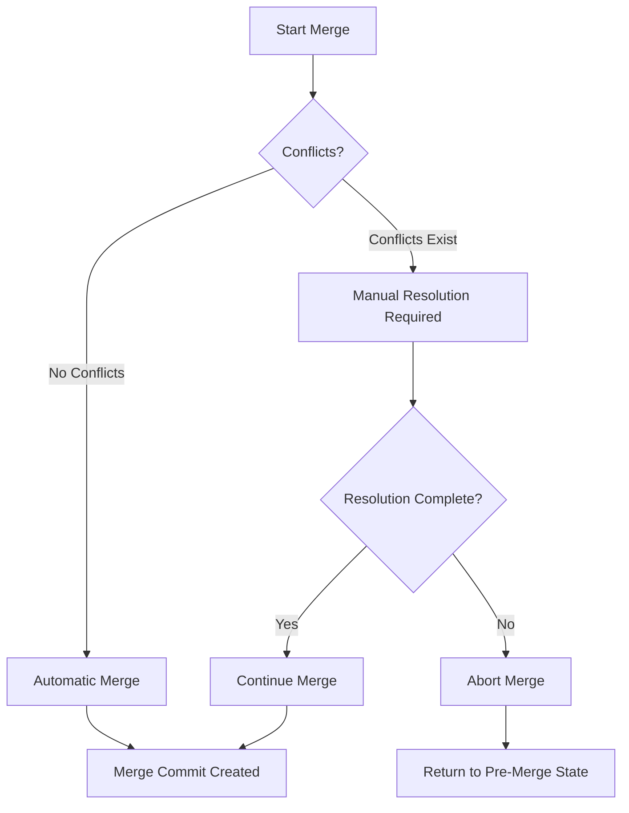

import Tabs from '@theme/Tabs';
import TabItem from '@theme/TabItem';

# Git Abort Merge

## Introduction

When working with Git, merging branches is a common operation. However, sometimes a merge doesn't go as planned - you might encounter unexpected conflicts, realize you're merging the wrong branch, or simply want to start over. This is where Git's ability to abort a merge becomes invaluable.

In this tutorial, we'll explore how to safely abort a merge operation in Git, allowing you to return to the state before the merge was initiated.

## When to Abort a Merge

You might want to abort a merge operation in several scenarios:

1. **Unexpected merge conflicts** that are too complex or numerous to resolve at the moment
2. **Merging the wrong branch** by mistake
3. **Needing more preparation** before performing the merge
4. **Testing a merge** to see what conflicts might arise, with the intention of aborting afterward

## How Git Merge Works

Before we dive into aborting merges, let's quickly understand what happens during a merge:



When Git cannot automatically merge changes due to conflicts, it enters a special state known as the "merge in progress" state.

## Aborting a Merge

### The Basic Command

To abort a merge that's in progress, you use:

```bash
git merge --abort
```

This command will:
- Stop the merge process
- Revert all changes made during the merge attempt
- Return your working directory to the state it was in before you started the merge

### Example Scenario

Let's walk through a practical example:

```bash
# You're on the main branch
git checkout main

# Start merging a feature branch
git merge feature-branch

# Git reports conflicts
# CONFLICT (content): Merge conflict in src/app.js
# CONFLICT (content): Merge conflict in src/utils.js
# Automatic merge failed; fix conflicts and then commit the result.

# You decide you're not ready to deal with these conflicts
git merge --abort

# Your repository is now back to the state before the merge attempt
```

Here's the terminal output you might see:

```
$ git checkout main
Already on 'main'

$ git merge feature-branch
Auto-merging src/utils.js
CONFLICT (content): Merge conflict in src/utils.js
Auto-merging src/app.js
CONFLICT (content): Merge conflict in src/app.js
Automatic merge failed; fix conflicts and then commit the result.

$ git merge --abort

$ git status
On branch main
nothing to commit, working tree clean
```

## Alternative Methods

### Using `git reset`

If for some reason `git merge --abort` doesn't work (which can happen in older Git versions), you can use:

```bash
git reset --hard HEAD
```

This forcefully resets your working directory to the state of the last commit. However, be cautious as this will discard ALL uncommitted changes, not just those from the failed merge.

### For Git Versions Below 1.7.4

In very old Git versions that don't support `git merge --abort`, use:

```bash
git reset --merge
```

This is similar to `--abort` but may behave slightly differently in certain complex scenarios.

## Practical Applications

### Scenario 1: Exploratory Merge

Sometimes you want to see what conflicts might arise when merging, without actually completing the merge:

```bash
# Start the merge to explore potential conflicts
git merge feature-branch

# Git reports conflicts, you review them to plan your strategy

# Abort the merge when you're done exploring
git merge --abort
```

### Scenario 2: Wrong Branch

You accidentally started merging the wrong branch:

```bash
# Accidentally merge the wrong branch
git merge wrong-branch

# Realize your mistake
git merge --abort

# Merge the correct branch instead
git merge correct-branch
```

### Scenario 3: Too Many Conflicts

When you encounter numerous conflicts that require careful planning:

```bash
# Start the merge
git merge complex-feature

# Git reports dozens of conflicts
# You decide this requires more planning or team discussion

git merge --abort
```

## Understanding the State During Merge

During a merge, Git enters a special state that's reflected in the output of `git status`:

```bash
$ git status
On branch main
You have unmerged paths.
  (fix conflicts and run "git commit")
  (use "git merge --abort" to abort the merge)

Unmerged paths:
  (use "git add <file>..." to mark resolution)
  both modified:   src/app.js
  both modified:   src/utils.js
```

This output explicitly tells you that you can abort the merge.

## Potential Issues After Aborting

### Uncommitted Changes

If you had uncommitted changes before starting the merge, aborting might not restore them. It's always best to start a merge with a clean working directory.

### Lingering .orig Files

Sometimes Git creates `.orig` files during conflict resolution. These might remain even after aborting. You can safely remove them:

```bash
# Remove all .orig files
find . -name "*.orig" -delete
```

## Best Practices

1. **Commit or stash changes** before starting a merge
2. **Review the branches** carefully before merging
3. **Use `git status`** to confirm you're in a merge state before aborting
4. **Consider creating a temporary branch** before attempting complex merges

## Summary

Git's `merge --abort` command provides a safety net when merging branches. It allows you to back out of a merge operation cleanly, returning your repository to its pre-merge state. This is particularly useful when encountering unexpected conflicts, merging the wrong branch, or simply needing more preparation before tackling merge issues.

Remember that aborting a merge doesn't solve conflicts; it just gives you a clean slate to approach the merge differently or at a better time.

## Additional Resources

- [Git Documentation on Merging](https://git-scm.com/docs/git-merge)
- [Git Branching and Merging Basics](https://git-scm.com/book/en/v2/Git-Branching-Basic-Branching-and-Merging)

## Exercises

1. Create a test repository with two branches containing conflicting changes, then practice initiating and aborting a merge.
2. Try using `git merge --abort` in different scenarios to understand its behavior.
3. Compare the behavior of `git merge --abort`, `git reset --hard HEAD`, and `git reset --merge` in a test repository.