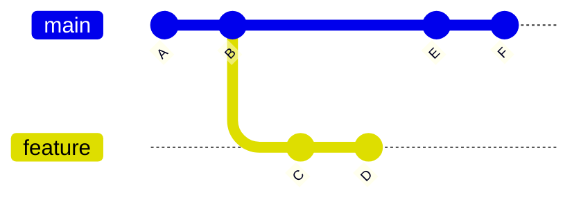

# Git Rebase

## Introduction

Git rebase is a powerful command that allows you to integrate changes from one branch into another by moving, applying, or combining commits. Unlike `git merge`, which creates a new commit to combine histories, rebasing rewrites commit history by creating new commits for each commit in the original branch.

Rebasing helps maintain a cleaner, more linear project history, making it easier to track changes and understand the evolution of your codebase. However, with this power comes responsibility, as rebasing can potentially cause complications if not used properly.

## Understanding Git Rebase

### What is Rebasing?

At its core, rebasing is the process of moving or combining a sequence of commits to a new base commit. The primary reason for rebasing is to maintain a linear project history.

Let's visualize the concept:



After rebasing the feature branch onto main:


Notice how commits C and D get recreated as C' and D' with new hashes, now based on commit F.

### Basic Rebase vs. Merge

| Merge | Rebase |
|-------|--------|
| Preserves history exactly as it happened | Creates a linear history |
| Creates a merge commit | No additional merge commits |
| Non-destructive operation | Rewrites commit history |
| Easier to understand | Cleaner history |

## Basic Rebase Command

The basic syntax for rebasing is:

```bash
git checkout feature
git rebase main
```

This command takes all the changes from the feature branch and replays them on top of the main branch.

## Step-by-Step Rebasing Process

Let's walk through a practical rebasing scenario:

### 1. Create a Feature Branch

```bash
# Start from main branch
git checkout main
git pull

# Create and switch to a new feature branch
git checkout -b feature-login
```

### 2. Make Changes in Your Feature Branch

```bash
# Make changes to files
echo "function login() {" >> login.js
echo "  // Login logic here" >> login.js
echo "}" >> login.js

# Commit your changes
git add login.js
git commit -m "Add login function"
```

### 3. Meanwhile, Changes Happen in Main

While you're working on your feature, other team members might push changes to the main branch.

```bash
# Simulate main branch moving forward
git checkout main
echo "// Copyright notice" > header.js
git add header.js
git commit -m "Add copyright header"
git checkout feature-login
```

### 4. Rebase Your Feature Branch onto Main

```bash
# Make sure you're on your feature branch
git checkout feature-login

# Rebase onto main
git rebase main
```

Output:
```
Successfully rebased and updated refs/heads/feature-login.
```

Your feature branch commits are now based on the latest main branch.

## Interactive Rebasing

Interactive rebasing allows you to modify commits during the rebase process. This is useful for cleaning up your commit history before merging your changes.

```bash
git rebase -i main
```

This opens an editor with a list of commits to be rebased:

```
pick ab123de Add login function
pick cd456fg Add login UI elements
pick ef789hi Fix login validation

# Commands:
# p, pick <commit> = use commit
# r, reword <commit> = use commit, but edit the commit message
# e, edit <commit> = use commit, but stop for amending
# s, squash <commit> = use commit, but meld into previous commit
# f, fixup <commit> = like "squash", but discard this commit's log message
# d, drop <commit> = remove commit
#
# These lines can be re-ordered; they are executed from top to bottom.
#
```

### Common Interactive Rebase Operations

#### Squashing Commits

To combine multiple commits into one:

```
pick ab123de Add login function
squash cd456fg Add login UI elements
squash ef789hi Fix login validation
```

This will combine all three commits into a single commit.

#### Rewording Commit Messages

To change a commit message:

```
pick ab123de Add login function
reword cd456fg Add login UI elements
pick ef789hi Fix login validation
```

#### Removing Commits

To delete a commit entirely:

```
pick ab123de Add login function
drop cd456fg This commit will be removed
pick ef789hi Fix login validation
```

## Real-World Use Cases

### 1. Cleaning Up Branch Before Merging

One common workflow is to clean up your feature branch before merging it into the main branch:

```bash
# Create a feature branch with multiple commits
git checkout -b feature-user-profile
# Make several commits...

# Before merging, clean up the history
git rebase -i main
# In the editor, squash related commits and reword messages

# Now merge with a clean history
git checkout main
git merge feature-user-profile
```

### 2. Integrating Upstream Changes

When working on a long-lived feature branch, you might want to periodically incorporate changes from the main branch:

```bash
# While on your feature branch
git fetch origin
git rebase origin/main

# Resolve any conflicts if they arise
git add .
git rebase --continue
```

### 3. Maintaining a Fork

When contributing to open-source projects, rebasing helps keep your fork up-to-date:

```bash
# Add the upstream repository
git remote add upstream https://github.com/original/repo.git

# Get latest changes from upstream
git fetch upstream

# Rebase your master branch
git checkout master
git rebase upstream/master

# Push to your fork with force (be careful!)
git push --force-with-lease
```

## Dealing with Conflicts

Rebasing can lead to conflicts when the same part of a file has been modified in both branches. When this happens:

1. Git will pause the rebase and show you which files have conflicts.
2. Edit the files to resolve the conflicts.
3. Add the resolved files with `git add`.
4. Continue the rebase with `git rebase --continue`.

Example conflict resolution:

```bash
git rebase main
# Conflict in login.js
# Edit login.js to resolve the conflict

git add login.js
git rebase --continue
```

## When to Avoid Rebasing

While rebasing creates a cleaner history, it's not always the right choice:

1. **Public Branches**: Never rebase commits that have been pushed to public branches. This can cause serious problems for collaborators.
2. **When History Matters**: If the exact sequence of events is important for understanding why changes were made.
3. **Complex Merges**: When there are many complex conflicts, a merge might be easier to manage.

## Golden Rule of Rebasing

> Never rebase a branch that others are working on.

This is because rebasing changes commit history, which can cause conflicts for other developers who have based their work on the original commits.

## Summary

Git rebase is a powerful tool for maintaining a clean, linear project history. It allows you to:

- Incorporate changes from one branch into another
- Clean up commit history before sharing
- Maintain a more readable project history

However, it's important to use rebase carefully, especially with shared branches, as it rewrites commit history.

## Additional Resources and Exercises

### Exercises

1. Create two branches and practice rebasing one onto the other.
2. Try an interactive rebase to squash multiple commits.
3. Intentionally create a conflict during rebase and practice resolving it.
4. Set up a scenario where you need to rebase a feature branch multiple times as the main branch evolves.

### Further Reading

- The Git documentation on [rebasing](https://git-scm.com/book/en/v2/Git-Branching-Rebasing)
- [Atlassian's Git tutorial](https://www.atlassian.com/git/tutorials/rewriting-history/git-rebase) on rebasing
- [Pro Git book](https://git-scm.com/book/en/v2) for in-depth Git knowledge