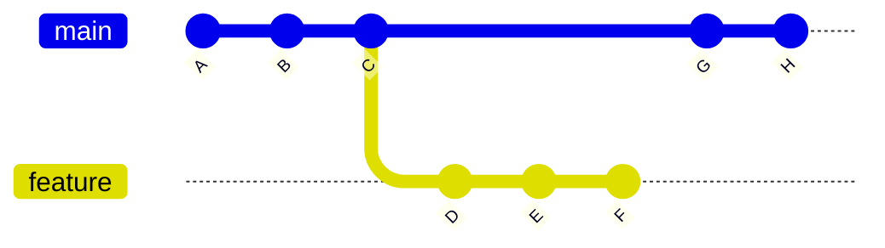
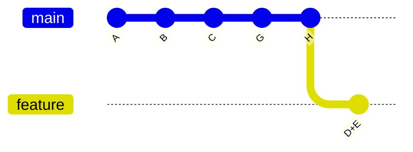

# Git Rebase Interactive

## Introduction

Interactive rebase is one of Git's most powerful features that allows you to modify your commit history before integrating changes with the main branch. While standard rebasing helps maintain a linear project history, interactive rebasing gives you precise control over that history, letting you reorder, combine, modify, or even remove commits before they become part of the main project timeline.

This guide will walk you through the process of using Git's interactive rebase feature, explain why and when you might want to use it, and provide practical examples to help you incorporate it into your workflow.

## What is Interactive Rebase?

Interactive rebase is an extension of Git's regular rebase command that allows you to stop after each commit you're rebasing and:

- Edit the commit message
- Combine multiple commits into one
- Reorder commits
- Delete commits entirely 
- Split a commit into multiple commits
- Edit/modify the content of commits

This level of control is incredibly useful for cleaning up your branch's history before sharing your work with others or before merging into a main branch.

## When to Use Interactive Rebase

Interactive rebase is most useful in these situations:

- **Before submitting a pull request**: Clean up your commit history to make it more logical and easier to review
- **When you have "work in progress" commits**: Combine them into meaningful units of work
- **When you need to fix a commit**: For example, if you forgot to add a file or made a typo in the commit message
- **When you want to maintain a clean, linear project history**: By organizing commits into a logical sequence

## Basic Interactive Rebase Syntax

The basic command for interactive rebase is:

```bash
git rebase -i <base>
```

Where `<base>` is the commit or branch that you want to rebase onto. This is often expressed as:

```bash
git rebase -i HEAD~n
```

Where `n` is the number of commits you want to include in the interactive rebase.

## Interactive Rebase Commands

When you run an interactive rebase, Git opens your default text editor with a list of commits and available commands. Here are the most common commands:

- `pick`: Use the commit as is
- `reword`: Use the commit but edit the commit message
- `edit`: Use the commit but stop for amending
- `squash`: Combine this commit with the previous one and edit the commit message
- `fixup`: Similar to squash, but discards this commit's message
- `drop`: Remove the commit entirely

## Step-by-Step Examples

### Example 1: Cleaning Up Commit History

Imagine you have a series of commits like this:

```bash
$ git log --oneline
abc1234 Fix typo in README
def5678 Add new feature
ghi9101 WIP: Add tests for new feature
jkl1121 Complete test suite
mno1314 Fix bug in new feature
```

And you want to clean this up before creating a pull request. Here's how to use interactive rebase:

1. Start the interactive rebase:

```bash
git rebase -i HEAD~5
```

2. Your editor will open with something like this:

```
pick abc1234 Fix typo in README
pick def5678 Add new feature
pick ghi9101 WIP: Add tests for new feature
pick jkl1121 Complete test suite
pick mno1314 Fix bug in new feature
```

3. Modify the file to reorder and combine commits:

```
pick def5678 Add new feature
fixup mno1314 Fix bug in new feature
pick ghi9101 WIP: Add tests for new feature
squash jkl1121 Complete test suite
pick abc1234 Fix typo in README
```

4. Save and close the editor. Git will apply your changes and might ask you to edit commit messages for squashed commits.

5. Your history will now look like:

```bash
$ git log --oneline
abc1234 Fix typo in README
newi123 Add tests for new feature
newh456 Add new feature
```

### Example 2: Editing a Previous Commit

If you need to modify the content of a previous commit:

1. Start the interactive rebase:

```bash
git rebase -i HEAD~3
```

2. Change `pick` to `edit` for the commit you want to modify:

```
pick abc1234 Fix typo in README
edit def5678 Add new feature
pick ghi9101 Add tests
```

3. When Git stops at the commit, make your changes:

```bash
# Make your changes
git add <modified-files>
git commit --amend
```

4. Continue the rebase:

```bash
git rebase --continue
```

## Visualizing Rebase with Diagrams

Interactive rebase modifies your Git history. Let's visualize what happens:



After interactive rebase to clean up commits D, E, and F (squashing E into D and removing F):



## Common Pitfalls and How to Avoid Them

### 1. Rebasing Published History

**Pitfall**: Rebasing commits that have already been pushed to a shared repository can cause conflicts for other team members.

**Solution**: Only rebase commits that exist solely in your local repository. Follow the golden rule: **never rebase commits that have been pushed publicly**.

### 2. Conflicts During Rebase

**Pitfall**: You might encounter merge conflicts during a rebase.

**Solution**: Resolve conflicts as they occur, then:

```bash
git add <resolved-files>
git rebase --continue
```

Or if you want to abort the rebase:

```bash
git rebase --abort
```

### 3. Losing Commits

**Pitfall**: It's possible to accidentally lose commits during interactive rebase.

**Solution**: Create a backup branch before rebasing:

```bash
git branch backup-branch
```

## Best Practices for Interactive Rebase

1. **Create Small, Focused Commits**: Even though you can reorganize later, it's best to create meaningful commits from the start.

2. **Rebase Before Pushing**: Clean up your history before sharing it with others.

3. **Write Clear Commit Messages**: This makes it easier to understand what each commit does when rebasing.

4. **Use Feature Branches**: Always perform interactive rebases on feature branches, not on main branches.

5. **Test After Rebasing**: Ensure your code still works after rebasing, especially after resolving conflicts.

## Real-World Application: Preparing a Pull Request

Here's a common workflow that utilizes interactive rebase:

1. Create a feature branch and develop your feature
2. Make frequent small commits as you work
3. When the feature is complete, use interactive rebase to:
   - Combine related commits
   - Remove "work in progress" commits
   - Ensure each commit passes tests
   - Create a clean, logical history
4. Push your cleaned-up branch and create a pull request

## Summary

Interactive rebase is a powerful tool for maintaining a clean, logical Git history. By allowing you to reorganize, combine, edit, and remove commits before they're merged into the main project, it enables you to present your work in a more coherent and understandable manner.

Remember that while interactive rebase is powerful, it should be used cautiously, especially when working with shared repositories. Always follow the golden rule: don't rebase commits that have been pushed publicly.

## Exercises

1. Create a series of commits on a feature branch, then use interactive rebase to combine them into a single commit.
2. Practice reordering commits using interactive rebase.
3. Use the `edit` command to modify a previous commit's content.
4. Experiment with `reword` to change commit messages of older commits.
5. Create a "messy" branch with work-in-progress commits, then clean it up with interactive rebase before creating a pull request.

## Additional Resources

- [Git Documentation on Rewriting History](https://git-scm.com/book/en/v2/Git-Tools-Rewriting-History)
- [Atlassian's Tutorial on Rewriting History](https://www.atlassian.com/git/tutorials/rewriting-history)
- [Pro Git Book - Interactive Rebasing](https://git-scm.com/book/en/v2/Git-Tools-Rewriting-History#_changing_multiple)