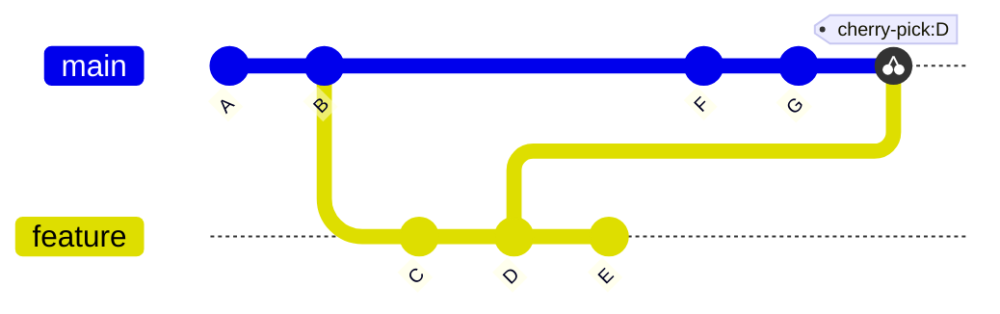

# Git Cherry Pick

## Introduction

When working with Git, you'll often need to apply specific changes from one branch to another. While merging and rebasing are common ways to combine branches, sometimes you only want to pick specific commits rather than the entire branch. This is where Git's `cherry-pick` command comes in handy.

Git cherry-pick allows you to select individual commits from one branch and apply them to another branch. Think of it as "picking the cherries" (specific commits) that you want, rather than taking the entire tree (branch).

## What is Git Cherry Pick?

Cherry picking in Git is the act of selecting a specific commit from one branch and applying it to another branch. Unlike merge or rebase operations that typically work with the entire branch history, cherry-pick focuses on individual commits.



In the diagram above, we cherry-picked commit "D" from the feature branch and applied it to the main branch.

## Basic Syntax

The basic syntax for cherry-pick is:

```bash
git cherry-pick <commit-hash>
```

Where `<commit-hash>` is the unique identifier of the commit you want to apply to your current branch.

## When to Use Cherry Pick

Cherry picking is particularly useful in the following scenarios:

1. **Hotfixes**: When you need to apply a bug fix to multiple branches
2. **Feature extraction**: When you want to pull specific features from a development branch into a release branch
3. **Recovery**: When you need to recover specific work from a branch that won't be merged
4. **Selective merging**: When you want to apply only certain commits from a team member's branch

## Step-by-Step Examples

### Example 1: Basic Cherry Picking

Let's say you're working on a project with two branches: `main` and `feature`. You've made several commits in the `feature` branch, but you only want to apply one specific commit to `main`.

First, find the commit hash you want to cherry-pick:

```bash
git log feature
```

Output:
```
commit abc123... (feature)
Author: Your Name <your.email@example.com>
Date:   Mon Feb 12 14:22:48 2024 -0500

    Add responsive navigation menu

commit def456...
Author: Your Name <your.email@example.com>
Date:   Mon Feb 12 13:15:32 2024 -0500

    Fix button styling issues

commit ghi789...
Author: Your Name <your.email@example.com>
Date:   Mon Feb 12 10:30:21 2024 -0500

    Implement user authentication
```

Now, switch to the branch where you want to apply the commit:

```bash
git checkout main
```

Then cherry-pick the commit:

```bash
git cherry-pick def456
```

Now the "Fix button styling issues" commit has been applied to your `main` branch, without bringing along the other commits from the `feature` branch.

### Example 2: Cherry Picking Multiple Commits

You can cherry-pick multiple commits in one command:

```bash
git cherry-pick <commit-hash-1> <commit-hash-2> <commit-hash-3>
```

Or, to pick a range of commits:

```bash
git cherry-pick <start-commit>..<end-commit>
```

Let's say you want to pick three consecutive commits from the `feature` branch:

```bash
git cherry-pick ghi789..abc123
```

This will apply all commits between `ghi789` (exclusive) and `abc123` (inclusive) to your current branch.

### Example 3: Handling Cherry Pick Conflicts

Sometimes, cherry-picking can result in conflicts, just like merging. When this happens, Git will pause the cherry-pick operation and ask you to resolve the conflicts.

For example:

```bash
git cherry-pick abc123
```

Output:
```
error: could not apply abc123... Add responsive navigation menu
hint: after resolving the conflicts, mark the corrected paths
hint: with 'git add <paths>' or 'git rm <paths>'
hint: and commit the result with 'git commit'
```

To resolve these conflicts:

1. Edit the conflicted files to resolve the conflicts
2. Stage the resolved files:

```bash
git add <resolved-files>
```

3. Continue the cherry-pick:

```bash
git cherry-pick --continue
```

Alternatively, you can abort the cherry-pick operation:

```bash
git cherry-pick --abort
```

## Advanced Cherry Pick Options

### Cherry Pick Without Committing

If you want to apply the changes from a commit but not create a new commit:

```bash
git cherry-pick -n <commit-hash>
```

This adds the changes to your working directory and staging area, but doesn't commit them automatically. You can review the changes and make your own commit later.

### Cherry Pick With Edit

If you want to edit the commit message during cherry-pick:

```bash
git cherry-pick -e <commit-hash>
```

This opens your default text editor to allow you to modify the commit message.

### Cherry Pick a Merge Commit

Merge commits are special because they have multiple parent commits. To cherry-pick a merge commit, you need to specify which parent to follow:

```bash
git cherry-pick -m 1 <merge-commit-hash>
```

The `-m` flag followed by a number specifies which parent to use as the mainline. Usually, `-m 1` refers to the branch you merged into, and `-m 2` refers to the branch that was merged.

## Real-World Applications

### Scenario 1: Backporting Fixes to an Older Version

Imagine you're maintaining multiple versions of your software. You fixed a critical bug in the latest version (version 2.0), but you also need to apply this fix to an older supported version (version 1.5).

1. Find the commit hash for the bug fix in version 2.0:

```bash
git log -p
```

2. Checkout the maintenance branch for version 1.5:

```bash
git checkout maintenance/1.5
```

3. Cherry-pick the bug fix:

```bash
git cherry-pick abc123
```

Now your bug fix has been backported to the older version!

### Scenario 2: Moving Experimental Features to a New Branch

You've been experimenting with several features in an experimental branch, but you realize that one specific feature is ready for inclusion in your development branch.

1. Identify the commit that implements the ready feature:

```bash
git log experimental
```

2. Create or switch to your development branch:

```bash
git checkout development
```

3. Cherry-pick the feature commit:

```bash
git cherry-pick def456
```

Now you have selectively moved just that one feature to your development branch.

## Best Practices for Cherry Picking

1. **Use sparingly**: Cherry picking can make your repository's history harder to understand because the same changes appear in multiple places.

2. **Document your cherry picks**: It's helpful to mention in the commit message that the commit was cherry-picked from another branch.

3. **Consider merge/rebase first**: If you're cherry-picking many commits, consider whether a merge or rebase might be more appropriate.

4. **Be aware of dependencies**: When cherry-picking, be careful about commit dependencies. If commit B depends on changes introduced in commit A, you should cherry-pick both (and in the right order).

5. **Watch for conflicts**: Cherry picking can create conflicts if the target branch has diverged significantly from the source branch.

## Summary

Git cherry-pick is a powerful tool that allows you to selectively apply specific commits from one branch to another. It's useful for backporting fixes, extracting specific features, and selectively integrating changes.

While it's not a replacement for regular merging or rebasing operations, cherry-pick provides fine-grained control over which changes you integrate and when.

Key points to remember:
- Cherry-pick applies a specific commit to your current branch
- It creates a new commit with the same changes but a different hash
- It can cause conflicts that need manual resolution
- It should be used judiciously, as it can complicate repository history

## Additional Resources

- [Git Official Documentation on cherry-pick](https://git-scm.com/docs/git-cherry-pick)
- [Pro Git Book - Advanced Merging chapter](https://git-scm.com/book/en/v2/Git-Tools-Advanced-Merging)

## Exercises

1. Create two branches: `exercise-main` and `exercise-feature`. Make several commits to the feature branch, then practice cherry-picking specific commits to the main branch.

2. Practice cherry-picking multiple commits in one command.

3. Deliberately create a conflict by modifying the same file in both branches, then practice resolving the conflict during a cherry-pick operation.

4. Try cherry-picking a merge commit and observe what happens with and without the `-m` option.

5. Use the `--no-commit` option to cherry-pick a commit, then modify the changes before committing them.