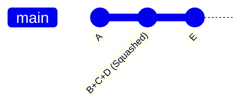

# Git Squash Commits

## Introduction

When working with Git, you'll often make multiple commits while developing a feature. These commits might represent small incremental changes, fixes, or work-in-progress snapshots. While this approach is great during development, it can create a cluttered commit history that's difficult to understand when looking back at the project.

This is where **commit squashing** comes in. Squashing commits means combining multiple commits into a single, cohesive commit. This technique helps maintain a clean, organized Git history that clearly communicates the purpose of each change.

## What is Commit Squashing?

Commit squashing is the process of combining several commits into one. It's particularly useful when:

- You've made multiple small, incremental commits while working on a feature
- You want to clean up "work in progress" commits before merging
- You need to combine fixup commits with their original changes
- You want to present a clean, logical history to other developers

Let's see how squashing works in practice.

## Methods for Squashing Commits

There are several ways to squash commits in Git. We'll cover the most common methods:

### 1. Interactive Rebase

The most flexible way to squash commits is using Git's interactive rebase feature.

#### Basic Syntax

```bash
git rebase -i <base-commit>
```

Here, `<base-commit>` is the commit before the oldest commit you want to modify. You can also use relative references like `HEAD~3` to specify "3 commits back from the current HEAD".

#### Step-by-Step Example

Let's say you have a series of commits like this:

```
A -> B -> C -> D -> E (HEAD)
```

And you want to squash commits B, C, and D into a single commit.

1. Start an interactive rebase for the last 4 commits:

```bash
git rebase -i HEAD~4
```

2. Your text editor will open with something like:

```
pick f7f3f6d A
pick df71a27 B
pick c5af687 C
pick 6c36088 D
pick 7289ab6 E

# Commands:
# p, pick = use commit
# r, reword = use commit, but edit the commit message
# e, edit = use commit, but stop for amending
# s, squash = use commit, but meld into previous commit
# f, fixup = like "squash", but discard this commit's log message
# x, exec = run command (the rest of the line) using shell
# d, drop = remove commit
```

3. Change the file to squash commits B, C, and D by replacing "pick" with "squash" or "s":

```
pick f7f3f6d A
squash df71a27 B
squash c5af687 C
squash 6c36088 D
pick 7289ab6 E
```

4. Save and close the editor.

5. Git will then ask you to edit the combined commit message. It will show all the messages from the squashed commits. Edit this to create a clear, comprehensive message for the combined commit.

6. Save and close this editor as well.

Now your commit history looks like:

```
A' -> E (HEAD)
```

Where A' is the new combined commit containing the changes from A, B, C, and D.

### 2. Using `git merge --squash`

Another approach is to use the `--squash` option when merging a branch.

#### Basic Syntax

```bash
git merge --squash <branch-name>
```

This takes all the changes from `<branch-name>` and stages them in your current branch, allowing you to create a single commit.

#### Example

Suppose you have a feature branch with multiple commits:

```
main:   A -> B -> C
                 \
feature:          D -> E -> F
```

To squash all commits from the feature branch into one:

1. Make sure you're on the main branch:

```bash
git checkout main
```

2. Use merge with the squash option:

```bash
git merge --squash feature
```

3. This stages all changes from the feature branch but doesn't commit them yet. You can now create a single commit:

```bash
git commit -m "Implement feature X with functionalities Y and Z"
```

The result is a single commit on the main branch that contains all changes from the feature branch:

```
main:   A -> B -> C -> G
                 \
feature:          D -> E -> F
```

Where G is the new squashed commit.

## When to Squash Commits

Squashing commits is most useful in these scenarios:

### 1. Before Creating a Pull Request

When working on a feature branch, you might make numerous commits with messages like "WIP", "Fix typo", or "Small adjustment". Before creating a pull request, squash these into meaningful, logical commits that are easier for reviewers to understand.

### 2. After Code Review

If you receive feedback on a pull request, you might make additional commits to address the feedback. Before merging, you can squash these fixes with their corresponding functional commits.

### 3. Fixing Mistakes

If you notice a mistake shortly after making a commit, you can make a fix and then squash the fix with the original commit.

## Real-world Example

Let's walk through a complete real-world scenario:

1. You're working on a feature to add user authentication to your web application
2. Your commit history looks like this:

```
- 7f8d922 Initial user authentication implementation
- af3c789 Add password hashing
- 15ef302 Fix login form styling
- c8f9d12 WIP on user registration
- 9b1a354 Complete user registration
- 53cd651 Fix typo in registration form
- e2a7b89 Add password validation
- 86cb107 Fix security bug in auth token generation
```

3. Before submitting a pull request, you decide to squash these commits into logical units:

```bash
git rebase -i HEAD~8
```

4. You decide to organize them into three meaningful commits:

```
pick 7f8d922 Initial user authentication implementation
squash af3c789 Add password hashing
squash 15ef302 Fix login form styling

pick c8f9d12 WIP on user registration
squash 9b1a354 Complete user registration
squash 53cd651 Fix typo in registration form

pick e2a7b89 Add password validation
squash 86cb107 Fix security bug in auth token generation
```

5. After completing the rebase, your history is much cleaner:

```
- 8a3d105 Implement user login functionality with secure password hashing
- 4c7e922 Add complete user registration system
- 3f9a247 Implement password validation with secure token generation
```

This history clearly communicates the purpose of your changes and makes code review much more straightforward.

## Visualizing the Squash Process

Let's visualize what happens during a commit squash:


After squashing commits B, C, and D:



## Best Practices

1. **Squash Related Changes**: Combine commits that are part of the same logical change.

2. **Write Clear Commit Messages**: When squashing, take time to write a comprehensive commit message that explains the purpose and impact of all the combined changes.

3. **Don't Squash Commits That Have Been Pushed**: Avoid squashing commits that others might have already pulled, as this changes history and can cause conflicts.

4. **Keep Important Checkpoints**: Not every commit needs to be squashed. Significant milestones or logical separations should remain as distinct commits.

5. **Use Fixup for Simple Corrections**: When making a small fix to a recent commit, use `git commit --fixup=<commit>` followed by `git rebase -i --autosquash` to automatically organize the squash.

## Common Issues and Solutions

### 1. Conflicts During Rebase

When squashing commits, you might encounter merge conflicts if changes in different commits affect the same lines of code.

**Solution**: Resolve conflicts as they appear during the rebase process. Git will pause the rebase when it encounters a conflict, allowing you to fix it and continue with `git rebase --continue`.

### 2. Lost Work After Failed Rebase

If something goes wrong during a rebase, you might worry about losing work.

**Solution**: Git keeps the original branch refs in `ORIG_HEAD`. If you need to abort a problematic rebase, use `git rebase --abort`, or recover with `git reset --hard ORIG_HEAD`.

### 3. Accidentally Squashed Too Much

If you've squashed commits you didn't intend to squash:

**Solution**: If you haven't pushed the changes, you can use `git reflog` to find the state before the rebase and reset to it with `git reset --hard HEAD@{n}` where `n` is the appropriate reflog entry.

## Command Reference

Here's a quick reference of commands related to commit squashing:

| Command | Description |
|---------|-------------|
| `git rebase -i <base-commit>` | Start an interactive rebase |
| `git merge --squash <branch>` | Squash all commits from a branch |
| `git commit --fixup=<commit>` | Mark a commit as a fix for a previous one |
| `git rebase -i --autosquash` | Automatically organize fixup commits during rebase |
| `git rebase --abort` | Abort an ongoing rebase |
| `git reset --hard ORIG_HEAD` | Revert to the state before a rebase |

## Summary

Squashing commits is a powerful technique for maintaining a clean, meaningful Git history. By combining multiple related commits into logical units, you make your project's history more comprehensible and useful to other developers.

Key points to remember:
- Use interactive rebase (`git rebase -i`) for maximum flexibility
- Consider `git merge --squash` when integrating feature branches
- Squash related commits that form a single logical change
- Write clear, comprehensive commit messages for squashed commits
- Be cautious about squashing commits that have already been shared

By following these guidelines, you'll create a Git history that serves as clear documentation of your project's evolution.

## Exercises

1. Create a new feature branch and make 5 small commits. Then practice squashing them into a single commit using interactive rebase.

2. Try the `--fixup` and `--autosquash` workflow: make a commit, then a fix commit with `--fixup`, and finally perform an `--autosquash` rebase.

3. Create two branches with different sets of commits, then try using `git merge --squash` to combine all changes from one branch into a single commit on the other.

## Additional Resources

- [Git Official Documentation on Rewriting History](https://git-scm.com/book/en/v2/Git-Tools-Rewriting-History)
- [Pro Git Book - Chapter 7.6: Git Tools - Rewriting History](https://git-scm.com/book/en/v2/Git-Tools-Rewriting-History)
- [Atlassian Git Tutorial - Rewriting History](https://www.atlassian.com/git/tutorials/rewriting-history)