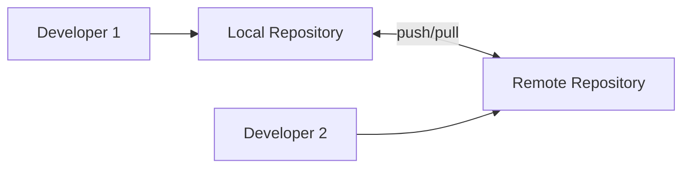

# Git Remote Basics

## Introduction

When you're working on a project by yourself, you might be perfectly happy using Git locally on your computer. However, the real power of Git emerges when you start collaborating with others or working across multiple devices. This is where **remote repositories** come into play.

A remote repository is a version of your project that's hosted somewhere on the internet or on a network. It allows you to:
- Collaborate with team members on the same codebase
- Backup your code to a server
- Access your code from different computers
- Contribute to open-source projects

In this tutorial, we'll explore the basic concepts and commands for working with Git remote repositories.

## Understanding Remote Repositories

Remote repositories are versions of your project that are hosted on the internet or network. You can have multiple remote repositories connected to your local repository, but typically you'll have a primary remote known as **origin**.



## Setting Up Remote Repositories

### Viewing Remote Repositories

To see which remote servers you have configured, run:

```bash
git remote
```

If you've cloned your repository, you should see at least `origin` - which is the default name Git gives to the server you cloned from.

For more detailed information, use:

```bash
git remote -v
```

This shows the URLs that Git has stored for each remote:

```
origin  https://github.com/username/repository.git (fetch)
origin  https://github.com/username/repository.git (push)
```

### Adding Remote Repositories

To add a new remote repository to your project, use:

```bash
git remote add <shortname> <url>
```

For example:

```bash
git remote add origin https://github.com/username/new-repository.git
```

This command associates the name `origin` with the specified URL.

### Removing and Renaming Remotes

If you want to remove a remote, you can use:

```bash
git remote remove <name>
```

To rename a remote, use:

```bash
git remote rename <old-name> <new-name>
```

## Working with Remote Repositories

### Fetching from Remote Repositories

To get data from your remote projects, you can run:

```bash
git fetch <remote>
```

For example:

```bash
git fetch origin
```

This command pulls down all the data from the remote repository that you don't have yet. After fetching, you have references to all the branches from that remote, which you can merge or inspect.

> **Note**: `git fetch` only downloads the data to your local repository — it doesn't automatically merge it with any of your work or modify what you're currently working on.

### Pulling from Remote Repositories

To automatically fetch and then merge the remote branch into your current branch, you can use:

```bash
git pull <remote> <branch>
```

For example:

```bash
git pull origin main
```

This is equivalent to running `git fetch` followed by `git merge origin/main`.

### Pushing to Remote Repositories

When your project is ready to be shared, you need to push it upstream:

```bash
git push <remote> <branch>
```

For example:

```bash
git push origin main
```

This pushes your `main` branch to the `origin` server. This command only works if you have write access to the server and no one has pushed in the meantime.

## Inspecting Remote Repositories

To get more information about a particular remote, use:

```bash
git remote show <remote>
```

For example:

```bash
git remote show origin
```

This will show information about the remote repository, including which branches are tracked, which branches are mapped for `git pull` and `git push`, and which branches are out of date.

## Practical Examples

### Example 1: Contributing to an Open Source Project

Let's walk through a common workflow for contributing to an open-source project:

1. Fork the repository on GitHub (or another platform)
2. Clone your fork locally:
   ```bash
   git clone https://github.com/yourusername/project.git
   ```
3. Add the original repository as a remote called "upstream":
   ```bash
   git remote add upstream https://github.com/original-owner/project.git
   ```
4. Create a new branch for your feature:
   ```bash
   git checkout -b feature-branch
   ```
5. Make changes and commit them
6. Push your feature branch to your fork:
   ```bash
   git push origin feature-branch
   ```
7. Create a pull request from your fork to the original repository

### Example 2: Working on Different Computers

If you work on multiple computers, you can use a remote repository as a central hub:

1. Push your changes from Computer A:
   ```bash
   git push origin main
   ```
2. On Computer B, pull the latest changes:
   ```bash
   git pull origin main
   ```
3. Make new changes on Computer B and push them:
   ```bash
   git push origin main
   ```
4. Go back to Computer A and pull the latest changes:
   ```bash
   git pull origin main
   ```

## Common Issues and Troubleshooting

### Push Rejection

If your push is rejected, it's often because someone else pushed to the same branch. You'll need to pull their changes first:

```bash
git pull origin main
# Resolve any merge conflicts
git push origin main
```

### Remote Branch Deletion

To delete a remote branch:

```bash
git push origin --delete branch-name
```

### Tracking Remote Branches

To set up a local branch to track a remote branch:

```bash
git checkout --track origin/branch-name
```

Or, if you already have a local branch:

```bash
git branch -u origin/branch-name
```

## Summary

Remote repositories are essential for collaboration and working across multiple environments. In this guide, we've covered:

- Understanding what remote repositories are
- Adding and configuring remotes
- Fetching, pulling, and pushing to remotes
- Inspecting remotes
- Common workflows and troubleshooting

Working with remote repositories opens up a world of collaboration possibilities with Git. Whether you're contributing to open-source projects or working with a team, understanding these basics is crucial.

## Exercises

1. Create a repository on GitHub or GitLab
2. Clone it to your local machine
3. Create a new file and commit it
4. Push your changes to the remote repository
5. Make changes directly on the remote (through the web interface)
6. Pull those changes to your local repository
7. Add a second remote pointing to the same repository (with a different name)
8. Fetch and merge changes from this second remote

## Additional Resources

- [Git Documentation - Working with Remotes](https://git-scm.com/book/en/v2/Git-Basics-Working-with-Remotes)
- [GitHub Guides](https://guides.github.com/)
- [Learn Git Branching](https://learngitbranching.js.org/) - Interactive tutorial