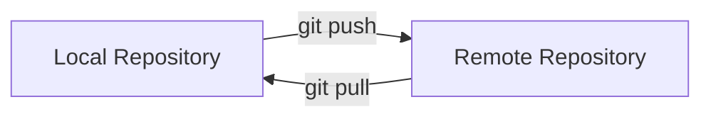

# Git Remote Adding

## Introduction

When working with Git, you'll often need to collaborate with other developers or back up your code to a server. This is where **remote repositories** come into play. A remote repository is a version of your project hosted on the internet or on a network somewhere. In this tutorial, we'll focus specifically on how to add remote repositories to your local Git setup.

Adding remotes allows you to:
- Collaborate with team members
- Contribute to open-source projects
- Back up your code to services like GitHub, GitLab, or Bitbucket
- Deploy your code to production servers

Let's dive into how remote adding works in Git!

## Prerequisites

Before we start, make sure you have:
- Git installed on your computer
- A local Git repository (created using `git init` or `git clone`)
- (Optional) An account on GitHub, GitLab, or another Git hosting service

## Understanding Git Remotes

A remote in Git is simply a reference to another repository. When you add a remote, you're essentially creating a named shortcut for a specific URL. This allows you to easily push changes to or pull changes from that remote repository.

Here's a simple diagram showing the relationship between local and remote repositories:



## Adding a Remote Repository

### Basic Syntax

The basic command to add a remote repository is:

```bash
git remote add <name> <url>
```

Where:
- `<name>` is a short name you'll use to refer to this remote (commonly "origin")
- `<url>` is the URL of the remote repository (HTTPS or SSH)

### Step-by-Step Example

Let's walk through adding a remote repository to an existing local Git project:

1. First, let's check if we already have any remotes:

```bash
git remote -v
```

If you've just created a repository with `git init`, this command won't show any output because no remotes exist yet.

2. Now, let's add a remote repository:

```bash
git remote add origin https://github.com/username/repository.git
```

This creates a remote named "origin" pointing to the GitHub repository URL.

3. Verify that the remote was added successfully:

```bash
git remote -v
```

Output:
```
origin  https://github.com/username/repository.git (fetch)
origin  https://github.com/username/repository.git (push)
```

Congratulations! You've successfully added a remote repository.

## Common Remote Names and Conventions

While you can name remotes anything you want, there are some common conventions:

- **origin**: The default name for the primary remote repository (where your project was cloned from or where you want to publish your code)
- **upstream**: Commonly used when you've forked a repository; it points to the original repository you forked from
- **production**, **staging**, **development**: Sometimes used for deployment targets

## Working with Multiple Remotes

You can add multiple remotes to a single repository. This is useful in scenarios like:

- Contributing to open-source projects (where you have your fork and the original repository)
- Deploying to different environments
- Backing up to multiple services

### Example: Adding an Upstream Remote

If you've forked a repository on GitHub, you might want to add the original repository as an "upstream" remote:

```bash
# Add your own GitHub repository as origin (if not already added)
git remote add origin https://github.com/yourusername/forked-repo.git

# Add the original repository as upstream
git remote add upstream https://github.com/original-owner/original-repo.git
```

Now you can fetch updates from the original repository:

```bash
git fetch upstream
git merge upstream/main
```

## Remote URLs: HTTPS vs SSH

You can add remotes using either HTTPS or SSH URLs:

### HTTPS URL Format
```
https://github.com/username/repository.git
```

### SSH URL Format
```
git@github.com:username/repository.git
```

The main differences are:
- HTTPS: Easier to set up, might require username/password for each operation
- SSH: Requires SSH key setup, but then allows passwordless operations

## Remote Management Commands

Beyond adding remotes, here are some other useful commands for managing remotes:

### Listing All Remotes
```bash
git remote -v
```

### Inspecting a Remote
```bash
git remote show origin
```

This shows detailed information about a remote, including which branches are tracked.

### Renaming a Remote
```bash
git remote rename old-name new-name
```

Example:
```bash
git remote rename origin github
```

### Removing a Remote
```bash
git remote remove name
```

Example:
```bash
git remote remove upstream
```

### Changing a Remote's URL
```bash
git remote set-url name new-url
```

Example:
```bash
git remote set-url origin https://github.com/new-username/new-repo.git
```

## Practical Workflows with Remotes

Let's explore some common workflows involving remote repositories:

### Creating a New Repository and Adding a Remote

```bash
# Initialize a new repository
mkdir my-project
cd my-project
git init

# Create some files and make your first commit
echo "# My Project" > README.md
git add README.md
git commit -m "Initial commit"

# Add a remote repository
git remote add origin https://github.com/username/my-project.git

# Push your code to the remote
git push -u origin main
```

### Cloning an Existing Repository

When you clone a repository, Git automatically adds the source as a remote named "origin":

```bash
git clone https://github.com/username/repository.git
cd repository
git remote -v  # Shows the "origin" remote that was automatically added
```

### Contributing to an Open-Source Project

1. Fork the project on GitHub to your account
2. Clone your fork:
```bash
git clone https://github.com/yourusername/project.git
cd project
```

3. Add the original repository as "upstream":
```bash
git remote add upstream https://github.com/original-owner/project.git
```

4. Keep your fork updated:
```bash
git fetch upstream
git merge upstream/main
```

5. Make your changes, push to your fork, then create a pull request

## Troubleshooting Remote Issues

### Authentication Problems

If you're having trouble pushing to or pulling from a remote, check:
- If your remote URL is correct (`git remote -v`)
- If you have the necessary permissions on the remote repository
- If your authentication method is working (HTTPS credentials or SSH keys)

### "Remote Already Exists" Error

If you try to add a remote with a name that already exists, you'll get an error:

```
fatal: remote origin already exists.
```

Solutions:
- Use a different name: `git remote add another-name url`
- Remove the existing remote first: `git remote remove origin`
- Update the URL if that's what you intended: `git remote set-url origin new-url`

### Remote Branch Tracking

If you're not seeing remote branches, you might need to fetch them:

```bash
git fetch origin
```

## Summary

In this tutorial, you've learned:
- What Git remotes are and why they're important
- How to add remote repositories using `git remote add`
- Common naming conventions for remotes
- How to work with multiple remotes
- Various commands for managing remote repositories
- Practical workflows involving remote repositories
- How to troubleshoot common remote issues

Remote repositories are a fundamental part of collaborative Git workflows. By mastering the basics of adding and managing remotes, you've taken an important step in your Git journey.

## Exercises

To practice working with Git remotes:

1. Create a new repository on GitHub, GitLab, or another service
2. Initialize a local repository and add the remote
3. Push some code to the remote
4. Clone someone else's repository and add your fork as a second remote
5. Try changing a remote URL and verify it worked
6. Add multiple remotes to a single repository

## Additional Resources

- [Git Documentation: Working with Remotes](https://git-scm.com/book/en/v2/Git-Basics-Working-with-Remotes)
- [GitHub Docs: Managing Remote Repositories](https://docs.github.com/en/get-started/getting-started-with-git/managing-remote-repositories)
- [Atlassian Git Tutorial: Syncing](https://www.atlassian.com/git/tutorials/syncing)