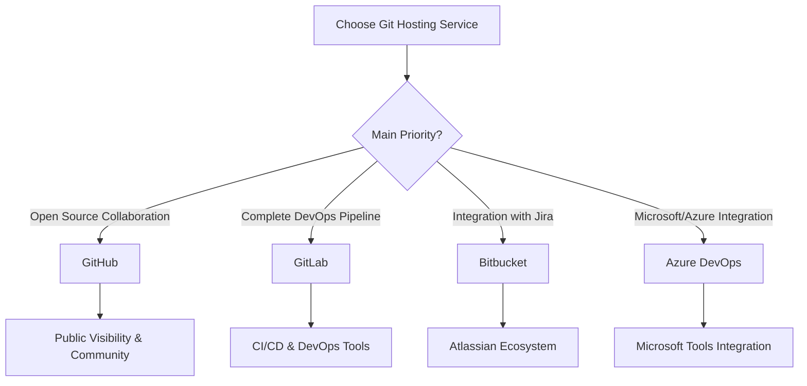

# Git Hosting Services

## Introduction

When working with Git, you'll eventually need to collaborate with others or back up your code to a remote location. This is where Git hosting services come into play. These platforms provide a centralized location to store your Git repositories online, making it easier to collaborate, share, and manage your code across different devices and teams.

In this guide, we'll explore popular Git hosting services, their key features, and how to get started with them. By the end, you'll understand which platform might best suit your needs and how to begin using it for your projects.

## What Are Git Hosting Services?

Git hosting services are platforms that store your Git repositories on remote servers. They typically offer additional features beyond simple storage, such as:

- Web interfaces for browsing repositories
- Issue tracking and project management tools
- Pull/Merge request systems for code review
- Continuous Integration/Continuous Deployment (CI/CD) tools
- Team management and access control
- Documentation hosting
- Social coding features

Let's explore some of the most popular Git hosting services available today.

## Popular Git Hosting Services

### GitHub

[GitHub](https://github.com) is the most widely used Git hosting platform, with over 100 million developers and more than 400 million repositories.

#### Key Features

- Public and private repositories
- GitHub Actions for CI/CD
- GitHub Pages for static website hosting
- Extensive marketplace of integrations
- Pull requests with code review tools
- Issue tracking and project boards
- GitHub Codespaces for cloud development environments
- GitHub Copilot for AI-assisted coding

#### Getting Started with GitHub

1. Create an account at [github.com](https://github.com)
2. Create a new repository:

```bash
# After creating a repository on GitHub
# Initialize your local repository
git init

# Add your files
git add .

# Commit your changes
git commit -m "Initial commit"

# Add the remote repository
git remote add origin https://github.com/yourusername/your-repo.git

# Push your code to GitHub
git push -u origin main
```

### GitLab

[GitLab](https://gitlab.com) is a complete DevOps platform that includes Git repository hosting along with numerous built-in DevOps tools.

#### Key Features

- Public and private repositories
- Built-in CI/CD pipelines
- Container registry
- Package registry
- Wiki and issue tracking
- Self-hosted and cloud options
- DevOps lifecycle tools

#### Getting Started with GitLab

1. Create an account at [gitlab.com](https://gitlab.com)
2. Create a new project and follow the instructions:

```bash
# After creating a project on GitLab
# If starting with an existing folder
cd existing-folder
git init
git remote add origin https://gitlab.com/yourusername/your-project.git
git add .
git commit -m "Initial commit"
git push -u origin main

# If starting with a new repository
git clone https://gitlab.com/yourusername/your-project.git
cd your-project
touch README.md
git add README.md
git commit -m "Add README"
git push -u origin main
```

### Bitbucket

[Bitbucket](https://bitbucket.org) is a Git hosting service from Atlassian that integrates well with other Atlassian products like Jira and Trello.

#### Key Features

- Public and private repositories
- Integration with Jira and other Atlassian tools
- Built-in CI/CD with Bitbucket Pipelines
- Pull requests with code review
- Traceability between code and issues
- Flexible deployment options

#### Getting Started with Bitbucket

1. Create an account at [bitbucket.org](https://bitbucket.org)
2. Create a new repository:

```bash
# After creating a repository on Bitbucket
# If starting fresh
git clone https://yourusername@bitbucket.org/yourusername/your-repo.git
cd your-repo
echo "# My Project" >> README.md
git add README.md
git commit -m "Initial commit"
git push -u origin main

# If adding an existing project
cd your-project
git init
git add .
git commit -m "Initial commit"
git remote add origin https://yourusername@bitbucket.org/yourusername/your-repo.git
git push -u origin main
```

### Azure DevOps

[Azure DevOps](https://dev.azure.com) (formerly Visual Studio Team Services) offers Git repositories as part of its broader suite of development tools.

#### Key Features

- Git repositories with branch policies
- Work item tracking
- Release pipelines
- Test management
- Packages
- Extensions marketplace
- Deep integration with Microsoft tools and Azure

#### Getting Started with Azure DevOps

1. Sign up at [dev.azure.com](https://dev.azure.com)
2. Create a new project and repository:

```bash
# After creating a project and repository
git clone https://yourorganization@dev.azure.com/yourorganization/yourproject/_git/yourrepo
cd yourrepo
# Add files, make changes
git add .
git commit -m "Initial commit"
git push -u origin main
```

## Comparing Git Hosting Services

Let's compare these services to help you choose the right one for your needs:



### Feature Comparison

| Feature | GitHub | GitLab | Bitbucket | Azure DevOps |
|---------|--------|--------|-----------|--------------|
| Free private repos | ✅ | ✅ | ✅ (up to 5 users) | ✅ (up to 5 users) |
| Wiki | ✅ | ✅ | ✅ | ✅ |
| Issue tracking | ✅ | ✅ | ✅ | ✅ |
| CI/CD | ✅ (GitHub Actions) | ✅ (GitLab CI) | ✅ (Pipelines) | ✅ (Azure Pipelines) |
| Self-hosting option | ✅ (Enterprise) | ✅ (Community Edition) | ❌ | ✅ (Server) |
| Package registry | ✅ | ✅ | ❌ | ✅ |
| Container registry | ✅ | ✅ | ❌ | ✅ |

## Working with Remote Repositories

Regardless of which Git hosting service you choose, the basic commands for working with remote repositories remain the same:

### Cloning a Repository

To get a copy of a remote repository:

```bash
git clone https://hostname/username/repository.git
```

### Adding a Remote Repository

To connect your local repository to a remote one:

```bash
git remote add origin https://hostname/username/repository.git
```

### Pushing Changes

To send your local changes to the remote repository:

```bash
# First push with upstream tracking
git push -u origin main

# Subsequent pushes
git push
```

### Pulling Changes

To fetch and merge changes from the remote repository:

```bash
git pull
```

### Fetching Changes

To download changes without merging:

```bash
git fetch
```

### Viewing Remote Information

To see details about your remote repositories:

```bash
# List all remotes
git remote -v

# Get information about a specific remote
git remote show origin
```

## Best Practices for Using Git Hosting Services

1. **Use meaningful repository names** - Choose descriptive names that indicate the purpose of the repository.

2. **Add a README.md file** - Document what your project does, how to set it up, and how to contribute.

3. **Include a .gitignore file** - Prevent unnecessary files from being committed:

```bash
# Create a .gitignore file for Node.js projects
npx gitignore node
```

4. **Utilize branch protection rules** - Prevent direct pushes to main branches and enforce code reviews.

5. **Set up CI/CD pipelines** - Automate testing and deployment processes.

6. **Use semantic versioning for releases** - Follow the MAJOR.MINOR.PATCH format.

7. **Document issues and pull requests thoroughly** - Provide context and clear steps to reproduce issues.

## Practical Example: Collaborative Workflow

Let's walk through a typical collaborative workflow using GitHub:

1. **Fork a repository** - Create your own copy of someone else's repository:
   - Click the "Fork" button on GitHub

2. **Clone your fork locally**:

```bash
git clone https://github.com/yourusername/repository.git
cd repository
```

3. **Add the original repository as an upstream remote**:

```bash
git remote add upstream https://github.com/original-owner/repository.git
```

4. **Create a feature branch**:

```bash
git checkout -b feature/new-feature
```

5. **Make changes and commit them**:

```bash
# Make your changes
git add .
git commit -m "Add new feature"
```

6. **Push your feature branch to your fork**:

```bash
git push -u origin feature/new-feature
```

7. **Create a pull request** - Go to GitHub and click "New pull request"

8. **Address review comments** - Make changes as needed:

```bash
# Make additional changes
git add .
git commit -m "Address review comments"
git push
```

9. **Keep your fork updated**:

```bash
git checkout main
git fetch upstream
git merge upstream/main
git push
```

## Summary

Git hosting services provide essential platforms for storing, sharing, and collaborating on code repositories. In this guide, we've explored:

- What Git hosting services are and why they're important
- Popular options including GitHub, GitLab, Bitbucket, and Azure DevOps
- How to get started with each platform
- Basic commands for working with remote repositories
- Best practices for using Git hosting services
- A practical collaborative workflow example

By understanding these services and their capabilities, you can choose the right platform for your needs and effectively collaborate with others on your coding projects.

## Additional Resources

- [Pro Git Book](https://git-scm.com/book/en/v2) - Chapter 2.5 and 6 cover working with remotes
- [GitHub Documentation](https://docs.github.com)
- [GitLab Documentation](https://docs.gitlab.com)
- [Bitbucket Documentation](https://support.atlassian.com/bitbucket-cloud/)
- [Azure DevOps Documentation](https://docs.microsoft.com/en-us/azure/devops/)

## Exercises

1. Create accounts on GitHub, GitLab, and Bitbucket, and create a repository on each platform.
2. Clone each repository locally and add a README.md file.
3. Create a branch, make changes, and push them to each remote repository.
4. Create a pull/merge request for your changes.
5. Collaborate with a classmate by forking their repository, making changes, and submitting a pull request.
6. Set up a simple CI/CD pipeline using GitHub Actions or GitLab CI.
7. Compare the user interfaces and features of each platform and write a brief analysis of which one you prefer and why.